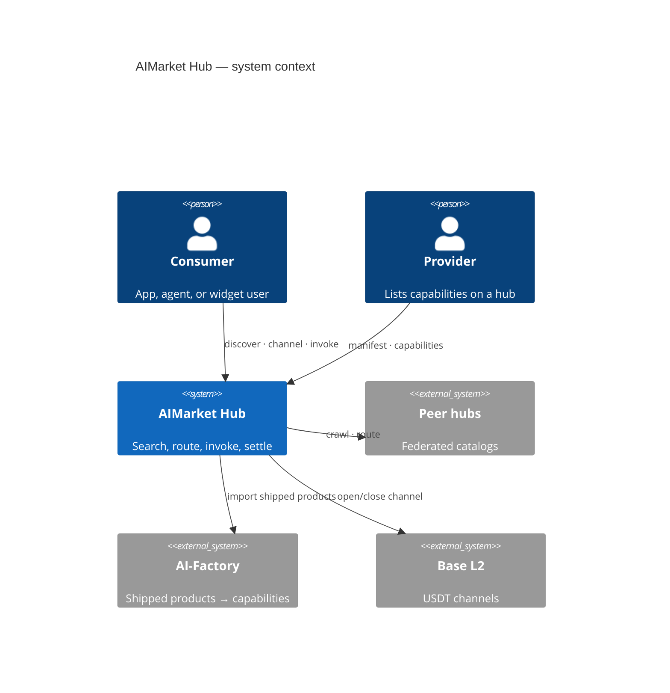
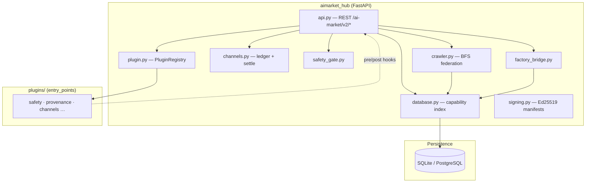
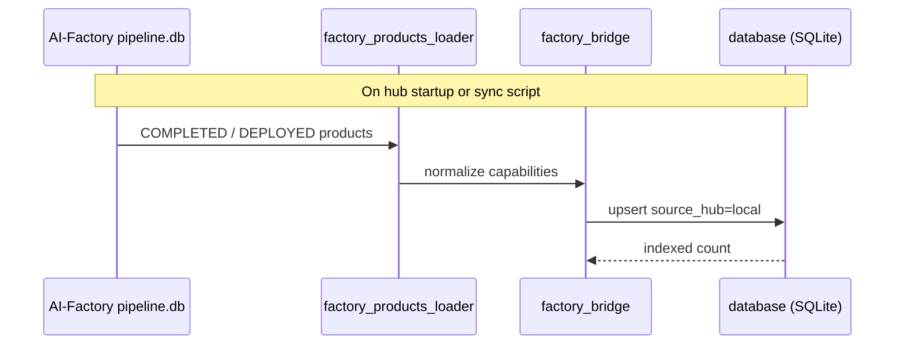
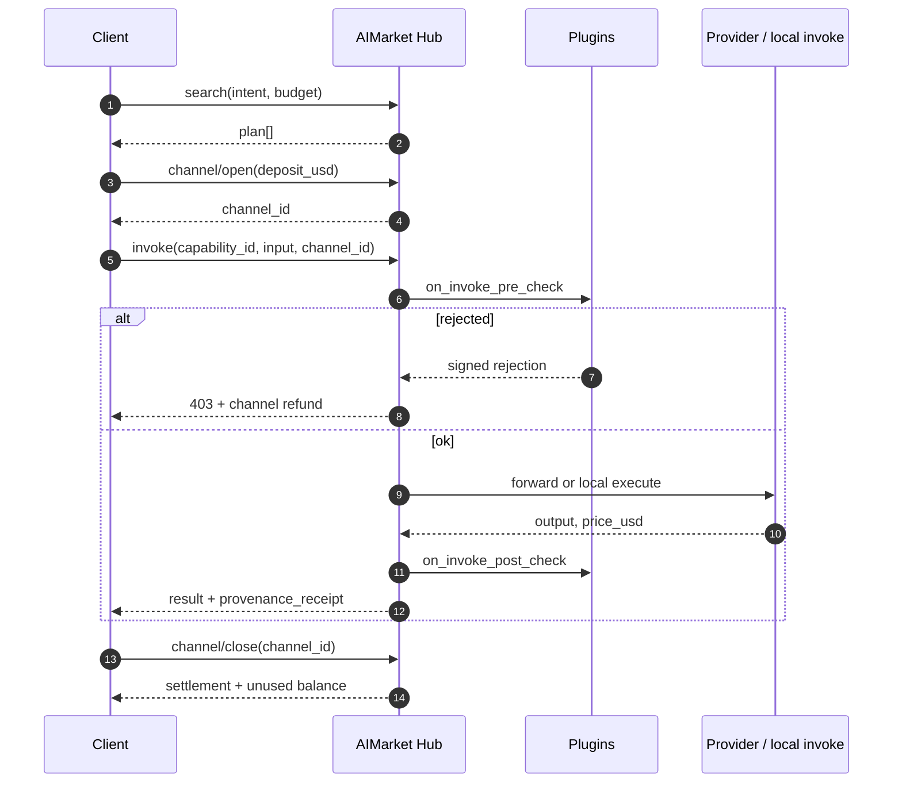
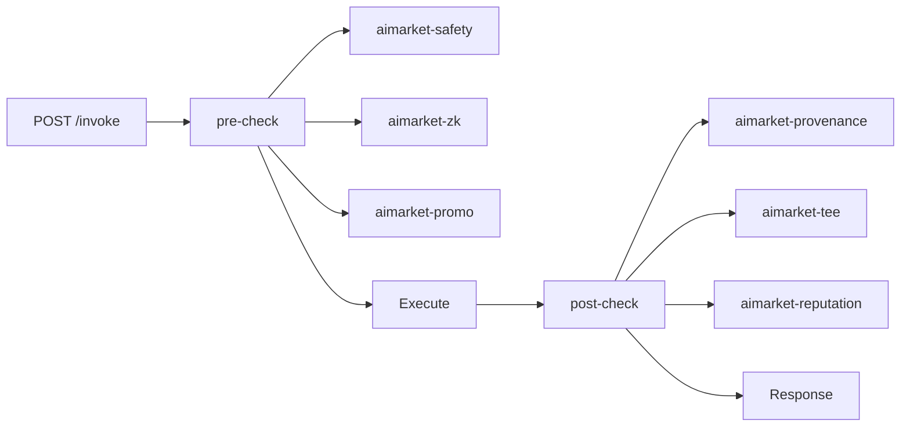
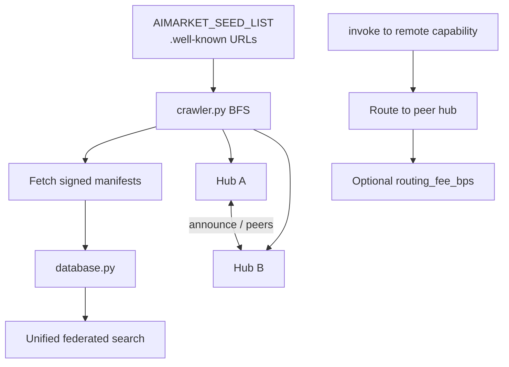
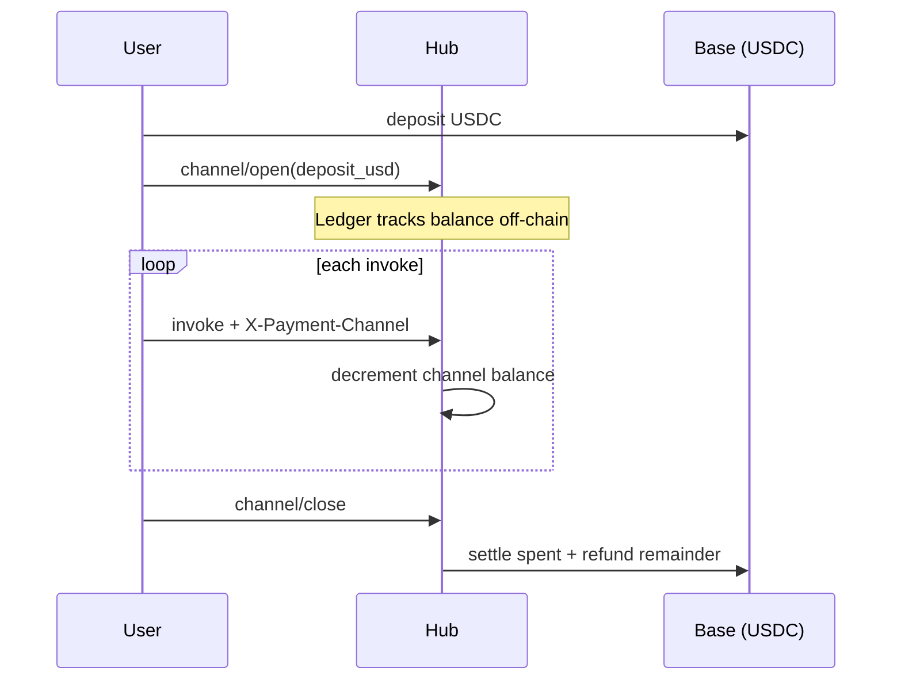

<!-- aicom-mirror-notice -->
> **📖 Read-only mirror.** `aimarket-hub` is published from the canonical AI-Factory monorepo.
> **Pull requests are not accepted** — any commit pushed here is overwritten by
> `scripts/mirror_satellites.sh` on the next sync.
> 🐞 Found a bug or have a request? Please **[open an issue](https://github.com/alexar76/aimarket-hub/issues)**.

# AIMarket Hub

<!-- aicom-readme-badges -->
<p align="center">
  <a href="https://github.com/alexar76/aimarket-hub/actions/workflows/ci.yml"></a>
  <a href="https://github.com/alexar76/aimarket-hub/releases"></a>
  <a href="https://github.com/alexar76/aimarket-protocol"></a>
  <a href="https://raw.githubusercontent.com/alexar76/aimarket-hub/refs/heads/main/docs/badges/coverage.svg"></a>
  <a href="https://github.com/alexar76/aimarket-hub/blob/main/LICENSE"></a>
</p>
<!-- /aicom-readme-badges -->

> 🌐 **English** · [Русский](docs/README.ru.md) · [Español](docs/README.es.md) · [Français](docs/README.fr.md) · [中文](docs/README.zh.md) · [Glossary](https://github.com/alexar76/aicom/blob/main/docs/localization-glossary.md)


> **Ecosystem:** [AICOM overview & live demos](https://modeldev.modelmarket.dev) · **Package version:** `3.2.1` (pyproject) · **Community:** [Discord · Pollux](https://discord.gg/aimarket) · [Telegram · Castor](https://t.me/just_for_agents)

**Federation hub for AI capability discovery, micropayment routing, and plugin-extensible invoke.**

Reference implementation of [AIMarket Protocol v2](https://github.com/alexar76/aimarket-protocol/blob/main/spec.md). One HTTP surface to **search** a federated catalog, **open payment channels**, **invoke** capabilities with safety and compliance hooks, and **settle** on-chain — without custodial wallets.

| | |
|---|---|
| **Live hub** | [modelmarket.dev](https://modelmarket.dev) |
| **Well-known** | [/.well-known/ai-market.json](https://modelmarket.dev/.well-known/ai-market.json) |
| **Plugin demo** | [/plugins/demo](https://modelmarket.dev/plugins/demo) |
| **Widget demo** | [/widget/demo](https://modelmarket.dev/widget/demo) |
| **Plain-language value** | [docs/value.md](https://github.com/alexar76/aimarket-hub/blob/main/docs/value.md) |

## Demo

- **Live:** https://modelmarket.dev/
- **Docs:** https://github.com/alexar76/aimarket-hub/blob/main/README.md

---

## Table of contents

- [Overview](#overview)
- [Architecture](#architecture)
- [Repository layout](#repository-layout)
- [Quick start](#quick-start)
- [Core API](#core-api)
- [Invoke lifecycle](#invoke-lifecycle)
- [Plugin ecosystem](#plugin-ecosystem)
- [Federation](#federation)
- [Payments](#payments)
- [Pay-on-Verified](#pay-on-verified)
- [Configuration](#configuration)
- [Deployment](#deployment)
- [Development](#development)
- [Security](#security)
- [Related projects](#related-projects)
- [License](#license)

---

## Overview

AIMarket Hub sits between **capability providers** (factory-shipped products, [**oracles**](https://github.com/alexar76/oracles), peer hubs, data-cap publishers) and **consumers** (Flutter desktop apps, agents, embeddable widgets, MCP clients).

**Problems it solves**

| Problem | Hub answer |
|---------|------------|
| Fragmented AI APIs | Federated search over `.well-known/ai-market.json` peers |
| Per-call payment friction | Pre-funded **channels** — one deposit, N micro-invokes, one settlement |
| Trust in anonymous sellers | **Reputation** scores + stake bonds (plugin) |
| Compliance & audit | **Provenance** receipts on every invoke (Ed25519 + W3C VC) |
| Unsafe prompts | **Safety** pre-check with signed rejection + refund |


### Zero-Trust Agent Discovery

**No human app-store reviewer.** Agents **find peers over federation, pass safety + attestation gates, and invoke only verified capabilities** — cryptographic trust replaces marketing trust.

| | |
|---|---|
| **What** | Federated `discover` → safety / reputation / TEE plugins → routed invoke |
| **Why** | Scales to millions of micro-capabilities; malicious listings can’t drain channels |
| **Deep dive** | [docs/killer-feature-zero-trust-discovery.md](https://github.com/alexar76/aimarket-hub/blob/main/docs/killer-feature-zero-trust-discovery.md) · [Ecosystem capabilities](https://github.com/alexar76/aicom/blob/main/docs/killer-features.md) |

---

## Architecture

### System context



### Container diagram (this repository)



### Factory import path

Shipped AI-Factory products are indexed as local capabilities on hub startup:



Sync ops: [`../scripts/sync_pipeline_mirror_and_hub.py`](https://github.com/alexar76/aicom/blob/main/scripts/sync_pipeline_mirror_and_hub.py)

---

## Repository layout

```
aimarket-hub/
├── aimarket_hub/           # Core package
│   ├── api.py              # HTTP routes (search, invoke, federation, plugins)
│   ├── crawler.py          # Peer discovery (SSRF-hardened BFS)
│   ├── database.py         # Capability + peer index
│   ├── channels.py         # Payment channel ledger
│   ├── plugin.py           # setuptools aimarket.plugins loader
│   ├── factory_bridge.py   # AI-Factory product import
│   ├── safety_gate.py      # Built-in safety fallback
│   └── …
├── plugins/                # Hub-local plugins (e.g. aimarket-provenance)
├── tests/                  # pytest suite
├── Dockerfile
├── LICENSE                 # Apache-2.0
├── CONTRIBUTORS.md
├── SECURITY.md
└── docs/
    └── value.md
```

**Sibling packages** (monorepo root [`plugins/`](https://github.com/alexar76/aimarket-plugins/tree/main/plugins/)): 15 plugins — **top-5 on PyPI** ([install guide](https://github.com/alexar76/aimarket-plugins/blob/main/plugins/docs/install.md)); full set bundled in Docker.

---

## Quick start

### Prerequisites

- Python **3.11+**
- Optional: Docker for container deploy

### Install & run

```bash
pip install aimarket-hub
# optional core plugins (TEE, channels, reputation, safety, MCP packager):
pip install "aimarket-hub[plugins]"
aimarket serve
# → http://localhost:9083
```

Verify discovery and search:

```bash
curl -s http://localhost:9083/.well-known/ai-market.json | jq .
curl -s "http://localhost:9083/ai-market/v2/search?intent=translate&budget=1" | jq .
curl -s http://localhost:9083/ai-market/v2/plugins | jq '.plugins | length'
```

### Publish a capability (community providers)

Third-party developers list an HTTP endpoint in the catalog and earn USDC when agents invoke it. **Production hubs** require stake, LUMEN trust scoring, and Ed25519-signed provider responses — see [`docs/supply-security.md`](https://github.com/alexar76/aimarket-hub/blob/main/docs/supply-security.md).

```bash
cd examples/hello-capability && python3 server.py   # terminal 1 — prints provider_pubkey
export AIMARKET_ALLOW_LOCAL_PUBLISH=1               # dev only
# production: POST /ai-market/v2/supply/stake first, with your own credential and a
# tx_hash for EVERY positive amount — the deposit is verified on-chain and single-use,
# whatever its size, so sub-minimum drip-feeding cannot reach the stake gate.
aimarket publish capability.json --hub http://127.0.0.1:9083
aimarket invoke demo-hello/greet@v1 --input '{"name":"dev"}'
```

Full walkthrough (20 languages): [ARGUS developer guide](https://github.com/alexar76/argus/tree/main/docs/developer-guide/) · [supply security](https://github.com/alexar76/aimarket-hub/blob/main/docs/supply-security.md) · example in [`examples/hello-capability/`](https://github.com/alexar76/aimarket-hub/tree/main/examples/hello-capability).

### Docker

**Production (this monorepo):** always redeploy Hub from repo root:

```bash
./scripts/deploy_hub.sh
# or full fleet: ./scripts/deploy_ecosystem.sh
```

See [`docs/deploy-ecosystem.md`](https://github.com/alexar76/aicom/blob/main/docs/deploy-ecosystem.md). Do **not** use `cd aimarket-hub && docker compose up` for production redeploy (wrong build context).

**Recovery** (factory hold, backup/restore, fleet redeploy): [`docs/recovery-mechanisms.md`](https://github.com/alexar76/aicom/blob/main/docs/recovery-mechanisms.md) in the factory monorepo.

Manual build (same as deploy script):

```bash
docker build -f aimarket-hub/Dockerfile -t modelmarket-hub .
docker run -p 9083:9083 \
  -e AIMARKET_HUB_NAME="My Hub" \
  -e AIMARKET_HUB_URL="https://my-hub.example.com" \
  -e AIMARKET_PAYMENT_RECIPIENT="0xYourWallet" \
  modelmarket-hub
```

---

## Core API

| Method | Path | Description |
|--------|------|-------------|
| `GET` | `/.well-known/ai-market.json` | Root discovery — chain, token, peers, signer key |
| `GET` | `/ai-market/v2/manifest` | Ed25519-signed capability catalog |
| `GET` | `/ai-market/v2/search` | NL federated search (`intent`, `budget`, `category`) |
| `POST` | `/ai-market/v2/supply/stake` | Deposit publisher stake (unlock community publish) |
| `POST` | `/ai-market/v2/supply/register` | Publish community capability + `invoke_url` |
| `POST` | `/ai-market/v2/invoke` | Invoke capability (plugin hooks, safety gate) |
| `POST` | `/ai-market/v2/channel/open` | Open pre-funded payment channel |
| `POST` | `/ai-market/v2/channel/close` | Close channel — settle + refund remainder |
| `POST` | `/ai-market/v2/federation/announce` | Peer hub announcement |
| `GET` | `/ai-market/v2/federation/peers` | Known peers + trust scores + pin status (`key_mismatch`) |
| `GET` | `/ai-market/v2/federation/assay` | Last sandbox scorecard (`pass` auto-admits by default) |
| `POST` | `/ai-market/v2/federation/assay` | Admin: re-run SSRF / signature / sandbox assay |
| `POST` | `/ai-market/v2/federation/crawl` | Trigger BFS crawl of seed peers |
| `POST` | `/ai-market/v2/federation/peers/approve` | Admin: toggle peer `trusted` (anti-TOFU) |
| `POST` | `/ai-market/v2/federation/peers/repin` | Admin: rotate a sticky peer pin after legitimate key change |
| `GET` | `/ai-market/v2/plugins` | Loaded plugin catalog |
| `GET` | `/ai-market/v2/reputation/{hub_url}` | Trust score breakdown |
| `GET` | `/ai-market/v2/stats/live` | Real-time invocation feed |

**Authorization.** `/supply/register` takes the shared `AIMARKET_PUBLISH_TOKEN`. The routes that
move or encumber stake — `/supply/stake` and `/self-bond/register` — take the caller's OWN
credential from `AIMARKET_PUBLISHER_TOKENS` (or `AIMARKET_ADMIN_TOKEN`), because a shared token
cannot prove which publisher is calling; in production a hub with neither configured refuses
them with `503`. `/self-bond/slash` and every settlement/federation route are admin-only.

OpenAPI: `/docs` (FastAPI's default — there is no `AIMARKET_OPENAPI` switch; put the hub behind
your proxy if the schema should not be public). Full spec: [`../aimarket-protocol/spec.md`](https://github.com/alexar76/aimarket-protocol/blob/main/spec.md)

---

## Invoke lifecycle

Standard consumer flow (implemented by [`aimarket_agent`](https://github.com/alexar76/aimarket-sdks/tree/main/dart/)):



---

## Plugin ecosystem

Plugins register via **`aimarket.plugins`** entry points ([`plugin.py`](https://github.com/alexar76/aimarket-hub/blob/main/aimarket_hub/plugin.py)). Each ships **README + docs/** (`value.md`, `user-guide.md`, `sdk-integration.md`, `user-cases.md`).

Regenerate docs: `python3 scripts/bootstrap_hub_plugin_docs.py` · value text: `python3 scripts/bootstrap_product_value.py`



| Plugin | Category | One-line value |
|--------|----------|----------------|
| [`aimarket-provenance`](https://github.com/alexar76/aimarket-hub/tree/main/plugins/aimarket-provenance) | compliance | Cryptographic receipt per AI output |
| [`aimarket-safety`](https://github.com/alexar76/aimarket-plugins/tree/main/plugins/aimarket-safety/) | security | Block jailbreak / injection before billing |
| [`aimarket-reputation`](https://github.com/alexar76/aimarket-plugins/tree/main/plugins/aimarket-reputation/) | reputation | Stake-backed trust scores |
| [`aimarket-channels`](https://github.com/alexar76/aimarket-plugins/tree/main/plugins/aimarket-channels/) | infrastructure | Off-chain ledger, on-chain settlement |
| [`aimarket-tee`](https://github.com/alexar76/aimarket-plugins/tree/main/plugins/aimarket-tee/) | security | Hardware attestation (Nitro / TDX) |
| [`aimarket-auction`](https://github.com/alexar76/aimarket-plugins/tree/main/plugins/aimarket-auction/) | monetization | Spot bidding for scarce slots |
| [`aimarket-personas`](https://github.com/alexar76/aimarket-plugins/tree/main/plugins/aimarket-personas/) | tooling | Buyer-friendly agent personas |
| [`aimarket-streaming`](https://github.com/alexar76/aimarket-plugins/tree/main/plugins/aimarket-streaming/) | monetization | SSE + per-token micro-billing |
| [`aimarket-nft`](https://github.com/alexar76/aimarket-plugins/tree/main/plugins/aimarket-nft/) | monetization | Transferable prepaid credit NFTs |
| [`aimarket-mcp-packager`](https://github.com/alexar76/aimarket-plugins/tree/main/plugins/aimarket-mcp-packager/) | tooling | MCP bundle for Claude Desktop |
| [`aimarket-orchestrator`](https://github.com/alexar76/aimarket-plugins/tree/main/plugins/aimarket-orchestrator/) | monetization | NL task → capability chain planner |
| [`aimarket-data-cap`](https://github.com/alexar76/aimarket-plugins/tree/main/plugins/aimarket-data-cap/) | monetization | Private corpus → paid search |
| [`aimarket-promo`](https://github.com/alexar76/aimarket-plugins/tree/main/plugins/aimarket-promo/) | monetization | Signed time-locked discounts |
| [`aimarket-dataset`](https://github.com/alexar76/aimarket-plugins/tree/main/plugins/aimarket-dataset/) | tooling | Weekly anonymized demand corpus |
| [`aimarket-zk`](https://github.com/alexar76/aimarket-plugins/tree/main/plugins/aimarket-zk/) | security | ZK proofs without revealing input |

---

## Federation

Hubs discover each other without a central registry:



### Observation gossip — seeing every new Hub

Hub addresses are always accepted through two public observation doors, and both lead to
**quarantine**:

- `POST /federation/announce` accepts an unauthenticated announcement;
- a hub that crawls this one identifies itself with `X-AIMarket-Crawler` and is recorded
  from that alone — so an operator can finally see who reads them.

In both cases the peer lands `status=pending`, `trusted=false`. Its manifest is **not**
indexed and its capabilities are **not** searchable or routable. Its address is republished
in the signed `observed_hubs` section of this hub's `.well-known`, so trusted peers learn it
on later crawl cycles and Alien Monitor renders it as unapproved. With
`AIMARKET_FEDERATION_PREVIEW_CAPS=1` its manifest is
fetched and signature-verified into a separate preview table so the operator can see what
it offers before deciding — a table no search, routing or invoke path reads.

Observation changes who is visible. Trust is not granted on the knock: the peer
lands `pending`. A **sandbox assay** then runs in the background (and again on
crawl cycles). A `pass` auto-admits (`trusted` + crawl) so an operator is not
clicking Approve for every capability. Fail and review stay at `/operator`.

The assay scores the **live invoke**, never brochure text. Names and descriptions
are stripped before any model sees evidence. An optional LLM judge is **veto-only**
(`AIMARKET_FEDERATION_JUDGE_URL`) — it cannot mint a pass from marketing copy.
`AIMARKET_FEDERATION_ASSAY_LLM` is ignored if set. Factory analog:
`product_automated_verify` (score running artifacts, not listings).

| Variable | Default | Effect |
|---|---|---|
| `AIMARKET_FEDERATION_GOSSIP_MAX_OBSERVED` | `2000` | Resource/fan-out bound for quarantined observed addresses |
| `AIMARKET_FEDERATION_OPEN` | `0` | Legacy switch for richer preview/admission behaviour; visibility is always on |
| `AIMARKET_FEDERATION_PREVIEW_CAPS` | `1` | Signature-verified preview of a pending peer's catalogue |
| `AIMARKET_FEDERATION_PREVIEW_MAX_CAPS` | `25` | Per-peer preview cap |
| `AIMARKET_FEDERATION_ASSAY` | `1` | Post-quarantine sandbox assay |
| `AIMARKET_FEDERATION_ASSAY_SANDBOX` | `1` | Probe one public free capability (receipt must match advertised key) |
| `AIMARKET_FEDERATION_AUTO_ADMIT` | `1` | A `pass` sets `trusted` **only with a judge token**. Alias: `AIMARKET_FEDERATION_ASSAY_AUTO_TRUST` |
| `AIMARKET_FEDERATION_JUDGE_URL` | OpenRouter chat if a key exists | OpenAI-compatible veto on sandbox evidence |
| `AIMARKET_FEDERATION_JUDGE_KEY` | `OPENROUTER_API_KEY` fallback | **No key → manual Approve only** |
| `AIMARKET_FEDERATION_JUDGE_MODEL` | `minimax/minimax-m3` | MiniMax, same as the rest of the fleet |
| `AIMARKET_FEDERATION_JUDGE_REQUIRED` | `0` | If `1`, a judge error blocks auto-admit (also implied when auto-admit + key) |
| `AIMARKET_FEDERATION_ASSAY_REQUIRE` | `0` | If `1`, human Approve refuses unless last assay is `pass` |

Join path: [`docs/join-the-federation.md`](https://github.com/alexar76/aicom/blob/main/docs/join-the-federation.md) · internals: [`docs/federation-admission.md`](docs/federation-admission.md) (EN·RU·ES·FR·ZH).

Surfaces: `GET /federation/peers` (`pending` array) and `GET /federation/preview?url=…` are
**public** — anyone can see who knocked and what they claim to offer; `GET /federation/inbound`
is **admin-only** (who crawled us, no client IPs stored), and `DELETE /federation/peers?url=…`
lets an operator reject a pending peer and drop its preview rows. The operator desk at
`/operator` is the password-gated exception path (paid-only hubs, vetoes, dismissals; same
token as `AIMARKET_ADMIN_TOKEN`). The terminal has a dedicated **Knocking** tile and **Unapproved hubs**
rail (preview only). Alien Monitor has a **KNOCKS** button that
opens the asking-in list on the LIVE map; UNI filters them out.

### x402 interoperability

The hub speaks [x402](https://docs.x402.org/) — the machine-payment standard that became a
Linux Foundation project in July 2026 — alongside its own payment surface:

- a `402` from this hub's own payment gate carries the x402 **V2** payload in a base64
  `PAYMENT-REQUIRED` header (a peer's 402 passed through verbatim is left untouched — its
  terms are the peer's, not ours), and the
  **V1** `accepts` array merged additively into the body, so both generations of client can
  read it and existing consumers see no change;
- `GET /discovery/resources` serves a **Bazaar-compatible** index of priced capabilities —
  the same envelope every official x402 SDK deserializes, so pointing a facilitator client
  at this hub enumerates its catalogue with no code changes.

Accepting an x402 `PAYMENT-SIGNATURE` is deliberately **not** implemented: that means
verifying and settling an EIP-3009 authorization, and moving money is not a change that
should ride along with a discovery change. See [`aimarket_hub/x402.py`](https://github.com/alexar76/aimarket-hub/blob/main/aimarket_hub/x402.py).

Full walkthrough: [`../docs/join-the-federation.md`](https://github.com/alexar76/aicom/blob/main/docs/join-the-federation.md) ·
Normative text: protocol spec §2.4–2.6.

Trust scoring: [`trust.py`](https://github.com/alexar76/aimarket-hub/blob/main/aimarket_hub/trust.py) · Signing: [`signing.py`](https://github.com/alexar76/aimarket-hub/blob/main/aimarket_hub/signing.py)

Peer key pin / mismatch / admin re-pin (EN·RU·ES·FR·ZH): [`docs/federation-peer-keys.md`](./docs/federation-peer-keys.md)

Deep dive: [`../docs/FEDERATION_HUB_REPORT.md`](https://github.com/alexar76/aicom/blob/main/docs/FEDERATION_HUB_REPORT.md)

---

## Payments



| Field | Default | Notes |
|-------|---------|-------|
| Chain | Base (L2) | `AIMARKET_PAYMENT_CHAIN` |
| Token | USDC | `AIMARKET_PAYMENT_TOKEN` — the ledger's default; the advertised catalog is `AIMARKET_PAYMENT_TOKENS` (`USDT,USDC,ETH`) |
| Recipient | env required | `AIMARKET_PAYMENT_RECIPIENT` |

Protocol principle: **no custody** — channels are on-chain constructs; hub holds ledger state only.

**Deposit authorization.** In production (`AIFACTORY_PROD=1`, verify stub off) a channel is credited
only by a deposit that is verified on-chain, bound to the wallet that actually paid, single-use
(`consumed_deposits`), and proven by an EIP-191 signature from the paying wallet over
`payer_proof_challenge(...)` — the deposit tx hash is public, so without that proof the channel
secret would go to whoever quotes it first. `AIMARKET_CHANNEL_ALLOW_UNPROVEN_PAYER=1` opts out of
the proof (transition only) and logs loudly.

---

## Pay-on-Verified

**Opt-in quality escrow on invoke.** With a `verify` block on the invoke body the channel debit
becomes a hold; [Metis](https://github.com/alexar76/metis) judges the delivered output against the
buyer's stated intent in the background — pass captures the hold, fail refunds it with a signed
rejection receipt. The buyer keeps the output either way; only the money outcome changes.

| | |
|---|---|
| **What** | `verify: { requested, intent, mode, wait }` on `POST /ai-market/v2/invoke` → `hold_channel` → Metis verdict → capture / release |
| **Why** | Providers are paid for verified work, not for responding; every verdict emits a reputation event |
| **Lookup** | `GET /ai-market/v2/verification/{nonce}` (nonce = receipt nonce) |
| **Deep dive** | [docs/pay-on-verified.md](https://github.com/alexar76/aimarket-hub/blob/main/docs/pay-on-verified.md) · [Cross-component doc](https://github.com/alexar76/aicom/blob/main/docs/pay-on-verified.md) |

---

## Configuration

Every default below is the value the code falls back to today; where a default is *derived*
from another variable, the rule is spelled out rather than a number.

### Core

| Variable | Default | Description |
|----------|---------|-------------|
| `AIMARKET_HUB_NAME` | AIMarket Hub | Display name in manifests |
| `AIMARKET_HUB_URL` | `http://localhost:9083` | Public URL (receipts, well-known) |
| `AIFACTORY_PROD` | — | `1` puts every money gate on the production path (on-chain verification required, fail-closed defaults) |
| `AIFACTORY_CRYPTO_ENABLED` | `0` | Master crypto switch: off ⇒ channels/escrow/NFT disabled, capabilities served free; signing and sandbox trials keep working |
| `AIMARKET_PAYMENT_CHAIN` | `base` | Settlement chain (`AIMARKET_PAYMENT_CHAINS` for the advertised list) |
| `AIMARKET_PAYMENT_TOKEN` | `USDC` | Ledger settlement token (`AIMARKET_PAYMENT_TOKENS` advertises `USDT,USDC,ETH`) |
| `AIMARKET_PAYMENT_RECIPIENT` | — | **Required in production** — the wallet deposits must pay |
| `AIMARKET_CRAWL_INTERVAL_S` | `3600` | Federation crawl period |
| `AIMARKET_ROUTING_FEE_BPS` | `100` | Routing fee (1% = 100 bps) |
| `AIMARKET_MIN_TRUST_SCORE` | `0.3` | Baseline trust floor (also the discover-gate default below) |
| `AIMARKET_SEED_LIST` | committed `federation_seeds.json` | Comma-separated peer `.well-known` URLs; unset falls back to the shipped seed file, not to "no seeds" |
| `AIMARKET_SEED_PUBKEYS` | committed seed `public_key` fields | `{url:key}` JSON or `url=key,…` — trusted-on-**first-contact** only; rotating an existing DB pin requires `POST /federation/peers/repin` |
| `AIMARKET_PLUGIN_WHITELIST` | — | Restrict loaded plugins |
| `AIMARKET_ADMIN_TOKEN` | — | Operator token. Unset ⇒ every admin route refuses (`503`), fail-closed |
| `AIMARKET_PUBLISH_TOKEN` | — | Shared token for `/supply/register`. Unset ⇒ publish disabled |
| `AIMARKET_PUBLISHER_TOKENS` | — | `pub-a:secretA,pub-b:secretB` — per-publisher credentials for the stake/bond routes (see Security) |
| `AIMARKET_CORS_ORIGINS` | — | Comma-separated allowlist. Empty means no cross-origin access (a `*` default enabled drive-by CSRF) |

### Databases

| Variable | Default | Description |
|----------|---------|-------------|
| `DATABASE_URL` | SQLite files | PostgreSQL for production — when set, every subsystem shares it |
| `AIMARKET_DB_PATH` | `data/hub.db` | The **hub index** database. It no longer overrides a path a subsystem passes explicitly (that silently aliased channels.db and provenance.db onto the hub file); a subsystem that must share the hub file now points its own variable at it |
| `AIMARKET_CHANNELS_DB_PATH` | `data/channels.db` | Payment-channel ledger (separate file from the hub index) |
| `AIMARKET_VERIFY_SETTLEMENTS_DB_PATH` | `AIMARKET_DB_PATH`, else `data/hub.db` | Where `verified_settlements` lives — the orphaned-hold reaper reads it and refuses to release anything it cannot read |

#### Upgrading past the shared-database aliasing

**This is a one-time migration step for any hub that already ran with `AIMARKET_DB_PATH`
set** — which includes every container here (`Dockerfile`, `Dockerfile.standalone`,
`docker-compose.yml`, `docker-compose.core.yml` all export it).

Until this release the env var overrode the path a subsystem asked for, so the channel
ledger (`data/channels.db`) and the provenance store (`data/provenance.db`) were created
*inside the hub file*. Now that the explicit argument wins, those subsystems open their own
files — and on an upgraded deployment those files **start empty**:

* the channel ledger loses its open channels and, more seriously, `consumed_deposits` —
  the table that makes an on-chain deposit single-use. An empty one lets every deposit
  already spent be replayed into a new funded channel;
* the provenance store loses its receipts.

The hub logs this at `ERROR` on startup (the requested file does not exist while the
`AIMARKET_DB_PATH` file does), naming the file the data is still in. Do one of these
**before serving traffic**:

```bash
# A. channel ledger — keep the shared file, no data moves, pre-upgrade behaviour exactly
export AIMARKET_CHANNELS_DB_PATH="$AIMARKET_DB_PATH"

# B. channel ledger — split it out: copy the file with the hub stopped
cp /app/data/hub.db /app/data/channels.db
export AIMARKET_CHANNELS_DB_PATH=/app/data/channels.db
```

Either way the tables the copy's owner does not use are simply never read. The provenance
store has **no** path variable — it always derives `provenance.db` from the hub database's
directory — so B is the only option there (`cp /app/data/hub.db /app/data/provenance.db`);
skipping it starts an empty receipt store, which costs an audit trail but no money.

`DATABASE_URL` deployments are unaffected — PostgreSQL was always one shared database.

### Channels

| Variable | Default | Description |
|----------|---------|-------------|
| `AIMARKET_ALLOW_DEMO_CREDIT` | — | `1` credits a channel without on-chain verification (dev/demo). Outside production, without it, crediting fails closed |
| `AIMARKET_CHANNEL_ALLOW_UNPROVEN_PAYER` | `0` | `1` opts OUT of the payer proof-of-control requirement (transition only — leaves deposit front-running open) |
| `AIMARKET_CHANNEL_ANON_OPENS_PER_HOUR` | `200` | One shared cap for all wallet-less opens (they are not exempt) |
| `AIMARKET_CHANNEL_ANON_CLOSES_PER_HOUR` | `600` | Same, for closes |
| `AIMARKET_CHANNEL_HOLD_REAP_AFTER_SECS` | `86400` | Release a hold stuck `held` this long with no live verification; `0` disables the reaper |
| `AIFACTORY_PAYMENT_MIN_CONFIRMATIONS` | `2` | Confirmations a deposit needs before it counts |
| `AIFACTORY_PAYMENT_VERIFY_STUB` | `0` | `1` accepts any tx hash — development only |

### Pay-on-Verified

| Variable | Default | Description |
|----------|---------|-------------|
| `AIMARKET_VERIFY_ENABLED` | `1` | Pay-on-Verified master switch (per-invoke opt-in still required) |
| `AIMARKET_VERIFY_MIN_PRICE_USD` | `0.05` | Price floor — cheaper invokes are never verification-taxed |
| `AIMARKET_VERIFY_SCORE_THRESHOLD` | `0.7` | `verify_score` needed to capture the hold (a value outside 0.0–1.0 falls back to `0.7`) |
| `AIMARKET_VERIFY_COUNCIL_MIN_PRICE_USD` | `0.50` | Route ceiling: `council` allowed at/above this price, else clamped to `fast` |
| `AIMARKET_VERIFY_MAX_CONCURRENCY` | `8` | Cap on simultaneous Metis calls across pending settlements |
| `AIMARKET_VERIFY_ATTEMPT_TIMEOUT_S` | `330` | Per-attempt Metis HTTP timeout (> Metis 300 s server cap) |
| `AIMARKET_VERIFY_RETRY_BACKOFF_S` | `5` | Initial transport-retry backoff (exponential, cap 300 s) |
| `AIMARKET_VERIFY_ENGINE_RETRIES` | `2` | Re-runs after an engine-error envelope before policy applies |
| `AIMARKET_VERIFY_MAX_WAIT_S` | `0` | `0` = no verdict deadline; `>0` bounds resolution via policy |
| `AIMARKET_VERIFY_FAIL_CLOSED` | `1` | Indeterminate outcome ⇒ refund the buyer. Only an explicit `0/false/no/off` captures instead; an unrecognised value is a typo and still fails closed |
| `AIMARKET_VERIFY_METIS_URL` | `http://127.0.0.1:8080` | Metis base URL (falls back to `METIS_URL`) |
| `AIMARKET_VERIFY_METIS_KEY` | — | Metis bearer key (falls back to `METIS_API_KEY`) |
| `AIMARKET_VERIFY_VERIFIER_ID` | `metis.verify@v1` | Envelope `verifier` attribution when a non-Metis verifier serves the slot |

### Supply security (community publishers)

Full model: [`docs/supply-security.md`](https://github.com/alexar76/aimarket-hub/blob/main/docs/supply-security.md). A non-finite or non-numeric
value in any threshold below is ignored with a warning and the documented default is used — a
`nan` threshold would otherwise silently disable the gate it configures.

| Variable | Default | Description |
|----------|---------|-------------|
| `AIMARKET_SUPPLY_SECURITY_RELAXED` | `0` | `1` = dev bypass: zero minimum stake, no response-signature requirement, no slashing |
| `AIMARKET_SUPPLY_MIN_STAKE_USD` | `25` in production, else `10` (`0` when relaxed) | Stake required to publish |
| `AIMARKET_SUPPLY_PUBLISH_PER_HOUR` | `5` | Publishes per publisher per hour |
| `AIMARKET_SUPPLY_MIN_TRUST_DISCOVER` | `AIMARKET_MIN_TRUST_SCORE` (`0.3`) | Trust floor to appear in discover |
| `AIMARKET_SUPPLY_MIN_TRUST_INVOKE` | `0.35` | Trust floor to be invoked |
| `AIMARKET_SUPPLY_REQUIRE_RESPONSE_SIG` | on iff production and not relaxed | Require an Ed25519 provider response signature |
| `AIMARKET_SUPPLY_MAX_INPUT_KEYS` | `32` | Top-level keys accepted in an invoke input |
| `AIMARKET_SUPPLY_MAX_INPUT_JSON_BYTES` | `32768` | Invoke input size cap |
| `AIMARKET_SUPPLY_PRODUCT_ALLOWLIST` | — | Comma-separated `product_id` allowlist |
| `AIMARKET_SUPPLY_SLASH_FAILURE_THRESHOLD` | `3` | Provider faults within the window before stake is slashed |
| `AIMARKET_SUPPLY_SLASH_FAILURE_WINDOW_S` | `600` | Fault window (must be > 0; a non-positive value would disable slashing, so it falls back) |
| `AIMARKET_SUPPLY_SLASH_COOLDOWN_S` | `3600` | At most one failure-driven slash per window; `0` disables the cool-down |
| `AIMARKET_SUPPLY_SLASH_DAILY_CAP_USD` | `10` | Rolling 24 h cap on failure-driven slashing; `0` disables the cap |
| `AIMARKET_SUPPLY_VERIFIED_FAIL_THRESHOLD` | `3` | Paid Metis "failed" verdicts before escalation |
| `AIMARKET_SUPPLY_VERIFIED_FAIL_WINDOW_S` | `86400` | Window for those verdicts |
| `AIMARKET_SUPPLY_VERIFIED_FAIL_MIN_CONSUMERS` | `2` | Distinct PAYING consumers required — one buyer's repeated failures are one voice |
| `AIMARKET_SUPPLY_TRUST_GRAPH_MAX_EDGES` | `1000` | Trust-graph bound; truncation is logged with the publisher it affected |
| `AIMARKET_ORACLE_FAMILY_URL` | `https://oracles.modelmarket.dev/family` | LUMEN trust oracle (falls back to `ARGUS_ORACLE_FAMILY_URL`) |

---

## Deployment

**Start here:** [complete production deployment runbook](docs/production-deployment.md). It is also available in [Russian](docs/production-deployment.ru.md), [Spanish](docs/production-deployment.es.md), [French](docs/production-deployment.fr.md) and [Chinese](docs/production-deployment.zh.md).

The runbook covers immutable commit-pinned releases, unprivileged systemd services, nginx/TLS on a hostname or `/hub` subpath, same-origin federation discovery and `invoke`, signed-manifest and real `402` assay evidence, protocol-only federation admission, UFW/Fail2ban/SSH hardening, backups, reboot acceptance, Alien Monitor and SKOPOS enrollment. Do not expose the provider backend or replace the Hub's Ed25519 key during a routine upgrade.

Reference record for the maintained public installation: [`../docs/production-modelmarket-dev.md`](https://github.com/alexar76/aicom/blob/main/docs/production-modelmarket-dev.md).

---

## Testing & coverage {#testing--coverage}

CI runs on every push ([workflow](https://github.com/alexar76/aimarket-hub/blob/main/.github/workflows/ci.yml)); coverage badge is refreshed from `pytest --cov` on `main`.

```bash
cd aimarket-hub
pip install -e ".[dev]"
pytest tests/ -q --cov=aimarket_hub
```

## Development

```bash
pip install -e ".[dev]"
```

Key test modules: `test_api.py`, `test_crawler.py`, `test_plugin_system.py`, `test_channels.py`, `test_cross_hub_integration.py`

Add a plugin: create package under [`../plugins/`](https://github.com/alexar76/aimarket-plugins/tree/main/plugins/) with `pyproject.toml` entry point `aimarket.plugins`.

---

## Security

- **SSRF protection** on federation crawler ([`crawler.py`](https://github.com/alexar76/aimarket-hub/blob/main/aimarket_hub/crawler.py))
- **Signed manifests** — Ed25519 ([`signing.py`](https://github.com/alexar76/aimarket-hub/blob/main/aimarket_hub/signing.py))
- **Safety gate** on every invoke ([`safety_gate.py`](https://github.com/alexar76/aimarket-hub/blob/main/aimarket_hub/safety_gate.py))
- **Verified, single-use stake deposits** — in production every stake credit needs an on-chain
  deposit that pays the platform recipient, and the hash is burned by an atomic claim before the
  credit, so one deposit can never fund two publishers even under concurrent requests. The claim
  is keyed on the *canonical* transaction id (an EVM hash is case-insensitive at the JSON-RPC
  layer, so `0xAB…` and `0xab…` are one deposit, not two)
  ([`supply_security.py`](https://github.com/alexar76/aimarket-hub/blob/main/aimarket_hub/supply_security.py))
- **Residual — stake deposits are not payer-bound.** The stake verifier answers "did somebody pay
  the platform?", not "did *this* publisher pay", so whoever submits a matching hash first gets the
  credit. Binding it needs a publisher→wallet record the stake ledger does not yet have; channel
  deposits are already bound (see the entry below). Until then, treat a stake deposit hash as a
  bearer secret and submit it before it is public
- **Single-use channel deposits + payer proof** — a verified deposit funds exactly one channel and
  only for the wallet that signed for it ([`channels.py`](https://github.com/alexar76/aimarket-hub/blob/main/aimarket_hub/channels.py))
- **Stake mutation is per-subject, slashing is operator-only** — a shared token can neither credit
  a stranger's stake nor burn a rival's bond ([`api.py`](https://github.com/alexar76/aimarket-hub/blob/main/aimarket_hub/api.py))
- **Vulnerability reports:** [SECURITY.md](https://github.com/alexar76/aimarket-hub/blob/main/SECURITY.md) → alexar76@rambler.ru

---

## Related projects

| Project | Relationship |
|---------|--------------|
| [AICOM / AI-Factory](https://github.com/alexar76/aicom/blob/main/README.md) | Ships products → hub index |
| [aimarket-protocol](https://github.com/alexar76/aimarket-protocol/tree/main/) | Normative v2 spec |
| [aimarket-sdks](https://github.com/alexar76/aimarket-sdks/tree/main/) | Client SDKs (Dart alpha) |
| [aimarket-widget](https://github.com/alexar76/aimarket-widget/tree/main/) | Embeddable UI |
| [oracles](https://github.com/alexar76/oracles/tree/main/) | Verifiable math capabilities — randomness, VDF, consensus, reputation (listed on hub) |
| [desktop-integrations](https://github.com/alexar76/aimarket-desktop/tree/main/) | 8 Flutter consumer apps |
| [Ecosystem architecture](https://github.com/alexar76/aicom/blob/main/docs/ecosystem-architecture.md) | Full monorepo diagram |
| [dioscuri](https://github.com/alexar76/dioscuri) | Twin community agents — MNEMOSYNE Q&A |

---

## Community

The [DIOSCURI](https://github.com/alexar76/dioscuri) twins answer questions from synced GitHub docs.

| Channel | Twin | Best for |
|---------|------|----------|
| [Discord](https://discord.gg/aimarket) | Pollux | Help, ideas, show-and-tell |
| [Telegram](https://t.me/just_for_agents) | Castor | Releases, digests, quick news |

**Ecosystem map:** [Alien Monitor](https://monitor.modelmarket.dev/) · [AICOM](https://magic-ai-factory.com)

---

## License

Apache-2.0 — see [LICENSE](https://github.com/alexar76/aimarket-hub/blob/main/LICENSE). Maintainers: [CONTRIBUTORS.md](https://github.com/alexar76/aimarket-hub/blob/main/CONTRIBUTORS.md).
