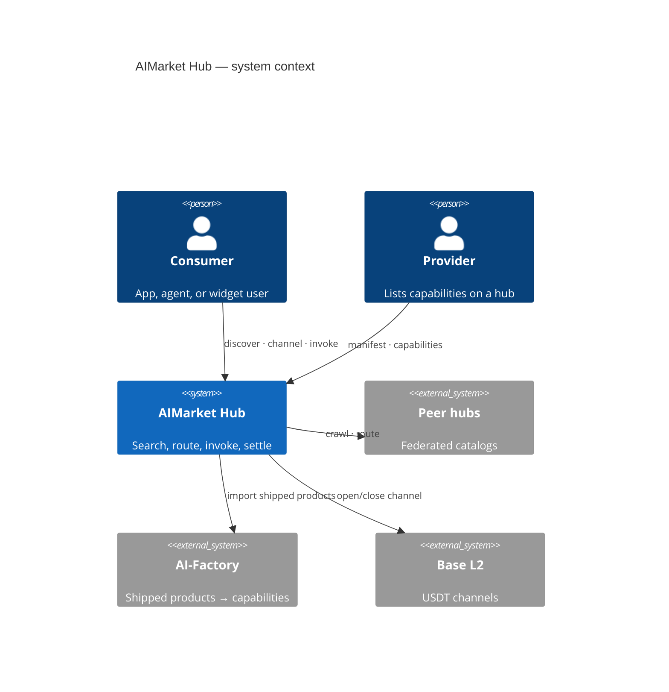
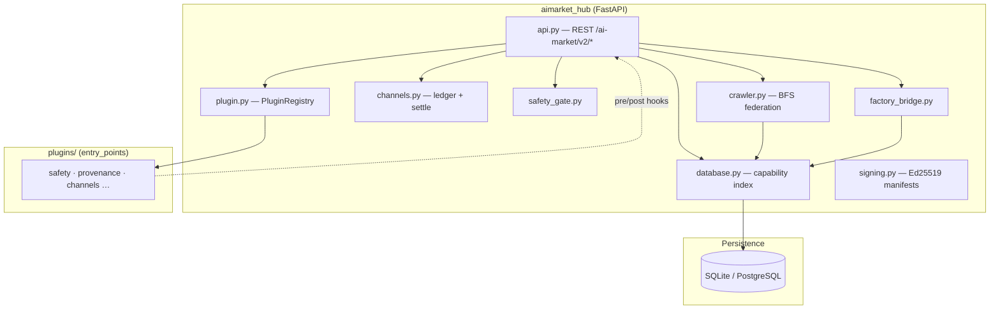
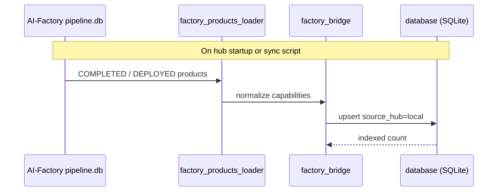
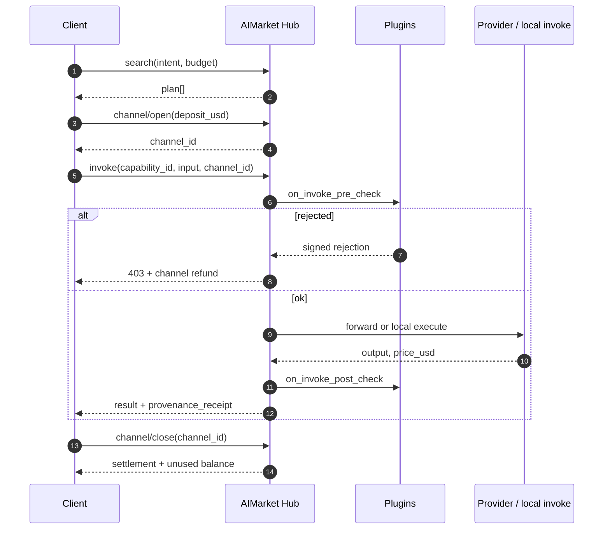
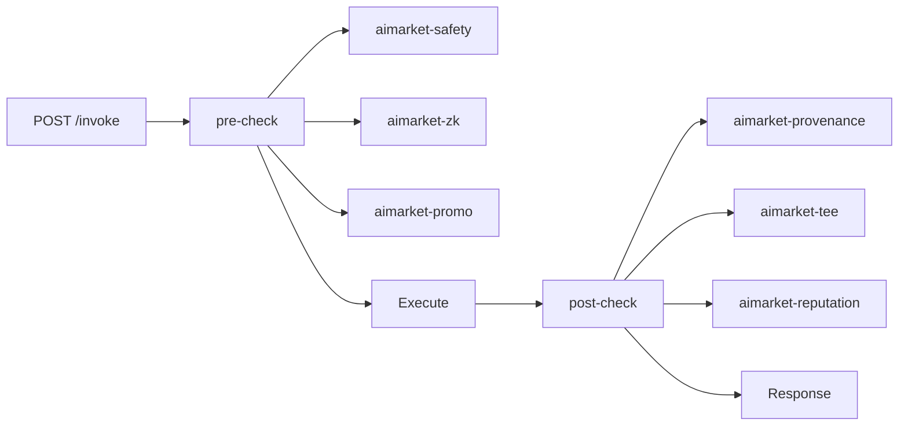
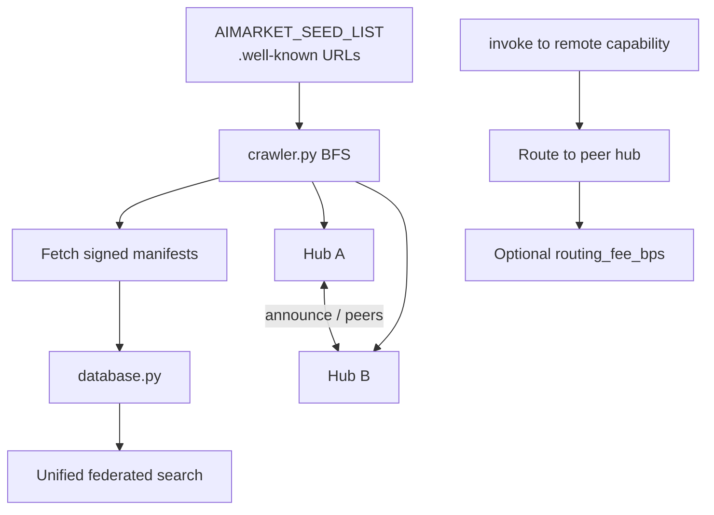

<!-- aicom-mirror-notice -->
> **Mirror — read-only.**
> The canonical source for `aimarket-hub` lives in the AI-Factory monorepo.
> Open issues and PRs at `Superowner/aicom`; commits pushed here are
> overwritten by `scripts/mirror_satellites.sh` on the next sync run.
> See `docs/repository-canonical-policy.md` for the policy.

# AIMarket Hub

[](LICENSE)
[](https://www.python.org/downloads/)
[](https://github.com/ai-factory/aimarket-protocol)
[](https://modelmarket.dev)

**Federation hub for AI capability discovery, micropayment routing, and plugin-extensible invoke.**

Reference implementation of [AIMarket Protocol v2](../aimarket-protocol/spec.md). One HTTP surface to **search** a federated catalog, **open payment channels**, **invoke** capabilities with safety and compliance hooks, and **settle** on-chain — without custodial wallets.

| | |
|---|---|
| **Live hub** | [modelmarket.dev](https://modelmarket.dev) |
| **Well-known** | [/.well-known/ai-market.json](https://modelmarket.dev/.well-known/ai-market.json) |
| **Plugin demo** | [/plugins/demo](https://modelmarket.dev/plugins/demo) |
| **Widget demo** | [/widget/demo](https://modelmarket.dev/widget/demo) |
| **Plain-language value** | [docs/value.md](docs/value.md) |

## Value in plain words

One place to find, pay for, and call AI capabilities from many providers — search, wallet, invoke, settle. The «app store + payment network» for AI functions.

**Простыми словами:** Одно место, чтобы найти, оплатить и вызвать AI-возможности от разных поставщиков — поиск, кошелёк, вызов, расчёт. «App Store + платёжная сеть» для AI-функций.

Full text: [docs/value.md](docs/value.md)

---

## Table of contents

- [Overview](#overview)
- [Architecture](#architecture)
- [Repository layout](#repository-layout)
- [Quick start](#quick-start)
- [Core API](#core-api)
- [Invoke lifecycle](#invoke-lifecycle)
- [Plugin ecosystem](#plugin-ecosystem)
- [Federation](#federation)
- [Payments](#payments)
- [Configuration](#configuration)
- [Deployment](#deployment)
- [Development](#development)
- [Security](#security)
- [Related projects](#related-projects)
- [License](#license)

---

## Overview

AIMarket Hub sits between **capability providers** (factory-shipped products, peer hubs, data-cap publishers) and **consumers** (Flutter desktop apps, agents, embeddable widgets, MCP clients).

**Problems it solves**

| Problem | Hub answer |
|---------|------------|
| Fragmented AI APIs | Federated search over `.well-known/ai-market.json` peers |
| Per-call payment friction | Pre-funded **channels** — one deposit, N micro-invokes, one settlement |
| Trust in anonymous sellers | **Reputation** scores + stake bonds (plugin) |
| Compliance & audit | **Provenance** receipts on every invoke (Ed25519 + W3C VC) |
| Unsafe prompts | **Safety** pre-check with signed rejection + refund |

**Value in plain words:** One place to find, pay for, and call AI capabilities from many providers — search, wallet, invoke, settle.  
**Простыми словами:** «App Store + платёжная сеть» для AI-функций. [Full text →](docs/value.md)

### Killer feature — Zero-Trust Agent Discovery

**No human app-store reviewer.** Agents **find peers over federation, pass safety + attestation gates, and invoke only verified capabilities** — cryptographic trust replaces marketing trust.

| | |
|---|---|
| **What** | Federated `discover` → safety / reputation / TEE plugins → routed invoke |
| **Why** | Scales to millions of micro-capabilities; malicious listings can’t drain channels |
| **Deep dive** | [docs/killer-feature-zero-trust-discovery.md](docs/killer-feature-zero-trust-discovery.md) · [Ecosystem killer features](../docs/killer-features.md) |

---

## Architecture

### System context



### Container diagram (this repository)



### Factory import path

Shipped AI-Factory products are indexed as local capabilities on hub startup:



Sync ops: [`../scripts/sync_pipeline_mirror_and_hub.py`](../scripts/sync_pipeline_mirror_and_hub.py)

---

## Repository layout

```
aimarket-hub/
├── aimarket_hub/           # Core package
│   ├── api.py              # HTTP routes (search, invoke, federation, plugins)
│   ├── crawler.py          # Peer discovery (SSRF-hardened BFS)
│   ├── database.py         # Capability + peer index
│   ├── channels.py         # Payment channel ledger
│   ├── plugin.py           # setuptools aimarket.plugins loader
│   ├── factory_bridge.py   # AI-Factory product import
│   ├── safety_gate.py      # Built-in safety fallback
│   └── …
├── plugins/                # Hub-local plugins (e.g. aimarket-provenance)
├── tests/                  # pytest suite
├── Dockerfile
├── LICENSE                 # Apache-2.0
├── CONTRIBUTORS.md
├── SECURITY.md
└── docs/
    └── value.md
```

**Sibling packages** (monorepo root [`plugins/`](../plugins/)): 14 pip-installable plugins copied into the hub Docker image.

---

## Quick start

### Prerequisites

- Python **3.11+**
- Optional: Docker for container deploy

### Install & run

```bash
pip install aimarket-hub
aimarket serve
# → http://localhost:9083
```

Verify discovery and search:

```bash
curl -s http://localhost:9083/.well-known/ai-market.json | jq .
curl -s "http://localhost:9083/ai-market/v2/search?intent=translate&budget=1" | jq .
curl -s http://localhost:9083/ai-market/v2/plugins | jq '.plugins | length'
```

### Docker

```bash
docker build -f aimarket-hub/Dockerfile -t modelmarket-hub .
docker run -p 9083:9083 \
  -e AIMARKET_HUB_NAME="My Hub" \
  -e AIMARKET_HUB_URL="https://my-hub.example.com" \
  -e AIMARKET_PAYMENT_RECIPIENT="0xYourWallet" \
  modelmarket-hub
```

---

## Core API

| Method | Path | Description |
|--------|------|-------------|
| `GET` | `/.well-known/ai-market.json` | Root discovery — chain, token, peers, signer key |
| `GET` | `/ai-market/v2/manifest` | Ed25519-signed capability catalog |
| `GET` | `/ai-market/v2/search` | NL federated search (`intent`, `budget`, `category`) |
| `POST` | `/ai-market/v2/invoke` | Invoke capability (plugin hooks, safety gate) |
| `POST` | `/ai-market/v2/channel/open` | Open pre-funded payment channel |
| `POST` | `/ai-market/v2/channel/close` | Close channel — settle + refund remainder |
| `POST` | `/ai-market/v2/federation/announce` | Peer hub announcement |
| `GET` | `/ai-market/v2/federation/peers` | Known peers + trust scores |
| `POST` | `/ai-market/v2/federation/crawl` | Trigger BFS crawl of seed peers |
| `GET` | `/ai-market/v2/plugins` | Loaded plugin catalog |
| `GET` | `/ai-market/v2/reputation/{hub_url}` | Trust score breakdown |
| `GET` | `/ai-market/v2/stats/live` | Real-time invocation feed |

OpenAPI: `/docs` when `AIMARKET_OPENAPI=1`. Full spec: [`../aimarket-protocol/spec.md`](../aimarket-protocol/spec.md)

---

## Invoke lifecycle

Standard consumer flow (implemented by [`aimarket_agent`](../aimarket-sdks/dart/)):



---

## Plugin ecosystem

Plugins register via **`aimarket.plugins`** entry points ([`plugin.py`](aimarket_hub/plugin.py)). Each ships **README + docs/** (`value.md`, `user-guide.md`, `sdk-integration.md`, `user-cases.md`).

Regenerate docs: `python3 scripts/bootstrap_hub_plugin_docs.py` · value text: `python3 scripts/bootstrap_product_value.py`



| Plugin | Category | One-line value |
|--------|----------|----------------|
| [`aimarket-provenance`](plugins/aimarket-provenance/) | compliance | Cryptographic receipt per AI output |
| [`aimarket-safety`](../plugins/aimarket-safety/) | security | Block jailbreak / injection before billing |
| [`aimarket-reputation`](../plugins/aimarket-reputation/) | reputation | Stake-backed trust scores |
| [`aimarket-channels`](../plugins/aimarket-channels/) | infrastructure | Off-chain ledger, on-chain settlement |
| [`aimarket-tee`](../plugins/aimarket-tee/) | security | Hardware attestation (Nitro / TDX) |
| [`aimarket-auction`](../plugins/aimarket-auction/) | monetization | Spot bidding for scarce slots |
| [`aimarket-personas`](../plugins/aimarket-personas/) | tooling | Buyer-friendly agent personas |
| [`aimarket-streaming`](../plugins/aimarket-streaming/) | monetization | SSE + per-token micro-billing |
| [`aimarket-nft`](../plugins/aimarket-nft/) | monetization | Transferable prepaid credit NFTs |
| [`aimarket-mcp-packager`](../plugins/aimarket-mcp-packager/) | tooling | MCP bundle for Claude Desktop |
| [`aimarket-orchestrator`](../plugins/aimarket-orchestrator/) | monetization | NL task → capability chain planner |
| [`aimarket-data-cap`](../plugins/aimarket-data-cap/) | monetization | Private corpus → paid search |
| [`aimarket-promo`](../plugins/aimarket-promo/) | monetization | Signed time-locked discounts |
| [`aimarket-dataset`](../plugins/aimarket-dataset/) | tooling | Weekly anonymized demand corpus |
| [`aimarket-zk`](../plugins/aimarket-zk/) | security | ZK proofs without revealing input |

---

## Federation

Hubs discover each other without a central registry:



Trust scoring: [`trust.py`](aimarket_hub/trust.py) · Signing: [`signing.py`](aimarket_hub/signing.py)

Deep dive: [`../docs/FEDERATION_HUB_REPORT.md`](../docs/FEDERATION_HUB_REPORT.md)

---

## Payments


| Field | Default | Notes |
|-------|---------|-------|
| Chain | Base (L2) | `AIMARKET_PAYMENT_CHAIN` |
| Token | USDT | `AIMARKET_PAYMENT_TOKEN` |
| Recipient | env required | `AIMARKET_PAYMENT_RECIPIENT` |

Protocol principle: **no custody** — channels are on-chain constructs; hub holds ledger state only.

---

## Configuration

| Variable | Default | Description |
|----------|---------|-------------|
| `AIMARKET_HUB_NAME` | AIMarket Hub | Display name in manifests |
| `AIMARKET_HUB_URL` | `http://localhost:9083` | Public URL (receipts, well-known) |
| `AIMARKET_PAYMENT_CHAIN` | `base` | Settlement chain |
| `AIMARKET_PAYMENT_TOKEN` | `USDT` | Settlement token |
| `AIMARKET_PAYMENT_RECIPIENT` | — | **Required in production** |
| `AIMARKET_CRAWL_INTERVAL_S` | `3600` | Federation crawl period |
| `AIMARKET_ROUTING_FEE_BPS` | `100` | Routing fee (1% = 100 bps) |
| `AIMARKET_SEED_LIST` | — | Comma-separated peer `.well-known` URLs |
| `AIMARKET_PLUGIN_WHITELIST` | — | Restrict loaded plugins |
| `DATABASE_URL` | SQLite file | PostgreSQL for production |

---

## Deployment

Production reference: [`../docs/production-modelmarket-dev.md`](../docs/production-modelmarket-dev.md)

| Checklist item | Action |
|----------------|--------|
| TLS | Terminate at nginx / Caddy → hub container |
| Secrets | `AIMARKET_PAYMENT_RECIPIENT`, DB URL via env — not in git |
| Factory sync | Cron or webhook → `sync_pipeline_mirror_and_hub.py` |
| Plugins | `pip install` desired plugins before `aimarket serve` |
| Health | `GET /.well-known/ai-market.json` + `/ai-market/v2/stats/live` |

---

## Development

```bash
cd aimarket-hub
pip install -e ".[dev]"
pytest tests/ -q
```

Key test modules: `test_api.py`, `test_crawler.py`, `test_plugin_system.py`, `test_channels.py`, `test_cross_hub_integration.py`

Add a plugin: create package under [`../plugins/`](../plugins/) with `pyproject.toml` entry point `aimarket.plugins`.

---

## Security

- **SSRF protection** on federation crawler ([`crawler.py`](aimarket_hub/crawler.py))
- **Signed manifests** — Ed25519 ([`signing.py`](aimarket_hub/signing.py))
- **Safety gate** on every invoke ([`safety_gate.py`](aimarket_hub/safety_gate.py))
- **Vulnerability reports:** [SECURITY.md](SECURITY.md) → security@aicom.io

---

## Related projects

| Project | Relationship |
|---------|--------------|
| [AICOM / AI-Factory](../README.md) | Ships products → hub index |
| [aimarket-protocol](../aimarket-protocol/) | Normative v2 spec |
| [aimarket-sdks](../aimarket-sdks/) | Client SDKs (Dart alpha) |
| [aimarket-widget](../aimarket-widget/) | Embeddable UI |
| [desktop-integrations](../desktop-integrations/) | 8 Flutter consumer apps |
| [Ecosystem architecture](../docs/ecosystem-architecture.md) | Full monorepo diagram |

---

## License

Apache-2.0 — see [LICENSE](LICENSE). Maintainers: [CONTRIBUTORS.md](CONTRIBUTORS.md).
