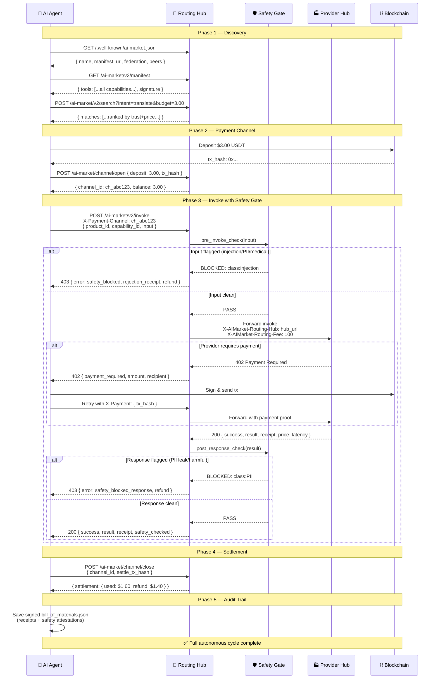
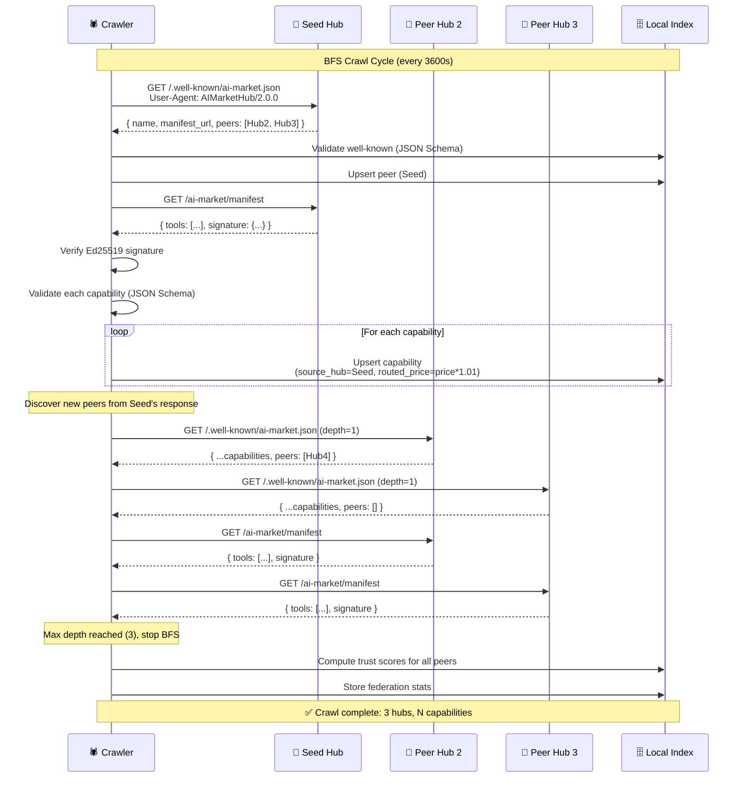
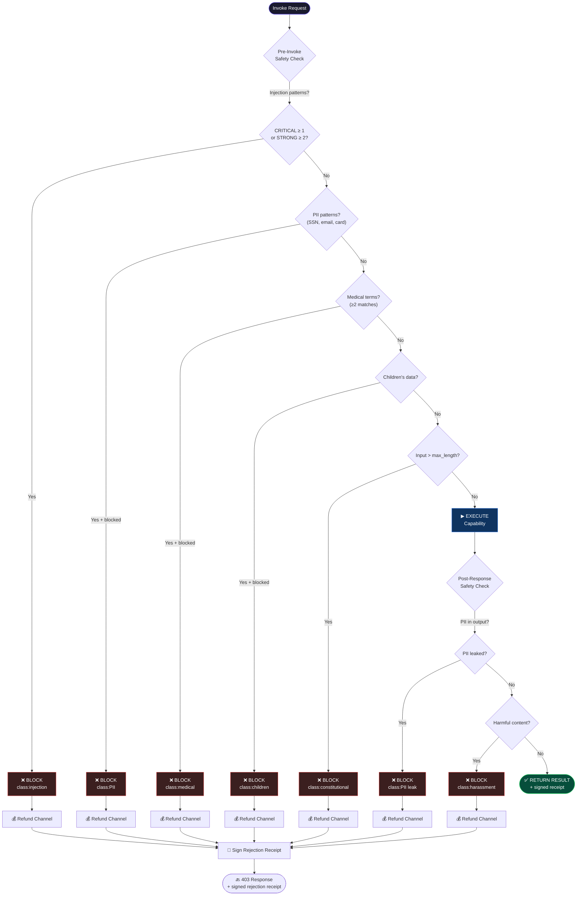
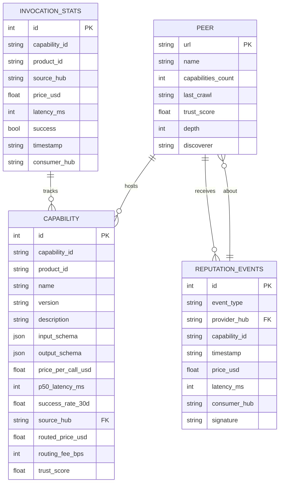
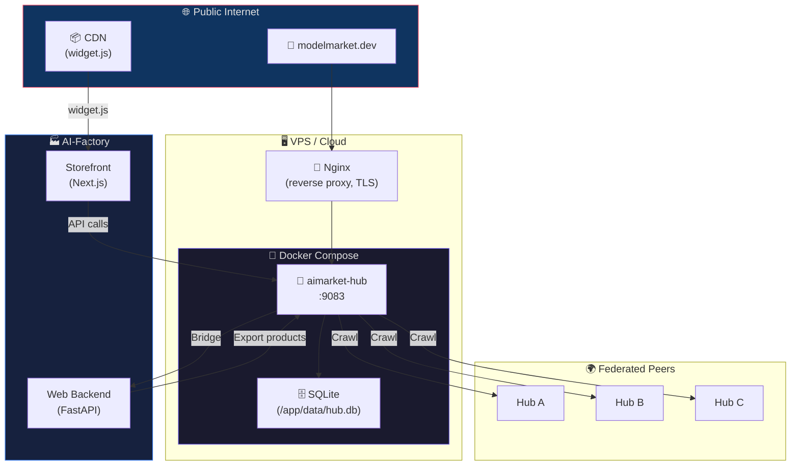
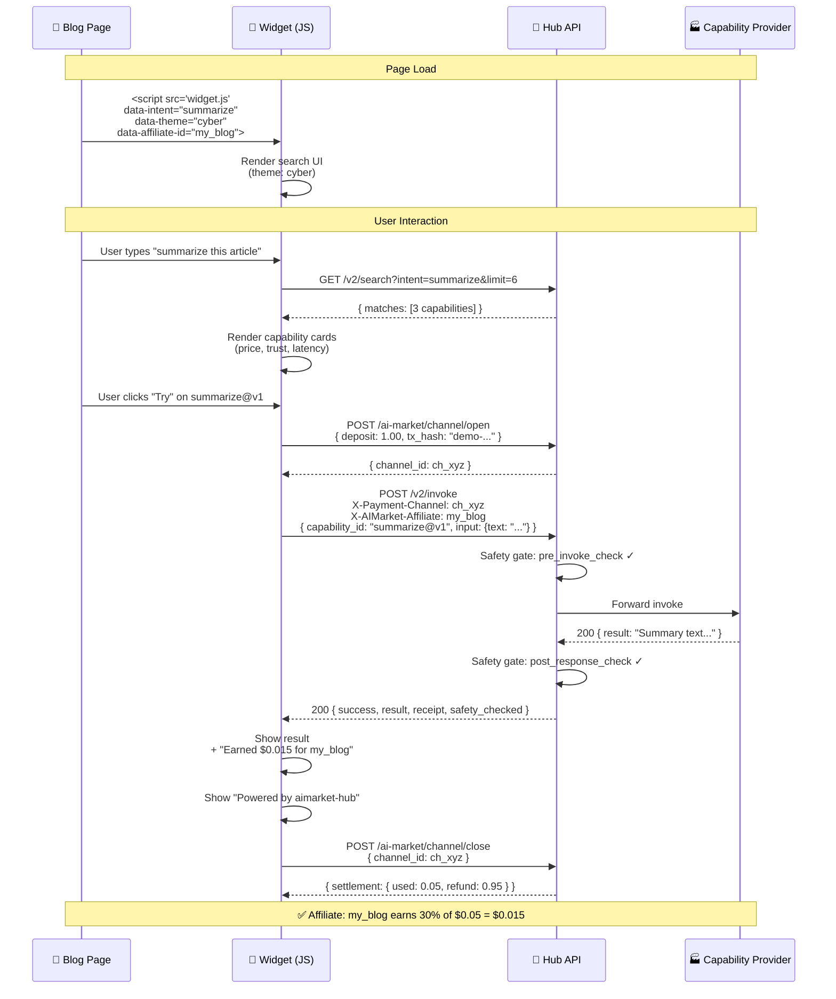
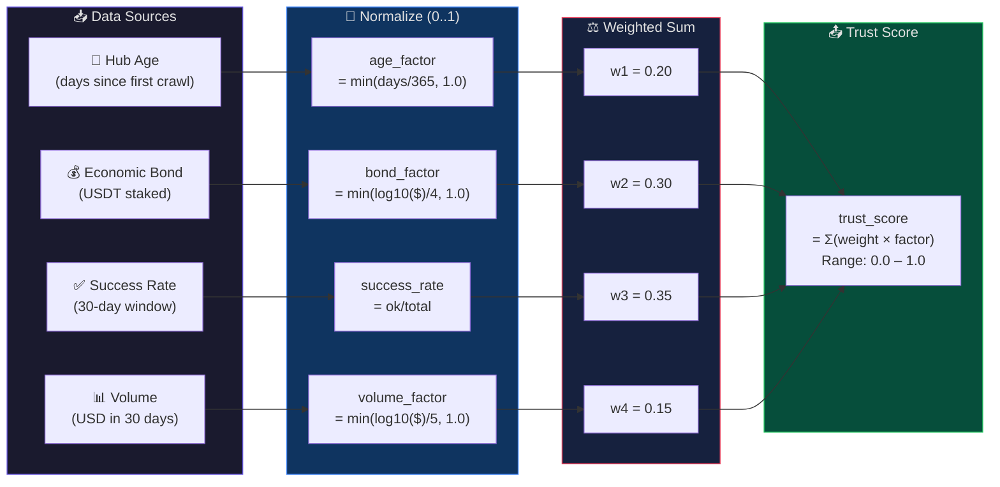

# AIMarket Hub — Architecture & Interaction Diagrams

## System Overview

```mermaid
graph TB
    subgraph External["🌐 External"]
        AGENT["🤖 AI Agent<br/>(Claude/GPT/Cursor)"]
        USER["👤 User<br/>(Browser/CLI)"]
        BLOG["📝 Blog<br/>(Widget embedded)"]
    end

    subgraph Factory["🏭 AI-Factory (closed core)"]
        PIPELINE["⚙️ 13-agent Pipeline"]
        STOREFRONT["🛒 Storefront<br/>(Next.js)"]
        ADMIN["🔧 Admin Panel"]
    end

    subgraph Hub["🔄 AIMarket Hub (Apache-2.0)"]
        direction TB
        WK["📋 .well-known<br/>GET /ai-market.json"]
        CRAWLER["🕷️ Crawler<br/>(BFS daemon)"]
        INDEXER["🗄️ Indexer<br/>(SQLite)"]
        SEARCH["🔍 Search API<br/>/v2/search"]
        ROUTER["🚦 Routing Proxy<br/>/v2/invoke"]
        SAFETY["🛡️ Safety Gate<br/>(pre/post invoke)"]
        TRUST["⭐ Trust Scorer<br/>(age+bond+success+volume)"]
        VALIDATOR["✅ Schema Validator<br/>(JSON Schema)"]
        SIGNER["🔐 Signer<br/>(Ed25519)"]
        STATS["📊 Live Stats<br/>/v2/stats/live"]
        EXPORTER["📦 Dataset Exporter<br/>(weekly JSONL)"]
    end

    subgraph Federation["🌍 Federation Network"]
        HUB2["Hub 2<br/>Legal AI"]
        HUB3["Hub 3<br/>DeFi AI"]
        HUB4["Hub N...<br/>Any provider"]
    end

    subgraph Chain["⛓️ Blockchain"]
        BASE["Base L2<br/>(USDT settlement)"]
        ETH["Ethereum<br/>(USDC settlement)"]
    end

    %% Flows
    AGENT -->|"① GET .well-known"| WK
    AGENT -->|"② Discover"| SEARCH
    AGENT -->|"③ Invoke (402)"| ROUTER
    USER -->|"Browser"| STOREFRONT
    BLOG -->|"Widget"| ROUTER
    STOREFRONT -->|"Federated catalog"| SEARCH
    ADMIN -->|"Manage"| CRAWLER
    PIPELINE -->|"Products → capabilities"| INDEXER

    CRAWLER -->|"Crawl .well-known"| HUB2
    CRAWLER -->|"Crawl .well-known"| HUB3
    CRAWLER -->|"Discover"| HUB4
    CRAWLER -->|"Index manifests"| INDEXER
    INDEXER -->|"Store"| SEARCH
    INDEXER -->|"Store"| TRUST

    ROUTER -->|"Pre-check"| SAFETY
    SAFETY -->|"Pass"| ROUTER
    SAFETY -->|"Block → refund"| ROUTER
    ROUTER -->|"Forward invoke"| HUB2
    ROUTER -->|"Return receipt"| AGENT

    TRUST -->|"Score peers"| INDEXER
    VALIDATOR -->|"Validate"| CRAWLER
    SIGNER -->|"Sign manifests"| WK
    SIGNER -->|"Sign receipts"| ROUTER
    STATS -->|"Live feed"| USER
    EXPORTER -->|"Weekly corpus"| USER

    ROUTER -->|"Settlement"| BASE
    ROUTER -->|"Settlement"| ETH

    style Hub fill:#1a1a2e,stroke:#6c5ce7,color:#e0e0e0
    style Factory fill:#16213e,stroke:#0f3460,color:#e0e0e0
    style Federation fill:#0f3460,stroke:#e94560,color:#e0e0e0
    style External fill:#533483,stroke:#e94560,color:#e0e0e0
    style Chain fill:#1b1b2f,stroke:#f5c518,color:#e0e0e0
```

---

## Autonomous Invoke Cycle (Full Flow)

---

## Federation Crawl Protocol

---

## Safety Gate Decision Tree

---

## Data Model (Entity Relationships)

---

## Deployment Topology

---

## Widget Embed Lifecycle

---

## Trust Score Computation Flow

