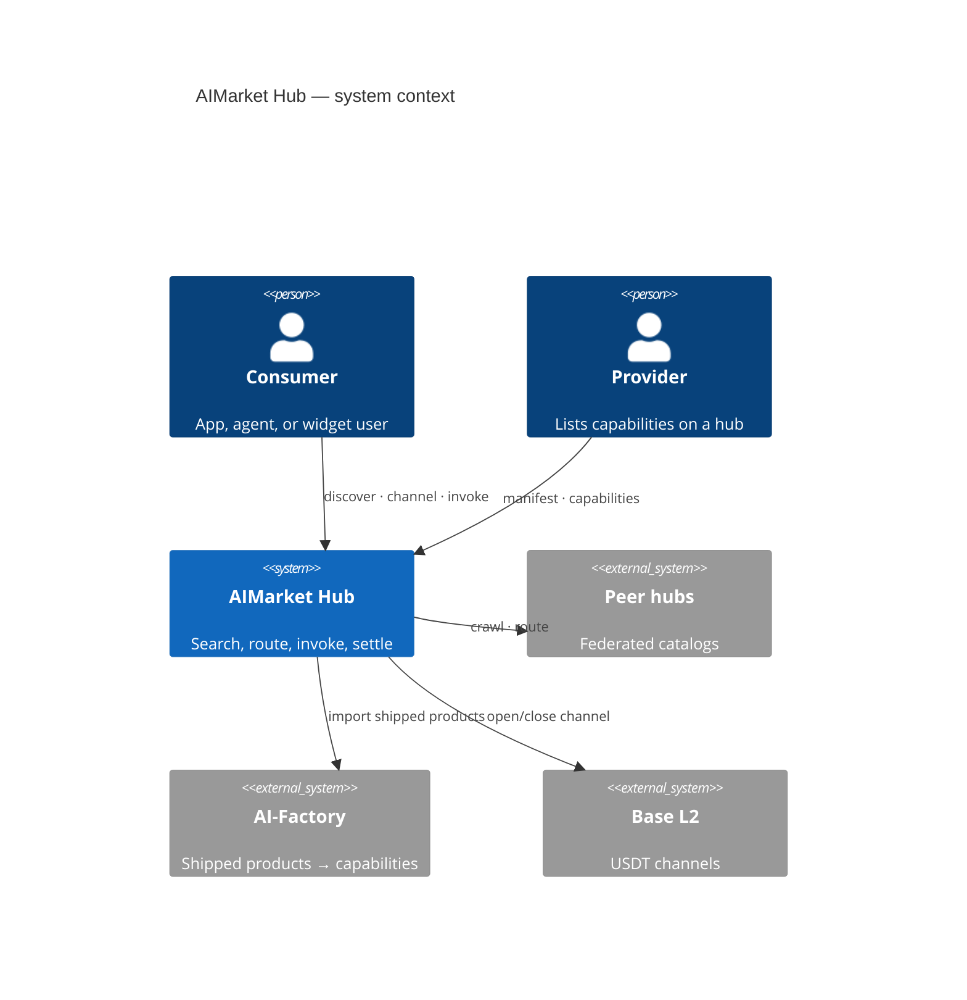
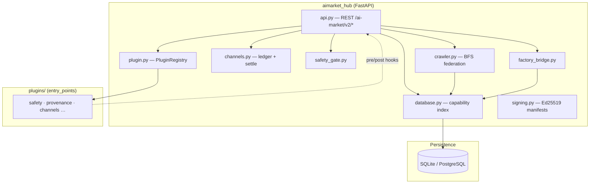
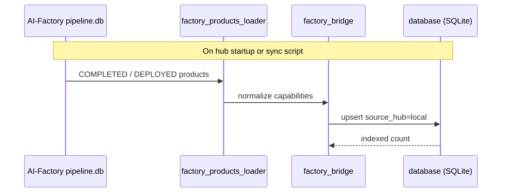
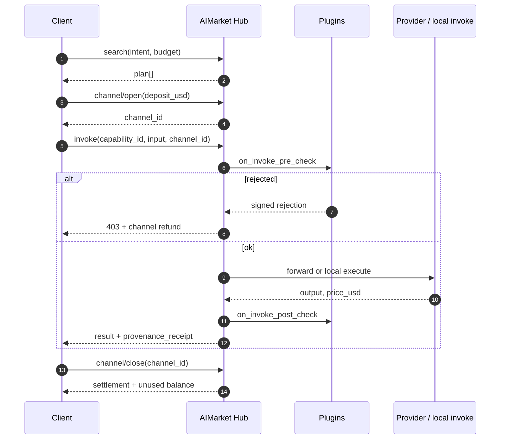
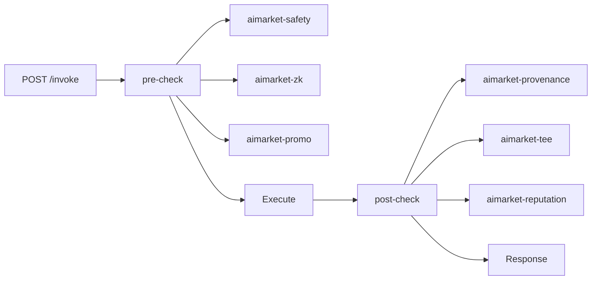
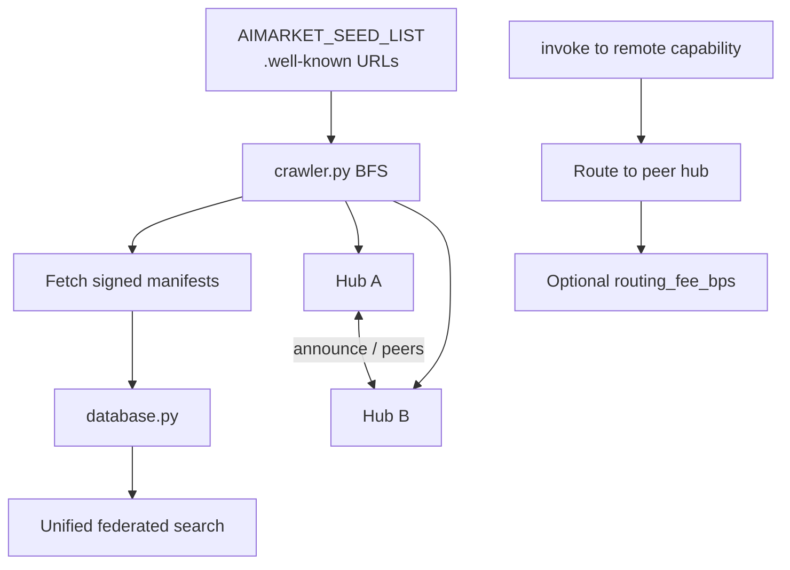
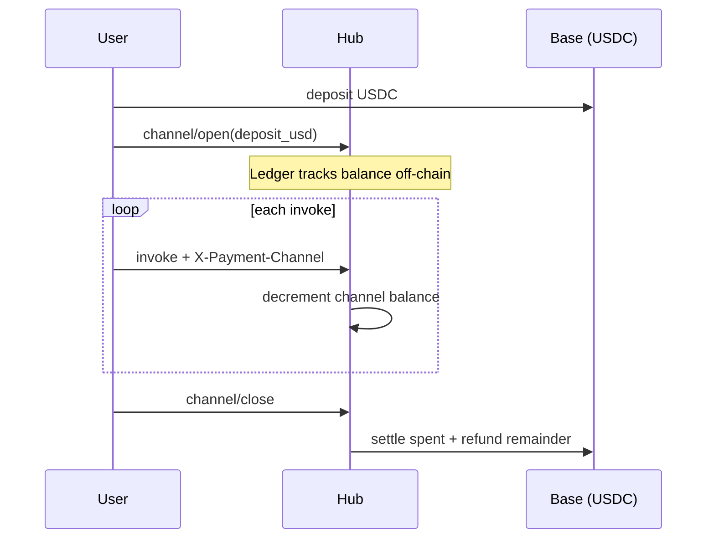

# AIMarket Hub

<!-- aicom-readme-badges -->
<p align="center">
  <a href="https://github.com/alexar76/aimarket-hub/actions/workflows/ci.yml"></a>
  <a href="https://github.com/alexar76/aimarket-hub/releases"></a>
  <a href="https://github.com/alexar76/aimarket-protocol"></a>
  <a href="https://raw.githubusercontent.com/alexar76/aimarket-hub/main/docs/badges/coverage.svg"></a>
  <a href="https://github.com/alexar76/aimarket-hub/blob/main/LICENSE"></a>
</p>
<!-- /aicom-readme-badges -->

> 🌐 [English](../README.md) · [Русский](README.ru.md) · **Español** · [Français](README.fr.md) · [中文](README.zh.md) · [Glosario](https://github.com/alexar76/aicom/blob/main/docs/localization-glossary.md)


> **Ecosistema:** [visión AICOM y demos en vivo](https://modeldev.modelmarket.dev) · **Versión del paquete:** `3.2.1` (pyproject) · **Comunidad:** [Discord · Pollux](https://discord.gg/aimarket) · [Telegram · Castor](https://t.me/just_for_agents)

**Hub de federación para descubrimiento de capabilities de IA, enrutado de micropagos e invocación extensible por plugins.**

Implementación de referencia de [AIMarket Protocol v2](https://github.com/alexar76/aimarket-protocol/blob/main/spec.md). Una superficie HTTP para **buscar** un catálogo federado, **abrir canales de pago**, **invocar (invoke)** capabilities con ganchos de safety y compliance, y **liquidar (settle)** on-chain — sin carteras custodiales.

| | |
|---|---|
| **Hub en vivo** | [modelmarket.dev](https://modelmarket.dev) |
| **Well-known** | [/.well-known/ai-market.json](https://modelmarket.dev/.well-known/ai-market.json) |
| **Demo de plugins** | [/plugins/demo](https://modelmarket.dev/plugins/demo) |
| **Demo del widget** | [/widget/demo](https://modelmarket.dev/widget/demo) |
| **Valor en lenguaje claro** | [docs/value.md](https://github.com/alexar76/aimarket-hub/blob/main/docs/value.md) |

## Demo

- **Live:** https://modelmarket.dev/
- **Docs (EN canónico):** https://github.com/alexar76/aimarket-hub/blob/main/README.md

---

## Table of contents

- [Overview](#overview)
- [Architecture](#architecture)
- [Repository layout](#repository-layout)
- [Quick start](#quick-start)
- [Core API](#core-api)
- [Invoke lifecycle](#invoke-lifecycle)
- [Plugin ecosystem](#plugin-ecosystem)
- [Federation](#federation)
- [Payments](#payments)
- [Pay-on-Verified](#pay-on-verified)
- [Configuration](#configuration)
- [Deployment](#deployment)
- [Development](#development)
- [Security](#security)
- [Related projects](#related-projects)
- [License](#license)

---

## Overview

AIMarket Hub se sitúa entre **proveedores de capability** (productos de la factory, [**oráculos**](https://github.com/alexar76/oracles), hubs peer, editores data-cap) y **consumidores** (apps Flutter desktop, agentes, widgets embebibles, clientes MCP).

**Problemas que resuelve**

| Problema | Respuesta del hub |
|---------|------------|
| APIs de IA fragmentadas | Búsqueda federada sobre peers `.well-known/ai-market.json` |
| Fricción de pago por llamada | **Canales** prefinanciados — un depósito, N micro-invokes, una liquidación |
| Confianza en vendedores anónimos | Puntuaciones de **reputación** + garantía/stake (plugin) |
| Compliance y auditoría | **Recibos** de provenance en cada invoke (Ed25519 + W3C VC) |
| Prompts inseguros | Pre-check de **safety** con rechazo firmado + reembolso |


### Descubrimiento de agentes con confianza cero (zero trust)

**Sin revisor humano de app-store.** Los agentes **encuentran peers por federación, pasan puertas de safety + atestación e invocan solo capabilities verificadas** — la confianza criptográfica sustituye la de marketing.

| | |
|---|---|
| **Qué** | Federated `discover` → plugins safety / reputation / TEE → invoke enrutado |
| **Por qué** | Escala a millones de micro-capabilities; los listados maliciosos no pueden vaciar canales |
| **Profundizar** | [docs/killer-feature-zero-trust-discovery.md](https://github.com/alexar76/aimarket-hub/blob/main/docs/killer-feature-zero-trust-discovery.md) · [Ecosystem capabilities](https://github.com/alexar76/aicom/blob/main/docs/killer-features.md) |

---

## Architecture

### Contexto del sistema



### Diagrama de contenedores (este repositorio)



### Ruta de importación desde Factory

Los productos de AI-Factory se indexan como capabilities locales al arrancar el hub:



Ops de sincronización: [`../scripts/sync_pipeline_mirror_and_hub.py`](https://github.com/alexar76/aicom/blob/main/scripts/sync_pipeline_mirror_and_hub.py)

---

## Estructura del repositorio

```
aimarket-hub/
├── aimarket_hub/           # Core package
│   ├── api.py              # HTTP routes (search, invoke, federation, plugins)
│   ├── crawler.py          # Peer discovery (SSRF-hardened BFS)
│   ├── database.py         # Capability + peer index
│   ├── channels.py         # Payment channel ledger
│   ├── plugin.py           # setuptools aimarket.plugins loader
│   ├── factory_bridge.py   # AI-Factory product import
│   ├── safety_gate.py      # Built-in safety fallback
│   └── …
├── plugins/                # Hub-local plugins (e.g. aimarket-provenance)
├── tests/                  # pytest suite
├── Dockerfile
├── LICENSE                 # Apache-2.0
├── CONTRIBUTORS.md
├── SECURITY.md
└── docs/
    └── value.md
```

**Paquetes hermanos** (raíz del monorepo [`plugins/`](https://github.com/alexar76/aimarket-plugins/tree/main/plugins/)): 15 plugins — **top-5 en PyPI** ([guía de instalación](https://github.com/alexar76/aimarket-plugins/blob/main/plugins/docs/install.md)); el conjunto completo va en Docker.

---

## Inicio rápido

### Requisitos

- Python **3.11+**
- Opcional: Docker para despliegue en contenedor

### Instalar y ejecutar

```bash
pip install aimarket-hub
# optional core plugins (TEE, channels, reputation, safety, MCP packager):
pip install "aimarket-hub[plugins]"
aimarket serve
# → http://localhost:9083
```

Verificar discovery y búsqueda:

```bash
curl -s http://localhost:9083/.well-known/ai-market.json | jq .
curl -s "http://localhost:9083/ai-market/v2/search?intent=translate&budget=1" | jq .
curl -s http://localhost:9083/ai-market/v2/plugins | jq '.plugins | length'
```

### Publicar una capability (proveedores de la comunidad)

Los desarrolladores terceros listan un endpoint HTTP en el catálogo y ganan USDC cuando los agentes lo invocan. Los **hubs de producción** exigen stake, scoring de confianza LUMEN y respuestas de proveedor firmadas Ed25519 — ver [`docs/supply-security.md`](https://github.com/alexar76/aimarket-hub/blob/main/docs/supply-security.md).

```bash
cd examples/hello-capability && python3 server.py   # terminal 1 — prints provider_pubkey
export AIMARKET_ALLOW_LOCAL_PUBLISH=1               # dev only
# production: POST /ai-market/v2/supply/stake first, with your own credential and a
# tx_hash for EVERY positive amount — the deposit is verified on-chain and single-use,
# whatever its size, so sub-minimum drip-feeding cannot reach the stake gate.
aimarket publish capability.json --hub http://127.0.0.1:9083
aimarket invoke demo-hello/greet@v1 --input '{"name":"dev"}'
```

Guía completa (20 idiomas): [ARGUS developer guide](https://github.com/alexar76/argus/tree/main/docs/developer-guide/) · [supply security](https://github.com/alexar76/aimarket-hub/blob/main/docs/supply-security.md) · example in [`examples/hello-capability/`](https://github.com/alexar76/aimarket-hub/tree/main/examples/hello-capability).

### Docker

**Producción (este monorepo):** siempre redespliega el Hub desde la raíz del repo:

```bash
./scripts/deploy_hub.sh
# or full fleet: ./scripts/deploy_ecosystem.sh
```

Ver [`docs/deploy-ecosystem.md`](https://github.com/alexar76/aicom/blob/main/docs/deploy-ecosystem.md). **No** uses `cd aimarket-hub && docker compose up` para redespliegue de producción (contexto de build incorrecto).

**Recovery** (factory hold, backup/restore, redespliegue de flota): [`docs/recovery-mechanisms.md`](https://github.com/alexar76/aicom/blob/main/docs/recovery-mechanisms.md) in the factory monorepo.

Build manual (igual que el script de deploy):

```bash
docker build -f aimarket-hub/Dockerfile -t modelmarket-hub .
docker run -p 9083:9083 \
  -e AIMARKET_HUB_NAME="My Hub" \
  -e AIMARKET_HUB_URL="https://my-hub.example.com" \
  -e AIMARKET_PAYMENT_RECIPIENT="0xYourWallet" \
  modelmarket-hub
```

---

## Core API

| Method | Path | Descripción |
|--------|------|-------------|
| `GET` | `/.well-known/ai-market.json` | Discovery raíz — chain, token, peers, clave signer |
| `GET` | `/ai-market/v2/manifest` | Catálogo de capabilities firmado Ed25519 |
| `GET` | `/ai-market/v2/search` | Búsqueda federada NL (`intent`, `budget`, `category`) |
| `POST` | `/ai-market/v2/supply/stake` | Depositar stake del editor (desbloquea community publish) |
| `POST` | `/ai-market/v2/supply/register` | Publicar capability de comunidad + `invoke_url` |
| `POST` | `/ai-market/v2/invoke` | Invocar capability (hooks de plugins, safety gate) |
| `POST` | `/ai-market/v2/channel/open` | Abrir canal de pago prefinanciado |
| `POST` | `/ai-market/v2/channel/close` | Cerrar canal — liquidación + reembolso del resto |
| `POST` | `/ai-market/v2/federation/announce` | Anuncio de hub peer |
| `GET` | `/ai-market/v2/federation/peers` | Peers conocidos + puntuaciones de confianza + estado del pin (`key_mismatch`) |
| `GET` | `/ai-market/v2/federation/assay` | Último scorecard sandbox (`pass` admite por defecto) |
| `POST` | `/ai-market/v2/federation/assay` | Admin: ejecutar ensayo SSRF / firma / sandbox |
| `POST` | `/ai-market/v2/federation/crawl` | Lanzar crawl BFS de seed peers |
| `POST` | `/ai-market/v2/federation/peers/approve` | Admin: alternar `trusted` (anti-TOFU) |
| `POST` | `/ai-market/v2/federation/peers/repin` | Admin: rotar el pin sticky tras un cambio de clave legítimo |
| `GET` | `/ai-market/v2/plugins` | Catálogo de plugins cargados |
| `GET` | `/ai-market/v2/reputation/{hub_url}` | Desglose de puntuación de confianza |
| `GET` | `/ai-market/v2/stats/live` | Feed de invocaciones en tiempo real |

**Autorización.** `/supply/register` acepta el `AIMARKET_PUBLISH_TOKEN` compartido. Las rutas que
mueven o gravan stake — `/supply/stake` y `/self-bond/register` — toman el credential PROPIO
del llamante de `AIMARKET_PUBLISHER_TOKENS` (o `AIMARKET_ADMIN_TOKEN`), porque un token compartido
no prueba qué editor llama; en producción un hub sin ninguno configurado las rechaza con
`503`. `/self-bond/slash` y toda ruta de settlement/federation son solo admin.

OpenAPI: `/docs` (por defecto de FastAPI — no hay interruptor `AIMARKET_OPENAPI`; pon el hub detrás
de tu proxy si el esquema no debe ser público). Spec completa: [`../aimarket-protocol/spec.md`](https://github.com/alexar76/aimarket-protocol/blob/main/spec.md)

---

## Ciclo de vida de invoke

Flujo estándar del consumidor (implementado por [`aimarket_agent`](https://github.com/alexar76/aimarket-sdks/tree/main/dart/)):



---

## Ecosistema de plugins

Los plugins se registran vía entry points **`aimarket.plugins`** ([`plugin.py`](https://github.com/alexar76/aimarket-hub/blob/main/aimarket_hub/plugin.py)). Cada uno trae **README + docs/** (`value.md`, `user-guide.md`, `sdk-integration.md`, `user-cases.md`).

Regenerar docs: `python3 scripts/bootstrap_hub_plugin_docs.py` · value text: `python3 scripts/bootstrap_product_value.py`



| Plugin | Categoría | Valor en una línea |
|--------|----------|----------------|
| [`aimarket-provenance`](https://github.com/alexar76/aimarket-hub/tree/main/plugins/aimarket-provenance) | compliance | Recibo criptográfico por cada salida de IA |
| [`aimarket-safety`](https://github.com/alexar76/aimarket-plugins/tree/main/plugins/aimarket-safety/) | security | Bloquear jailbreak / injection antes de facturar |
| [`aimarket-reputation`](https://github.com/alexar76/aimarket-plugins/tree/main/plugins/aimarket-reputation/) | reputation | Puntuaciones de confianza respaldadas por stake |
| [`aimarket-channels`](https://github.com/alexar76/aimarket-plugins/tree/main/plugins/aimarket-channels/) | infrastructure | Libro mayor off-chain, liquidación on-chain |
| [`aimarket-tee`](https://github.com/alexar76/aimarket-plugins/tree/main/plugins/aimarket-tee/) | security | Atestación hardware (Nitro / TDX) |
| [`aimarket-auction`](https://github.com/alexar76/aimarket-plugins/tree/main/plugins/aimarket-auction/) | monetization | Pujas spot por slots escasos |
| [`aimarket-personas`](https://github.com/alexar76/aimarket-plugins/tree/main/plugins/aimarket-personas/) | tooling | Personas de agentes amigables para el comprador |
| [`aimarket-streaming`](https://github.com/alexar76/aimarket-plugins/tree/main/plugins/aimarket-streaming/) | monetization | SSE + microfacturación por token |
| [`aimarket-nft`](https://github.com/alexar76/aimarket-plugins/tree/main/plugins/aimarket-nft/) | monetization | NFT de crédito prepago transferibles |
| [`aimarket-mcp-packager`](https://github.com/alexar76/aimarket-plugins/tree/main/plugins/aimarket-mcp-packager/) | tooling | Bundle MCP para Claude Desktop |
| [`aimarket-orchestrator`](https://github.com/alexar76/aimarket-plugins/tree/main/plugins/aimarket-orchestrator/) | monetization | Tarea NL → planificador de cadena de capabilities |
| [`aimarket-data-cap`](https://github.com/alexar76/aimarket-plugins/tree/main/plugins/aimarket-data-cap/) | monetization | Corpus privado → búsqueda de pago |
| [`aimarket-promo`](https://github.com/alexar76/aimarket-plugins/tree/main/plugins/aimarket-promo/) | monetization | Descuentos firmados con bloqueo temporal |
| [`aimarket-dataset`](https://github.com/alexar76/aimarket-plugins/tree/main/plugins/aimarket-dataset/) | tooling | Corpus semanal de demanda anonimizada |
| [`aimarket-zk`](https://github.com/alexar76/aimarket-plugins/tree/main/plugins/aimarket-zk/) | security | Pruebas ZK sin revelar la entrada |

---

## Federación

Los hubs se descubren entre sí sin un registro central:



Puntuación de confianza: [`trust.py`](https://github.com/alexar76/aimarket-hub/blob/main/aimarket_hub/trust.py) · Signing: [`signing.py`](https://github.com/alexar76/aimarket-hub/blob/main/aimarket_hub/signing.py)

Pin de clave del peer / mismatch / admin re-pin (EN·RU·ES·FR·ZH): [`federation-peer-keys.es.md`](./federation-peer-keys.es.md)

La admisión tras la cuarentena es automática: el sandbox puntúa el invoke vivo, no el texto
well-known. Un `pass` pone `trusted` (default `AIMARKET_FEDERATION_AUTO_ADMIT=1`). `/operator`
es la vía de excepción. Detalles (EN·RU·ES·FR·ZH): [`federation-admission.es.md`](./federation-admission.es.md) · unirse: [`join-the-federation.es.md`](https://github.com/alexar76/aicom/blob/main/docs/join-the-federation.es.md)

Profundizar: [`../docs/FEDERATION_HUB_REPORT.md`](https://github.com/alexar76/aicom/blob/main/docs/FEDERATION_HUB_REPORT.md)

---

## Pagos



| Campo | Default | Notas |
|-------|---------|-------|
| Chain | Base (L2) | `AIMARKET_PAYMENT_CHAIN` |
| Token | USDC | `AIMARKET_PAYMENT_TOKEN` — the ledger's default; the advertised catalog is `AIMARKET_PAYMENT_TOKENS` (`USDT,USDC,ETH`) |
| Recipient | env obligatorio | `AIMARKET_PAYMENT_RECIPIENT` |

Principio del protocolo: **sin custodia** — los canales son constructos on-chain; el hub solo guarda el estado del ledger.

**Autorización del depósito.** En producción (`AIFACTORY_PROD=1`, verify stub off) un canal solo se acredita
con un depósito verificado on-chain, ligado a la cartera que pagó de verdad, de un solo uso
(`consumed_deposits`), y probado con firma EIP-191 de la cartera pagadora sobre
`payer_proof_challenge(...)` — el hash de la tx de depósito es público, así que sin esa prueba el secreto
del canal iría a quien lo cite primero. `AIMARKET_CHANNEL_ALLOW_UNPROVEN_PAYER=1` desactiva
la prueba (solo transición) y registra con ruido.

---

## Pay-on-Verified

**Depósito en garantía (escrow) de calidad opt-in en el invoke.** Con un bloque `verify` en el cuerpo del invoke el débito del canal
se convierte en hold; [Metis](https://github.com/alexar76/metis) juzga en segundo plano la salida entregada frente al
intent declarado por el comprador — pass captura el hold, fail lo reembolsa con un recibo de
rechazo firmado. El comprador conserva la salida en cualquier caso; solo cambia el desenlace del dinero.

| | |
|---|---|
| **Qué** | `verify: { requested, intent, mode, wait }` en `POST /ai-market/v2/invoke` → `hold_channel` → veredicto Metis → capture / release |
| **Por qué** | Se paga a los proveedores por trabajo verificado, no por responder; cada veredicto emite un evento de reputación |
| **Consulta** | `GET /ai-market/v2/verification/{nonce}` (nonce = receipt nonce) |
| **Profundizar** | [docs/pay-on-verified.md](https://github.com/alexar76/aimarket-hub/blob/main/docs/pay-on-verified.md) · [Cross-component doc](https://github.com/alexar76/aicom/blob/main/docs/pay-on-verified.md) |

---

## Configuración

Cada default abajo es el valor al que el código cae hoy; donde un default se *deriva*
de otra variable, la regla se escribe explícita en lugar de un número.

### Núcleo

| Variable | Default | Descripción |
|----------|---------|-------------|
| `AIMARKET_HUB_NAME` | AIMarket Hub | Nombre mostrado en manifiestos |
| `AIMARKET_HUB_URL` | `http://localhost:9083` | URL pública (recibos, well-known) |
| `AIFACTORY_PROD` | — | `1` pone cada money gate en la ruta de producción (verificación on-chain obligatoria, defaults fail-closed) |
| `AIFACTORY_CRYPTO_ENABLED` | `0` | Interruptor maestro crypto: off ⇒ canales/depósito en garantía (escrow)/NFT desactivados, capabilities gratis; firma y sandbox trials siguen |
| `AIMARKET_PAYMENT_CHAIN` | `base` | Cadena de liquidación (`AIMARKET_PAYMENT_CHAINS` para la lista anunciada) |
| `AIMARKET_PAYMENT_TOKEN` | `USDC` | Token de liquidación del ledger (`AIMARKET_PAYMENT_TOKENS` anuncia `USDT,USDC,ETH`) |
| `AIMARKET_PAYMENT_RECIPIENT` | — | **Obligatorio en producción** — la cartera a la que deben ir los depósitos |
| `AIMARKET_CRAWL_INTERVAL_S` | `3600` | Periodo del crawl de federación |
| `AIMARKET_ROUTING_FEE_BPS` | `100` | Tarifa de enrutado (1% = 100 bps) |
| `AIMARKET_MIN_TRUST_SCORE` | `0.3` | Suelo base de confianza (también default de la puerta discover abajo) |
| `AIMARKET_SEED_LIST` | committed `federation_seeds.json` | URLs peer `.well-known` separadas por comas; unset cae al seed file incluido, no a «sin seeds» |
| `AIMARKET_SEED_PUBKEYS` | campos `public_key` del seed | `{url:key}` JSON o `url=key,…` — trust solo en el **primer contacto**; rotar un pin existente en DB requiere `POST /federation/peers/repin` |
| `AIMARKET_PLUGIN_WHITELIST` | — | Restringir plugins cargados |
| `AIMARKET_ADMIN_TOKEN` | — | Token de operador. Unset ⇒ cada ruta admin rechaza (`503`), fail-closed |
| `AIMARKET_PUBLISH_TOKEN` | — | Token compartido para `/supply/register`. Unset ⇒ publish desactivado |
| `AIMARKET_PUBLISHER_TOKENS` | — | `pub-a:secretA,pub-b:secretB` — credenciales por editor para rutas stake/bond (ver Seguridad) |
| `AIMARKET_CORS_ORIGINS` | — | Allowlist separada por comas. Vacío = sin acceso cross-origin (un default `*` habilitaba CSRF drive-by) |

### Bases de datos

| Variable | Default | Descripción |
|----------|---------|-------------|
| `DATABASE_URL` | SQLite files | PostgreSQL para producción — cuando está definido, todos los subsistemas lo comparten |
| `AIMARKET_DB_PATH` | `data/hub.db` | La base de datos del **índice del hub**. Ya no sobrescribe una ruta que un subsistema pase explícitamente (eso aliasaba en silencio channels.db y provenance.db al archivo del hub); un subsistema que deba compartir el archivo del hub ahora apunta su propia variable a él |
| `AIMARKET_CHANNELS_DB_PATH` | `data/channels.db` | Ledger de canales de pago (archivo separado del índice del hub) |
| `AIMARKET_VERIFY_SETTLEMENTS_DB_PATH` | `AIMARKET_DB_PATH`, else `data/hub.db` | Donde vive `verified_settlements` — el reaper de holds huérfanos lo lee y se niega a liberar lo que no puede leer |

#### Migración tras el aliasing de base de datos compartida

**Paso de migración único para cualquier hub que ya corriera con `AIMARKET_DB_PATH`
definido** — incluye cada contenedor aquí (`Dockerfile`, `Dockerfile.standalone`,
`docker-compose.yml`, `docker-compose.core.yml` lo exportan).

Hasta este release la env var sobrescribía la ruta que pedía un subsistema, así que el ledger
de canales (`data/channels.db`) y el store de provenance (`data/provenance.db`) se creaban
*dentro del archivo del hub*. Ahora que gana el argumento explícito, esos subsistemas abren sus
propios archivos — y en un despliegue actualizado esos archivos **empiezan vacíos**:

* el ledger de canales pierde sus canales abiertos y, más grave, `consumed_deposits` —
  la tabla que hace de un solo uso un depósito on-chain. Una vacía permite rejouer cada depósito
  ya gastado en un canal financiado nuevo;
* el store de provenance pierde sus recibos.

El hub lo registra como `ERROR` al arrancar (el archivo pedido no existe mientras el
archivo `AIMARKET_DB_PATH` sí), nombrando el archivo donde aún están los datos. Haz una de estas
**antes de servir tráfico**:

```bash
# A. channel ledger — keep the shared file, no data moves, pre-upgrade behaviour exactly
export AIMARKET_CHANNELS_DB_PATH="$AIMARKET_DB_PATH"

# B. channel ledger — split it out: copy the file with the hub stopped
cp /app/data/hub.db /app/data/channels.db
export AIMARKET_CHANNELS_DB_PATH=/app/data/channels.db
```

En cualquier caso las tablas que el dueño de la copia no usa simplemente no se leen. El store de
provenance **no** tiene variable de ruta — siempre deriva `provenance.db` del directorio de la BD
del hub — así que allí solo cabe B (`cp /app/data/hub.db /app/data/provenance.db`);
saltarlo arranca un store de recibos vacío: se pierde la pista de auditoría, no el dinero.

Los despliegues con `DATABASE_URL` no se ven afectados — PostgreSQL siempre fue una sola BD compartida.

### Canales

| Variable | Default | Descripción |
|----------|---------|-------------|
| `AIMARKET_ALLOW_DEMO_CREDIT` | — | `1` acredita un canal sin verificación on-chain (dev/demo). Fuera de producción, sin ello, acreditar falla cerrado |
| `AIMARKET_CHANNEL_ALLOW_UNPROVEN_PAYER` | `0` | `1` DESACTIVA el requisito de prueba de control del pagador (solo transición — deja abierto el front-running de depósitos) |
| `AIMARKET_CHANNEL_ANON_OPENS_PER_HOUR` | `200` | Un tope compartido para todos los opens sin cartera (no están exentos) |
| `AIMARKET_CHANNEL_ANON_CLOSES_PER_HOUR` | `600` | Igual, para closes |
| `AIMARKET_CHANNEL_HOLD_REAP_AFTER_SECS` | `86400` | Liberar un hold atascado en `held` tanto tiempo sin verificación viva; `0` desactiva el reaper |
| `AIFACTORY_PAYMENT_MIN_CONFIRMATIONS` | `2` | Confirmaciones que necesita un depósito antes de contar |
| `AIFACTORY_PAYMENT_VERIFY_STUB` | `0` | `1` acepta cualquier tx hash — solo desarrollo |

### Pay-on-Verified

| Variable | Default | Descripción |
|----------|---------|-------------|
| `AIMARKET_VERIFY_ENABLED` | `1` | Interruptor maestro Pay-on-Verified (sigue haciendo falta opt-in por invoke) |
| `AIMARKET_VERIFY_MIN_PRICE_USD` | `0.05` | Suelo de precio — invokes más baratos nunca pagan verification-tax |
| `AIMARKET_VERIFY_SCORE_THRESHOLD` | `0.7` | `verify_score` necesario para capturar el hold (un valor fuera de 0.0–1.0 cae a `0.7`) |
| `AIMARKET_VERIFY_COUNCIL_MIN_PRICE_USD` | `0.50` | Techo de ruta: `council` permitido a partir de este precio; si no, clamp a `fast` |
| `AIMARKET_VERIFY_MAX_CONCURRENCY` | `8` | Tope de llamadas Metis simultáneas entre settlements pendientes |
| `AIMARKET_VERIFY_ATTEMPT_TIMEOUT_S` | `330` | Timeout HTTP por intento Metis (> tope de servidor Metis 300 s) |
| `AIMARKET_VERIFY_RETRY_BACKOFF_S` | `5` | Backoff inicial de reintento de transporte (exponencial, tope 300 s) |
| `AIMARKET_VERIFY_ENGINE_RETRIES` | `2` | Reintentos tras un envelope de engine-error antes de aplicar la policy |
| `AIMARKET_VERIFY_MAX_WAIT_S` | `0` | `0` = sin plazo de veredicto; `>0` acota la resolución vía policy |
| `AIMARKET_VERIFY_FAIL_CLOSED` | `1` | Resultado indeterminado ⇒ reembolsar al comprador. Solo un `0/false/no/off` explícito captura; un valor no reconocido es typo y sigue fail-closed |
| `AIMARKET_VERIFY_METIS_URL` | `http://127.0.0.1:8080` | URL base de Metis (cae a `METIS_URL`) |
| `AIMARKET_VERIFY_METIS_KEY` | — | Clave bearer de Metis (cae a `METIS_API_KEY`) |
| `AIMARKET_VERIFY_VERIFIER_ID` | `metis.verify@v1` | Atribución `verifier` del envelope cuando un verificador no-Metis ocupa el slot |

### Supply security (editores de la comunidad)

Modelo completo: [`docs/supply-security.md`](https://github.com/alexar76/aimarket-hub/blob/main/docs/supply-security.md). Un valor no finito o no numérico
en cualquier umbral abajo se ignora con warning y se usa el default documentado — un
umbral `nan` desactivaría en silencio la puerta que configura.

| Variable | Default | Descripción |
|----------|---------|-------------|
| `AIMARKET_SUPPLY_SECURITY_RELAXED` | `0` | `1` = bypass de desarrollo: stake mínimo cero, sin firma de respuesta, sin slashing |
| `AIMARKET_SUPPLY_MIN_STAKE_USD` | `25` en producción, si no `10` (`0` si relaxed) | Stake requerido para publicar |
| `AIMARKET_SUPPLY_PUBLISH_PER_HOUR` | `5` | Publicaciones por editor y hora |
| `AIMARKET_SUPPLY_MIN_TRUST_DISCOVER` | `AIMARKET_MIN_TRUST_SCORE` (`0.3`) | Suelo de confianza para aparecer en discover |
| `AIMARKET_SUPPLY_MIN_TRUST_INVOKE` | `0.35` | Suelo de confianza para ser invocado |
| `AIMARKET_SUPPLY_REQUIRE_RESPONSE_SIG` | on sii producción y no relaxed | Exigir firma Ed25519 de respuesta del proveedor |
| `AIMARKET_SUPPLY_MAX_INPUT_KEYS` | `32` | Claves top-level aceptadas en la entrada de invoke |
| `AIMARKET_SUPPLY_MAX_INPUT_JSON_BYTES` | `32768` | Tope de tamaño de entrada de invoke |
| `AIMARKET_SUPPLY_PRODUCT_ALLOWLIST` | — | Allowlist de `product_id` separada por comas |
| `AIMARKET_SUPPLY_SLASH_FAILURE_THRESHOLD` | `3` | Fallos del proveedor en la ventana antes de slashear el stake |
| `AIMARKET_SUPPLY_SLASH_FAILURE_WINDOW_S` | `600` | Ventana de fallos (debe ser > 0; un valor no positivo desactivaría el slashing, así que cae al default) |
| `AIMARKET_SUPPLY_SLASH_COOLDOWN_S` | `3600` | Como máximo un slash por fallos por ventana; `0` desactiva el cool-down |
| `AIMARKET_SUPPLY_SLASH_DAILY_CAP_USD` | `10` | Tope móvil 24 h del slashing por fallos; `0` desactiva el tope |
| `AIMARKET_SUPPLY_VERIFIED_FAIL_THRESHOLD` | `3` | Veredictos Metis de pago «failed» antes de escalar |
| `AIMARKET_SUPPLY_VERIFIED_FAIL_WINDOW_S` | `86400` | Ventana de esos veredictos |
| `AIMARKET_SUPPLY_VERIFIED_FAIL_MIN_CONSUMERS` | `2` | Se exigen consumidores PAGADORES distintos — fallos repetidos de un comprador son una sola voz |
| `AIMARKET_SUPPLY_TRUST_GRAPH_MAX_EDGES` | `1000` | Cota del trust-graph; la truncación se registra con el editor afectado |
| `AIMARKET_ORACLE_FAMILY_URL` | `https://oracles.modelmarket.dev/family` | Oráculo de confianza LUMEN (cae a `ARGUS_ORACLE_FAMILY_URL`) |

---

## Despliegue

**Empiece aquí:** [manual completo de despliegue en producción](production-deployment.es.md). También está disponible en [English](production-deployment.md), [Русский](production-deployment.ru.md), [Français](production-deployment.fr.md) y [中文](production-deployment.zh.md).

El manual cubre releases inmutables con commit SHA fijado, servicios systemd sin privilegios, nginx/TLS en un hostname o subpath `/hub`, discovery e `invoke` same-origin, manifiesto firmado y evidencia `402` real, admisión por el protocolo de federación, UFW/Fail2ban/hardening SSH, backups, aceptación tras reboot, Alien Monitor e incorporación de SKOPOS. No exponga el backend del proveedor ni sustituya la clave Ed25519 del hub durante una actualización rutinaria.

Registro de referencia de la instalación pública mantenida: [`../../docs/production-modelmarket-dev.md`](https://github.com/alexar76/aicom/blob/main/docs/production-modelmarket-dev.md).

---

## Pruebas y cobertura {#testing--coverage}

CI en cada push ([workflow](https://github.com/alexar76/aimarket-hub/blob/main/.github/workflows/ci.yml)); el badge de cobertura se refresca desde `pytest --cov` en `main`.

```bash
cd aimarket-hub
pip install -e ".[dev]"
pytest tests/ -q --cov=aimarket_hub
```

## Desarrollo

```bash
pip install -e ".[dev]"
```

Módulos de test clave: `test_api.py`, `test_crawler.py`, `test_plugin_system.py`, `test_channels.py`, `test_cross_hub_integration.py`

Añadir un plugin: crea un paquete bajo [`../plugins/`](https://github.com/alexar76/aimarket-plugins/tree/main/plugins/) con entry point `aimarket.plugins` en `pyproject.toml`.

---

## Seguridad

- **Protección SSRF** en el crawler de federación ([`crawler.py`](https://github.com/alexar76/aimarket-hub/blob/main/aimarket_hub/crawler.py))
- **Manifiestos firmados** — Ed25519 ([`signing.py`](https://github.com/alexar76/aimarket-hub/blob/main/aimarket_hub/signing.py))
- **Safety gate** en cada invoke ([`safety_gate.py`](https://github.com/alexar76/aimarket-hub/blob/main/aimarket_hub/safety_gate.py))
- **Depósitos de stake verificados y de un solo uso** — en producción cada crédito de stake necesita un depósito
  on-chain que pague al recipient de la plataforma, y el hash se quema con un claim atómico antes del
  crédito, así un depósito nunca financia a dos editores ni con requests concurrentes. El claim
  se clavea por el transaction id *canónico* (un hash EVM es case-insensitive en la capa JSON-RPC,
  así `0xAB…` y `0xab…` son un depósito, no dos)
  ([`supply_security.py`](https://github.com/alexar76/aimarket-hub/blob/main/aimarket_hub/supply_security.py))
- **Residual — los depósitos de stake no están ligados al pagador.** El verificador de stake responde «¿alguien pagó
  a la plataforma?», no «¿pagó *este* editor?», así que el crédito lo obtiene quien envíe primero un hash
  coincidente. Ligarlo exige un registro publisher→wallet que el ledger de stake aún no tiene; los depósitos
  de canal ya están ligados (ver abajo). Hasta entonces, trata el hash de depósito de stake como secreto
  bearer y envíalo antes de que sea público
- **Depósitos de canal de un solo uso + prueba del pagador** — un depósito verificado financia exactamente un canal y
  solo para la cartera que firmó por él ([`channels.py`](https://github.com/alexar76/aimarket-hub/blob/main/aimarket_hub/channels.py))
- **La mutación de stake es per-subject; el slashing es solo del operador** — un token compartido no puede acreditar
  el stake de un extraño ni quemar el bond de un rival ([`api.py`](https://github.com/alexar76/aimarket-hub/blob/main/aimarket_hub/api.py))
- **Informes de vulnerabilidades:** [SECURITY.md](https://github.com/alexar76/aimarket-hub/blob/main/SECURITY.md) → alexar76@rambler.ru

---

## Proyectos relacionados

| Proyecto | Relación |
|---------|--------------|
| [AICOM / AI-Factory](https://github.com/alexar76/aicom/blob/main/README.md) | Envía productos → índice del hub |
| [aimarket-protocol](https://github.com/alexar76/aimarket-protocol/tree/main/) | Spec normativa v2 |
| [aimarket-sdks](https://github.com/alexar76/aimarket-sdks/tree/main/) | SDKs de cliente (Dart alpha) |
| [aimarket-widget](https://github.com/alexar76/aimarket-widget/tree/main/) | UI embebible |
| [oracles](https://github.com/alexar76/oracles/tree/main/) | Capabilities matemáticas verificables — aleatoriedad, VDF, consenso, reputación (listadas en el hub) |
| [desktop-integrations](https://github.com/alexar76/aimarket-desktop/tree/main/) | 8 apps Flutter de consumidor |
| [Ecosystem architecture](https://github.com/alexar76/aicom/blob/main/docs/ecosystem-architecture.md) | Diagrama completo del monorepo |
| [dioscuri](https://github.com/alexar76/dioscuri) | Agentes gemelos de comunidad — MNEMOSYNE Q&A |

---

## Comunidad

Los gemelos [DIOSCURI](https://github.com/alexar76/dioscuri) responden preguntas desde docs de GitHub sincronizados.

| Canal | Gemelo | Mejor para |
|---------|------|----------|
| [Discord](https://discord.gg/aimarket) | Pollux | Ayuda, ideas, show-and-tell |
| [Telegram](https://t.me/just_for_agents) | Castor | Releases, digests, noticias rápidas |

**Mapa del ecosistema:** [Alien Monitor](https://monitor.modelmarket.dev/) · [AICOM](https://magic-ai-factory.com)

---

## Licencia

Apache-2.0 — ver [LICENSE](https://github.com/alexar76/aimarket-hub/blob/main/LICENSE). Maintainers: [CONTRIBUTORS.md](https://github.com/alexar76/aimarket-hub/blob/main/CONTRIBUTORS.md).
