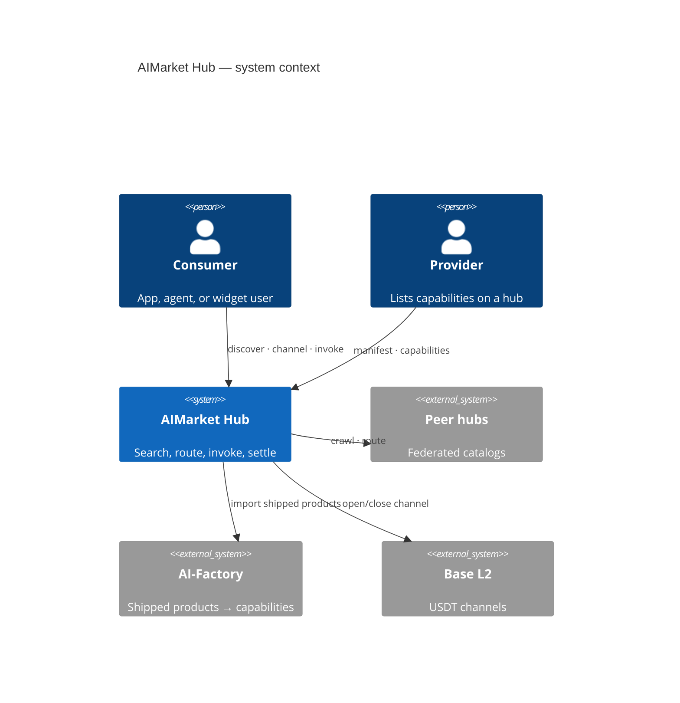
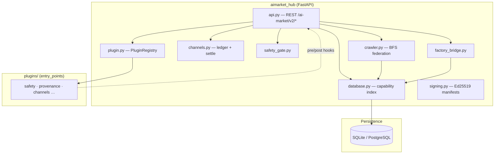
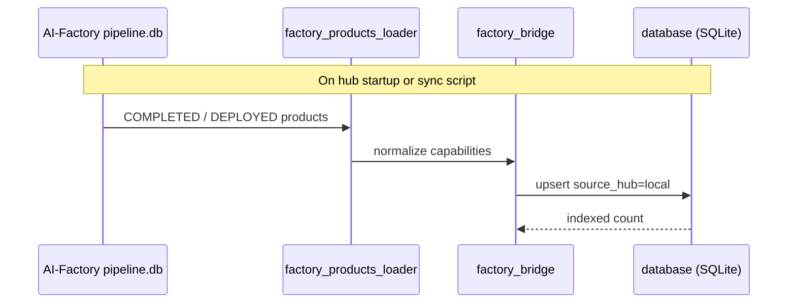
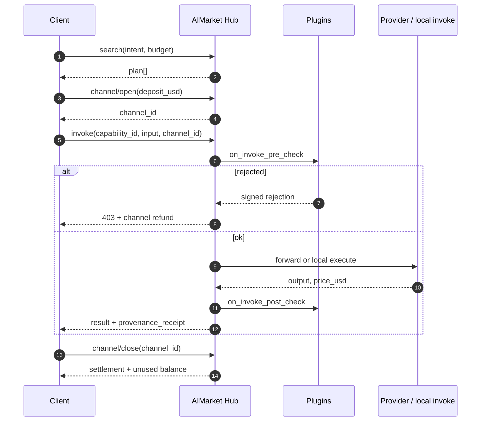
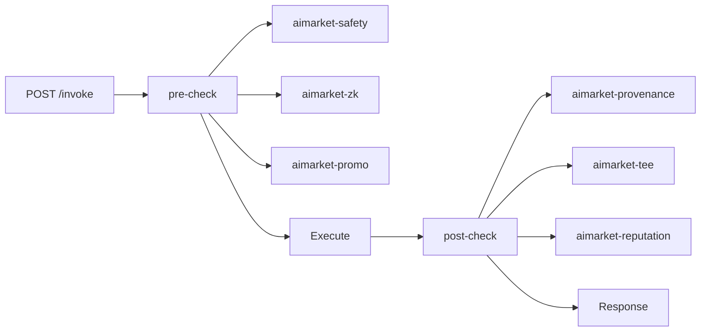
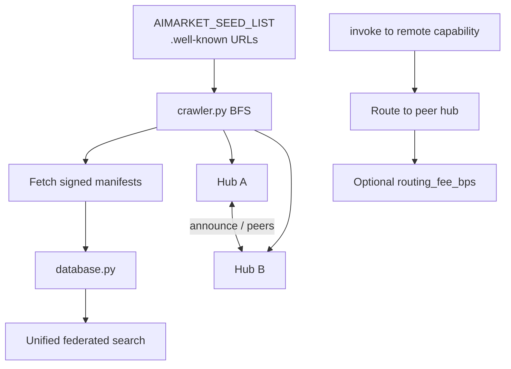
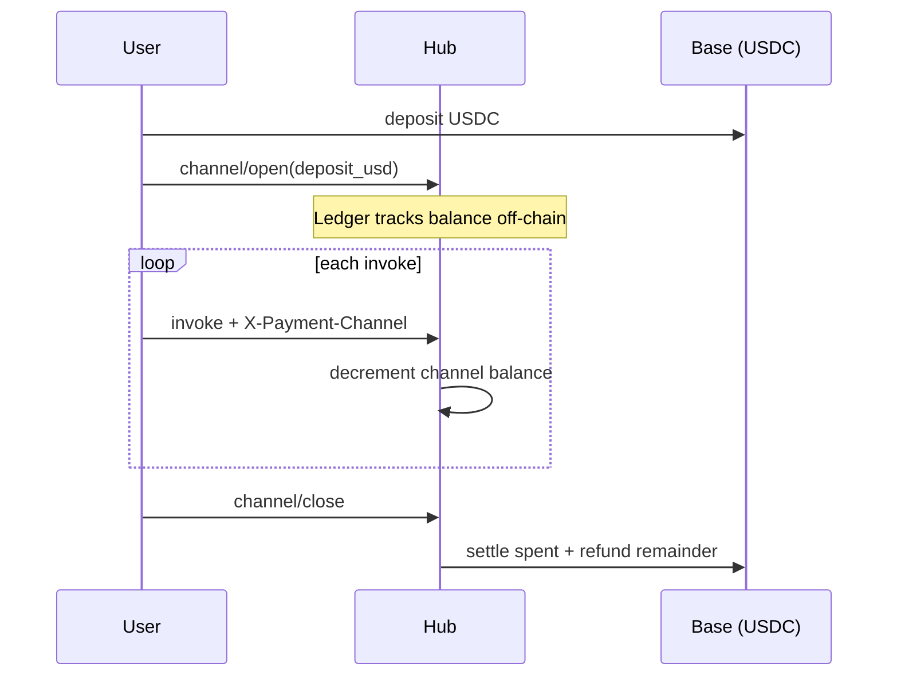

# AIMarket Hub

<!-- aicom-readme-badges -->
<p align="center">
  <a href="https://github.com/alexar76/aimarket-hub/actions/workflows/ci.yml"></a>
  <a href="https://github.com/alexar76/aimarket-hub/releases"></a>
  <a href="https://github.com/alexar76/aimarket-protocol"></a>
  <a href="https://raw.githubusercontent.com/alexar76/aimarket-hub/main/docs/badges/coverage.svg"></a>
  <a href="https://github.com/alexar76/aimarket-hub/blob/main/LICENSE"></a>
</p>
<!-- /aicom-readme-badges -->

> 🌐 [English](../README.md) · [Русский](README.ru.md) · [Español](README.es.md) · **Français** · [中文](README.zh.md) · [Glossaire](https://github.com/alexar76/aicom/blob/main/docs/localization-glossary.md)


> **Écosystème :** [aperçu AICOM et démos live](https://modeldev.modelmarket.dev) · **Version du paquet :** `3.2.1` (pyproject) · **Communauté :** [Discord · Pollux](https://discord.gg/aimarket) · [Telegram · Castor](https://t.me/just_for_agents)

**Hub de fédération pour la découverte de capabilities IA, le routage de micropaiements et l’invocation extensible par plugins.**

Implémentation de référence de [AIMarket Protocol v2](https://github.com/alexar76/aimarket-protocol/blob/main/spec.md). Une surface HTTP pour **chercher** un catalogue fédéré, **ouvrir des canaux de paiement**, **invoquer (invoke)** des capabilities avec des hooks safety et compliance, et **régler (settle)** on-chain — sans portefeuilles custodiaux.

| | |
|---|---|
| **Hub live** | [modelmarket.dev](https://modelmarket.dev) |
| **Well-known** | [/.well-known/ai-market.json](https://modelmarket.dev/.well-known/ai-market.json) |
| **Démo plugins** | [/plugins/demo](https://modelmarket.dev/plugins/demo) |
| **Démo widget** | [/widget/demo](https://modelmarket.dev/widget/demo) |
| **Valeur en langage clair** | [docs/value.md](https://github.com/alexar76/aimarket-hub/blob/main/docs/value.md) |

## Demo

- **Live:** https://modelmarket.dev/
- **Docs (EN canonique) :** https://github.com/alexar76/aimarket-hub/blob/main/README.md

---

## Table of contents

- [Overview](#overview)
- [Architecture](#architecture)
- [Repository layout](#repository-layout)
- [Quick start](#quick-start)
- [Core API](#core-api)
- [Invoke lifecycle](#invoke-lifecycle)
- [Plugin ecosystem](#plugin-ecosystem)
- [Federation](#federation)
- [Payments](#payments)
- [Pay-on-Verified](#pay-on-verified)
- [Configuration](#configuration)
- [Deployment](#deployment)
- [Development](#development)
- [Security](#security)
- [Related projects](#related-projects)
- [License](#license)

---

## Overview

AIMarket Hub se place entre **fournisseurs de capability** (produits de la factory, [**oracles**](https://github.com/alexar76/oracles), hubs peers, éditeurs data-cap) et **consommateurs** (apps Flutter desktop, agents, widgets embarquables, clients MCP).

**Problèmes qu’il résout**

| Problème | Réponse du hub |
|---------|------------|
| APIs IA fragmentées | Recherche fédérée sur peers `.well-known/ai-market.json` |
| Friction de paiement par appel | **Canaux** préfinancés — un dépôt, N micro-invokes, un règlement |
| Confiance envers vendeurs anonymes | Scores de **réputation** + caution/stake (plugin) |
| Compliance et audit | **Reçus** de provenance à chaque invoke (Ed25519 + W3C VC) |
| Prompts non sûrs | Pré-contrôle **safety** avec rejet signé + remboursement |


### Découverte d’agents en confiance zéro (zero trust)

**Sans relecteur humain d’app-store.** Les agents **trouvent des peers via la fédération, passent les portes safety + attestation et n’invoquent que des capabilities vérifiées** — la confiance cryptographique remplace celle du marketing.

| | |
|---|---|
| **Quoi** | Federated `discover` → plugins safety / reputation / TEE → invoke routé |
| **Pourquoi** | Passe à l’échelle de millions de micro-capabilities ; les listings malveillants ne peuvent pas vider les canaux |
| **Approfondir** | [docs/killer-feature-zero-trust-discovery.md](https://github.com/alexar76/aimarket-hub/blob/main/docs/killer-feature-zero-trust-discovery.md) · [Ecosystem capabilities](https://github.com/alexar76/aicom/blob/main/docs/killer-features.md) |

---

## Architecture

### Contexte système



### Diagramme de conteneurs (ce dépôt)



### Chemin d’import depuis Factory

Les produits AI-Factory sont indexés comme capabilities locales au démarrage du hub :



Ops de sync : [`../scripts/sync_pipeline_mirror_and_hub.py`](https://github.com/alexar76/aicom/blob/main/scripts/sync_pipeline_mirror_and_hub.py)

---

## Disposition du dépôt

```
aimarket-hub/
├── aimarket_hub/           # Core package
│   ├── api.py              # HTTP routes (search, invoke, federation, plugins)
│   ├── crawler.py          # Peer discovery (SSRF-hardened BFS)
│   ├── database.py         # Capability + peer index
│   ├── channels.py         # Payment channel ledger
│   ├── plugin.py           # setuptools aimarket.plugins loader
│   ├── factory_bridge.py   # AI-Factory product import
│   ├── safety_gate.py      # Built-in safety fallback
│   └── …
├── plugins/                # Hub-local plugins (e.g. aimarket-provenance)
├── tests/                  # pytest suite
├── Dockerfile
├── LICENSE                 # Apache-2.0
├── CONTRIBUTORS.md
├── SECURITY.md
└── docs/
    └── value.md
```

**Paquets frères** (raíz del monorepo [`plugins/`](https://github.com/alexar76/aimarket-plugins/tree/main/plugins/)): 15 plugins — **top-5 sur PyPI** ([guide d’installation](https://github.com/alexar76/aimarket-plugins/blob/main/plugins/docs/install.md)); l’ensemble complet est bundlé dans Docker.

---

## Démarrage rapide

### Prérequis

- Python **3.11+**
- Optionnel : Docker pour un déploiement conteneur

### Installer et lancer

```bash
pip install aimarket-hub
# optional core plugins (TEE, channels, reputation, safety, MCP packager):
pip install "aimarket-hub[plugins]"
aimarket serve
# → http://localhost:9083
```

Vérifier discovery et recherche :

```bash
curl -s http://localhost:9083/.well-known/ai-market.json | jq .
curl -s "http://localhost:9083/ai-market/v2/search?intent=translate&budget=1" | jq .
curl -s http://localhost:9083/ai-market/v2/plugins | jq '.plugins | length'
```

### Publier une capability (fournisseurs communauté)

Les développeurs tiers listent un endpoint HTTP dans le catalogue et gagnent de l’USDC quand les agents l’invoquent. Les **hubs de production** exigent stake, scoring de confiance LUMEN et réponses fournisseur signées Ed25519 — voir [`docs/supply-security.md`](https://github.com/alexar76/aimarket-hub/blob/main/docs/supply-security.md).

```bash
cd examples/hello-capability && python3 server.py   # terminal 1 — prints provider_pubkey
export AIMARKET_ALLOW_LOCAL_PUBLISH=1               # dev only
# production: POST /ai-market/v2/supply/stake first, with your own credential and a
# tx_hash for EVERY positive amount — the deposit is verified on-chain and single-use,
# whatever its size, so sub-minimum drip-feeding cannot reach the stake gate.
aimarket publish capability.json --hub http://127.0.0.1:9083
aimarket invoke demo-hello/greet@v1 --input '{"name":"dev"}'
```

Guide complet (20 langues) : [ARGUS developer guide](https://github.com/alexar76/argus/tree/main/docs/developer-guide/) · [supply security](https://github.com/alexar76/aimarket-hub/blob/main/docs/supply-security.md) · example in [`examples/hello-capability/`](https://github.com/alexar76/aimarket-hub/tree/main/examples/hello-capability).

### Docker

**Production (ce monorepo) :** toujours redéployer le Hub depuis la racine du dépôt :

```bash
./scripts/deploy_hub.sh
# or full fleet: ./scripts/deploy_ecosystem.sh
```

Voir [`docs/deploy-ecosystem.md`](https://github.com/alexar76/aicom/blob/main/docs/deploy-ecosystem.md). **Ne pas** utiliser `cd aimarket-hub && docker compose up` pour un redéploiement production (mauvais build context).

**Recovery** (factory hold, backup/restore, redéploiement de flotte) : [`docs/recovery-mechanisms.md`](https://github.com/alexar76/aicom/blob/main/docs/recovery-mechanisms.md) in the factory monorepo.

Build manuel (identique au script de deploy) :

```bash
docker build -f aimarket-hub/Dockerfile -t modelmarket-hub .
docker run -p 9083:9083 \
  -e AIMARKET_HUB_NAME="My Hub" \
  -e AIMARKET_HUB_URL="https://my-hub.example.com" \
  -e AIMARKET_PAYMENT_RECIPIENT="0xYourWallet" \
  modelmarket-hub
```

---

## Core API

| Method | Path | Description |
|--------|------|-------------|
| `GET` | `/.well-known/ai-market.json` | Discovery racine — chain, token, peers, clé signer |
| `GET` | `/ai-market/v2/manifest` | Catalogue de capabilities signé Ed25519 |
| `GET` | `/ai-market/v2/search` | Recherche fédérée NL (`intent`, `budget`, `category`) |
| `POST` | `/ai-market/v2/supply/stake` | Déposer le stake de l’éditeur (débloque community publish) |
| `POST` | `/ai-market/v2/supply/register` | Publier une capability communauté + `invoke_url` |
| `POST` | `/ai-market/v2/invoke` | Invoquer une capability (hooks plugins, safety gate) |
| `POST` | `/ai-market/v2/channel/open` | Ouvrir un canal de paiement préfinancé |
| `POST` | `/ai-market/v2/channel/close` | Fermer le canal — règlement + remboursement du reste |
| `POST` | `/ai-market/v2/federation/announce` | Annonce de hub peer |
| `GET` | `/ai-market/v2/federation/peers` | Peers connus + scores de confiance |
| `POST` | `/ai-market/v2/federation/crawl` | Déclencher un crawl BFS des seed peers |
| `GET` | `/ai-market/v2/plugins` | Catalogue des plugins chargés |
| `GET` | `/ai-market/v2/reputation/{hub_url}` | Détail du score de confiance |
| `GET` | `/ai-market/v2/stats/live` | Flux d’invocations en temps réel |

**Autorisation.** `/supply/register` accepte le `AIMARKET_PUBLISH_TOKEN` partagé. Les routes qui
déplacent ou grevent le stake — `/supply/stake` et `/self-bond/register` — prennent le credential PROPRE
de l’appelant depuis `AIMARKET_PUBLISHER_TOKENS` (ou `AIMARKET_ADMIN_TOKEN`), car un jeton partagé
ne prouve pas quel éditeur appelle ; en production un hub sans aucun configuré les refuse avec
`503`. `/self-bond/slash` et toute route settlement/federation sont admin-only.

OpenAPI : `/docs` (défaut FastAPI — pas d’interrupteur `AIMARKET_OPENAPI` ; placez le hub derrière
votre proxy si le schéma ne doit pas être public). Spec complète : [`../aimarket-protocol/spec.md`](https://github.com/alexar76/aimarket-protocol/blob/main/spec.md)

---

## Cycle de vie d’invoke

Flux consommateur standard (implementado por [`aimarket_agent`](https://github.com/alexar76/aimarket-sdks/tree/main/dart/)):



---

## Écosystème de plugins

Les plugins s’enregistrent via les entry points **`aimarket.plugins`** ([`plugin.py`](https://github.com/alexar76/aimarket-hub/blob/main/aimarket_hub/plugin.py)). Chacun fournit **README + docs/** (`value.md`, `user-guide.md`, `sdk-integration.md`, `user-cases.md`).

Régénérer les docs : `python3 scripts/bootstrap_hub_plugin_docs.py` · value text: `python3 scripts/bootstrap_product_value.py`



| Plugin | Catégorie | Valeur en une ligne |
|--------|----------|----------------|
| [`aimarket-provenance`](https://github.com/alexar76/aimarket-hub/tree/main/plugins/aimarket-provenance) | compliance | Reçu cryptographique pour chaque sortie IA |
| [`aimarket-safety`](https://github.com/alexar76/aimarket-plugins/tree/main/plugins/aimarket-safety/) | security | Bloquer jailbreak / injection avant facturation |
| [`aimarket-reputation`](https://github.com/alexar76/aimarket-plugins/tree/main/plugins/aimarket-reputation/) | reputation | Scores de confiance adossés au stake |
| [`aimarket-channels`](https://github.com/alexar76/aimarket-plugins/tree/main/plugins/aimarket-channels/) | infrastructure | Grand livre off-chain, règlement on-chain |
| [`aimarket-tee`](https://github.com/alexar76/aimarket-plugins/tree/main/plugins/aimarket-tee/) | security | Attestation matérielle (Nitro / TDX) |
| [`aimarket-auction`](https://github.com/alexar76/aimarket-plugins/tree/main/plugins/aimarket-auction/) | monetization | Enchères spot pour slots rares |
| [`aimarket-personas`](https://github.com/alexar76/aimarket-plugins/tree/main/plugins/aimarket-personas/) | tooling | Personas d’agents conviviales pour l’acheteur |
| [`aimarket-streaming`](https://github.com/alexar76/aimarket-plugins/tree/main/plugins/aimarket-streaming/) | monetization | SSE + microfacturation par jeton |
| [`aimarket-nft`](https://github.com/alexar76/aimarket-plugins/tree/main/plugins/aimarket-nft/) | monetization | NFT de crédit prépayé transférables |
| [`aimarket-mcp-packager`](https://github.com/alexar76/aimarket-plugins/tree/main/plugins/aimarket-mcp-packager/) | tooling | Bundle MCP pour Claude Desktop |
| [`aimarket-orchestrator`](https://github.com/alexar76/aimarket-plugins/tree/main/plugins/aimarket-orchestrator/) | monetization | Tâche NL → planificateur de chaîne de capabilities |
| [`aimarket-data-cap`](https://github.com/alexar76/aimarket-plugins/tree/main/plugins/aimarket-data-cap/) | monetization | Corpus privé → recherche payante |
| [`aimarket-promo`](https://github.com/alexar76/aimarket-plugins/tree/main/plugins/aimarket-promo/) | monetization | Remises signées à verrouillage temporel |
| [`aimarket-dataset`](https://github.com/alexar76/aimarket-plugins/tree/main/plugins/aimarket-dataset/) | tooling | Corpus hebdomadaire de demande anonymisée |
| [`aimarket-zk`](https://github.com/alexar76/aimarket-plugins/tree/main/plugins/aimarket-zk/) | security | Preuves ZK sans révéler l’entrée |

---

## Fédération

Les hubs se découvrent sans registre central :



Score de confiance : [`trust.py`](https://github.com/alexar76/aimarket-hub/blob/main/aimarket_hub/trust.py) · Signing: [`signing.py`](https://github.com/alexar76/aimarket-hub/blob/main/aimarket_hub/signing.py)

Profundizar: [`../docs/FEDERATION_HUB_REPORT.md`](https://github.com/alexar76/aicom/blob/main/docs/FEDERATION_HUB_REPORT.md)

---

## Paiements



| Champ | Default | Notes |
|-------|---------|-------|
| Chain | Base (L2) | `AIMARKET_PAYMENT_CHAIN` |
| Token | USDC | `AIMARKET_PAYMENT_TOKEN` — défaut du ledger ; catalogue annoncé — `AIMARKET_PAYMENT_TOKENS` (`USDT,USDC,ETH`) |
| Recipient | env obligatoire | `AIMARKET_PAYMENT_RECIPIENT` |

Principe du protocole : **pas de custodie** — les canaux sont des constructions on-chain ; le hub ne conserve que l’état du ledger.

**Autorisation du dépôt.** En production (`AIFACTORY_PROD=1`, verify stub off) un canal n’est crédité
que par un dépôt vérifié on-chain, lié au portefeuille qui a vraiment payé, à usage unique
(`consumed_deposits`), et prouvé par une signature EIP-191 du portefeuille payeur sur
`payer_proof_challenge(...)` — le hash de la tx de dépôt est public, donc sans cette preuve le secret
du canal irait à qui le cite en premier. `AIMARKET_CHANNEL_ALLOW_UNPROVEN_PAYER=1` désactive
la preuve (transition seulement) et journalise bruyamment.

---

## Pay-on-Verified

**Séquestre / dépôt fiduciaire (escrow) qualité en opt-in sur l’invoke.** Avec un bloc `verify` dans le corps de l’invoke, le débit du canal
devient un hold ; [Metis](https://github.com/alexar76/metis) juge en arrière-plan la sortie livrée contre
l’intent déclaré par l’acheteur — pass capture le hold, fail le rembourse avec un reçu de
rejet signé. L’acheteur garde la sortie dans tous les cas ; seul le dénouement monétaire change.

| | |
|---|---|
| **Quoi** | `verify: { requested, intent, mode, wait }` sur `POST /ai-market/v2/invoke` → `hold_channel` → verdict Metis → capture / release |
| **Pourquoi** | Les fournisseurs sont payés pour un travail vérifié, pas pour avoir répondu ; chaque verdict émet un événement de réputation |
| **Consultation** | `GET /ai-market/v2/verification/{nonce}` (nonce = receipt nonce) |
| **Approfondir** | [docs/pay-on-verified.md](https://github.com/alexar76/aimarket-hub/blob/main/docs/pay-on-verified.md) · [Cross-component doc](https://github.com/alexar76/aicom/blob/main/docs/pay-on-verified.md) |

---

## Configuration

Chaque défaut ci-dessous est la valeur de repli du code aujourd’hui ; quand un défaut est *dérivé*
d’une autre variable, la règle est écrite explicitement plutôt qu’un nombre.

### Noyau

| Variable | Default | Description |
|----------|---------|-------------|
| `AIMARKET_HUB_NAME` | AIMarket Hub | Nom affiché dans les manifestes |
| `AIMARKET_HUB_URL` | `http://localhost:9083` | URL publique (reçus, well-known) |
| `AIFACTORY_PROD` | — | `1` place chaque money gate sur le chemin production (vérification on-chain obligatoire, défauts fail-closed) |
| `AIFACTORY_CRYPTO_ENABLED` | `0` | Interrupteur maître crypto : off ⇒ canaux/séquestre (escrow)/NFT désactivés, capabilities gratuites ; signature et sandbox trials continuent |
| `AIMARKET_PAYMENT_CHAIN` | `base` | Chaîne de règlement (`AIMARKET_PAYMENT_CHAINS` pour la liste annoncée) |
| `AIMARKET_PAYMENT_TOKEN` | `USDC` | Jeton (token) de règlement du ledger (`AIMARKET_PAYMENT_TOKENS` annonce `USDT,USDC,ETH`) |
| `AIMARKET_PAYMENT_RECIPIENT` | — | **Obligatoire en production** — le portefeuille que les dépôts doivent payer |
| `AIMARKET_CRAWL_INTERVAL_S` | `3600` | Période du crawl de fédération |
| `AIMARKET_ROUTING_FEE_BPS` | `100` | Frais de routage (1% = 100 bps) |
| `AIMARKET_MIN_TRUST_SCORE` | `0.3` | Plancher de confiance de base (aussi le défaut de la porte discover ci-dessous) |
| `AIMARKET_SEED_LIST` | committed `federation_seeds.json` | URLs peer `.well-known` séparées par des virgules ; unset retombe sur le seed file livré, pas sur « aucun seed » |
| `AIMARKET_PLUGIN_WHITELIST` | — | Restreindre les plugins chargés |
| `AIMARKET_ADMIN_TOKEN` | — | Jeton opérateur. Unset ⇒ cada ruta admin rechaza (`503`), fail-closed |
| `AIMARKET_PUBLISH_TOKEN` | — | Jeton partagé pour `/supply/register`. Unset ⇒ publish desactivado |
| `AIMARKET_PUBLISHER_TOKENS` | — | `pub-a:secretA,pub-b:secretB` — identifiants par éditeur pour les routes stake/bond (voir Sécurité) |
| `AIMARKET_CORS_ORIGINS` | — | Allowlist séparée par des virgules. Vacío = sin acceso cross-origin (un default `*` habilitaba CSRF drive-by) |

### Bases de données

| Variable | Default | Description |
|----------|---------|-------------|
| `DATABASE_URL` | SQLite files | PostgreSQL pour la production — une fois défini, tous les sous-systèmes le partagent |
| `AIMARKET_DB_PATH` | `data/hub.db` | La base de données de l’**index du hub**. Ya no sobrescribe una ruta que un subsistema pase explícitamente (eso aliasaba en silencio channels.db y provenance.db al archivo del hub); un subsistema que deba compartir el archivo del hub ahora apunta su propia variable a él |
| `AIMARKET_CHANNELS_DB_PATH` | `data/channels.db` | Grand livre des canaux de paiement (archivo separado del índice del hub) |
| `AIMARKET_VERIFY_SETTLEMENTS_DB_PATH` | `AIMARKET_DB_PATH`, else `data/hub.db` | Où vit `verified_settlements` — le reaper de holds orphelins le lit et refuse de libérer ce qu’il ne peut pas lire |

#### Migration après l’aliasing de base de données partagée

**Étape de migration unique pour tout hub qui tournait déjà avec `AIMARKET_DB_PATH`
défini** — y compris chaque conteneur ici (`Dockerfile`, `Dockerfile.standalone`,
`docker-compose.yml`, `docker-compose.core.yml` l’exportent).

Jusqu’à cette release, la variable d’env écrasait le chemin demandé par un sous-système, donc le ledger
de canaux (`data/channels.db`) et le store de provenance (`data/provenance.db`) étaient créés
*à l’intérieur du fichier du hub*. Maintenant que l’argument explicite gagne, ces sous-systèmes ouvrent leurs
propres fichiers — et sur un déploiement mis à jour ces fichiers **démarrent vides** :

* le ledger de canaux perd ses canaux ouverts et, plus grave, `consumed_deposits` —
  la table qui rend un dépôt on-chain à usage unique. Une table vide permet de rejouer chaque dépôt
  déjà dépensé dans un nouveau canal financé ;
* le store de provenance perd ses reçus.

Le hub journalise cela en `ERROR` au démarrage (le fichier demandé n’existe pas alors que le
fichier `AIMARKET_DB_PATH` existe), en nommant le fichier où les données sont encore. Faites l’un de ces
choix **avant de servir du trafic** :

```bash
# A. channel ledger — keep the shared file, no data moves, pre-upgrade behaviour exactly
export AIMARKET_CHANNELS_DB_PATH="$AIMARKET_DB_PATH"

# B. channel ledger — split it out: copy the file with the hub stopped
cp /app/data/hub.db /app/data/channels.db
export AIMARKET_CHANNELS_DB_PATH=/app/data/channels.db
```

Dans tous les cas, les tables que le propriétaire de la copie n’utilise pas ne sont simplement jamais lues. Le store de
provenance **n’a pas** de variable de chemin — il dérive toujours `provenance.db` du répertoire de la BD
du hub — donc seule l’option B s’applique (`cp /app/data/hub.db /app/data/provenance.db`) ;
l’ignorer démarre un store de reçus vide : on perd la piste d’audit, pas l’argent.

Les déploiements avec `DATABASE_URL` ne sont pas affectés — PostgreSQL a toujours été une seule BD partagée.

### Canaux

| Variable | Default | Description |
|----------|---------|-------------|
| `AIMARKET_ALLOW_DEMO_CREDIT` | — | `1` crédite un canal sans vérification on-chain (dev/démo). Hors production, sans cela, le crédit échoue fermé |
| `AIMARKET_CHANNEL_ALLOW_UNPROVEN_PAYER` | `0` | `1` DÉSACTIVE l’exigence de preuve de contrôle du payeur (transition seulement — laisse ouvert le front-running des dépôts) |
| `AIMARKET_CHANNEL_ANON_OPENS_PER_HOUR` | `200` | Un plafond partagé pour tous les opens sans portefeuille (ils ne sont pas exemptés) |
| `AIMARKET_CHANNEL_ANON_CLOSES_PER_HOUR` | `600` | Idem, pour les closes |
| `AIMARKET_CHANNEL_HOLD_REAP_AFTER_SECS` | `86400` | Libérer un hold coincé en `held` aussi longtemps sans vérification vivante ; `0` désactive le reaper |
| `AIFACTORY_PAYMENT_MIN_CONFIRMATIONS` | `2` | Confirmations qu’un dépôt doit avoir avant de compter |
| `AIFACTORY_PAYMENT_VERIFY_STUB` | `0` | `1` accepte n’importe quel tx hash — développement seulement |

### Pay-on-Verified

| Variable | Default | Description |
|----------|---------|-------------|
| `AIMARKET_VERIFY_ENABLED` | `1` | Interrupteur maître Pay-on-Verified (l’opt-in par invoke reste requis) |
| `AIMARKET_VERIFY_MIN_PRICE_USD` | `0.05` | Plancher de prix — les invokes moins chers ne paient jamais la verification-tax |
| `AIMARKET_VERIFY_SCORE_THRESHOLD` | `0.7` | `verify_score` requis pour capturer le hold (une valeur hors 0.0–1.0 retombe à `0.7`) |
| `AIMARKET_VERIFY_COUNCIL_MIN_PRICE_USD` | `0.50` | Plafond de route : `council` autorisé à partir de ce prix ; sinon clamp vers `fast` |
| `AIMARKET_VERIFY_MAX_CONCURRENCY` | `8` | Plafond d’appels Metis simultanés sur les settlements en attente |
| `AIMARKET_VERIFY_ATTEMPT_TIMEOUT_S` | `330` | Timeout HTTP par tentative Metis (> plafond serveur Metis 300 s) |
| `AIMARKET_VERIFY_RETRY_BACKOFF_S` | `5` | Backoff initial de nouvel essai transport (exponentiel, plafond 300 s) |
| `AIMARKET_VERIFY_ENGINE_RETRIES` | `2` | Nouveaux essais après une enveloppe engine-error avant d’appliquer la policy |
| `AIMARKET_VERIFY_MAX_WAIT_S` | `0` | `0` = pas de délai de verdict ; `>0` borne la résolution via policy |
| `AIMARKET_VERIFY_FAIL_CLOSED` | `1` | Résultat indéterminé ⇒ rembourser l’acheteur. Seul un `0/false/no/off` explicite capture ; une valeur non reconnue est une typo et reste fail-closed |
| `AIMARKET_VERIFY_METIS_URL` | `http://127.0.0.1:8080` | URL base de Metis (cae a `METIS_URL`) |
| `AIMARKET_VERIFY_METIS_KEY` | — | Clé bearer Metis (retombe sur `METIS_API_KEY`) |
| `AIMARKET_VERIFY_VERIFIER_ID` | `metis.verify@v1` | Attribution `verifier` de l’enveloppe quand un vérificateur non-Metis occupe le slot |

### Supply security (éditeurs communauté)

Modèle complet : [`docs/supply-security.md`](https://github.com/alexar76/aimarket-hub/blob/main/docs/supply-security.md). Une valeur non finie ou non numérique
dans tout seuil ci-dessous est ignorée avec un avertissement et le défaut documenté est utilisé — un
seuil `nan` désactiverait sinon silencieusement la porte qu’il configure.

| Variable | Default | Description |
|----------|---------|-------------|
| `AIMARKET_SUPPLY_SECURITY_RELAXED` | `0` | `1` = bypass de développement : stake minimum zéro, pas de signature de réponse, pas de slashing |
| `AIMARKET_SUPPLY_MIN_STAKE_USD` | `25` en production, sinon `10` (`0` si relaxed) | Stake requis pour publier |
| `AIMARKET_SUPPLY_PUBLISH_PER_HOUR` | `5` | Publications par éditeur et par heure |
| `AIMARKET_SUPPLY_MIN_TRUST_DISCOVER` | `AIMARKET_MIN_TRUST_SCORE` (`0.3`) | Plancher de confiance pour apparaître dans discover |
| `AIMARKET_SUPPLY_MIN_TRUST_INVOKE` | `0.35` | Plancher de confiance pour être invoqué |
| `AIMARKET_SUPPLY_REQUIRE_RESPONSE_SIG` | on ssi production et non relaxed | Exiger une signature Ed25519 de réponse du fournisseur |
| `AIMARKET_SUPPLY_MAX_INPUT_KEYS` | `32` | Clés top-level acceptées dans l’entrée d’invoke |
| `AIMARKET_SUPPLY_MAX_INPUT_JSON_BYTES` | `32768` | Plafond de taille d’entrée d’invoke |
| `AIMARKET_SUPPLY_PRODUCT_ALLOWLIST` | — | Allowlist `product_id` séparée par des virgules |
| `AIMARKET_SUPPLY_SLASH_FAILURE_THRESHOLD` | `3` | Défauts fournisseur dans la fenêtre avant de slasher le stake |
| `AIMARKET_SUPPLY_SLASH_FAILURE_WINDOW_S` | `600` | Fenêtre de défauts (doit être > 0 ; une valeur non positive désactiverait le slashing, donc repli au défaut) |
| `AIMARKET_SUPPLY_SLASH_COOLDOWN_S` | `3600` | Au plus un slash piloté par défauts par fenêtre ; `0` désactive le cool-down |
| `AIMARKET_SUPPLY_SLASH_DAILY_CAP_USD` | `10` | Plafond glissant 24 h du slashing par défauts ; `0` désactive le plafond |
| `AIMARKET_SUPPLY_VERIFIED_FAIL_THRESHOLD` | `3` | Verdicts Metis payants « failed » avant escalade |
| `AIMARKET_SUPPLY_VERIFIED_FAIL_WINDOW_S` | `86400` | Fenêtre pour ces verdicts |
| `AIMARKET_SUPPLY_VERIFIED_FAIL_MIN_CONSUMERS` | `2` | Des consommateurs PAYANTS distincts sont exigés — les échecs répétés d’un acheteur = une seule voix |
| `AIMARKET_SUPPLY_TRUST_GRAPH_MAX_EDGES` | `1000` | Borne du trust-graph ; la troncature est journalisée avec l’éditeur affecté |
| `AIMARKET_ORACLE_FAMILY_URL` | `https://oracles.modelmarket.dev/family` | Oracle de confiance LUMEN (retombe sur `ARGUS_ORACLE_FAMILY_URL`) |

---

## Déploiement

Référence production : [`../docs/production-modelmarket-dev.md`](https://github.com/alexar76/aicom/blob/main/docs/production-modelmarket-dev.md)

| Élément checklist | Action |
|----------------|--------|
| TLS | Terminer sur nginx / Caddy → conteneur du hub |
| Secrets | `AIMARKET_PAYMENT_RECIPIENT`, DB URL via env — pas dans git |
| Sync Factory | Cron ou webhook → `sync_pipeline_mirror_and_hub.py` |
| Plugins | `pip install` des plugins souhaités avant `aimarket serve` |
| Health | `GET /.well-known/ai-market.json` + `/ai-market/v2/stats/live` |

---

## Tests et couverture {#testing--coverage}

CI à chaque push ([workflow](https://github.com/alexar76/aimarket-hub/blob/main/.github/workflows/ci.yml)); le badge de couverture est rafraîchi desde `pytest --cov` en `main`.

```bash
cd aimarket-hub
pip install -e ".[dev]"
pytest tests/ -q --cov=aimarket_hub
```

## Développement

```bash
pip install -e ".[dev]"
```

Modules de test clés : `test_api.py`, `test_crawler.py`, `test_plugin_system.py`, `test_channels.py`, `test_cross_hub_integration.py`

Ajouter un plugin : créez un paquet sous [`../plugins/`](https://github.com/alexar76/aimarket-plugins/tree/main/plugins/) avec l’entry point `aimarket.plugins` dans `pyproject.toml`.

---

## Sécurité

- **Protection SSRF** sur le crawler de fédération ([`crawler.py`](https://github.com/alexar76/aimarket-hub/blob/main/aimarket_hub/crawler.py))
- **Manifestes signés** — Ed25519 ([`signing.py`](https://github.com/alexar76/aimarket-hub/blob/main/aimarket_hub/signing.py))
- **Safety gate** à chaque invoke ([`safety_gate.py`](https://github.com/alexar76/aimarket-hub/blob/main/aimarket_hub/safety_gate.py))
- **Dépôts de stake vérifiés et à usage unique** — en production chaque crédit de stake nécessite un dépôt
  on-chain qui paie le recipient de la plateforme, et le hash est brûlé par un claim atomique avant le
  crédit, ainsi un dépôt ne finance jamais deux éditeurs même sous requêtes concurrentes. Le claim
  est clé sur l’id de transaction *canonique* (un hash EVM est insensible à la casse au niveau JSON-RPC,
  donc `0xAB…` et `0xab…` sont un dépôt, pas deux)
  ([`supply_security.py`](https://github.com/alexar76/aimarket-hub/blob/main/aimarket_hub/supply_security.py))
- **Résiduel — les dépôts de stake ne sont pas liés au payeur.** Le vérificateur de stake répond « quelqu’un a-t-il payé
  la plateforme ? », pas « *cet* éditeur a-t-il payé ? », donc le crédit va à qui soumet en premier un hash
  correspondant. Le lier exige un enregistrement publisher→wallet que le ledger de stake n’a pas encore ; les dépôts
  de canal sont déjà liés (voir ci-dessous). D’ici là, traitez le hash de dépôt de stake comme secret
  bearer et soumettez-le avant qu’il soit public
- **Dépôts de canal à usage unique + preuve du payeur** — un dépôt vérifié finance exactement un canal et
  uniquement pour le portefeuille qui a signé pour lui ([`channels.py`](https://github.com/alexar76/aimarket-hub/blob/main/aimarket_hub/channels.py))
- **La mutation de stake est per-subject ; le slashing est réservé à l’opérateur** — un jeton partagé ne peut ni créditer
  le stake d’un inconnu ni brûler le bond d’un rival ([`api.py`](https://github.com/alexar76/aimarket-hub/blob/main/aimarket_hub/api.py))
- **Rapports de vulnérabilités :** [SECURITY.md](https://github.com/alexar76/aimarket-hub/blob/main/SECURITY.md) → alexar76@rambler.ru

---

## Projets liés

| Projet | Relation |
|---------|--------------|
| [AICOM / AI-Factory](https://github.com/alexar76/aicom/blob/main/README.md) | Livre des produits → index du hub |
| [aimarket-protocol](https://github.com/alexar76/aimarket-protocol/tree/main/) | Spec normative v2 |
| [aimarket-sdks](https://github.com/alexar76/aimarket-sdks/tree/main/) | SDKs client (Dart alpha) |
| [aimarket-widget](https://github.com/alexar76/aimarket-widget/tree/main/) | UI embarquable |
| [oracles](https://github.com/alexar76/oracles/tree/main/) | Capabilities mathématiques vérifiables — aléatoire, VDF, consensus, réputation (listées sur le hub) |
| [desktop-integrations](https://github.com/alexar76/aimarket-desktop/tree/main/) | 8 apps Flutter consommateur |
| [Ecosystem architecture](https://github.com/alexar76/aicom/blob/main/docs/ecosystem-architecture.md) | Diagramme complet du monorepo |
| [dioscuri](https://github.com/alexar76/dioscuri) | Agents jumeaux de communauté — MNEMOSYNE Q&A |

---

## Communauté

Les jumeaux [DIOSCURI](https://github.com/alexar76/dioscuri) répondent aux questions à partir des docs GitHub synchronisés.

| Canal | Jumeau | Idéal pour |
|---------|------|----------|
| [Discord](https://discord.gg/aimarket) | Pollux | Aide, idées, show-and-tell |
| [Telegram](https://t.me/just_for_agents) | Castor | Releases, digests, brèves |

**Carte de l’écosystème :** [Alien Monitor](https://magic-ai-factory.com/monitor/) · [AICOM](https://magic-ai-factory.com)

---

## Licence

Apache-2.0 — voir [LICENSE](https://github.com/alexar76/aimarket-hub/blob/main/LICENSE). Maintainers: [CONTRIBUTORS.md](https://github.com/alexar76/aimarket-hub/blob/main/CONTRIBUTORS.md).
