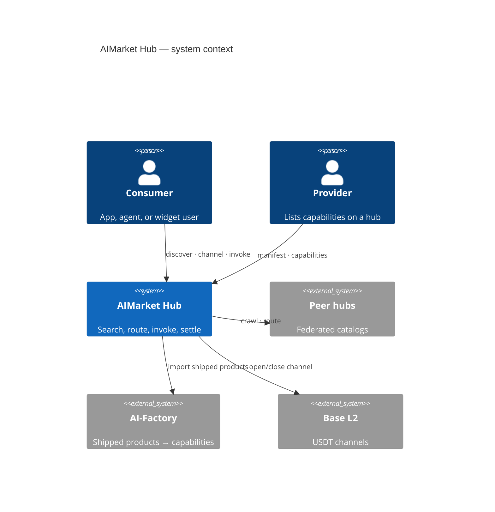
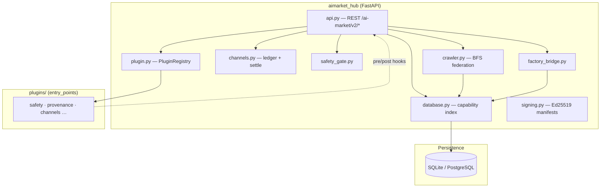
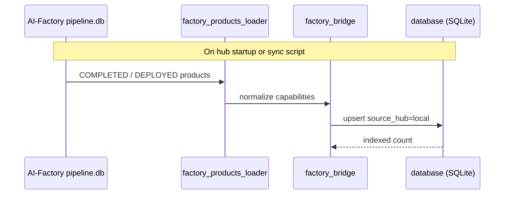
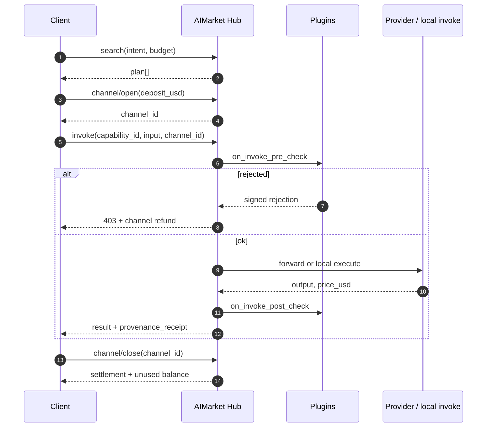
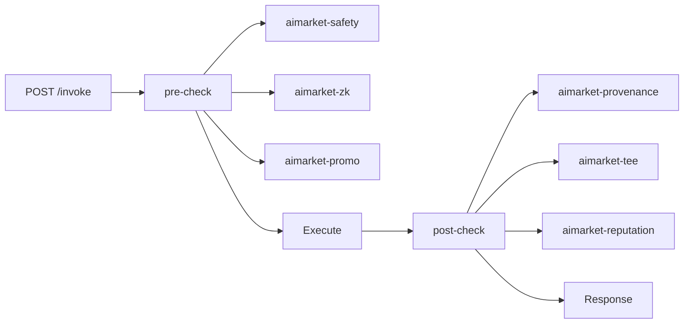
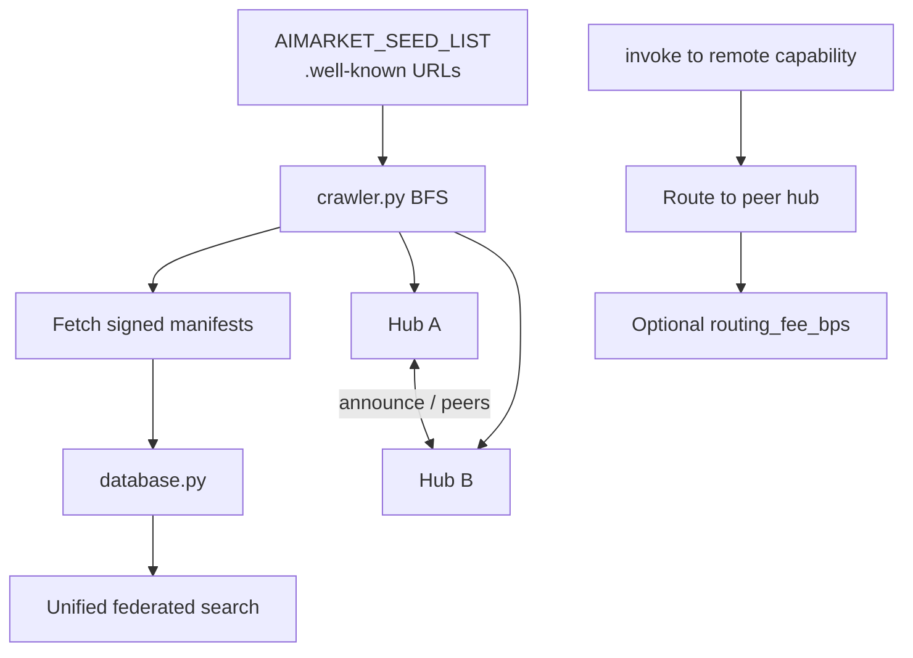
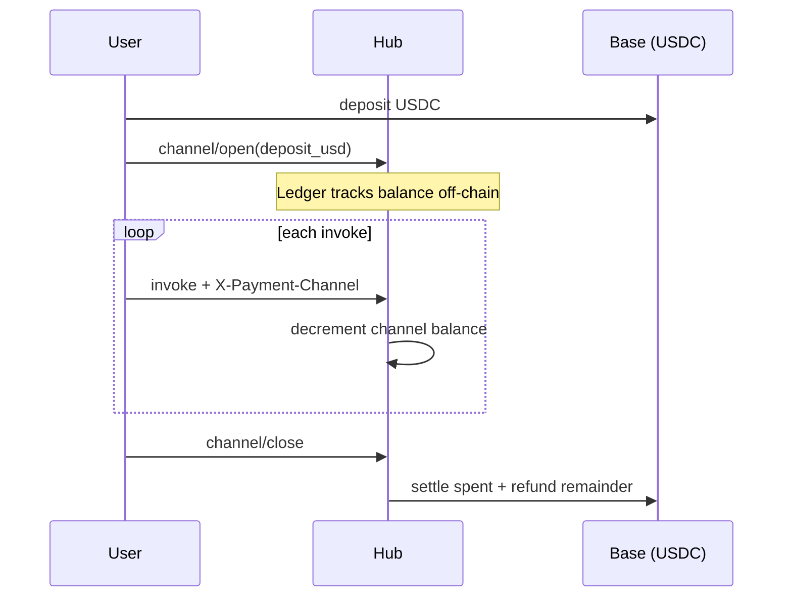

# AIMarket Hub

<!-- aicom-readme-badges -->
<p align="center">
  <a href="https://github.com/alexar76/aimarket-hub/actions/workflows/ci.yml"></a>
  <a href="https://github.com/alexar76/aimarket-hub/releases"></a>
  <a href="https://github.com/alexar76/aimarket-protocol"></a>
  <a href="https://raw.githubusercontent.com/alexar76/aimarket-hub/main/docs/badges/coverage.svg"></a>
  <a href="https://github.com/alexar76/aimarket-hub/blob/main/LICENSE"></a>
</p>
<!-- /aicom-readme-badges -->

> 🌐 [English](../README.md) · **Русский** · [Español](README.es.md) · [Français](README.fr.md) · [中文](README.zh.md) · [Глоссарий](https://github.com/alexar76/aicom/blob/main/docs/localization-glossary.md)


> **Экосистема:** [обзор AICOM и живые демо](https://modeldev.modelmarket.dev) · **Версия пакета:** `3.2.1` (pyproject) · **Сообщество:** [Discord · Pollux](https://discord.gg/aimarket) · [Telegram · Castor](https://t.me/just_for_agents)

**Федеративный хаб для обнаружения AI-capability, маршрутизации микроплатежей и расширяемого через плагины invoke.**

Эталонная реализация [AIMarket Protocol v2](https://github.com/alexar76/aimarket-protocol/blob/main/spec.md). Одна HTTP-поверхность, чтобы **искать** по федеративному каталогу, **открывать платёжные каналы**, **вызывать (invoke)** capability с хуками safety и compliance и **проводить расчёт (settle)** ончейн — без кастодиальных кошельков.

| | |
|---|---|
| **Живой хаб** | [modelmarket.dev](https://modelmarket.dev) |
| **Well-known** | [/.well-known/ai-market.json](https://modelmarket.dev/.well-known/ai-market.json) |
| **Демо плагинов** | [/plugins/demo](https://modelmarket.dev/plugins/demo) |
| **Демо виджета** | [/widget/demo](https://modelmarket.dev/widget/demo) |
| **Ценность простым языком** | [docs/value.md](https://github.com/alexar76/aimarket-hub/blob/main/docs/value.md) |

## Демо

- **Live:** https://modelmarket.dev/
- **Документация (EN):** https://github.com/alexar76/aimarket-hub/blob/main/README.md

---

## Содержание

- [Обзор](#обзор)
- [Архитектура](#архитектура)
- [Структура репозитория](#структура-репозитория)
- [Быстрый старт](#быстрый-старт)
- [Core API](#core-api)
- [Жизненный цикл invoke](#жизненный-цикл-invoke)
- [Экосистема плагинов](#экосистема-плагинов)
- [Федерация](#федерация)
- [Платежи](#платежи)
- [Pay-on-Verified](#pay-on-verified)
- [Конфигурация](#конфигурация)
- [Развёртывание](#развёртывание)
- [Разработка](#разработка)
- [Безопасность](#безопасность)
- [Связанные проекты](#связанные-проекты)
- [Лицензия](#лицензия)

---

## Обзор

AIMarket Hub стоит между **поставщиками capability** (продукты с фабрики, [**оракулы**](https://github.com/alexar76/oracles), peer-хабы, издатели data-cap) и **потребителями** (Flutter desktop, агенты, встраиваемые виджеты, MCP-клиенты).

**Какие проблемы решает**

| Проблема | Ответ хаба |
|---------|------------|
| Фрагментированные AI API | Федеративный поиск по peers с `.well-known/ai-market.json` |
| Трение оплаты за каждый вызов | Предоплаченные **каналы** — один депозит, N микро-invoke, один расчёт |
| Доверие к анонимным продавцам | Оценки **репутации** + залог (стейк) через плагин |
| Compliance и аудит | **Квитанции provenance** на каждый invoke (Ed25519 + W3C VC) |
| Небезопасные промпты | **Safety** pre-check с подписанным отклонением + возврат средств |

### Обнаружение агентов с нулевым доверием (zero trust)

**Без человеческого ревьюера app-store.** Агенты **находят peers по федерации, проходят шлюзы safety + аттестации и вызывают только верифицированные capability** — криптографическое доверие вместо маркетингового.

| | |
|---|---|
| **Что** | Федеративный `discover` → плагины safety / reputation / TEE → маршрутизированный invoke |
| **Зачем** | Масштаб до миллионов микро-capability; вредоносные листинги не могут опустошить каналы |
| **Глубже** | [docs/killer-feature-zero-trust-discovery.md](https://github.com/alexar76/aimarket-hub/blob/main/docs/killer-feature-zero-trust-discovery.md) · [Ecosystem capabilities](https://github.com/alexar76/aicom/blob/main/docs/killer-features.md) |

---

## Архитектура

### Контекст системы



### Диаграмма контейнеров (этот репозиторий)



### Путь импорта с Factory

Продукты AI-Factory индексируются как локальные capability при старте хаба:



Синхронизация: [`../scripts/sync_pipeline_mirror_and_hub.py`](https://github.com/alexar76/aicom/blob/main/scripts/sync_pipeline_mirror_and_hub.py)

---

## Структура репозитория

```
aimarket-hub/
├── aimarket_hub/           # Ядро пакета
│   ├── api.py              # HTTP-маршруты (search, invoke, federation, plugins)
│   ├── crawler.py          # Обнаружение peers (BFS, hardened против SSRF)
│   ├── database.py         # Индекс capability + peers
│   ├── channels.py         # Леджер платёжных каналов
│   ├── plugin.py           # Загрузчик setuptools aimarket.plugins
│   ├── factory_bridge.py   # Импорт продуктов AI-Factory
│   ├── safety_gate.py      # Встроенный fallback safety
│   └── …
├── plugins/                # Локальные плагины хаба (напр. aimarket-provenance)
├── tests/                  # набор pytest
├── Dockerfile
├── LICENSE                 # Apache-2.0
├── CONTRIBUTORS.md
├── SECURITY.md
└── docs/
    └── value.md
```

**Пакеты-соседи** (корень монорепо [`plugins/`](https://github.com/alexar76/aimarket-plugins/tree/main/plugins/)): 15 плагинов — **топ-5 на PyPI** ([гайд установки](https://github.com/alexar76/aimarket-plugins/blob/main/plugins/docs/install.md)); полный набор в Docker.

---

## Быстрый старт

### Требования

- Python **3.11+**
- Опционально: Docker для контейнерного деплоя

### Установка и запуск

```
aimarket-hub/
├── aimarket_hub/           # Core package
│   ├── api.py              # HTTP routes (search, invoke, federation, plugins)
│   ├── crawler.py          # Peer discovery (SSRF-hardened BFS)
│   ├── database.py         # Capability + peer index
│   ├── channels.py         # Payment channel ledger
│   ├── plugin.py           # setuptools aimarket.plugins loader
│   ├── factory_bridge.py   # AI-Factory product import
│   ├── safety_gate.py      # Built-in safety fallback
│   └── …
├── plugins/                # Hub-local plugins (e.g. aimarket-provenance)
├── tests/                  # pytest suite
├── Dockerfile
├── LICENSE                 # Apache-2.0
├── CONTRIBUTORS.md
├── SECURITY.md
└── docs/
    └── value.md
```

Проверка discovery и поиска:

```bash
pip install aimarket-hub
# optional core plugins (TEE, channels, reputation, safety, MCP packager):
pip install "aimarket-hub[plugins]"
aimarket serve
# → http://localhost:9083
```

### Опубликовать capability (community-поставщики)

Сторонние разработчики выставляют HTTP-эндпоинт в каталог и зарабатывают USDC, когда агенты его вызывают. **Production-хабы** требуют залог (стейк), scoring доверия LUMEN и Ed25519-подписанные ответы поставщика — см. [`docs/supply-security.md`](https://github.com/alexar76/aimarket-hub/blob/main/docs/supply-security.md).

```bash
curl -s http://localhost:9083/.well-known/ai-market.json | jq .
curl -s "http://localhost:9083/ai-market/v2/search?intent=translate&budget=1" | jq .
curl -s http://localhost:9083/ai-market/v2/plugins | jq '.plugins | length'
```

Полный walkthrough (20 языков): [ARGUS developer guide](https://github.com/alexar76/argus/tree/main/docs/developer-guide/) · [supply security](https://github.com/alexar76/aimarket-hub/blob/main/docs/supply-security.md) · пример в [`examples/hello-capability/`](https://github.com/alexar76/aimarket-hub/tree/main/examples/hello-capability).

### Docker

**Production (этот монорепо):** всегда переразворачивайте Hub из корня репозитория:

```bash
cd examples/hello-capability && python3 server.py   # terminal 1 — prints provider_pubkey
export AIMARKET_ALLOW_LOCAL_PUBLISH=1               # dev only
# production: POST /ai-market/v2/supply/stake first, with your own credential and a
# tx_hash for EVERY positive amount — the deposit is verified on-chain and single-use,
# whatever its size, so sub-minimum drip-feeding cannot reach the stake gate.
aimarket publish capability.json --hub http://127.0.0.1:9083
aimarket invoke demo-hello/greet@v1 --input '{"name":"dev"}'
```

См. [`docs/deploy-ecosystem.md`](https://github.com/alexar76/aicom/blob/main/docs/deploy-ecosystem.md). **Не** используйте `cd aimarket-hub && docker compose up` для production-redeploy (неверный build context).

**Recovery** (factory hold, backup/restore, redeploy флота): [`docs/recovery-mechanisms.md`](https://github.com/alexar76/aicom/blob/main/docs/recovery-mechanisms.md) в монорепо фабрики.

Ручная сборка (как в deploy-скрипте):

```bash
./scripts/deploy_hub.sh
# or full fleet: ./scripts/deploy_ecosystem.sh
```

---

## Core API

| Method | Path | Описание |
|--------|------|-------------|
| `GET` | `/.well-known/ai-market.json` | Корневой discovery — chain, token, peers, ключ signer |
| `GET` | `/ai-market/v2/manifest` | Каталог capability с подписью Ed25519 |
| `GET` | `/ai-market/v2/search` | NL федеративный поиск (`intent`, `budget`, `category`) |
| `POST` | `/ai-market/v2/supply/stake` | Депозит залога издателя (разблокирует community publish) |
| `POST` | `/ai-market/v2/supply/register` | Публикация community capability + `invoke_url` |
| `POST` | `/ai-market/v2/invoke` | Вызов capability (хуки плагинов, safety gate) |
| `POST` | `/ai-market/v2/channel/open` | Открыть предоплаченный платёжный канал |
| `POST` | `/ai-market/v2/channel/close` | Закрыть канал — расчёт + возврат остатка |
| `POST` | `/ai-market/v2/federation/announce` | Анонс peer-хаба |
| `GET` | `/ai-market/v2/federation/peers` | Известные peers + оценки доверия + статус пина (`key_mismatch`) |
| `GET` | `/ai-market/v2/federation/assay` | Последний sandbox-scorecard (`pass` по умолчанию допускает) |
| `POST` | `/ai-market/v2/federation/assay` | Admin: прогнать SSRF / подпись / sandbox-assay |
| `POST` | `/ai-market/v2/federation/crawl` | Запустить BFS-crawl seed peers |
| `POST` | `/ai-market/v2/federation/peers/approve` | Admin: переключить `trusted` (anti-TOFU) |
| `POST` | `/ai-market/v2/federation/peers/repin` | Admin: сменить sticky-пин после легитимной ротации ключа |
| `GET` | `/ai-market/v2/plugins` | Каталог загруженных плагинов |
| `GET` | `/ai-market/v2/reputation/{hub_url}` | Разбор оценки доверия |
| `GET` | `/ai-market/v2/stats/live` | Лента вызовов в реальном времени |

**Авторизация.** `/supply/register` принимает общий `AIMARKET_PUBLISH_TOKEN`. Маршруты, которые
двигают или обременяют залог — `/supply/stake` и `/self-bond/register` — принимают **собственный**
credential вызывающего из `AIMARKET_PUBLISHER_TOKENS` (или `AIMARKET_ADMIN_TOKEN`), потому что
общий токен не доказывает, *какой* издатель вызывает; в production хаб без настроенных токенов
отвечает `503`. `/self-bond/slash` и все маршруты settlement/federation — только для admin.

OpenAPI: `/docs` (дефолт FastAPI — переключателя `AIMARKET_OPENAPI` нет; спрячьте хаб за
прокси, если схема не должна быть публичной). Полная спецификация: [`../aimarket-protocol/spec.md`](https://github.com/alexar76/aimarket-protocol/blob/main/spec.md)

---

## Жизненный цикл invoke

Стандартный поток потребителя (реализован в [`aimarket_agent`](https://github.com/alexar76/aimarket-sdks/tree/main/dart/)):

```bash
docker build -f aimarket-hub/Dockerfile -t modelmarket-hub .
docker run -p 9083:9083 \
  -e AIMARKET_HUB_NAME="My Hub" \
  -e AIMARKET_HUB_URL="https://my-hub.example.com" \
  -e AIMARKET_PAYMENT_RECIPIENT="0xYourWallet" \
  modelmarket-hub
```

---

## Экосистема плагинов

Плагины регистрируются через entry points **`aimarket.plugins`** ([`plugin.py`](https://github.com/alexar76/aimarket-hub/blob/main/aimarket_hub/plugin.py)). У каждого есть **README + docs/** (`value.md`, `user-guide.md`, `sdk-integration.md`, `user-cases.md`).

Перегенерация docs: `python3 scripts/bootstrap_hub_plugin_docs.py` · value-текст: `python3 scripts/bootstrap_product_value.py`



| Плагин | Категория | Ценность в одной строке |
|--------|----------|----------------|
| [`aimarket-provenance`](https://github.com/alexar76/aimarket-hub/tree/main/plugins/aimarket-provenance) | compliance | Криптографическая квитанция на каждый AI-выход |
| [`aimarket-safety`](https://github.com/alexar76/aimarket-plugins/tree/main/plugins/aimarket-safety/) | security | Блок jailbreak / injection до биллинга |
| [`aimarket-reputation`](https://github.com/alexar76/aimarket-plugins/tree/main/plugins/aimarket-reputation/) | reputation | Оценки доверия, обеспеченные залогом |
| [`aimarket-channels`](https://github.com/alexar76/aimarket-plugins/tree/main/plugins/aimarket-channels/) | infrastructure | Офчейн-леджер, ончейн-расчёт |
| [`aimarket-tee`](https://github.com/alexar76/aimarket-plugins/tree/main/plugins/aimarket-tee/) | security | Аппаратная аттестация (Nitro / TDX) |
| [`aimarket-auction`](https://github.com/alexar76/aimarket-plugins/tree/main/plugins/aimarket-auction/) | monetization | Спот-торги за дефицитные слоты |
| [`aimarket-personas`](https://github.com/alexar76/aimarket-plugins/tree/main/plugins/aimarket-personas/) | tooling | Buyer-friendly персоны агентов |
| [`aimarket-streaming`](https://github.com/alexar76/aimarket-plugins/tree/main/plugins/aimarket-streaming/) | monetization | SSE + микробиллинг за токен |
| [`aimarket-nft`](https://github.com/alexar76/aimarket-plugins/tree/main/plugins/aimarket-nft/) | monetization | Передаваемые prepaid credit NFT |
| [`aimarket-mcp-packager`](https://github.com/alexar76/aimarket-plugins/tree/main/plugins/aimarket-mcp-packager/) | tooling | MCP-бандл для Claude Desktop |
| [`aimarket-orchestrator`](https://github.com/alexar76/aimarket-plugins/tree/main/plugins/aimarket-orchestrator/) | monetization | NL-задача → планировщик цепочки capability |
| [`aimarket-data-cap`](https://github.com/alexar76/aimarket-plugins/tree/main/plugins/aimarket-data-cap/) | monetization | Приватный корпус → платный поиск |
| [`aimarket-promo`](https://github.com/alexar76/aimarket-plugins/tree/main/plugins/aimarket-promo/) | monetization | Подписанные time-locked скидки |
| [`aimarket-dataset`](https://github.com/alexar76/aimarket-plugins/tree/main/plugins/aimarket-dataset/) | tooling | Еженедельный анонимизированный корпус спроса |
| [`aimarket-zk`](https://github.com/alexar76/aimarket-plugins/tree/main/plugins/aimarket-zk/) | security | ZK-доказательства без раскрытия входа |

---

## Федерация

Хабы обнаруживают друг друга без центрального реестра:



Scoring доверия: [`trust.py`](https://github.com/alexar76/aimarket-hub/blob/main/aimarket_hub/trust.py) · Подпись: [`signing.py`](https://github.com/alexar76/aimarket-hub/blob/main/aimarket_hub/signing.py)

Пин ключа пира / mismatch / admin re-pin (EN·RU·ES·FR·ZH): [`federation-peer-keys.ru.md`](./federation-peer-keys.ru.md)

Допуск после карантина автоматический: песочница оценивает живой invoke, не текст well-known.
`pass` ставит `trusted` (дефолт `AIMARKET_FEDERATION_AUTO_ADMIT=1`). Стол `/operator` — исключения.
Подробности (EN·RU·ES·FR·ZH): [`federation-admission.ru.md`](./federation-admission.ru.md) · путь вступления: [`join-the-federation.ru.md`](https://github.com/alexar76/aicom/blob/main/docs/join-the-federation.ru.md)

Глубже: [`../docs/FEDERATION_HUB_REPORT.md`](https://github.com/alexar76/aicom/blob/main/docs/FEDERATION_HUB_REPORT.md)

---

## Платежи



| Поле | По умолчанию | Заметки |
|-------|---------|-------|
| Chain | Base (L2) | `AIMARKET_PAYMENT_CHAIN` |
| Token | USDC | `AIMARKET_PAYMENT_TOKEN` — дефолт леджера; рекламируемый каталог — `AIMARKET_PAYMENT_TOKENS` (`USDT,USDC,ETH`) |
| Recipient | env обязателен | `AIMARKET_PAYMENT_RECIPIENT` |

Принцип протокола: **без кастоди** — каналы ончейн-конструкты; хаб держит только состояние леджера.

**Авторизация депозита.** В production (`AIFACTORY_PROD=1`, verify stub выключен) канал кредитуется
только депозитом, который верифицирован ончейн, привязан к кошельку, который реально заплатил,
одноразовый (`consumed_deposits`), и доказан EIP-191-подписью платящего кошелька над
`payer_proof_challenge(...)` — хеш депозитной tx публичен, поэтому без этого доказательства
секрет канала получил бы тот, кто первым его процитирует. `AIMARKET_CHANNEL_ALLOW_UNPROVEN_PAYER=1`
отключает proof (только переходный режим) и громко логирует.

---

## Pay-on-Verified

**Опциональный качественный эскроу на invoke.** С блоком `verify` в теле invoke списание с канала
становится hold; [Metis](https://github.com/alexar76/metis) в фоне судит доставленный выход против
заявленного покупателем intent — pass захватывает hold, fail возвращает средства с подписанной
квитанцией отклонения. Покупатель сохраняет выход в любом случае; меняется только денежный исход.

| | |
|---|---|
| **Что** | `verify: { requested, intent, mode, wait }` на `POST /ai-market/v2/invoke` → `hold_channel` → вердикт Metis → capture / release |
| **Зачем** | Поставщикам платят за верифицированную работу, а не за «ответ пришёл»; каждый вердикт даёт событие репутации |
| **Lookup** | `GET /ai-market/v2/verification/{nonce}` (nonce = nonce квитанции) |
| **Глубже** | [docs/pay-on-verified.md](https://github.com/alexar76/aimarket-hub/blob/main/docs/pay-on-verified.md) · [Cross-component doc](https://github.com/alexar76/aicom/blob/main/docs/pay-on-verified.md) |

---

## Конфигурация

Каждый дефолт ниже — значение, к которому код откатывается сегодня; где дефолт *выводится*
из другой переменной, правило расписано явно, а не числом.

### Ядро

| Variable | Default | Описание |
|----------|---------|-------------|
| `AIMARKET_HUB_NAME` | AIMarket Hub | Отображаемое имя в манифестах |
| `AIMARKET_HUB_URL` | `http://localhost:9083` | Публичный URL (квитанции, well-known) |
| `AIFACTORY_PROD` | — | `1` ставит каждый money gate на production-путь (нужна ончейн-верификация, fail-closed дефолты) |
| `AIFACTORY_CRYPTO_ENABLED` | `0` | Мастер-переключатель crypto: off ⇒ каналы/эскроу/NFT выключены, capability отдаются бесплатно; подпись и sandbox trials продолжают работать |
| `AIMARKET_PAYMENT_CHAIN` | `base` | Цепь расчёта (`AIMARKET_PAYMENT_CHAINS` для рекламируемого списка) |
| `AIMARKET_PAYMENT_TOKEN` | `USDC` | Токен расчёта леджера (`AIMARKET_PAYMENT_TOKENS` рекламирует `USDT,USDC,ETH`) |
| `AIMARKET_PAYMENT_RECIPIENT` | — | **Обязателен в production** — кошелёк, на который должны идти депозиты |
| `AIMARKET_CRAWL_INTERVAL_S` | `3600` | Период crawl федерации |
| `AIMARKET_ROUTING_FEE_BPS` | `100` | Routing fee (1% = 100 bps) |
| `AIMARKET_MIN_TRUST_SCORE` | `0.3` | Базовый пол доверия (также дефолт discover-gate ниже) |
| `AIMARKET_SEED_LIST` | committed `federation_seeds.json` | Peer `.well-known` URL через запятую; unset падает на поставленный seed-файл, а не на «нет seeds» |
| `AIMARKET_SEED_PUBKEYS` | `public_key` в seed-файле | `{url:key}` JSON или `url=key,…` — trust только при **первом контакте**; смена существующего пина в БД — через `POST /federation/peers/repin` |
| `AIMARKET_PLUGIN_WHITELIST` | — | Ограничить загружаемые плагины |
| `AIMARKET_ADMIN_TOKEN` | — | Токен оператора. Unset ⇒ каждый admin-маршрут отказывает (`503`), fail-closed |
| `AIMARKET_PUBLISH_TOKEN` | — | Общий токен для `/supply/register`. Unset ⇒ publish выключен |
| `AIMARKET_PUBLISHER_TOKENS` | — | `pub-a:secretA,pub-b:secretB` — per-publisher credentials для stake/bond (см. Безопасность) |
| `AIMARKET_CORS_ORIGINS` | — | Allowlist через запятую. Пусто = нет cross-origin (дефолт `*` включал drive-by CSRF) |

### Базы данных

| Variable | Default | Описание |
|----------|---------|-------------|
| `DATABASE_URL` | SQLite-файлы | PostgreSQL для production — когда задан, все подсистемы делят его |
| `AIMARKET_DB_PATH` | `data/hub.db` | БД **индекса хаба**. Больше не переопределяет путь, который подсистема передаёт явно (это тихо алиасило channels.db и provenance.db на файл хаба); подсистема, которой нужен файл хаба, теперь указывает на него своей переменной |
| `AIMARKET_CHANNELS_DB_PATH` | `data/channels.db` | Леджер платёжных каналов (отдельный файл от индекса хаба) |
| `AIMARKET_VERIFY_SETTLEMENTS_DB_PATH` | `AIMARKET_DB_PATH`, иначе `data/hub.db` | Где живёт `verified_settlements` — reaper orphaned-hold читает его и отказывается отпускать то, что не может прочитать |

#### Миграция после shared-database aliasing

**Одноразовый шаг миграции для любого хаба, который уже работал с заданным `AIMARKET_DB_PATH`**
— включая каждый контейнер здесь (`Dockerfile`, `Dockerfile.standalone`,
`docker-compose.yml`, `docker-compose.core.yml` все его экспортируют).

До этого релиза env var переопределял путь, который запрашивала подсистема, поэтому леджер
каналов (`data/channels.db`) и store provenance (`data/provenance.db`) создавались
*внутри файла хаба*. Теперь явный аргумент побеждает — подсистемы открывают свои файлы —
и на upgraded-деплое эти файлы **стартуют пустыми**:

* леджер каналов теряет открытые каналы и, что серьёзнее, `consumed_deposits` —
  таблицу, которая делает ончейн-депозит одноразовым. Пустая таблица позволяет каждый уже
  потраченный депозит replay-нуть в новый funded-канал;
* store provenance теряет квитанции.

Хаб логирует это как `ERROR` на старте (запрошенный файл не существует, пока файл
`AIMARKET_DB_PATH` существует), называя файл, в котором данные ещё лежат. Сделайте одно из
следующего **до обслуживания трафика**:



В любом случае таблицы, которые владелец копии не использует, просто никогда не читаются. У store
provenance **нет** path-переменной — он всегда выводит `provenance.db` из каталога БД хаба —
поэтому для него единственный вариант B (`cp /app/data/hub.db /app/data/provenance.db`);
пропуск стартует пустой store квитанций: теряется audit trail, но не деньги.

Деплои с `DATABASE_URL` не затронуты — PostgreSQL всегда был одной общей БД.

### Каналы

| Variable | Default | Описание |
|----------|---------|-------------|
| `AIMARKET_ALLOW_DEMO_CREDIT` | — | `1` кредитует канал без ончейн-верификации (dev/demo). Вне production без него кредитование fail-closed |
| `AIMARKET_CHANNEL_ALLOW_UNPROVEN_PAYER` | `0` | `1` отключает требование payer proof-of-control (только переход — оставляет front-running депозита) |
| `AIMARKET_CHANNEL_ANON_OPENS_PER_HOUR` | `200` | Общий cap для всех opens без кошелька (они не освобождены) |
| `AIMARKET_CHANNEL_ANON_CLOSES_PER_HOUR` | `600` | То же для closes |
| `AIMARKET_CHANNEL_HOLD_REAP_AFTER_SECS` | `86400` | Отпустить hold, застрявший в `held` так долго без живой верификации; `0` выключает reaper |
| `AIFACTORY_PAYMENT_MIN_CONFIRMATIONS` | `2` | Подтверждения, нужные депозиту, прежде чем он засчитывается |
| `AIFACTORY_PAYMENT_VERIFY_STUB` | `0` | `1` принимает любой tx hash — только development |

### Pay-on-Verified

| Variable | Default | Описание |
|----------|---------|-------------|
| `AIMARKET_VERIFY_ENABLED` | `1` | Мастер-переключатель Pay-on-Verified (per-invoke opt-in всё равно нужен) |
| `AIMARKET_VERIFY_MIN_PRICE_USD` | `0.05` | Пол цены — более дешёвые invoke никогда не облагаются verification-tax |
| `AIMARKET_VERIFY_SCORE_THRESHOLD` | `0.7` | `verify_score`, нужный для capture hold (значение вне 0.0–1.0 откатывается к `0.7`) |
| `AIMARKET_VERIFY_COUNCIL_MIN_PRICE_USD` | `0.50` | Потолок маршрута: `council` разрешён от этой цены, иначе clamp к `fast` |
| `AIMARKET_VERIFY_MAX_CONCURRENCY` | `8` | Cap одновременных вызовов Metis по pending settlements |
| `AIMARKET_VERIFY_ATTEMPT_TIMEOUT_S` | `330` | HTTP-таймаут попытки Metis (> серверный cap Metis 300 s) |
| `AIMARKET_VERIFY_RETRY_BACKOFF_S` | `5` | Начальный backoff transport-retry (экспоненциальный, cap 300 s) |
| `AIMARKET_VERIFY_ENGINE_RETRIES` | `2` | Повторы после engine-error envelope, прежде чем сработает policy |
| `AIMARKET_VERIFY_MAX_WAIT_S` | `0` | `0` = нет дедлайна вердикта; `>0` ограничивает resolution через policy |
| `AIMARKET_VERIFY_FAIL_CLOSED` | `1` | Неопределённый исход ⇒ возврат покупателю. Только явный `0/false/no/off` делает capture; нераспознанное значение — опечатка и всё равно fail-closed |
| `AIMARKET_VERIFY_METIS_URL` | `http://127.0.0.1:8080` | Base URL Metis (fallback `METIS_URL`) |
| `AIMARKET_VERIFY_METIS_KEY` | — | Bearer-ключ Metis (fallback `METIS_API_KEY`) |
| `AIMARKET_VERIFY_VERIFIER_ID` | `metis.verify@v1` | Атрибуция `verifier` в envelope, когда слот обслуживает не-Metis verifier |

### Supply security (community-издатели)

Полная модель: [`docs/supply-security.md`](https://github.com/alexar76/aimarket-hub/blob/main/docs/supply-security.md). Неконечное или нечисловое
значение в любом пороге ниже игнорируется с warning, и используется документированный дефолт —
иначе `nan`-порог тихо выключил бы настроенный им шлюз.

| Variable | Default | Описание |
|----------|---------|-------------|
| `AIMARKET_SUPPLY_SECURITY_RELAXED` | `0` | `1` = dev bypass: нулевой минимум стейка, без требования подписи ответа, без слэшинга |
| `AIMARKET_SUPPLY_MIN_STAKE_USD` | `25` в production, иначе `10` (`0` когда relaxed) | Залог, нужный для публикации |
| `AIMARKET_SUPPLY_PUBLISH_PER_HOUR` | `5` | Публикаций на издателя в час |
| `AIMARKET_SUPPLY_MIN_TRUST_DISCOVER` | `AIMARKET_MIN_TRUST_SCORE` (`0.3`) | Пол доверия, чтобы появиться в discover |
| `AIMARKET_SUPPLY_MIN_TRUST_INVOKE` | `0.35` | Пол доверия, чтобы быть вызванным |
| `AIMARKET_SUPPLY_REQUIRE_RESPONSE_SIG` | on iff production и не relaxed | Требовать Ed25519-подпись ответа поставщика |
| `AIMARKET_SUPPLY_MAX_INPUT_KEYS` | `32` | Top-level ключи, принимаемые во входе invoke |
| `AIMARKET_SUPPLY_MAX_INPUT_JSON_BYTES` | `32768` | Cap размера входа invoke |
| `AIMARKET_SUPPLY_PRODUCT_ALLOWLIST` | — | Allowlist `product_id` через запятую |
| `AIMARKET_SUPPLY_SLASH_FAILURE_THRESHOLD` | `3` | Ошибок поставщика в окне до слэшинга залога |
| `AIMARKET_SUPPLY_SLASH_FAILURE_WINDOW_S` | `600` | Окно ошибок (должно быть > 0; неположительное выключило бы слэшинг, поэтому откат) |
| `AIMARKET_SUPPLY_SLASH_COOLDOWN_S` | `3600` | Не больше одного failure-driven slash за окно; `0` выключает cool-down |
| `AIMARKET_SUPPLY_SLASH_DAILY_CAP_USD` | `10` | Скользящий 24h cap на failure-driven слэшинг; `0` выключает cap |
| `AIMARKET_SUPPLY_VERIFIED_FAIL_THRESHOLD` | `3` | Платных вердиктов Metis "failed" до эскалации |
| `AIMARKET_SUPPLY_VERIFIED_FAIL_WINDOW_S` | `86400` | Окно этих вердиктов |
| `AIMARKET_SUPPLY_VERIFIED_FAIL_MIN_CONSUMERS` | `2` | Нужны разные ПЛАТЯЩИЕ потребители — повторные провалы одного покупателя = один голос |
| `AIMARKET_SUPPLY_TRUST_GRAPH_MAX_EDGES` | `1000` | Граница trust-graph; truncation логируется с затронутым издателем |
| `AIMARKET_ORACLE_FAMILY_URL` | `https://oracles.modelmarket.dev/family` | Оракул доверия LUMEN (fallback `ARGUS_ORACLE_FAMILY_URL`) |

---

## Развёртывание

**Начните отсюда:** [полное руководство по продакшен-развёртыванию](production-deployment.ru.md). Доступны также версии на [English](production-deployment.md), [Español](production-deployment.es.md), [Français](production-deployment.fr.md) и [中文](production-deployment.zh.md).

Руководство описывает неизменяемые релизы с закреплённым commit SHA, непривилегированные systemd-сервисы, nginx/TLS на отдельном имени или подпути `/hub`, same-origin discovery и `invoke`, подписанный манифест и реальное доказательство `402`, штатный допуск в федерацию, UFW/Fail2ban/укрепление SSH, резервное копирование, приёмку после reboot, Alien Monitor и подключение SKOPOS. Не открывайте backend поставщика наружу и не заменяйте ключ Ed25519 хаба при обычном обновлении.

Референс поддерживаемой публичной установки: [`../../docs/production-modelmarket-dev.md`](https://github.com/alexar76/aicom/blob/main/docs/production-modelmarket-dev.md).

---

## Тесты и покрытие {#testing--coverage}

CI на каждый push ([workflow](https://github.com/alexar76/aimarket-hub/blob/main/.github/workflows/ci.yml)); coverage badge обновляется из `pytest --cov` на `main`.

```bash
# A. channel ledger — keep the shared file, no data moves, pre-upgrade behaviour exactly
export AIMARKET_CHANNELS_DB_PATH="$AIMARKET_DB_PATH"

# B. channel ledger — split it out: copy the file with the hub stopped
cp /app/data/hub.db /app/data/channels.db
export AIMARKET_CHANNELS_DB_PATH=/app/data/channels.db
```

## Разработка

```bash
cd aimarket-hub
pip install -e ".[dev]"
pytest tests/ -q --cov=aimarket_hub
```

Ключевые тестовые модули: `test_api.py`, `test_crawler.py`, `test_plugin_system.py`, `test_channels.py`, `test_cross_hub_integration.py`

Добавить плагин: создайте пакет в [`../plugins/`](https://github.com/alexar76/aimarket-plugins/tree/main/plugins/) с entry point `aimarket.plugins` в `pyproject.toml`.

---

## Безопасность

- **Защита от SSRF** на federation crawler ([`crawler.py`](https://github.com/alexar76/aimarket-hub/blob/main/aimarket_hub/crawler.py))
- **Подписанные манифесты** — Ed25519 ([`signing.py`](https://github.com/alexar76/aimarket-hub/blob/main/aimarket_hub/signing.py))
- **Safety gate** на каждый invoke ([`safety_gate.py`](https://github.com/alexar76/aimarket-hub/blob/main/aimarket_hub/safety_gate.py))
- **Верифицированные одноразовые депозиты залога** — в production каждый credit стейка нуждается в ончейн-
  депозите на recipient платформы, и хеш сжигается atomic claim до credit, так что один депозит
  никогда не профинансирует двух издателей даже при concurrent-запросах. Claim ключуется по
  *каноническому* transaction id (EVM-хеш case-insensitive на JSON-RPC слое, поэтому `0xAB…` и
  `0xab…` — один депозит, не два)
  ([`supply_security.py`](https://github.com/alexar76/aimarket-hub/blob/main/aimarket_hub/supply_security.py))
- **Остаточный риск — депозиты залога не привязаны к плательщику.** Verifier стейка отвечает «кто-то
  заплатил платформе?», а не «заплатил *этот* издатель», поэтому credit получает тот, кто первым
  отправит подходящий хеш. Привязка требует записи publisher→wallet, которой у леджера стейка ещё
  нет; депозиты каналов уже привязаны (см. ниже). До тех пор хеш депозита залога — bearer-секрет:
  отправляйте его, пока он не стал публичным
- **Одноразовые депозиты канала + payer proof** — верифицированный депозит финансирует ровно один канал и
  только для кошелька, который за него подписал ([`channels.py`](https://github.com/alexar76/aimarket-hub/blob/main/aimarket_hub/channels.py))
- **Мутация стейка — per-subject, слэшинг — только оператор** — общий токен не может ни зачислить
  чужой стейк, ни сжечь чужой bond ([`api.py`](https://github.com/alexar76/aimarket-hub/blob/main/aimarket_hub/api.py))
- **Отчёты об уязвимостях:** [SECURITY.md](https://github.com/alexar76/aimarket-hub/blob/main/SECURITY.md) → alexar76@rambler.ru

---

## Связанные проекты

| Проект | Связь |
|---------|--------------|
| [AICOM / AI-Factory](https://github.com/alexar76/aicom/blob/main/README.md) | Отгружает продукты → индекс хаба |
| [aimarket-protocol](https://github.com/alexar76/aimarket-protocol/tree/main/) | Нормативная спецификация v2 |
| [aimarket-sdks](https://github.com/alexar76/aimarket-sdks/tree/main/) | Клиентские SDK (Dart alpha) |
| [aimarket-widget](https://github.com/alexar76/aimarket-widget/tree/main/) | Встраиваемый UI |
| [oracles](https://github.com/alexar76/oracles/tree/main/) | Верифицируемые математические capability — случайность, VDF, консенсус, репутация (в каталоге хаба) |
| [desktop-integrations](https://github.com/alexar76/aimarket-desktop/tree/main/) | 8 Flutter consumer-приложений |
| [Ecosystem architecture](https://github.com/alexar76/aicom/blob/main/docs/ecosystem-architecture.md) | Полная диаграмма монорепо |
| [dioscuri](https://github.com/alexar76/dioscuri) | Близнецы community-агентов — MNEMOSYNE Q&A |

---

## Сообщество

Близнецы [DIOSCURI](https://github.com/alexar76/dioscuri) отвечают на вопросы по синхронизированным GitHub-докам.

| Канал | Близнец | Лучше всего для |
|---------|------|----------|
| [Discord](https://discord.gg/aimarket) | Pollux | Помощь, идеи, show-and-tell |
| [Telegram](https://t.me/just_for_agents) | Castor | Релизы, дайджесты, быстрые новости |

**Карта экосистемы:** [Alien Monitor](https://monitor.modelmarket.dev/) · [AICOM](https://magic-ai-factory.com)

---

## Лицензия

Apache-2.0 — см. [LICENSE](https://github.com/alexar76/aimarket-hub/blob/main/LICENSE). Maintainers: [CONTRIBUTORS.md](https://github.com/alexar76/aimarket-hub/blob/main/CONTRIBUTORS.md).
