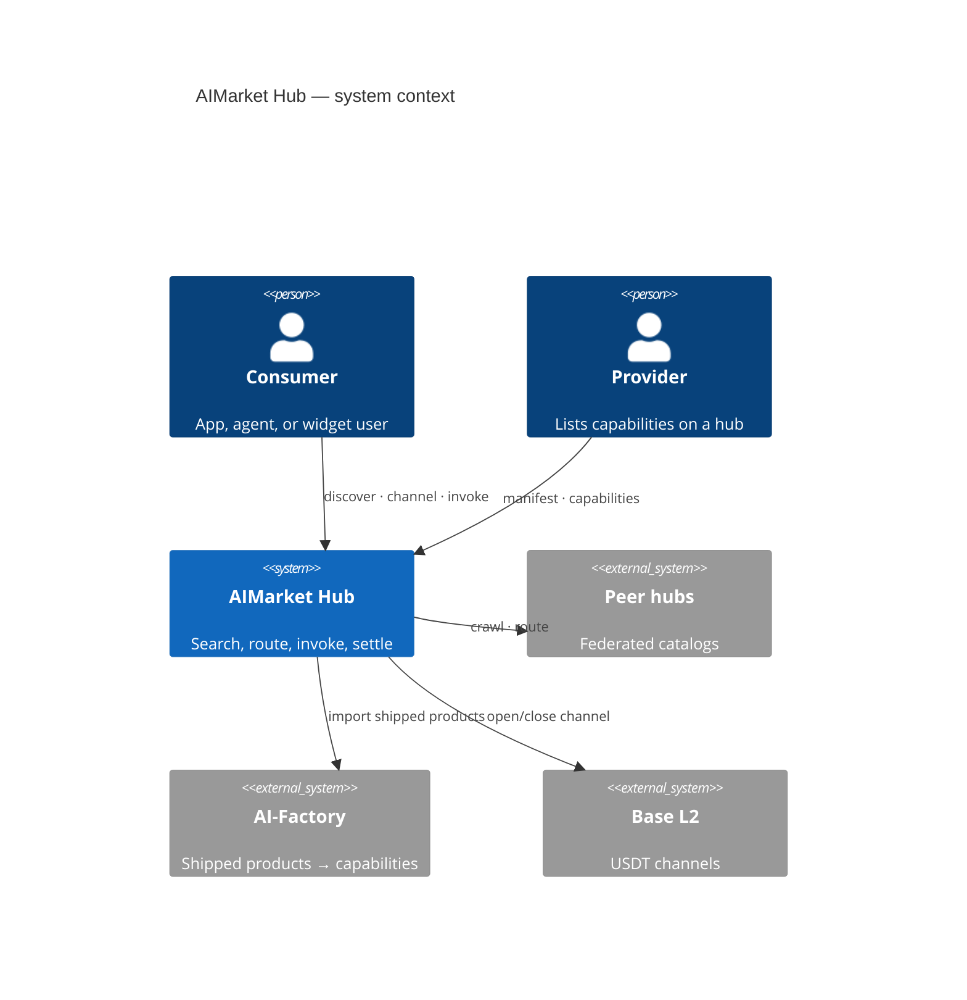
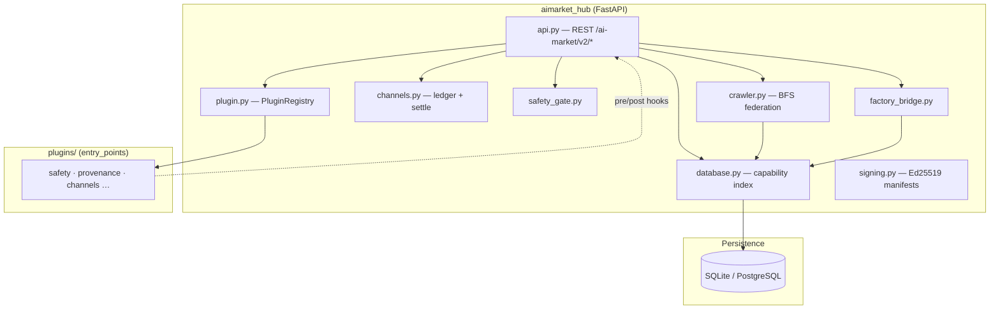
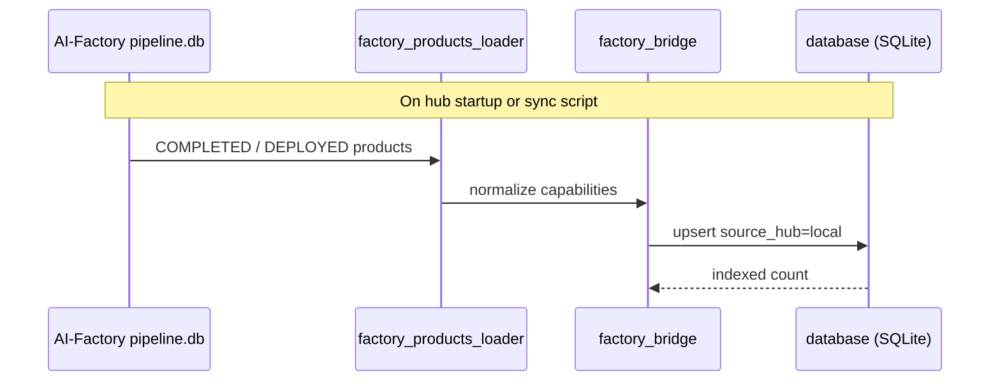
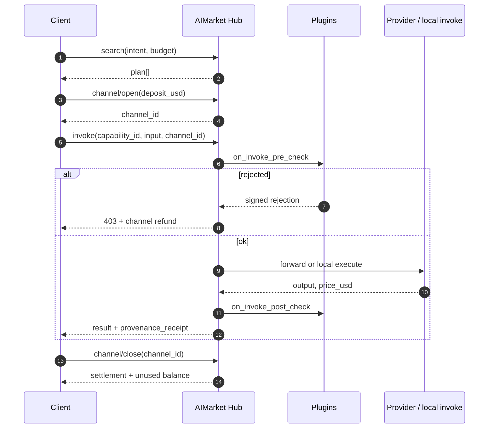
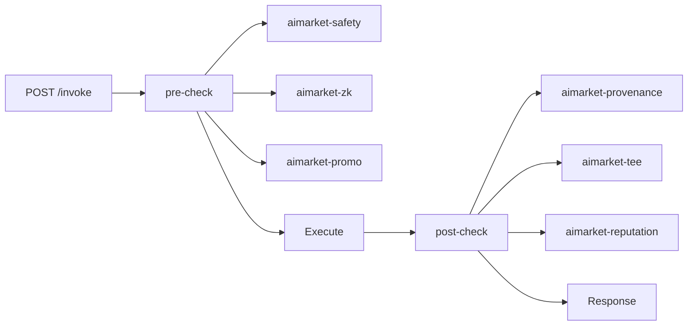
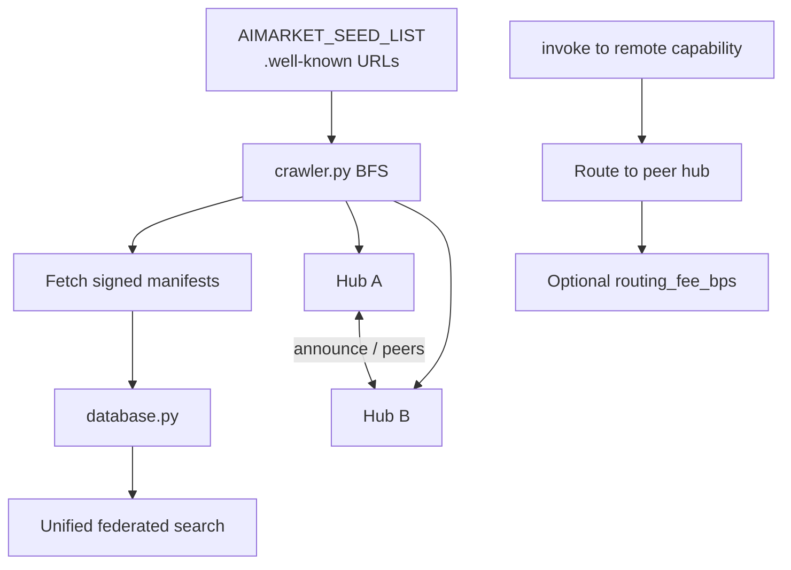
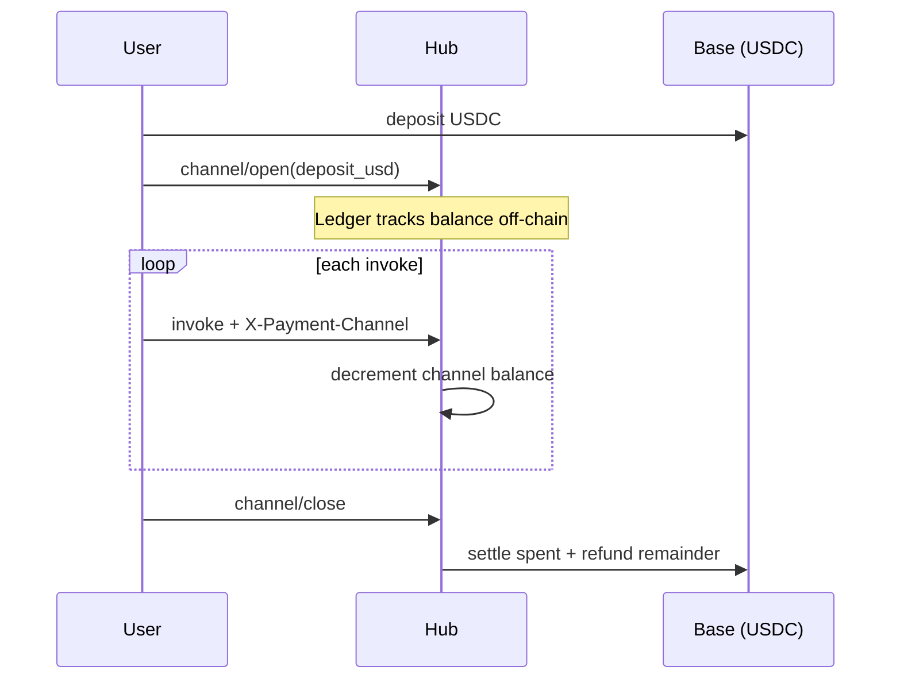

# AIMarket Hub

<!-- aicom-readme-badges -->
<p align="center">
  <a href="https://github.com/alexar76/aimarket-hub/actions/workflows/ci.yml"></a>
  <a href="https://github.com/alexar76/aimarket-hub/releases"></a>
  <a href="https://github.com/alexar76/aimarket-protocol"></a>
  <a href="https://raw.githubusercontent.com/alexar76/aimarket-hub/main/docs/badges/coverage.svg"></a>
  <a href="https://github.com/alexar76/aimarket-hub/blob/main/LICENSE"></a>
</p>
<!-- /aicom-readme-badges -->

> 🌐 [English](../README.md) · [Русский](README.ru.md) · [Español](README.es.md) · [Français](README.fr.md) · **中文** · [术语表](https://github.com/alexar76/aicom/blob/main/docs/localization-glossary.md)


> **生态：** [AICOM 概览与在线演示](https://modeldev.modelmarket.dev) · **包版本：** `3.2.1` (pyproject) · **社区：** [Discord · Pollux](https://discord.gg/aimarket) · [Telegram · Castor](https://t.me/just_for_agents)

**用于 AI capability 发现、微支付路由与可插件扩展调用的联邦枢纽（Hub）。**

[AIMarket Protocol v2](https://github.com/alexar76/aimarket-protocol/blob/main/spec.md) 的参考实现。单一 HTTP 面即可**搜索**联邦目录、**打开支付通道**、带 safety/compliance 钩子地**调用（invoke）** capability，并**链上结算（settle）** — 无托管钱包。

| | |
|---|---|
| **在线 Hub** | [modelmarket.dev](https://modelmarket.dev) |
| **Well-known** | [/.well-known/ai-market.json](https://modelmarket.dev/.well-known/ai-market.json) |
| **插件演示** | [/plugins/demo](https://modelmarket.dev/plugins/demo) |
| **小组件演示** | [/widget/demo](https://modelmarket.dev/widget/demo) |
| **通俗价值说明** | [docs/value.md](https://github.com/alexar76/aimarket-hub/blob/main/docs/value.md) |

## Demo

- **Live:** https://modelmarket.dev/
- **文档（英文真源）：** https://github.com/alexar76/aimarket-hub/blob/main/README.md

---

## 目录

- [概览](#overview)
- [架构](#architecture)
- [仓库布局](#repository-layout)
- [快速开始](#quick-start)
- [Core API](#core-api)
- [调用生命周期](#invoke-lifecycle)
- [插件生态](#plugin-ecosystem)
- [联邦](#federation)
- [支付](#payments)
- [Pay-on-Verified](#pay-on-verified)
- [配置](#configuration)
- [部署](#deployment)
- [开发](#development)
- [安全](#security)
- [相关项目](#related-projects)
- [许可](#license)

---

## 概览

AIMarket Hub 位于 **capability 提供方**（工厂交付产品、[**预言机**](https://github.com/alexar76/oracles)、对等 Hub、data-cap 发布方）与 **消费方**（Flutter 桌面应用、智能体、可嵌入小组件、MCP 客户端）之间。

**它解决的问题**

| 问题 | Hub 的回答 |
|---------|------------|
| 碎片化的 AI API | 对 `.well-known/ai-market.json` 对等节点的联邦搜索 |
| 按次付款摩擦 | 预充值**通道** — 一次存款、N 次微调用、一次结算 |
| 对匿名卖方的信任 | **声誉**分 + 保证金/质押（插件） |
| 合规与审计 | 每次调用的 provenance **收据**（Ed25519 + W3C VC） |
| 不安全提示词 | **safety** 预检：签名拒绝 + 退款 |


### 零信任（zero trust）智能体发现

**没有人工应用商店审核员。** 智能体**经联邦发现对等方、通过 safety + 证明（attestation）门控，并仅调用已验证 capability** — 密码学信任取代营销信任。

| | |
|---|---|
| **是什么** | 联邦 `discover` → safety / reputation / TEE 插件 → 路由后的 invoke |
| **为什么** | 可扩展到数百万微 capability；恶意上架无法抽空通道 |
| **深入阅读** | [docs/killer-feature-zero-trust-discovery.md](https://github.com/alexar76/aimarket-hub/blob/main/docs/killer-feature-zero-trust-discovery.md) · [Ecosystem capabilities](https://github.com/alexar76/aicom/blob/main/docs/killer-features.md) |

---

## 架构

### 系统上下文



### 容器图（本仓库）



### 来自 Factory 的导入路径

AI-Factory 交付的产品在 Hub 启动时索引为本地 capability：



同步运维： [`../scripts/sync_pipeline_mirror_and_hub.py`](https://github.com/alexar76/aicom/blob/main/scripts/sync_pipeline_mirror_and_hub.py)

---

## 仓库布局

```
aimarket-hub/
├── aimarket_hub/           # Core package
│   ├── api.py              # HTTP routes (search, invoke, federation, plugins)
│   ├── crawler.py          # Peer discovery (SSRF-hardened BFS)
│   ├── database.py         # Capability + peer index
│   ├── channels.py         # Payment channel ledger
│   ├── plugin.py           # setuptools aimarket.plugins loader
│   ├── factory_bridge.py   # AI-Factory product import
│   ├── safety_gate.py      # Built-in safety fallback
│   └── …
├── plugins/                # Hub-local plugins (e.g. aimarket-provenance)
├── tests/                  # pytest suite
├── Dockerfile
├── LICENSE                 # Apache-2.0
├── CONTRIBUTORS.md
├── SECURITY.md
└── docs/
    └── value.md
```

**兄弟包**（单体仓根目录 [`plugins/`](https://github.com/alexar76/aimarket-plugins/tree/main/plugins/)）：15 个插件 — **PyPI 前五**（[安装指南](https://github.com/alexar76/aimarket-plugins/blob/main/plugins/docs/install.md)）；完整集合打包进 Docker。

---

## 快速开始

### 前置条件

- Python **3.11+**
- 可选：用 Docker 做容器部署

### 安装并运行

```bash
pip install aimarket-hub
# optional core plugins (TEE, channels, reputation, safety, MCP packager):
pip install "aimarket-hub[plugins]"
aimarket serve
# → http://localhost:9083
```

验证 discovery 与搜索：

```bash
curl -s http://localhost:9083/.well-known/ai-market.json | jq .
curl -s "http://localhost:9083/ai-market/v2/search?intent=translate&budget=1" | jq .
curl -s http://localhost:9083/ai-market/v2/plugins | jq '.plugins | length'
```

### 发布 capability（社区提供方）

第三方开发者把 HTTP 端点列入目录，智能体调用时赚取 USDC。**生产 Hub** 要求质押、LUMEN 信任评分与 Ed25519 签名的提供方响应 — 见 [`docs/supply-security.md`](https://github.com/alexar76/aimarket-hub/blob/main/docs/supply-security.md)。

```bash
cd examples/hello-capability && python3 server.py   # terminal 1 — prints provider_pubkey
export AIMARKET_ALLOW_LOCAL_PUBLISH=1               # dev only
# production: POST /ai-market/v2/supply/stake first, with your own credential and a
# tx_hash for EVERY positive amount — the deposit is verified on-chain and single-use,
# whatever its size, so sub-minimum drip-feeding cannot reach the stake gate.
aimarket publish capability.json --hub http://127.0.0.1:9083
aimarket invoke demo-hello/greet@v1 --input '{"name":"dev"}'
```

完整演练（20 种语言）： [ARGUS developer guide](https://github.com/alexar76/argus/tree/main/docs/developer-guide/) · [supply security](https://github.com/alexar76/aimarket-hub/blob/main/docs/supply-security.md) · example in [`examples/hello-capability/`](https://github.com/alexar76/aimarket-hub/tree/main/examples/hello-capability).

### Docker

**生产（本单体仓）：** 始终从仓库根目录重新部署 Hub：

```bash
./scripts/deploy_hub.sh
# or full fleet: ./scripts/deploy_ecosystem.sh
```

见 [`docs/deploy-ecosystem.md`](https://github.com/alexar76/aicom/blob/main/docs/deploy-ecosystem.md)。**不要**用 `cd aimarket-hub && docker compose up` 做生产重部署（错误的 build context）。

**Recovery**（factory hold、备份/恢复、机队重部署）： [`docs/recovery-mechanisms.md`](https://github.com/alexar76/aicom/blob/main/docs/recovery-mechanisms.md) in the factory monorepo.

手动构建（与部署脚本相同）：

```bash
docker build -f aimarket-hub/Dockerfile -t modelmarket-hub .
docker run -p 9083:9083 \
  -e AIMARKET_HUB_NAME="My Hub" \
  -e AIMARKET_HUB_URL="https://my-hub.example.com" \
  -e AIMARKET_PAYMENT_RECIPIENT="0xYourWallet" \
  modelmarket-hub
```

---

## Core API

| Method | Path | 说明 |
|--------|------|-------------|
| `GET` | `/.well-known/ai-market.json` | 根 discovery — chain、token、peers、签名者密钥 |
| `GET` | `/ai-market/v2/manifest` | Ed25519 签名的 capability 目录 |
| `GET` | `/ai-market/v2/search` | NL 联邦搜索（`intent`、`budget`、`category`） |
| `POST` | `/ai-market/v2/supply/stake` | 存入发布方质押（解锁社区发布） |
| `POST` | `/ai-market/v2/supply/register` | 发布社区 capability + `invoke_url` |
| `POST` | `/ai-market/v2/invoke` | 调用 capability（插件钩子、safety gate） |
| `POST` | `/ai-market/v2/channel/open` | 打开预充值支付通道 |
| `POST` | `/ai-market/v2/channel/close` | 关闭通道 — 结算 + 退还余额 |
| `POST` | `/ai-market/v2/federation/announce` | 对等 Hub 公告 |
| `GET` | `/ai-market/v2/federation/peers` | 已知 peers + 信任分 + pin 状态（`key_mismatch`） |
| `GET` | `/ai-market/v2/federation/assay` | 最近一次沙箱记分卡（默认 `pass` 即准入） |
| `POST` | `/ai-market/v2/federation/assay` | Admin：运行 SSRF / 签名 / 沙箱检测 |
| `POST` | `/ai-market/v2/federation/crawl` | 触发对 seed peers 的 BFS 爬取 |
| `POST` | `/ai-market/v2/federation/peers/approve` | Admin：切换 `trusted`（anti-TOFU） |
| `POST` | `/ai-market/v2/federation/peers/repin` | Admin：合法密钥轮换后更新粘性 pin |
| `GET` | `/ai-market/v2/plugins` | 已加载插件目录 |
| `GET` | `/ai-market/v2/reputation/{hub_url}` | 信任分明细 |
| `GET` | `/ai-market/v2/stats/live` | 实时调用动态 |

**授权。** `/supply/register` 接受共享的 `AIMARKET_PUBLISH_TOKEN`。会移动或抵押质押的路由 —
`/supply/stake` 与 `/self-bond/register` — 取调用方**自己的**凭据，来自 `AIMARKET_PUBLISHER_TOKENS`
（或 `AIMARKET_ADMIN_TOKEN`），因为共享令牌无法证明是哪个发布方在调用；生产环境若两者皆未配置则返回
`503`。`/self-bond/slash` 以及所有 settlement/federation 路由仅限 admin。

OpenAPI：`/docs`（FastAPI 默认 — 没有 `AIMARKET_OPENAPI` 开关；若 schema 不应公开，请把 Hub 放在代理后面）。完整规范：[`../aimarket-protocol/spec.md`](https://github.com/alexar76/aimarket-protocol/blob/main/spec.md)

---

## 调用（invoke）生命周期

标准消费方流程（由 [`aimarket_agent`](https://github.com/alexar76/aimarket-sdks/tree/main/dart/) 实现）：



---

## 插件生态

插件通过 **`aimarket.plugins`** entry points 注册（[`plugin.py`](https://github.com/alexar76/aimarket-hub/blob/main/aimarket_hub/plugin.py)）。每个都附带 **README + docs/**（`value.md`、`user-guide.md`、`sdk-integration.md`、`user-cases.md`）。

重新生成文档： `python3 scripts/bootstrap_hub_plugin_docs.py` · value text: `python3 scripts/bootstrap_product_value.py`



| 插件 | 类别 | 一句话价值 |
|--------|----------|----------------|
| [`aimarket-provenance`](https://github.com/alexar76/aimarket-hub/tree/main/plugins/aimarket-provenance) | compliance | 每次 AI 输出的密码学收据 |
| [`aimarket-safety`](https://github.com/alexar76/aimarket-plugins/tree/main/plugins/aimarket-safety/) | security | 计费前拦截越狱/注入 |
| [`aimarket-reputation`](https://github.com/alexar76/aimarket-plugins/tree/main/plugins/aimarket-reputation/) | reputation | 有质押背书的信任分 |
| [`aimarket-channels`](https://github.com/alexar76/aimarket-plugins/tree/main/plugins/aimarket-channels/) | infrastructure | 链下账本、链上结算 |
| [`aimarket-tee`](https://github.com/alexar76/aimarket-plugins/tree/main/plugins/aimarket-tee/) | security | 硬件证明（Nitro / TDX） |
| [`aimarket-auction`](https://github.com/alexar76/aimarket-plugins/tree/main/plugins/aimarket-auction/) | monetization | 稀缺槽位的现货竞价 |
| [`aimarket-personas`](https://github.com/alexar76/aimarket-plugins/tree/main/plugins/aimarket-personas/) | tooling | 面向买方的智能体人设 |
| [`aimarket-streaming`](https://github.com/alexar76/aimarket-plugins/tree/main/plugins/aimarket-streaming/) | monetization | SSE + 按 token 微计费 |
| [`aimarket-nft`](https://github.com/alexar76/aimarket-plugins/tree/main/plugins/aimarket-nft/) | monetization | 可转让预付积分 NFT |
| [`aimarket-mcp-packager`](https://github.com/alexar76/aimarket-plugins/tree/main/plugins/aimarket-mcp-packager/) | tooling | 面向 Claude Desktop 的 MCP 包 |
| [`aimarket-orchestrator`](https://github.com/alexar76/aimarket-plugins/tree/main/plugins/aimarket-orchestrator/) | monetization | NL 任务 → capability 链规划器 |
| [`aimarket-data-cap`](https://github.com/alexar76/aimarket-plugins/tree/main/plugins/aimarket-data-cap/) | monetization | 私有语料 → 付费搜索 |
| [`aimarket-promo`](https://github.com/alexar76/aimarket-plugins/tree/main/plugins/aimarket-promo/) | monetization | 带时效锁定的签名折扣 |
| [`aimarket-dataset`](https://github.com/alexar76/aimarket-plugins/tree/main/plugins/aimarket-dataset/) | tooling | 每周匿名化需求语料 |
| [`aimarket-zk`](https://github.com/alexar76/aimarket-plugins/tree/main/plugins/aimarket-zk/) | security | 不泄露输入的 ZK 证明 |

---

## 联邦

Hub 之间无需中央注册表即可互相发现：



信任评分： [`trust.py`](https://github.com/alexar76/aimarket-hub/blob/main/aimarket_hub/trust.py) · Signing: [`signing.py`](https://github.com/alexar76/aimarket-hub/blob/main/aimarket_hub/signing.py)

Peer 密钥 pin / mismatch / admin re-pin（EN·RU·ES·FR·ZH）：[`federation-peer-keys.zh.md`](./federation-peer-keys.zh.md)

隔离之后的准入是自动的：沙箱给实时 invoke 打分，而不是 well-known 文案。`pass` 会设置
`trusted`（默认 `AIMARKET_FEDERATION_AUTO_ADMIT=1`）。`/operator` 是例外路径。
细节（EN·RU·ES·FR·ZH）：[`federation-admission.zh.md`](./federation-admission.zh.md) · 加入：[`join-the-federation.zh.md`](https://github.com/alexar76/aicom/blob/main/docs/join-the-federation.zh.md)

深入阅读： [`../docs/FEDERATION_HUB_REPORT.md`](https://github.com/alexar76/aicom/blob/main/docs/FEDERATION_HUB_REPORT.md)

---

## 支付



| 字段 | 默认 | 说明 |
|-------|---------|-------|
| Chain | Base (L2) | `AIMARKET_PAYMENT_CHAIN` |
| Token | USDC | `AIMARKET_PAYMENT_TOKEN` — 账本默认；公布目录为 `AIMARKET_PAYMENT_TOKENS` (`USDT,USDC,ETH`) |
| Recipient | 环境变量必填 | `AIMARKET_PAYMENT_RECIPIENT` |

协议原则：**无托管** — 通道是链上构造；Hub 只保存账本状态。

**存款授权。** 生产环境（`AIFACTORY_PROD=1`，verify stub 关闭）下，通道仅在以下条件成立时入账：存款已链上验证、绑定到实际付款钱包、一次性使用（`consumed_deposits`），并由付款钱包对 `payer_proof_challenge(...)` 的 EIP-191 签名证明 — 存款交易哈希是公开的，没有该证明时通道密钥会落到最先引用它的人手里。`AIMARKET_CHANNEL_ALLOW_UNPROVEN_PAYER=1` 可关闭证明（仅过渡期）并大声记日志。

---

## Pay-on-Verified

**调用上的可选质量托管（escrow）。** 在 invoke 体中带 `verify` 块时，通道扣款变为 hold；[Metis](https://github.com/alexar76/metis) 在后台对照买方声明的 intent 评判交付输出 — pass 捕获 hold，fail 退款并附签名拒绝收据。买方无论如何保留输出；只改变资金结果。

| | |
|---|---|
| **是什么** | `verify: { requested, intent, mode, wait }` 于 `POST /ai-market/v2/invoke` → `hold_channel` → Metis 裁决 → capture / release |
| **为什么** | 按已验证工作向提供方付款，而非按「有回复」；每次裁决产生声誉事件 |
| **查询** | `GET /ai-market/v2/verification/{nonce}` (nonce = receipt nonce) |
| **深入阅读** | [docs/pay-on-verified.md](https://github.com/alexar76/aimarket-hub/blob/main/docs/pay-on-verified.md) · [Cross-component doc](https://github.com/alexar76/aicom/blob/main/docs/pay-on-verified.md) |

---

## 配置

以下每个默认值都是代码今日回退到的值；若默认值由另一变量*推导*，规则会写清楚，而不是写一个数字。

### 核心

| Variable | Default | 说明 |
|----------|---------|-------------|
| `AIMARKET_HUB_NAME` | AIMarket Hub | 清单中的显示名称 |
| `AIMARKET_HUB_URL` | `http://localhost:9083` | 公网 URL（收据、well-known） |
| `AIFACTORY_PROD` | — | `1` 将每个资金门控置于生产路径（必须链上验证，默认 fail-closed） |
| `AIFACTORY_CRYPTO_ENABLED` | `0` | 加密总开关：关闭 ⇒ 通道/托管（escrow）/NFT 禁用，capability 免费提供；签名与沙箱试用仍可用 |
| `AIMARKET_PAYMENT_CHAIN` | `base` | 结算链（`AIMARKET_PAYMENT_CHAINS` 用于已公布列表） |
| `AIMARKET_PAYMENT_TOKEN` | `USDC` | 账本结算代币（`AIMARKET_PAYMENT_TOKENS` 公布 `USDT,USDC,ETH`） |
| `AIMARKET_PAYMENT_RECIPIENT` | — | **生产环境必填** — 存款必须支付到的钱包 |
| `AIMARKET_CRAWL_INTERVAL_S` | `3600` | 联邦爬取周期 |
| `AIMARKET_ROUTING_FEE_BPS` | `100` | 路由费（1% = 100 bps） |
| `AIMARKET_MIN_TRUST_SCORE` | `0.3` | 基线信任下限（也是下方 discover 门控的默认） |
| `AIMARKET_SEED_LIST` | committed `federation_seeds.json` | 逗号分隔的对等 `.well-known` URL；未设置则回退到随附 seed 文件，而不是「无 seed」 |
| `AIMARKET_SEED_PUBKEYS` | seed 中的 `public_key` | `{url:key}` JSON 或 `url=key,…` — 仅在 **首次接触** 时 trust；已有 DB pin 的轮换须走 `POST /federation/peers/repin` |
| `AIMARKET_PLUGIN_WHITELIST` | — | 限制已加载插件 |
| `AIMARKET_ADMIN_TOKEN` | — | 运营者令牌。未设置 ⇒ 每个 admin 路由拒绝（`503`），fail-closed |
| `AIMARKET_PUBLISH_TOKEN` | — | `/supply/register` 的共享令牌。未设置 ⇒ 发布关闭 |
| `AIMARKET_PUBLISHER_TOKENS` | — | `pub-a:secretA,pub-b:secretB` — 各发布方凭据，用于 stake/bond 路由（见安全） |
| `AIMARKET_CORS_ORIGINS` | — | 逗号分隔白名单。空 = 无跨域访问（默认 `*` 曾启用 drive-by CSRF） |

### 数据库

| Variable | Default | 说明 |
|----------|---------|-------------|
| `DATABASE_URL` | SQLite files | 生产用 PostgreSQL — 设置后所有子系统共享 |
| `AIMARKET_DB_PATH` | `data/hub.db` | **Hub 索引**数据库。不再覆盖子系统显式传入的路径（那曾把 channels.db 与 provenance.db 静默别名到 Hub 文件）；需要共享 Hub 文件的子系统现在用自己的变量指向它 |
| `AIMARKET_CHANNELS_DB_PATH` | `data/channels.db` | 支付通道账本（与 Hub 索引分开的文件） |
| `AIMARKET_VERIFY_SETTLEMENTS_DB_PATH` | `AIMARKET_DB_PATH`, else `data/hub.db` | `verified_settlements` 所在位置 — 孤儿 hold 的 reaper 读取它，并拒绝释放无法读取的内容 |

#### 共享数据库别名之后的迁移

**一次性迁移步骤，适用于任何已设置 `AIMARKET_DB_PATH` 运行过的 Hub** — 包括此处每个容器（`Dockerfile`、`Dockerfile.standalone`、`docker-compose.yml`、`docker-compose.core.yml` 都导出它）。

在此版本之前，环境变量会覆盖子系统请求的路径，因此通道账本（`data/channels.db`）与 provenance 存储（`data/provenance.db`）被创建在 *Hub 文件内部*。现在显式参数优先，这些子系统打开各自的文件 — 升级部署后这些文件会**从空开始**：

* 通道账本丢失已打开的通道，更严重的是丢失 `consumed_deposits` — 使链上存款一次性使用的表。空表会让每笔已花费的存款被重放到新的已资助通道；
* provenance 存储丢失收据。

Hub 在启动时以 `ERROR` 记录（请求的文件不存在而 `AIMARKET_DB_PATH` 文件存在），并指出数据仍在哪个文件。在**对外服务流量之前**任选其一：

```bash
# A. channel ledger — keep the shared file, no data moves, pre-upgrade behaviour exactly
export AIMARKET_CHANNELS_DB_PATH="$AIMARKET_DB_PATH"

# B. channel ledger — split it out: copy the file with the hub stopped
cp /app/data/hub.db /app/data/channels.db
export AIMARKET_CHANNELS_DB_PATH=/app/data/channels.db
```

无论哪种方式，副本所有者不使用的表只是永不读取。provenance 存储**没有**路径变量 — 始终从 Hub 数据库目录推导 `provenance.db` — 因此那里只能选 B（`cp /app/data/hub.db /app/data/provenance.db`）；跳过会启动空收据存储：丢失审计轨迹，但不丢钱。

使用 `DATABASE_URL` 的部署不受影响 — PostgreSQL 始终是单一共享数据库。

### 通道

| Variable | Default | 说明 |
|----------|---------|-------------|
| `AIMARKET_ALLOW_DEMO_CREDIT` | — | `1` 在无链上验证时给通道入账（开发/演示）。非生产环境下若未设置则入账 fail-closed |
| `AIMARKET_CHANNEL_ALLOW_UNPROVEN_PAYER` | `0` | `1` 关闭付款人控制证明要求（仅过渡 — 仍开放存款抢跑） |
| `AIMARKET_CHANNEL_ANON_OPENS_PER_HOUR` | `200` | 所有无钱包 opens 的共享上限（不豁免） |
| `AIMARKET_CHANNEL_ANON_CLOSES_PER_HOUR` | `600` | 关闭同理 |
| `AIMARKET_CHANNEL_HOLD_REAP_AFTER_SECS` | `86400` | 释放在无实时验证下长时间卡在 `held` 的 hold；`0` 关闭 reaper |
| `AIFACTORY_PAYMENT_MIN_CONFIRMATIONS` | `2` | 存款计入前所需确认数 |
| `AIFACTORY_PAYMENT_VERIFY_STUB` | `0` | `1` 接受任意交易哈希 — 仅开发 |

### Pay-on-Verified

| Variable | Default | 说明 |
|----------|---------|-------------|
| `AIMARKET_VERIFY_ENABLED` | `1` | Pay-on-Verified 总开关（仍需每次 invoke 选择加入） |
| `AIMARKET_VERIFY_MIN_PRICE_USD` | `0.05` | 价格下限 — 更便宜的调用永不征收 verification-tax |
| `AIMARKET_VERIFY_SCORE_THRESHOLD` | `0.7` | 捕获 hold 所需的 `verify_score`（超出 0.0–1.0 则回退到 `0.7`） |
| `AIMARKET_VERIFY_COUNCIL_MIN_PRICE_USD` | `0.50` | 路由上限：达到此价格才允许 `council`，否则钳制为 `fast` |
| `AIMARKET_VERIFY_MAX_CONCURRENCY` | `8` | 待处理结算之间同时 Metis 调用的上限 |
| `AIMARKET_VERIFY_ATTEMPT_TIMEOUT_S` | `330` | 每次 Metis HTTP 超时（> Metis 服务器上限 300 s） |
| `AIMARKET_VERIFY_RETRY_BACKOFF_S` | `5` | 传输重试的初始退避（指数，上限 300 s） |
| `AIMARKET_VERIFY_ENGINE_RETRIES` | `2` | 引擎错误 envelope 后、应用 policy 前的重试次数 |
| `AIMARKET_VERIFY_MAX_WAIT_S` | `0` | `0` = 无裁决截止；`>0` 经 policy 限制解决时间 |
| `AIMARKET_VERIFY_FAIL_CLOSED` | `1` | 不确定结果 ⇒ 退款给买方。只有显式 `0/false/no/off` 才会 capture；无法识别的值视为笔误，仍 fail-closed |
| `AIMARKET_VERIFY_METIS_URL` | `http://127.0.0.1:8080` | Metis 基址（回退到 `METIS_URL`） |
| `AIMARKET_VERIFY_METIS_KEY` | — | Metis bearer 密钥（回退到 `METIS_API_KEY`） |
| `AIMARKET_VERIFY_VERIFIER_ID` | `metis.verify@v1` | 非 Metis 验证器占用该槽时 envelope 的 `verifier` 归属 |

### Supply security（社区发布方）

完整模型： [`docs/supply-security.md`](https://github.com/alexar76/aimarket-hub/blob/main/docs/supply-security.md). 以下任一阈值中的非有限或非数值会被忽略并告警，改用文档默认值 — 否则 `nan` 阈值会静默关闭它所配置的门控。

| Variable | Default | 说明 |
|----------|---------|-------------|
| `AIMARKET_SUPPLY_SECURITY_RELAXED` | `0` | `1` = 开发旁路：最低质押为零、无响应签名要求、无罚没 |
| `AIMARKET_SUPPLY_MIN_STAKE_USD` | 生产为 `25`，否则 `10`（relaxed 时为 `0`） | 发布所需质押 |
| `AIMARKET_SUPPLY_PUBLISH_PER_HOUR` | `5` | 每位发布方每小时发布次数 |
| `AIMARKET_SUPPLY_MIN_TRUST_DISCOVER` | `AIMARKET_MIN_TRUST_SCORE` (`0.3`) | 出现在 discover 的信任下限 |
| `AIMARKET_SUPPLY_MIN_TRUST_INVOKE` | `0.35` | 可被调用的信任下限 |
| `AIMARKET_SUPPLY_REQUIRE_RESPONSE_SIG` | 仅当生产且非 relaxed 时开启 | 要求提供方响应的 Ed25519 签名 |
| `AIMARKET_SUPPLY_MAX_INPUT_KEYS` | `32` | invoke 输入中接受的顶层键数 |
| `AIMARKET_SUPPLY_MAX_INPUT_JSON_BYTES` | `32768` | invoke 输入大小上限 |
| `AIMARKET_SUPPLY_PRODUCT_ALLOWLIST` | — | 逗号分隔的 `product_id` 白名单 |
| `AIMARKET_SUPPLY_SLASH_FAILURE_THRESHOLD` | `3` | 罚没质押前窗口内的提供方故障次数 |
| `AIMARKET_SUPPLY_SLASH_FAILURE_WINDOW_S` | `600` | 故障窗口（必须 > 0；非正值会关闭罚没，故回退默认） |
| `AIMARKET_SUPPLY_SLASH_COOLDOWN_S` | `3600` | 每个窗口最多一次故障驱动罚没；`0` 关闭冷却 |
| `AIMARKET_SUPPLY_SLASH_DAILY_CAP_USD` | `10` | 故障驱动罚没的 24 小时滚动上限；`0` 关闭上限 |
| `AIMARKET_SUPPLY_VERIFIED_FAIL_THRESHOLD` | `3` | 付费 Metis「failed」裁决次数，达到后升级 |
| `AIMARKET_SUPPLY_VERIFIED_FAIL_WINDOW_S` | `86400` | 这些裁决的窗口 |
| `AIMARKET_SUPPLY_VERIFIED_FAIL_MIN_CONSUMERS` | `2` | 需要不同的付费消费方 — 同一买方的重复失败只算一票 |
| `AIMARKET_SUPPLY_TRUST_GRAPH_MAX_EDGES` | `1000` | 信任图边界；截断会记录受影响的发布方 |
| `AIMARKET_ORACLE_FAMILY_URL` | `https://oracles.modelmarket.dev/family` | LUMEN 信任预言机（回退到 `ARGUS_ORACLE_FAMILY_URL`） |

---

## 部署

**从这里开始：**[完整生产部署运行手册](production-deployment.zh.md)。另有 [English](production-deployment.md)、[Русский](production-deployment.ru.md)、[Español](production-deployment.es.md) 和 [Français](production-deployment.fr.md) 版本。

本手册涵盖固定 commit SHA 的不可变 release、非特权 systemd 服务、独立 hostname 或 `/hub` 子路径的 nginx/TLS、same-origin discovery 与 `invoke`、已签名清单和真实 `402` 证据、仅通过联邦协议完成准入、UFW/Fail2ban/SSH hardening、备份、reboot 后验收、Alien Monitor 与 SKOPOS 注册。常规升级时，不得公开提供方后端，也不得替换枢纽 (Hub) 的 Ed25519 密钥。

受维护公共安装的参考记录：[`../../docs/production-modelmarket-dev.md`](https://github.com/alexar76/aicom/blob/main/docs/production-modelmarket-dev.md)。

---

## 测试与覆盖率 {#testing--coverage}

每次 push 跑 CI（[workflow](https://github.com/alexar76/aimarket-hub/blob/main/.github/workflows/ci.yml)）；覆盖率徽章从 `main` 上的 `pytest --cov` 刷新。

```bash
cd aimarket-hub
pip install -e ".[dev]"
pytest tests/ -q --cov=aimarket_hub
```

## 开发

```bash
pip install -e ".[dev]"
```

关键测试模块： `test_api.py`, `test_crawler.py`, `test_plugin_system.py`, `test_channels.py`, `test_cross_hub_integration.py`

添加插件：在 [`../plugins/`](https://github.com/alexar76/aimarket-plugins/tree/main/plugins/) 下创建包，并在 `pyproject.toml` 中配置 `aimarket.plugins` entry point。

---

## 安全

- **SSRF 防护**用于联邦爬虫 ([`crawler.py`](https://github.com/alexar76/aimarket-hub/blob/main/aimarket_hub/crawler.py))
- **已签名清单** — Ed25519 ([`signing.py`](https://github.com/alexar76/aimarket-hub/blob/main/aimarket_hub/signing.py))
- **每次 invoke 的 safety gate** ([`safety_gate.py`](https://github.com/alexar76/aimarket-hub/blob/main/aimarket_hub/safety_gate.py))
- **已验证、一次性质押存款** — 生产中每次质押入账都需要向平台收款地址支付的链上存款，并且哈希在入账前被原子 claim 烧掉，因此即使并发请求，一笔存款也绝不会资助两个发布方。Claim 以*规范*交易 id 为键（EVM 哈希在 JSON-RPC 层不区分大小写，故 `0xAB…` 与 `0xab…` 是一笔存款，不是两笔）
  （[`supply_security.py`](https://github.com/alexar76/aimarket-hub/blob/main/aimarket_hub/supply_security.py)）
- **残留风险 — 质押存款未绑定付款人。** 质押验证器回答的是「是否有人向平台付款？」，而不是「是否是*该*发布方付款？」，因此谁先提交匹配哈希谁入账。绑定需要质押账本尚不具备的 publisher→wallet 记录；通道存款已绑定（见下）。在此之前，将质押存款哈希视为 bearer 密钥，并在公开前提交
- **一次性通道存款 + 付款人证明** — 已验证存款恰好资助一条通道，且仅属于为其签名的钱包（[`channels.py`](https://github.com/alexar76/aimarket-hub/blob/main/aimarket_hub/channels.py)）
- **质押变更按主体；罚没仅运营商** — 共享令牌既不能给陌生人的质押入账，也不能烧掉对手的 bond（[`api.py`](https://github.com/alexar76/aimarket-hub/blob/main/aimarket_hub/api.py)）
- **漏洞报告：** [SECURITY.md](https://github.com/alexar76/aimarket-hub/blob/main/SECURITY.md) → alexar76@rambler.ru

---

## 相关项目

| 项目 | 关系 |
|---------|--------------|
| [AICOM / AI-Factory](https://github.com/alexar76/aicom/blob/main/README.md) | 交付产品 → Hub 索引 |
| [aimarket-protocol](https://github.com/alexar76/aimarket-protocol/tree/main/) | 规范 v2 规格 |
| [aimarket-sdks](https://github.com/alexar76/aimarket-sdks/tree/main/) | 客户端 SDK（Dart alpha） |
| [aimarket-widget](https://github.com/alexar76/aimarket-widget/tree/main/) | 可嵌入 UI |
| [oracles](https://github.com/alexar76/oracles/tree/main/) | 可验证数学 capability — 随机性、VDF、共识、声誉（列在 Hub 上） |
| [desktop-integrations](https://github.com/alexar76/aimarket-desktop/tree/main/) | 8 个 Flutter 消费方应用 |
| [Ecosystem architecture](https://github.com/alexar76/aicom/blob/main/docs/ecosystem-architecture.md) | 完整单体仓图 |
| [dioscuri](https://github.com/alexar76/dioscuri) | 社区孪生智能体 — MNEMOSYNE 问答 |

---

## 社区

[DIOSCURI](https://github.com/alexar76/dioscuri) 孪生从同步的 GitHub 文档回答问题。

| 频道 | 孪生 | 最适合 |
|---------|------|----------|
| [Discord](https://discord.gg/aimarket) | Pollux | 求助、想法、展示 |
| [Telegram](https://t.me/just_for_agents) | Castor | 发布、摘要、快讯 |

**生态地图：** [Alien Monitor](https://monitor.modelmarket.dev/) · [AICOM](https://magic-ai-factory.com)

---

## 许可

Apache-2.0 — 见 [LICENSE](https://github.com/alexar76/aimarket-hub/blob/main/LICENSE). Maintainers: [CONTRIBUTORS.md](https://github.com/alexar76/aimarket-hub/blob/main/CONTRIBUTORS.md).
