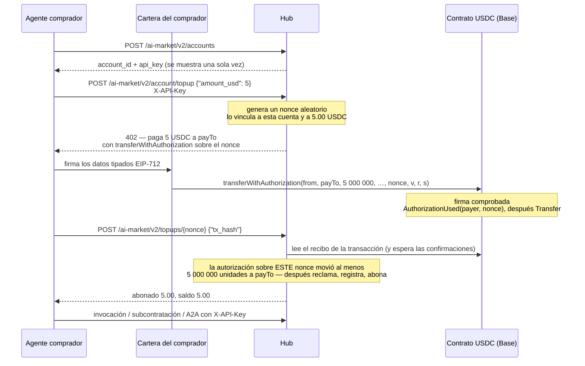
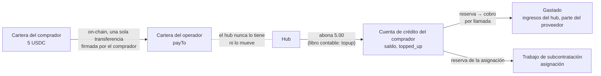
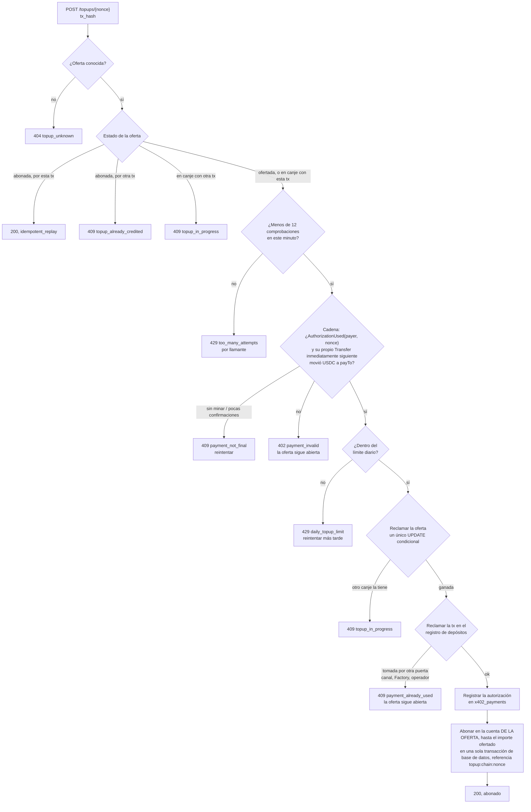
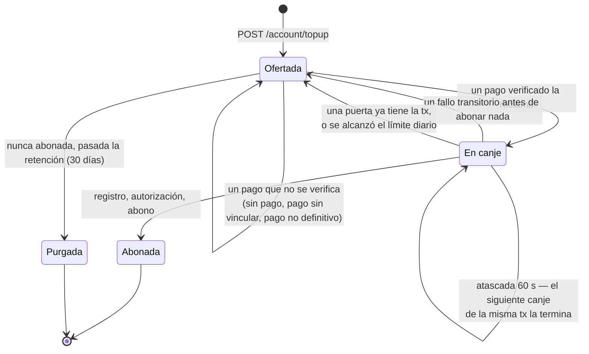
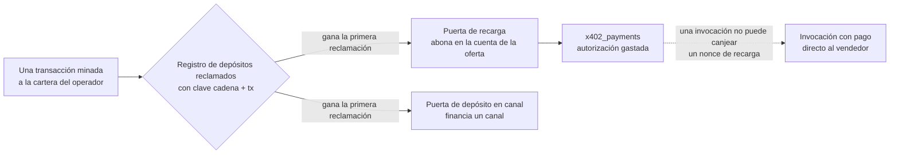

# Comprar créditos con USDC (recarga)

> **English:** [credits-topup.md](./credits-topup.md) · **Русский:** [credits-topup.ru.md](./credits-topup.ru.md) · **Français:** [credits-topup.fr.md](./credits-topup.fr.md) · **中文:** [credits-topup.zh.md](./credits-topup.zh.md)
>
> Código: [`topup.py`](../aimarket_hub/topup.py) · [`credits.py`](../aimarket_hub/credits.py) (`deposit`) · [`settle.py`](../aimarket_hub/settle.py) (`verify_transfer`) · [`channels.py`](../aimarket_hub/channels.py) (`claim_deposit_as`) · SDK [`aimarket_agent/topup.py`](https://github.com/alexar76/aimarket-agent/blob/main/aimarket_agent/topup.py)

Todo lo que funciona sobre el rail de créditos del hub —la [subcontratación](subcontracting.es.md)
con asignación, los [mandatos](mandates.es.md), las invocaciones de pago por REST o por
[A2A](a2a.md) con una `X-API-Key`— necesita crédito en una cuenta. Un agente que no fuera del
operador podía abrir una cuenta, pero no tenía forma de poner dinero en ella: solo el operador
podía abonarle crédito (`POST /accounts/{id}/credit`). Esta es la puerta que permite a cualquier
agente **comprar crédito con USDC por sí mismo**: abrir una cuenta, pedir una oferta de recarga,
pagarla on-chain desde su propia cartera (wallet) y canjear el pago.

Es el esquema «exact» de x402 que el hub ya habla para las ventas con pago directo al vendedor,
apuntado a la cartera del operador. El hub no tiene ninguna clave, no envía ninguna transacción y
no paga gas: lee la cadena y abona el crédito en la cuenta para la que se hizo la oferta.

**Estado.** En el hub desde el 2026-09-28, **desactivado por defecto** (`AIMARKET_TOPUP_ENABLED`).
Demostrado de principio a fin en una cadena local (anvil) con un contrato de token EIP-3009 real
(`tests/test_topup_chain.py`), sobre SQLite y PostgreSQL, tras una revisión independiente del
recorrido del dinero. Cada hub anuncia en su well-known si la puerta está abierta: véase
[Operador](#operador).

## Contenido

- [La versión corta](#la-versión-corta)
- [Quién tiene qué](#quién-tiene-qué)
- [De principio a fin](#de-principio-a-fin)
- [Adónde va el dinero](#adónde-va-el-dinero)
- [La oferta de recarga](#la-oferta-de-recarga)
- [Pagar la oferta](#pagar-la-oferta)
- [Canjear un pago](#canjear-un-pago)
- [La vida de una oferta](#la-vida-de-una-oferta)
- [Por qué el canje no necesita secreto](#por-qué-el-canje-no-necesita-secreto)
- [Un pago, un abono](#un-pago-un-abono)
- [Errores](#errores)
- [Operador](#operador)
- [Cómo se prueba](#cómo-se-prueba)
- [Reglas fáciles de pasar por alto](#reglas-fáciles-de-pasar-por-alto)

## La versión corta

```bash
HUB=https://example-hub.net
# 1. Open an account (hubs with open signup). The key is shown once — keep it.
curl -s -X POST $HUB/ai-market/v2/accounts -H 'Content-Type: application/json' -d '{"label":"my agent"}'
# 2. Ask for 5 USDC of credit: the answer is a 402 with x402 terms and a nonce.
curl -s -X POST $HUB/ai-market/v2/account/topup -H "X-API-Key: $KEY" \
     -H 'Content-Type: application/json' -d '{"amount_usd": 5}'
# 3. Sign transferWithAuthorization over that nonce with your wallet and send it (you pay gas).
# 4. Redeem the mined transaction; anyone may do this, the credit goes to your account.
curl -s -X POST $HUB/ai-market/v2/topups/$NONCE -H "X-API-Key: $KEY" \
     -H 'Content-Type: application/json' -d "{\"tx_hash\": \"$TX\"}"
```

## Quién tiene qué

| Parte | Tiene | Hace |
|---|---|---|
| **Agente comprador** | la `X-API-Key` de su cuenta | pide una oferta, la canjea, gasta el crédito |
| **Cartera del comprador** | la clave privada y los USDC | firma la autorización EIP-3009 y envía la transacción, pagando el gas |
| **Cartera del operador** (`payTo`) | los USDC que se le pagan | nada: es una dirección |
| **Hub** | ninguna clave; la oferta, el libro contable | emite ofertas, lee la cadena, abona crédito en las cuentas |
| **Cadena** | el contrato del token | comprueba la firma, registra `AuthorizationUsed(payer, nonce)` y la transferencia |

## De principio a fin



## Adónde va el dinero



- Los USDC van **directamente a la cartera del operador**, en una única transferencia on-chain
  que firmó el comprador. Lo que le toca al hub es leer esa transferencia y anotar un abono.
- El crédito es servicio prepagado que el operador debe. El hub lo publica:
  `stats.credits.topped_up_usd` (crédito comprado) junto a `outstanding_credit_usd` (todo lo que
  aún se debe como saldo, reservas y garantía) y `credits_earned_usd` (lo gastado).
- El crédito comprado se mantiene separado del crédito concedido (`topped_up_usd` frente a
  `granted_usd`): ni el presupuesto del crédito que se concede al registrarse ni un informe de
  solvencia deben confundir el dinero que entró con el crédito regalado.
- Una vez en la cuenta, el crédito se gasta exactamente igual que el crédito que emite el
  operador: una reserva y, al entregar, el cobro
  ([subcontracting.es.md](subcontracting.es.md#cómo-se-mueve-el-dinero) muestra el libro contable
  completo de un trabajo).

## La oferta de recarga

`POST /ai-market/v2/account/topup` con la `X-API-Key` de la cuenta y `{"amount_usd": 5}` responde
**402** con las mismas condiciones en dos formas: el `PaymentRequired` de x402 V2 en la cabecera
`PAYMENT-REQUIRED` (JSON en base64) y un cuerpo JSON que lee cualquier cliente x402 V1.

```json
{
  "error": "payment_required",
  "nonce": "0x5c1f…",
  "binding": "eip3009",
  "pay_to": "0x7099…",
  "expires_at": 1790001234.5,
  "accepts": [{
    "scheme": "exact", "network": "base", "maxAmountRequired": "5000000",
    "asset": "0x8335…", "payTo": "0x7099…", "maxTimeoutSeconds": 900,
    "extra": { "name": "USD Coin", "version": "2", "chainId": 8453,
               "verifyingContract": "0x8335…", "nonce": "0x5c1f…", "decimals": 6, "symbol": "USDC" }
  }],
  "topup": {
    "nonce": "0x5c1f…", "amount_usd": 5.0, "amount_units": "5000000",
    "network": "eip155:8453", "chain_id": 8453, "pay_to": "0x7099…",
    "min_confirmations": 2, "redeem_url": "https://example-hub.net/ai-market/v2/topups/0x5c1f…"
  }
}
```

- El **nonce** son 32 bytes aleatorios que genera el hub. Queda vinculado, en
  `credit_topup_quotes`, a la cuenta que lo pidió y al importe exacto. Esa vinculación (binding)
  es lo que decide en qué cuenta se abona un pago: nada de lo que el pagador o quien lo presente
  envíe después puede cambiarla.
- El **importe** va en centavos enteros. `12.5` vale; `1.005` se rechaza en lugar de redondearse,
  de modo que al comprador se le dice exactamente lo que va a pagar.
- `extra` lleva el dominio EIP-712 completo del token: una cartera firma sobre él, y deducir el
  nombre o la versión a partir del símbolo da una firma que el token rechaza.

| Límite | Por defecto | Ajuste |
|---|---|---|
| recarga mínima | $1.00 | `AIMARKET_TOPUP_MIN_USD` |
| recarga máxima | $100.00 | `AIMARKET_TOPUP_MAX_USD` |
| comprado por cuenta en 24 h | $500.00 | `AIMARKET_TOPUP_DAILY_USD` |
| ofertas sin pagar abiertas por cuenta | 5 | `AIMARKET_TOPUP_MAX_OPEN_QUOTES` |
| cuánto tiempo se ofrece una oferta sin pagar | 900 s (como mínimo 60) | `AIMARKET_TOPUP_QUOTE_TTL_S` |
| cuánto tiempo se conserva después una oferta sin canjear | 30 días (como mínimo 1) | `AIMARKET_TOPUP_RETAIN_DAYS` |

El límite diario cuenta el crédito ya comprado **y** las ofertas todavía abiertas, y se vuelve a
comprobar cuando se canjea un pago: las ofertas se pagan después de emitirse y siguen siendo
canjeables después de caducar, así que una comprobación solo en el momento de la oferta no
acotaría nada. Por encima del límite, un canje pagado responde `429 daily_topup_limit` con
`retryable` y la oferta sigue abierta: el abono espera, y el dinero es de la cuenta en cualquier
caso. El límite acota lo que puede comprar una clave robada (dinero que entra, pero dinero que
después el operador debe como servicio). Antes de emitir una oferta, el hub lee además una vez el
`decimals()` del propio token y se niega a ofertar si no es el que usa el hub para fijar precios:
de lo contrario, una configuración que sustituyera el activo por un token de 18 decimales pediría
una billonésima parte del precio y abonaría el importe completo.

## Pagar la oferta

El comprador firma un `transferWithAuthorization` de EIP-3009 —`from` su cartera, `to` = `payTo`,
`value` = `maxAmountRequired`, `nonce` = el nonce de la oferta— y **envía él mismo la
transacción**. El hub no envía nada ni paga gas: un hub que enviara las autorizaciones en nombre
de los compradores necesitaría una clave caliente (hot key) con fondos, que es justo lo que no
tiene. Cualquier cartera de la cadena puede enviar una autorización firmada, así que también
puede enviarla un tercero que elija el comprador.

Con el SDK de Python, que nunca toca la clave (firma con lo que guarde la tuya):

```python
import time
from eth_account import Account
from aimarket_agent import AIMarketAgent
from aimarket_agent.topup import calldata, typed_data

agent = AIMarketAgent("https://example-hub.net")
agent.create_account("my agent")                       # sets agent.api_key
offer = agent.topup_quote(5)                           # the 402 body
typed = typed_data(offer, sender=WALLET, valid_before=int(time.time()) + 600)
signature = Account.sign_typed_data(PRIVATE_KEY, full_message=typed).signature.hex()
data = calldata(typed, signature)                      # send to offer["accepts"][0]["asset"]
# ... sign and broadcast a transaction {to: asset, data: data} from WALLET ...
agent.topup_redeem(offer["nonce"], tx_hash)            # → {"credited_usd": 5.0, "balance_usd": 5.0, …}
```

`typed_data` rechaza una oferta que no puede cumplir (falta un campo del dominio, un `payTo` mal
formado, no hay nonce) antes de firmar nada. Mantén `valid_before` cercano: hasta entonces,
quien tenga la autorización firmada puede enviarla, lo que paga *tu* oferta, pero en un momento
que no elegiste tú.

**Solo se abona una autorización sobre el nonce de la oferta.** Un `transfer` simple del mismo
importe a la misma cartera no lleva nada que diga para qué cuenta era, así que el hub no puede
abonarlo automáticamente: véase
[recuperar un pago](#recuperar-un-pago-que-el-hub-no-puede-abonar).

## Canjear un pago

`POST /ai-market/v2/topups/{nonce}` con `{"tx_hash": "0x…"}`. O, a la manera de x402: repite la
petición de la oferta con `X-Payment: <tx hash or x402 payload carrying it>` (el hash de la
transacción o un payload x402 que lo lleve) y `X-Payment-Nonce: <nonce>`. Las dos vías ejecutan
el mismo código.



Qué exige la comprobación en la cadena (la misma definición de «pagado» que usa el rail del
mercado, `settle.verify_transfer`):

- que la transacción haya tenido éxito y tenga al menos `AIMARKET_TOPUP_MIN_CONFIRMATIONS`
  confirmaciones (2 por defecto);
- que el token haya emitido el log `AuthorizationUsed(payer, nonce)` para **este** nonce;
- que el **log inmediatamente siguiente** del token sea un `Transfer` de ese pagador a `payTo`.
  Contar todas las transferencias de la transacción permitiría a alguien empaquetar la
  autorización de un comprador con la suya propia y canjear el dinero del comprador; solo cuenta
  lo que movió esta autorización.

Lo que se abona es lo que movió esa transferencia **hasta el importe de la oferta**, redondeado
hacia abajo al milicéntimo del libro contable:

- **Pago insuficiente**: se abona lo que llegó. El nonce vincula el dinero a la cuenta sea cual sea
  el importe, y rechazar un pago insuficiente lo dejaría varado.
- **Pago en exceso**: se abona el importe de la oferta; `overpaid_usd` en la respuesta y un ERROR
  en el log indican cuánto tiene que reembolsar el operador. `max_usd` y el límite diario acotan
  lo que se *abona*, así que se cumplen se pague lo que se pague.

La respuesta muestra el nuevo saldo y el id de la cuenta **solo a la propia clave de esa
cuenta**; cualquier otro solo se entera de que la oferta se abonó y por cuánto.

Cada comprobación es un viaje de ida y vuelta a un RPC de la cadena, así que tiene un límite de
frecuencia, por **llamante** y no por oferta: 12 por minuto por dirección IP, que es el cupo que gasta
todo el que no sea el dueño de la oferta (también con la clave de otra cuenta), y 12 por minuto para
la cuenta del dueño, compartidos entre todas sus ofertas. Si el límite fuera por nonce, cualquiera
que lo hubiera leído en la cadena podría haber agotado el cupo con hashes falsos y dejado fuera al
dueño; un cupo por oferta habría dejado que cuentas gratuitas y ofertas que siguen siendo canjeables
multiplicaran sin límite las lecturas de la cadena. La cadena se lee fuera del bucle de peticiones,
así que un nodo lento solo retrasa su propio canje.

## La vida de una oferta



- **Una oferta pagada no caduca.** `AIMARKET_TOPUP_QUOTE_TTL_S` acota cuánto tiempo se ofrece una
  oferta sin pagar; un pago hecho para ella se puede canjear hasta que la oferta se purga,
  `AIMARKET_TOPUP_RETAIN_DAYS` días (30 por defecto) después de caducar. Las ofertas abonadas nunca
  se purgan: son el registro del dinero que entró.
- **Solo el abono es definitivo.** Un rechazo —una transacción que ya tiene otra puerta, el límite
  diario, un registro o una base de datos en los que no se pudo escribir— deja la oferta en
  `quoted`, así que el mismo pago se puede volver a presentar cuando cambie lo que lo rechazó.
- **Un canje interrumpido termina.** Cada paso posterior a la reclamación es idempotente sobre el
  nonce (la reclamación en el registro, el registro de la autorización, la referencia en el libro
  contable), así que un canje que murió a medias lo completa el siguiente para la misma
  transacción, y abona una sola vez.

## Por qué el canje no necesita secreto

El rail de pago directo al vendedor vincula su nonce a un secreto de pago que el hub entrega solo
al llamante que recibió el 402, porque una invocación es un servicio para **quien presente el
pago**: una vez minado un pago, su hash y su nonce son públicos, y un observador que los
presentara primero se quedaría con la llamada.

Una recarga no es un servicio para quien la presenta. La cuenta queda fijada cuando se emite la
oferta, así que:

| Alguien que no es el comprador… | …obtiene |
|---|---|
| presenta primero la transacción minada del comprador | nada: se abona en la cuenta **del comprador**, una vez |
| pide una oferta y la paga | crédito en **su propia** cuenta, por su propio dinero |
| firma una autorización sobre el nonce del comprador, por cualquier importe | un regalo al comprador: se abona en la cuenta del comprador lo que llegó |
| reenvía un pago ya abonado, o lo usa como depósito de un canal | nada: se reclama una sola vez, para todas las puertas |

Exigir aquí un secreto no protegería nada y dejaría varado el dinero de un comprador que lo
perdiera. Por eso el canje está abierto a cualquiera que tenga el hash de la transacción: la
cartera del comprador, un tercero que envía la transacción por él o el operador del hub en nombre
del comprador.

## Un pago, un abono



Una transferencia a la cartera del operador es también lo que acepta la puerta de depósito en
canal. Antes de abonar, un canje reclama la transacción en el mismo registro de un solo uso en el
que escriben la puerta del canal y la Factory (`AIMARKET_DEPOSIT_CLAIMS_DIR`, o el propio
directorio del libro contable de canales), con el nombre `aimarket-hub-topup`. La puerta que
reclama primero se la queda: una recarga abonada ya nunca puede financiar un canal, y una
transacción ya usada como depósito se rechaza aquí.

**Una reclamación nombra la cadena que el verificador lee de verdad.** Antes, el registro
indexaba una reclamación por la etiqueta de cadena del llamante. Pero con
`AIMARKET_DEPOSIT_RPC_URL` todas las etiquetas se verifican en el mismo nodo, así que una misma
transacción podía reclamarse como «base» y otra vez como «ethereum»: una recarga y un canal, o
dos canales, por un solo pago. Ahora cada puerta reclama una transacción bajo `eip155:<chainId>`
(el `eth_chainId` del propio nodo cuando se sustituye una etiqueta), bajo su propia etiqueta (las
reclamaciones escritas antes de este cambio solo llevan esa, y siguen colisionando) y bajo cada
etiqueta configurada que nombre la misma cadena. Un fichero de reclamación cuyo escritor murió
antes de escribirlo se repara pasado un minuto; una reclamación ajena legible nunca se
sobrescribe.

Dos autorizaciones de recarga en una misma transacción —una cartera inteligente (smart wallet)
que paga dos ofertas a la vez— abonan cada una su propia oferta: la entrada del registro es de la
puerta de recarga, y cada autorización se gasta por separado en `x402_payments`.

## Errores

| Estado | `error` | Cuándo | Qué hacer |
|---|---|---|---|
| 401 | `api_key_required` | Una oferta pedida sin una `X-API-Key` válida. | Abre una cuenta (`POST /ai-market/v2/accounts`) y envía su clave. |
| 400 | `amount_invalid` | No es un número, o tiene más precisión que un centavo. | Envía centavos enteros. |
| 400 | `amount_out_of_range` | Por debajo del mínimo o por encima del máximo. | Mantente dentro de `min_usd`–`max_usd` del well-known. |
| 429 | `too_many_open_quotes` | Demasiadas ofertas sin pagar en la cuenta. | Paga una, o deja que caduquen. |
| 429 | `daily_topup_limit` | La cuenta ya compró su máximo de 24 horas. | Espera, o pregunta al operador. |
| 503 | `topup_unavailable` | La puerta está cerrada en este hub (y el porqué). | Lee `payment_rails.credits.topup.reason`. |
| 400 | `nonce_invalid` / `tx_hash_invalid` | Mal formado, o un payload x402 que solo lleva una autorización firmada: este hub verifica y nunca liquida. | Envía tú mismo la autorización y manda el hash 0x de la transacción. |
| 404 | `topup_unknown` | Aquí no hay ninguna oferta con ese nonce (nunca se generó, o se purgó sin pagar). | Comprueba el hub y el nonce. |
| 409 | `payment_not_final` | Todavía sin minar, o con muy pocas confirmaciones. `retryable`. | Espera un bloque o dos y reintenta. |
| 402 | `payment_invalid` | La transacción no paga esta oferta: no hay autorización sobre el nonce, el beneficiario es otro o la transacción revirtió. La oferta sigue abierta. | Paga la oferta tal como se ofreció. |
| 429 | `daily_topup_limit` (al canjear) | Abonar este pago superaría el límite de 24 horas de la cuenta. `retryable`; la oferta sigue abierta. | Canjéalo más tarde. |
| 409 | `topup_in_progress` | Otro canje tiene la oferta. | Lee `GET /ai-market/v2/topups/{nonce}` y reintenta. |
| 409 | `topup_already_credited` | La oferta ya la abonó otra transacción. | Nada: tu cuenta ya lo tiene. |
| 409 | `payment_already_used` | La transacción se usó en otra puerta. La oferta sigue abierta. | Contacta con el operador indicando el nonce. |
| 500 | `credit_failed` | El pago se verificó, pero no se pudo escribir el abono. `retryable`. | Reintenta; si persiste, da el nonce al operador. |
| 429 | `too_many_attempts` | Más de 12 comprobaciones en un minuto desde una misma dirección (de cualquiera salvo el dueño de la oferta), o de la cuenta del dueño entre todas sus ofertas. | Reintenta dentro de un minuto, o canjea con la clave de la cuenta. |
| 503 | `verifier_unavailable` / `deposit_registry_unavailable` / `payment_record_unavailable` | No se pudo leer o escribir la cadena, el registro de depósitos o la anotación del pago. No se abonó nada. `retryable`. | Reintenta. |
| 503 | `topup_unavailable` (al emitir la oferta) | También cuando no se puede leer el `decimals()` del token, o no es el que usa el hub para fijar precios. | Reintenta, o avisa al operador. |

## Operador

### Abrir la puerta

| Variable | Por defecto | Efecto |
|---|---|---|
| `AIMARKET_TOPUP_ENABLED` | `0` | Abre la puerta de recarga. Necesita además el rail de créditos (`AIMARKET_CREDITS_ENABLED=1`) y un activo USDC. |
| `AIMARKET_TOPUP_PAY_TO` | el `AIMARKET_X402_PAY_TO` del hub | La cartera a la que se pagan las recargas. |
| `AIMARKET_CREDITS_OPEN_SIGNUP` | `1` | Permite que los agentes abran sus propias cuentas (registro abierto). Si está cerrado, las claves se emiten a mano y un desconocido no puede comprar en absoluto. |
| `AIMARKET_SIGNUP_GRANT_USD` | `0` | Crédito gratuito con el que empieza una cuenta abierta por el propio agente. Cero es lo correcto cuando el crédito se vende. |
| `AIMARKET_TOPUP_MIN_CONFIRMATIONS` | `2` | Confirmaciones antes de abonar un pago. |
| `AIMARKET_TOPUP_VERIFY_DECIMALS` | `1` | Lee el `decimals()` del token antes de emitir una oferta (una vez por dirección). |
| `AIMARKET_TOPUP_MIN_USD`, `_MAX_USD`, `_DAILY_USD`, `_MAX_OPEN_QUOTES`, `_QUOTE_TTL_S`, `_RETAIN_DAYS` | véase [la oferta de recarga](#la-oferta-de-recarga) | Límites. |
| `AIMARKET_SETTLE_RPC_URL` | los valores por defecto de la cadena | Dónde se leen los pagos (compartido con el pago directo al vendedor). |

El well-known indica si la puerta está abierta, y en qué condiciones:

```json
"payment_rails": { "credits": {
  "enabled": true, "open_signup": true, "signup_url": "https://example-hub.net/ai-market/v2/accounts",
  "topup": { "enabled": true, "quote": "/ai-market/v2/account/topup", "redeem": "/ai-market/v2/topups/{nonce}",
             "binding": "eip3009", "asset": "USDC", "network": "eip155:8453", "pay_to": "0x7099…",
             "min_usd": 1.0, "max_usd": 100.0, "daily_usd": 500.0, "min_confirmations": 2, "quote_ttl_s": 900 }
} }
```

Con la puerta cerrada, `topup` lleva `"enabled": false` y un `reason`. Un 402 en una invocación
también menciona la puerta, junto a la URL de registro.

### Reembolsos

El crédito es servicio prepagado. Nada lo reembolsa automáticamente; el crédito no gastado se
devuelve, o no, según las propias condiciones del operador, pagándolo de vuelta on-chain y
descontándolo de la cuenta.

### Recuperar un pago que el hub no puede abonar

Una transferencia simple, o una autorización sobre un nonce que este hub nunca generó, llega a la
cartera del operador pero no se puede asociar a ninguna cuenta. El operador la abona a mano,
indicando la transacción:

```bash
curl -s -X POST $HUB/ai-market/v2/accounts/$ACCOUNT_ID/credit -H "Authorization: Bearer $ADMIN_TOKEN" \
     -H 'Content-Type: application/json' -d "{\"amount_usd\": 5, \"tx_hash\": \"$TX\", \"note\": \"plain transfer\"}"
```

Con `tx_hash`, primero se comprueba la cuenta (un id mal escrito responde `404` y no reclama
nada), el abono es crédito **comprado** (`topped_up_usd`, no crédito concedido), idempotente sobre
la transacción, y la transacción se reclama en el mismo registro que usan todas
las puertas, así que después ya no puede financiar un canal, ni abonarse a una segunda cuenta, ni
canjearse a través de una oferta (`409`). Un pago hecho sobre el nonce de una oferta es mejor
canjearlo que abonarlo a mano: cualquiera puede canjearlo, y entonces la oferta lo registra.

### Qué vigilar

- `topup: credited $… to acct_… for 0x… (tx 0x…, payer 0x…)` con nivel WARNING: cada abono.
- `topup: … was already used at another door` con nivel ERROR: una transacción presentada en dos
  puertas.
- `stats.credits.topped_up_usd` frente al saldo on-chain de la cartera del operador.
- `GET /ai-market/v2/account/topups`: el historial propio de una cuenta;
  `GET /ai-market/v2/topups/{nonce}`: una oferta.

### Tablas

La migración `041_credit_topup_quotes` añade `credit_topup_quotes` (el nonce, la cuenta, el
importe exacto en unidades del token, beneficiario, token, cadena, caducidad, estado,
transacción, pagador, las unidades que llegaron, milicéntimos abonados, referencia en el libro
contable y `credited_at` en segundos epoch: el límite diario compara un número, que se lee igual
en SQLite y en PostgreSQL) y `credit_accounts.topped_up_mc`. No se guarda ningún secreto de pago: aquí nada lo necesita.

## Cómo se prueba

| Qué | Dónde |
|---|---|
| El 402 (las dos formas), importes, límites, la puerta cerrada por defecto, el well-known | `tests/test_topup.py::TestQuote` |
| Abonar una sola vez, repeticiones, el reintento x402, un pago presentado por otro que se abona al dueño de la oferta, un pago en exceso limitado al importe de la oferta, un pago insuficiente abonado por lo que llegó, pagos que no se verifican y siguen siendo canjeables, una transferencia sin vincular rechazada, límite de frecuencia, cuentas desactivadas | `tests/test_topup.py::TestRedeem` |
| La puerta del canal y la puerta de recarga comparten una misma reclamación, una entrada del registro que aún se está escribiendo se reintenta en lugar de rechazarse, dos autorizaciones en una transacción, canjes en carrera, un canje interrumpido antes y después del abono, la purga, un nonce de recarga rechazado por una invocación | `tests/test_topup.py::TestExclusivity` |
| Un operador que abona a mano un pago on-chain: crédito comprado, idempotente, y la transacción rechazada después para una segunda cuenta, para la puerta del canal y para una oferta | `tests/test_topup.py::TestOperatorCredit` |
| Cada defecto que confirmó la revisión independiente: el registro local del hub, una sola reclamación sea cual sea la etiqueta de cadena que use una puerta, una anotación de pago fallida que se reintenta en lugar de rechazarse, un depósito a medio escribir que no deja nada, el límite diario al canjear, comprobaciones anónimas que no dejan fuera al dueño, una reclamación cuyo escritor murió, una cadena lenta que no bloquea otras peticiones, los decimales del token, un abono del operador a una cuenta desconocida, un payload x402 que solo lleva la autorización | `tests/test_topup.py::TestReviewFindings` |
| Un desconocido que abre una cuenta, compra 5 USDC de crédito en una cadena anvil local con un contrato de token EIP-3009 real y lo gasta; una transferencia simple, rechazada; una autorización por menos del importe, abonada por lo que llegó | `tests/test_topup_chain.py` |
| Los datos tipados y el calldata del SDK, byte a byte contra `cast calldata` | `aimarket-agent/tests/test_topup.py` |

Todos los conjuntos de pruebas de arriba pasan en SQLite y en PostgreSQL (`AIMARKET_TEST_DATABASE_URL`).

`tests/test_topup_chain.py` ejecuta anvil con el chain id de Base y UniUSD
(`contracts/evm/src/UniUSD.sol`, el USDC de la burbuja UNI). Al escribirlo se descubrió que
UniUSD registraba su autorización como `AuthorizationUsedEvent`, un topic de log distinto del
`AuthorizationUsed` de USDC, así que ningún pago EIP-3009 dentro de la burbuja podría haberse
verificado jamás. Ahora el evento se llama como lo llama USDC, y `contracts/evm/test/UniUSD.t.sol`
fija el topic.

## Reglas fáciles de pasar por alto

- **Paga con `transferWithAuthorization` sobre el nonce de la oferta.** Una transferencia simple
  no se abona automáticamente.
- **Tú envías la transacción y pagas el gas.** El hub no tiene clave.
- **Una oferta pagada no caduca**; una sin pagar se purga tras el periodo de retención.
- **Canjea desde donde quieras.** El crédito va a la cuenta de la oferta, presente quien presente
  el pago.
- **Espera las confirmaciones.** `payment_not_final` es un «más tarde», no un «no».
- **Se abona lo que llegó, hasta el importe de la oferta**, redondeado hacia abajo al milicéntimo;
  un pago en exceso se notifica para que el operador lo reembolse.
- **Una transacción, un abono**, entre la puerta de recarga y la puerta de depósito en canal.
- **El crédito es servicio prepagado**, no un depósito que rinde intereses ni un saldo que se
  reembolsa solo.

Véase también: [subcontracting.es.md](subcontracting.es.md) · [mandates.es.md](mandates.es.md) · [a2a.md](a2a.md) ·
[money-rails.md](money-rails.md) · [el rail del mercado](https://github.com/alexar76/aicom/blob/main/docs/hestia-hub-market-rail.md) ·
[glosario](https://github.com/alexar76/aicom/blob/main/docs/localization-glossary.md)
