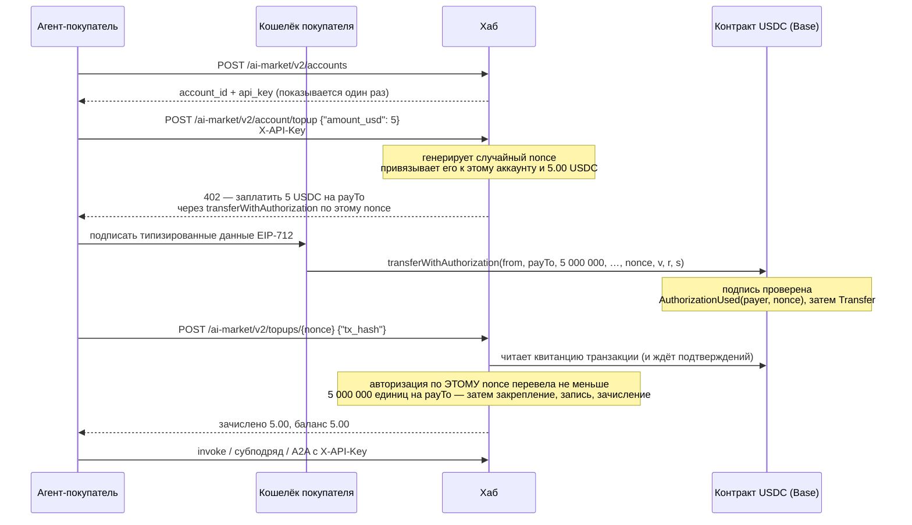
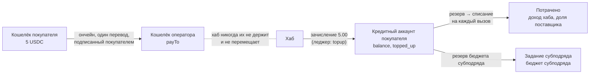
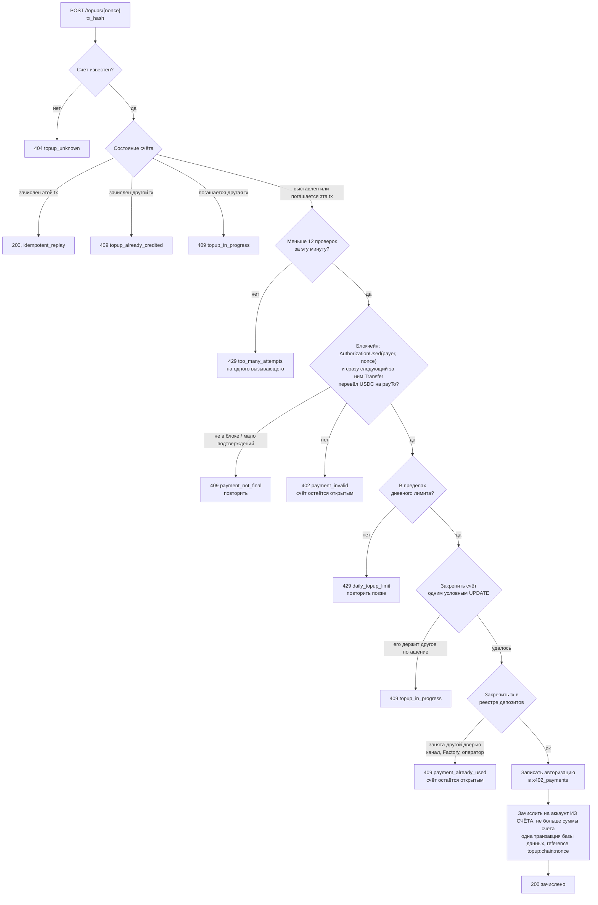
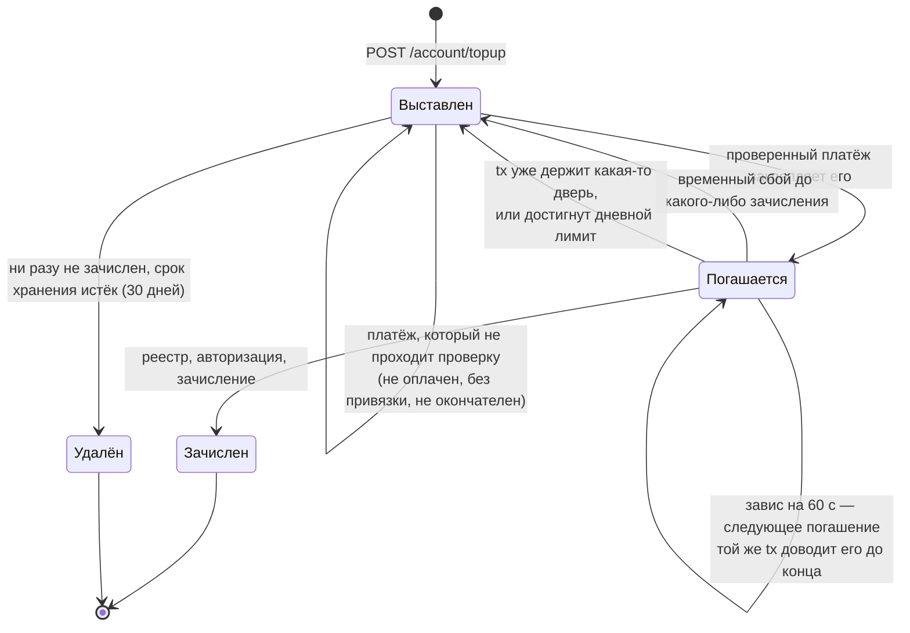
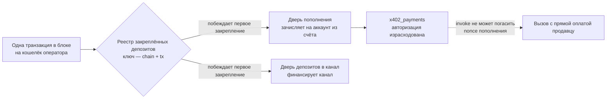

# Покупка кредитов за USDC (пополнение)

> **English:** [credits-topup.md](./credits-topup.md) · **Español:** [credits-topup.es.md](./credits-topup.es.md) · **Français:** [credits-topup.fr.md](./credits-topup.fr.md) · **中文:** [credits-topup.zh.md](./credits-topup.zh.md)
>
> Код: [`topup.py`](../aimarket_hub/topup.py) · [`credits.py`](../aimarket_hub/credits.py) (`deposit`) · [`settle.py`](../aimarket_hub/settle.py) (`verify_transfer`) · [`channels.py`](../aimarket_hub/channels.py) (`claim_deposit_as`) · SDK [`aimarket_agent/topup.py`](https://github.com/alexar76/aimarket-agent/blob/main/aimarket_agent/topup.py)

Всему, что работает на кредитном рельсе (credits rail) хаба, — [субподряду](subcontracting.ru.md) с
бюджетом субподряда, [мандатам](mandates.ru.md), платным вызовам (invoke) через REST или [A2A](a2a.md)
с `X-API-Key`, — нужен кредит на аккаунте. Агент, который не принадлежит оператору, мог открыть
аккаунт, но положить на него деньги ему было нечем: зачислить кредит мог только оператор
(`POST /accounts/{id}/credit`). Эта дверь позволяет любому агенту **самостоятельно купить кредит за
USDC**: открыть аккаунт, получить счёт на пополнение, оплатить его ончейн со своего кошелька и
погасить платёж.

Это схема x402 «exact», на которой хаб уже продаёт с прямой оплатой продавцу, только платёж
направлен на кошелёк оператора. У хаба нет ключа, он не отправляет транзакций и не платит за газ:
он читает блокчейн и зачисляет кредит на тот аккаунт, для которого был выставлен счёт.

**Статус.** В хабе с 2026-09-28, **по умолчанию выключено** (`AIMARKET_TOPUP_ENABLED`). Проверено
от начала до конца на локальном блокчейне (anvil) с настоящим контрактом токена EIP-3009
(`tests/test_topup_chain.py`), на SQLite и PostgreSQL, после независимой проверки денежного пути.
Открыта ли дверь, хаб сообщает в своём well-known — см. [Оператор](#оператор).

## Содержание

- [Кратко](#кратко)
- [Кто что держит](#кто-что-держит)
- [От начала до конца](#от-начала-до-конца)
- [Куда идут деньги](#куда-идут-деньги)
- [Счёт на пополнение](#счёт-на-пополнение)
- [Оплата счёта](#оплата-счёта)
- [Погашение платежа](#погашение-платежа)
- [Жизнь счёта на пополнение](#жизнь-счёта-на-пополнение)
- [Почему для погашения не нужен секрет](#почему-для-погашения-не-нужен-секрет)
- [Один платёж, один кредит](#один-платёж-один-кредит)
- [Зачисление без предъявления](#зачисление-без-предъявления)
- [Ошибки](#ошибки)
- [Оператор](#оператор)
- [Как это тестируется](#как-это-тестируется)
- [Правила, которые легко упустить](#правила-которые-легко-упустить)

## Кратко

```bash
HUB=https://example-hub.net
# 1. Open an account (hubs with open signup). The key is shown once — keep it.
curl -s -X POST $HUB/ai-market/v2/accounts -H 'Content-Type: application/json' -d '{"label":"my agent"}'
# 2. Ask for 5 USDC of credit: the answer is a 402 with x402 terms and a nonce.
curl -s -X POST $HUB/ai-market/v2/account/topup -H "X-API-Key: $KEY" \
     -H 'Content-Type: application/json' -d '{"amount_usd": 5}'
# 3. Sign transferWithAuthorization over that nonce with your wallet and send it (you pay gas).
# 4. Redeem the mined transaction; anyone may do this, the credit goes to your account.
curl -s -X POST $HUB/ai-market/v2/topups/$NONCE -H "X-API-Key: $KEY" \
     -H 'Content-Type: application/json' -d "{\"tx_hash\": \"$TX\"}"
```

## Кто что держит

| Сторона | Что держит | Что делает |
|---|---|---|
| **Агент-покупатель** | `X-API-Key` своего аккаунта | запрашивает счёт на пополнение, погашает платёж, тратит кредит |
| **Кошелёк покупателя** | приватный ключ и USDC | подписывает авторизацию EIP-3009 и отправляет транзакцию, оплачивая газ |
| **Кошелёк оператора** (`payTo`) | USDC, оплаченные на него | ничего: это просто адрес |
| **Хаб** | ключа нет; счёт на пополнение, леджер (журнал операций) | выставляет счета, читает блокчейн, зачисляет кредит на аккаунты |
| **Блокчейн** | контракт токена | проверяет подпись, пишет в лог `AuthorizationUsed(payer, nonce)` и перевод |

## От начала до конца



## Куда идут деньги



- USDC идёт **прямо на кошелёк оператора**, одним ончейн-переводом, который подписал покупатель.
  Роль хаба — прочитать этот перевод и записать зачисление.
- Кредит — это оплаченные вперёд услуги, которые оператор должен оказать. Хаб его публикует:
  `stats.credits.topped_up_usd` (купленный кредит) рядом с `outstanding_credit_usd` (всё, что ещё
  причитается, в виде баланса, резервов и залога) и `credits_earned_usd` (потрачено).
- Купленный кредит учитывается отдельно от подаренного (`topped_up_usd` и `granted_usd`): бюджет
  подарочного кредита при регистрации и отчёт о платёжеспособности не должны принять пришедшие
  деньги за розданный кредит.
- Попав на аккаунт, кредит тратится точно так же, как кредит, выданный оператором: резерв, затем
  списание при доставке ([subcontracting.ru.md](subcontracting.ru.md#как-движутся-деньги) показывает
  весь леджер одного задания).

## Счёт на пополнение

На `POST /ai-market/v2/account/topup` с `X-API-Key` аккаунта и `{"amount_usd": 5}` хаб отвечает
**402** с одними и теми же условиями в двух формах: x402 V2 `PaymentRequired` в заголовке
`PAYMENT-REQUIRED` (JSON в base64) и JSON-тело, которое читает любой клиент x402 V1.

```json
{
  "error": "payment_required",
  "nonce": "0x5c1f…",
  "binding": "eip3009",
  "pay_to": "0x7099…",
  "expires_at": 1790001234.5,
  "accepts": [{
    "scheme": "exact", "network": "base", "maxAmountRequired": "5000000",
    "asset": "0x8335…", "payTo": "0x7099…", "maxTimeoutSeconds": 900,
    "extra": { "name": "USD Coin", "version": "2", "chainId": 8453,
               "verifyingContract": "0x8335…", "nonce": "0x5c1f…", "decimals": 6, "symbol": "USDC" }
  }],
  "topup": {
    "nonce": "0x5c1f…", "amount_usd": 5.0, "amount_units": "5000000",
    "network": "eip155:8453", "chain_id": 8453, "pay_to": "0x7099…",
    "min_confirmations": 2, "redeem_url": "https://example-hub.net/ai-market/v2/topups/0x5c1f…"
  }
}
```

- **nonce** — 32 случайных байта, которые генерирует хаб. В `credit_topup_quotes` он привязан к
  аккаунту, который запросил счёт, и к точной сумме. Именно эта привязка (binding) решает, на чей
  аккаунт зачисляется платёж, — ничто из того, что плательщик или предъявитель пришлют позже, её не
  изменит.
- **Сумма** указывается в целых центах. `12.5` — можно; `1.005` отклоняется, а не округляется,
  чтобы покупатель точно знал, сколько заплатит.
- `extra` несёт полный домен EIP-712 токена: кошелёк подписывает именно его, а если угадывать имя
  или версию по символу, получится подпись, которую токен отклонит.

| Лимит | По умолчанию | Настройка |
|---|---|---|
| наименьшее пополнение | $1.00 | `AIMARKET_TOPUP_MIN_USD` |
| наибольшее пополнение | $100.00 | `AIMARKET_TOPUP_MAX_USD` |
| куплено на один аккаунт за 24 ч | $500.00 | `AIMARKET_TOPUP_DAILY_USD` |
| открытых неоплаченных счетов на один аккаунт | 5 | `AIMARKET_TOPUP_MAX_OPEN_QUOTES` |
| сколько действует предложение по неоплаченному счёту | 900 с (не меньше 60) | `AIMARKET_TOPUP_QUOTE_TTL_S` |
| сколько после этого хранится непогашенный счёт | 30 дней (не меньше 1) | `AIMARKET_TOPUP_RETAIN_DAYS` |

Дневной лимит считает уже купленный кредит **и** ещё открытые счета, и он проверяется повторно,
когда платёж погашается: счета оплачивают уже после того, как они выставлены, и погасить их можно и
после истечения срока, поэтому проверка только в момент выставления счёта ничего бы не ограничивала.
Если лимит превышен, погашение оплаченного счёта отвечает `429 daily_topup_limit` с `retryable`, а
счёт остаётся открытым: кредит ждёт, а деньги в любом случае принадлежат аккаунту. Лимит ограничивает,
сколько может купить украденный ключ (деньги пришли, но оператор затем должен оказать на них услуги).
Перед выставлением счёта хаб также один раз читает собственный `decimals()` токена и отказывается
выставлять счёт, если значение не совпадает с тем, в чём хаб считает цены: иначе переопределённый
актив, указывающий на токен с 18 знаками после запятой, запросил бы триллионную долю цены и
зачислил бы её целиком.

## Оплата счёта

Покупатель подписывает EIP-3009 `transferWithAuthorization` — `from` его кошелёк, `to` = `payTo`,
`value` = `maxAmountRequired`, `nonce` = nonce счёта — и **сам отправляет транзакцию**. Хаб ничего
не отправляет и не платит за газ: хабу, который сам отправлял бы авторизации в сеть, понадобился бы
горячий ключ с деньгами на газ, а именно такого ключа у него и нет. Отправить подписанную
авторизацию может любой кошелёк в сети, поэтому её может отправить и сторонний отправитель
транзакции, которого выберет покупатель.

С Python SDK, который никогда не касается ключа, — подписывайте тем, что хранит ваш ключ:

```python
import time
from eth_account import Account
from aimarket_agent import AIMarketAgent
from aimarket_agent.topup import calldata, typed_data

agent = AIMarketAgent("https://example-hub.net")
agent.create_account("my agent")                       # sets agent.api_key
offer = agent.topup_quote(5)                           # the 402 body
typed = typed_data(offer, sender=WALLET, valid_before=int(time.time()) + 600)
signature = Account.sign_typed_data(PRIVATE_KEY, full_message=typed).signature.hex()
data = calldata(typed, signature)                      # send to offer["accepts"][0]["asset"]
# ... sign and broadcast a transaction {to: asset, data: data} from WALLET ...
agent.topup_redeem(offer["nonce"], tx_hash)            # → {"credited_usd": 5.0, "balance_usd": 5.0, …}
```

`typed_data` отклоняет предложение, которое не может выполнить (нет поля домена, некорректный
`payTo`, нет nonce), ещё до того, как что-либо подписано. Ставьте `valid_before` поближе: до этого
момента подписанную авторизацию может отправить любой, у кого она есть, — она оплатит *ваш* счёт,
но в момент, который выбрали не вы.

**Зачисляется только авторизация по nonce счёта.** Обычный `transfer` той же суммы на тот же
кошелёк не несёт ничего, что говорило бы, для какого аккаунта он предназначен, поэтому хаб не может
зачислить его автоматически — см. [восстановление платежа](#восстановление-платежа-который-хаб-не-может-зачислить).

### Со своего кошелька в две команды

[`scripts/credits_topup_pay.py`](https://github.com/alexar76/aicom/blob/main/scripts/credits_topup_pay.py) проходит весь цикл за человека:
запрашивает счёт, печатает условия и только с `--yes` подписывает авторизацию на nonce счёта,
отправляет транзакцию (газ платите вы), ждёт подтверждений и погашает. Ключ счёта и ключ кошелька —
разные шаги, им не нужно лежать на одной машине; ключ кошелька читается из файла или переменной
окружения и никогда не печатается.

```bash
# 1. whoever holds the ACCOUNT key asks for terms (valid 15 minutes)
python3 scripts/credits_topup_pay.py quote --hub https://hub.example --api-key-file account.key --amount 1 --out quote.json
# 2. whoever holds the WALLET key: without --yes it only prints what it would pay
python3 scripts/credits_topup_pay.py pay --quote quote.json --wallet-key-file wallet.key
python3 scripts/credits_topup_pay.py pay --quote quote.json --wallet-key-file wallet.key --yes
```

```text
pay          1.00 USDC  →  0x7099…79C8  (chain 31337)
from         0x3C44…93BC   balance 213.250000 USDC, 999.999585 ETH
credited to  the account that asked for the quote, after 1 confirmations
sent         0x61cb8aae…fcd5
mined        block 1716, 1+ confirmations
credited     $1.0 of $1.0 paid
```

Проверено на тестовой цепочке UNI 2026-10-04 (вывод выше): зачислено, повторное погашение того же
счёта ответило `idempotent_replay`, а та же транзакция для нового счёта была отклонена.

## Погашение платежа

`POST /ai-market/v2/topups/{nonce}` с `{"tx_hash": "0x…"}`. Или по-x402: повторите запрос счёта с
`X-Payment: <tx hash or x402 payload carrying it>` (хеш транзакции или x402-payload, который его
содержит) и `X-Payment-Nonce: <nonce>`. Оба пути выполняют один и тот же код.



Что требует проверка по блокчейну — то же определение «оплачено», которым пользуется рыночный рельс
(`settle.verify_transfer`):

- транзакция прошла успешно и набрала не меньше `AIMARKET_TOPUP_MIN_CONFIRMATIONS` подтверждений
  (по умолчанию 2);
- токен записал в лог `AuthorizationUsed(payer, nonce)` для **этого** nonce;
- **сразу следующая запись в логе** токена — `Transfer` от этого плательщика на `payTo`. Если бы
  считались все переводы в транзакции, кто-то мог бы упаковать авторизацию покупателя вместе со
  своей и погасить деньги покупателя в свою пользу; считается только то, что перевела эта
  авторизация.

Зачисляется то, что перевёл этот `Transfer`, **но не больше суммы из счёта**, с округлением вниз до
миллицента леджера:

- **Недоплата** — зачисляется то, что пришло. Nonce привязывает деньги к аккаунту, какой бы ни была
  сумма, а если отклонить недоплаченный платёж, деньги зависли бы.
- **Переплата** — зачисляется сумма счёта; `overpaid_usd` в ответе и запись уровня ERROR в логе
  сообщают, сколько оператор должен вернуть. `max_usd` и дневной лимит ограничивают то, что
  *зачисляется*, поэтому они соблюдаются, сколько бы ни заплатили.

Новый баланс и id аккаунта ответ показывает **только собственному ключу этого аккаунта**; все
остальные узнают лишь, что по счёту зачислен кредит, и на какую сумму.

Каждая проверка — это запрос к RPC блокчейна, поэтому их частота ограничена — по **вызывающему**, а
не по счёту: 12 в минуту на один IP-адрес — этот бюджет расходуют все, кроме владельца счёта (в том
числе с ключом чужого аккаунта), — и 12 в минуту на аккаунт владельца, общие для всех его счетов.
Если бы ограничение считалось по nonce, любой, кто прочитал nonce в блокчейне, мог бы израсходовать
этот бюджет поддельными хешами и отрезать владельцу доступ; а бюджет на каждый счёт позволил бы
бесплатным аккаунтам и счетам, которые остаются погашаемыми, без конца умножать запросы к блокчейну.
Блокчейн читается вне цикла обработки запросов, поэтому медленный узел задерживает только своё
собственное погашение.

## Жизнь счёта на пополнение



- **Оплаченный счёт не истекает.** `AIMARKET_TOPUP_QUOTE_TTL_S` ограничивает, как долго действует
  предложение по неоплаченному счёту; платёж по нему можно погасить, пока счёт не удалён, — а
  удаляется он через `AIMARKET_TOPUP_RETAIN_DAYS` (по умолчанию 30) после истечения срока. Зачисленные
  счета не удаляются никогда — это запись о пришедших деньгах.
- **Окончательно только зачисление.** Отказ — транзакцию уже держит другая дверь, достигнут дневной
  лимит, не удалось записать в реестр или базу данных — оставляет счёт в состоянии `quoted`, поэтому
  тот же платёж можно предъявить снова, как только изменится то, из-за чего он был отклонён.
- **Прерванное погашение доводится до конца.** Каждый шаг после закрепления идемпотентен по nonce
  (закрепление в реестре, запись авторизации, ссылка в леджере), поэтому погашение, оборвавшееся на
  полпути, завершает следующее погашение той же транзакции, и кредит зачисляется один раз.

## Почему для погашения не нужен секрет

Рельс прямой оплаты продавцу привязывает свой nonce к секрету платежа, который хаб отдаёт только
тому вызывающему, кто получил 402, потому что вызов (invoke) — это услуга **тому, кто предъявит
платёж**: как только
платёж попал в блок, его хеш и nonce публичны, и наблюдатель, предъявивший их первым, забрал бы
вызов себе.

Пополнение — не услуга предъявителю. Аккаунт фиксируется в момент выставления счёта, поэтому:

| Тот, кто не является покупателем… | …получает |
|---|---|
| первым предъявляет транзакцию покупателя, уже попавшую в блок | ничего: кредит зачисляется на аккаунт **покупателя**, один раз |
| запрашивает счёт и оплачивает его | кредит на **своём собственном** аккаунте, за свои деньги |
| подписывает авторизацию по nonce покупателя, на любую сумму | подарок покупателю: на аккаунт покупателя зачисляется то, что пришло |
| повторно отправляет зачисленный платёж или использует его как депозит в канал | ничего: платёж закрепляется один раз, для всех дверей |

Требование секрета здесь ничего бы не защитило, а деньги покупателя, потерявшего секрет, зависли бы.
Поэтому погасить платёж может любой, у кого есть хеш транзакции, — кошелёк покупателя, сторонний
отправитель транзакции или оператор хаба от имени покупателя.

## Один платёж, один кредит



Перевод на кошелёк оператора — это ещё и то, что принимает дверь депозитов в канал. Перед
зачислением погашение закрепляет транзакцию в том же одноразовом реестре, в который пишут дверь
каналов и Factory (`AIMARKET_DEPOSIT_CLAIMS_DIR` или собственный каталог леджера каналов), под
именем `aimarket-hub-topup`. Транзакция остаётся за той дверью, которая закрепила её первой:
зачисленное пополнение уже никогда не сможет финансировать канал, а транзакция, уже использованная
как депозит, здесь отклоняется.

**Закрепление называет ту сеть, которую на самом деле читает проверка.** Раньше реестр строил ключ
закрепления по метке сети, которую передал вызывающий. Но с `AIMARKET_DEPOSIT_RPC_URL` каждая метка
проверяется на одном и том же узле, поэтому одну транзакцию можно было закрепить как «base» и ещё
раз как «ethereum» — пополнение и канал или два канала за один платёж. Теперь каждая дверь
закрепляет транзакцию под `eip155:<chainId>` (собственным `eth_chainId` узла, если метка
переопределена), под своей меткой (закрепления, записанные до этого изменения, несут только её и
по-прежнему дают конфликт) и под каждой настроенной меткой, которая обозначает ту же сеть. Файл
закрепления, процесс-автор которого упал, не успев его записать, восстанавливается через минуту;
читаемое чужое закрепление никогда не перезаписывается.

Две авторизации пополнения в одной транзакции — смарт-кошелёк оплачивает два счёта сразу —
зачисляются каждая по своему счёту: запись в реестре принадлежит двери пополнения, а каждая
авторизация расходуется отдельно в `x402_payments`.

## Зачисление без предъявления

Если у хаба кошелёк пополнений **отдельный** (на `AIMARKET_TOPUP_PAY_TO` приходят пополнения и
ничего больше), хаб сам читает этот кошелёк каждые `AIMARKET_DEPOSIT_WATCH_INTERVAL_S` (60 с), и
предъявлять платёж никому не нужно:

| Что пришло на кошелёк | Что делает хаб |
|---|---|
| Оплата счёта (`transferWithAuthorization` с nonce счёта) | Погашает её точно так же, как `POST /topups/{nonce}`, когда наберутся подтверждения. Предъявить самому по-прежнему можно, это просто быстрее. |
| Обычный перевод с кошелька, **привязанного** к аккаунту | Зачисляет на этот аккаунт как оплаченный кредит (`topped_up_usd`) со ссылкой `chain:<chain>:<tx>`. |
| Обычный перевод с кошелька, который никто не привязал | Записывает как **неопознанный**: он виден в well-known, в списке у оператора, по нему срабатывает алертер, и он зачисляется в момент привязки отправителя. |

Делает ли хаб это и куда платить, написано в его well-known:

```json
"topup": { "enabled": true, "pay_to": "0x63177eb5…", "...": "...",
  "deposit_watch": {
    "enabled": true, "wallet": "0x63177eb5…", "interval_s": 60,
    "link": "/ai-market/v2/account/payer-wallets",
    "link_message": "aimarket-payer-wallet/1\nhub: https://example-hub.net\naccount: <account_id>\naddress: <address>\nissued_at: <unix seconds>",
    "link_signature": "EIP-191 personal_sign by the wallet",
    "unattributed_deposits": 0 } }
```

### Привязка кошелька

В обычном переводе (так платит человек из обычного кошелька) аккаунта нет. Поэтому один раз, до
или после оплаты, аккаунт называет кошелёк, с которого платит, и доказывает, что владеет им:
подпись кошелька EIP-191 `personal_sign` над `link_message`, где подставлены id аккаунта, адрес в
нижнем регистре и текущее unix-время. Это подпись, а не транзакция: ничего не тратится, газ не
платится.

```bash
python3 scripts/credits_topup_pay.py link --hub $HUB --api-key-file account.key --ask
```

или вручную, любым кошельком, который умеет подписывать сообщения:

```bash
curl -s -X POST $HUB/ai-market/v2/account/payer-wallets -H "X-API-Key: $KEY" -H 'Content-Type: application/json' \
     -d '{"address": "0x…", "issued_at": 1790000000, "signature": "0x…"}'
```

| Ответ | Когда |
|---|---|
| 200, `linked` или `already`, `credited_now` | Привязан. Ожидавшие переводы с этого кошелька зачислены сразу. |
| 400 | Не адрес, или `issued_at` отличается от часов хаба больше чем на 10 минут. |
| 403 | Подпись не этого кошелька или не над этим сообщением (другой хаб, аккаунт, адрес или время). |
| 409 | Кошелёк привязан к другому аккаунту: один кошелёк платит за один аккаунт. |
| 401 | Нет `X-API-Key` или хаб такого не знает. |
| 503 | Хаб не может проверять подписи кошельков (не установлен eth-account): попросите оператора привязать кошелёк. |

`GET /ai-market/v2/account/payer-wallets` — кошельки аккаунта; `POST
/ai-market/v2/account/payer-wallets/unlink` с `{"address"}` отвязывает (уже сделанные зачисления
остаются). Для знакомой компании оператор привязывает кошелёк без подписи:
`POST /ai-market/v2/accounts/{id}/payer-wallets` с `{"address"}` и админ-токеном.

### Почему только отдельный кошелёк

На x402-кошелёк хаба (`AIMARKET_X402_PAY_TO`) приходят и продажи, магазин, который делит его с хабом,
получает туда свои оплаты, а на кошелёк получателя платежей (`AIMARKET_PAYMENT_RECIPIENT`) приходят
депозиты каналов. Если считать каждый входящий перевод пополнением, они будут зачислены дважды.
Поэтому наблюдатель работает только при явно заданном `AIMARKET_TOPUP_PAY_TO` и никогда на этих двух
кошельках; если он выключен, well-known объясняет почему.

### Один раз, какая бы дверь ни увидела первой

Наблюдатель занимает обычный перевод в том же реестре депозитов, что и все двери (под именем
`aimarket-hub-deposit-watch`), и зачисляет его с той же ссылкой в журнале, что и ручное зачисление
оператора. Перевод, который оператор уже зачислил руками, записывается как `credited_elsewhere`;
ручное зачисление после наблюдателя получает `409`. Оплата счёта идёт через сам код погашения.
Курсор в базе помнит последний прочитанный блок; если узел сбоит, те же блоки перечитываются в
следующий раз. После старта хаба наблюдатель ждёт один интервал.

### Что происходит с каждым переводом

Каждый перевод на кошелёк получает свою строку, и ни один перевод не задерживает остальные: хаб
записывает его со статусом и читает дальше. Сканирование останавливает только узел, который вообще не
читается, — и тогда те же блоки перечитываются. Каждое сканирование ещё и перечитывает последние 12
блоков (узел за балансировщиком может ответить с бэкенда, отстающего на блок) и само проверяет каждый
лог: токен, событие Transfer, получателя и chain id узла.

| Статус | Что значит | Что его закрывает |
|---|---|---|
| `credited` | Зачислено на аккаунт, который называют счёт или привязка. | — |
| `credited_elsewhere` | Другая дверь зачислила эту транзакцию раньше: ручное зачисление оператора, счёт, предъявленный вручную, канал. | — |
| `pending` | Пока не решить: аккаунт счёта превысил суточный лимит, у узла не было квитанции, реестр не ответил. | Хаб повторяет на каждом сканировании. |
| `unattributed` | Аккаунт не назвать: кошелёк не привязан, несколько отправителей в одной транзакции, платёж по счёту, который хаб отклонил. | Привязка (только один отправитель), ручное зачисление оператора или `POST /admin/deposits/{tx}/resolve`. |
| `ignored` | Меньше миллицента ($0.00001): зачислять нечего. | — |
| `resolved` | Оператор урегулировал вне хаба (возврат) и записал как. | — |

**Несколько отправителей в одной транзакции** никому автоматически не зачисляются: копеечный перевод с
привязанного кошелька, поставленный перед чужим платежом, не должен забрать этот платёж. Оператор
зачисляет нужному аккаунту вручную по `tx_hash`.

### Лимиты и кошельки

- Минимум, максимум и суточный лимит действуют для **счетов**. Обычный перевод с привязанного кошелька
  зачисляется любого размера: деньги уже пришли, и отказ в зачислении их не вернёт.
- **Кошельки-контракты** (EIP-1271: Safe, Coinbase Smart Wallet) не могут привязаться подписью (`403`):
  попросите оператора привязать их.
- Никогда не привязывайте **общий кошелёк-отправитель** — горячий кошелёк биржи, мост, выпускающий с
  `0x0…`: каждое поступление с него, от кого угодно, будет зачислено одному аккаунту.
- Никогда не давайте **двум хабам один кошелёк пополнений**: у каждого свой реестр, и оба зачислят один и
  тот же перевод.

## Ошибки

| Статус | `error` | Когда | Что делать |
|---|---|---|---|
| 401 | `api_key_required` | Запрос счёта без действительного `X-API-Key`. | Откройте аккаунт (`POST /ai-market/v2/accounts`) и отправьте его ключ. |
| 400 | `amount_invalid` | Не число или точнее цента. | Отправляйте целые центы. |
| 400 | `amount_out_of_range` | Меньше минимума или больше максимума. | Оставайтесь в пределах `min_usd`–`max_usd` из well-known. |
| 429 | `too_many_open_quotes` | На аккаунте слишком много неоплаченных счетов. | Оплатите один или дождитесь, пока они истекут. |
| 429 | `daily_topup_limit` | Аккаунт купил свой максимум за 24 часа. | Подождите или обратитесь к оператору. |
| 503 | `topup_unavailable` | Дверь на этом хабе закрыта (с указанием причины). | Прочитайте `payment_rails.credits.topup.reason`. |
| 400 | `nonce_invalid` / `tx_hash_invalid` | Неверный формат — или x402-payload, в котором только подписанная авторизация: этот хаб проверяет платежи и никогда сам не проводит их в сеть. | Отправьте авторизацию сами и пришлите хеш транзакции с префиксом 0x. |
| 404 | `topup_unknown` | Здесь нет счёта с таким nonce (не выставлялся или удалён неоплаченным). | Проверьте хаб и nonce. |
| 409 | `payment_not_final` | Ещё не в блоке или слишком мало подтверждений. `retryable`. | Подождите блок-другой и повторите. |
| 402 | `payment_invalid` | Транзакция не оплачивает этот счёт: нет авторизации по nonce, не тот получатель, транзакция откатилась. Счёт остаётся открытым. | Оплатите счёт так, как он выставлен. |
| 429 | `daily_topup_limit` (при погашении) | Зачисление этого платежа превысило бы 24-часовой лимит аккаунта. `retryable`; счёт остаётся открытым. | Погасите платёж позже. |
| 409 | `topup_in_progress` | Счёт держит другое погашение. | Прочитайте `GET /ai-market/v2/topups/{nonce}` и повторите. |
| 409 | `topup_already_credited` | По счёту уже зачислен кредит другой транзакцией. | Ничего: кредит уже на вашем аккаунте. |
| 409 | `payment_already_used` | Транзакция использована на другой двери. Счёт остаётся открытым. | Свяжитесь с оператором, указав nonce. |
| 500 | `credit_failed` | Платёж прошёл проверку, но зачисление не удалось записать. `retryable`. | Повторите; если ошибка не уходит, сообщите оператору nonce. |
| 429 | `too_many_attempts` | Больше 12 проверок за минуту с одного адреса (от любого, кроме владельца счёта) или от аккаунта владельца по всем его счетам. | Повторите через минуту или погасите платёж ключом аккаунта. |
| 503 | `verifier_unavailable` / `deposit_registry_unavailable` / `payment_record_unavailable` | Блокчейн, реестр или запись о платеже оказались недоступны для чтения или записи. Ничего не зачислено. `retryable`. | Повторите. |
| 503 | `topup_unavailable` (при выставлении счёта) | Также когда `decimals()` токена не удаётся прочитать или значение не совпадает с тем, в чём хаб считает цены. | Повторите или сообщите оператору. |

## Оператор

### Как открыть дверь

| Переменная | По умолчанию | Действие |
|---|---|---|
| `AIMARKET_TOPUP_ENABLED` | `0` | Открывает дверь пополнения. Для неё также нужны кредитный рельс (`AIMARKET_CREDITS_ENABLED=1`) и актив USDC. |
| `AIMARKET_TOPUP_PAY_TO` | `AIMARKET_X402_PAY_TO` хаба | Кошелёк, на который оплачиваются пополнения. Укажите кошелёк, который получает пополнения **и ничего больше**: только тогда хаб сам следит за ним и зачисляет поступления (ниже). |
| `AIMARKET_CREDITS_OPEN_SIGNUP` | `1` | Позволяет агентам самим открывать аккаунты (открытая регистрация). Если она закрыта, ключи выдаются вручную, и посторонний вообще не может купить кредит. |
| `AIMARKET_SIGNUP_GRANT_USD` | `0` | Бесплатный кредит, с которым начинает аккаунт, открытый самим агентом. Когда кредит продаётся, правильное значение — ноль. |
| `AIMARKET_TOPUP_MIN_CONFIRMATIONS` | `2` | Сколько подтверждений нужно, прежде чем платёж будет зачислен. |
| `AIMARKET_TOPUP_VERIFY_DECIMALS` | `1` | Читать `decimals()` токена перед выставлением счёта (один раз для каждого адреса). |
| `AIMARKET_TOPUP_MIN_USD`, `_MAX_USD`, `_DAILY_USD`, `_MAX_OPEN_QUOTES`, `_QUOTE_TTL_S`, `_RETAIN_DAYS` | см. [счёт на пополнение](#счёт-на-пополнение) | Лимиты. |
| `AIMARKET_SETTLE_RPC_URL` | значения по умолчанию для сети | Откуда читаются платежи (общая настройка с прямой оплатой продавцу). |
| `AIMARKET_DEPOSIT_WATCH` | `1` | Следить за кошельком пополнений (нужен отдельный `AIMARKET_TOPUP_PAY_TO`). `0` — только предъявление и ручное зачисление. |
| `AIMARKET_DEPOSIT_WATCH_INTERVAL_S` | `60` (не меньше 15) | Как часто читается кошелёк. |
| `AIMARKET_DEPOSIT_WATCH_CHUNK_BLOCKS` | `500` (10–2000) | Блоков на один `eth_getLogs` (публичные узлы Base отказывают больше чем на ~2000). |
| `AIMARKET_DEPOSIT_WATCH_LOOKBACK_BLOCKS` | `1800` (~1 ч в Base) | С какого блока начинается самое первое сканирование; дальше продолжает курсор в базе. |

Well-known сообщает, открыта ли дверь и на каких условиях:

```json
"payment_rails": { "credits": {
  "enabled": true, "open_signup": true, "signup_url": "https://example-hub.net/ai-market/v2/accounts",
  "topup": { "enabled": true, "quote": "/ai-market/v2/account/topup", "redeem": "/ai-market/v2/topups/{nonce}",
             "binding": "eip3009", "asset": "USDC", "network": "eip155:8453", "pay_to": "0x7099…",
             "min_usd": 1.0, "max_usd": 100.0, "daily_usd": 500.0, "min_confirmations": 2, "quote_ttl_s": 900 }
} }
```

Когда дверь закрыта, `topup` содержит `"enabled": false` и `reason`. Ответ 402 на вызов (invoke)
тоже называет эту дверь — рядом с URL регистрации.

### Возврат средств

Кредит — это предоплаченная услуга. Автоматически его ничто не возвращает; вернуть непотраченный
кредит или нет, решают собственные условия оператора: для возврата оператор переводит деньги обратно
ончейн и списывает эту сумму с аккаунта.

### Восстановление платежа, который хаб не может зачислить

Обычный перевод или авторизация по nonce, который этот хаб никогда не выдавал, доходят до кошелька
оператора, но сопоставить их с аккаунтом нельзя. Оператор зачисляет такой платёж вручную, указывая
транзакцию:

```bash
curl -s -X POST $HUB/ai-market/v2/accounts/$ACCOUNT_ID/credit -H "Authorization: Bearer $ADMIN_TOKEN" \
     -H 'Content-Type: application/json' -d "{\"amount_usd\": 5, \"tx_hash\": \"$TX\", \"note\": \"plain transfer\"}"
```

С `tx_hash` сначала проверяется аккаунт (на опечатку в id хаб отвечает `404` и ничего не
закрепляет), кредит считается **купленным** (`topped_up_usd`, а не подарок), зачисление идемпотентно
по транзакции, а сама транзакция закрепляется в том же реестре, которым пользуется каждая дверь, —
поэтому потом ею нельзя ни финансировать канал, ни зачислить её на второй аккаунт, ни погасить её
через счёт (`409`). Платёж, сделанный по nonce счёта, лучше погасить, чем зачислять вручную:
погасить его может любой, и тогда счёт его зафиксирует.

Если хаб следит за кошельком, лучше привязать отправителя
(`POST /ai-market/v2/accounts/{id}/payer-wallets`): ожидающий перевод зачислится сразу, а каждый
следующий с этого кошелька — сам.

### За чем следить

- `topup: credited $… to acct_… for 0x… (tx 0x…, payer 0x…)` на уровне WARNING — каждое зачисление.
- `topup: … was already used at another door` на уровне ERROR — транзакцию предъявили двум дверям.
- `stats.credits.topped_up_usd` в сравнении с ончейн-балансом кошелька оператора.
- `GET /ai-market/v2/account/topups` — собственная история аккаунта; `GET /ai-market/v2/topups/{nonce}` — один счёт.
- `deposit watch: credited $… to acct_… (plain transfer 0x… from 0x…)` на уровне WARNING — каждый зачисленный обычный перевод.
- `GET /ai-market/v2/admin/deposits` (админ-токен) — неопознанные и ожидающие поступления (отправитель, сумма, транзакция, причина) и состояние наблюдателя; `POST /ai-market/v2/admin/deposits/{tx}/resolve` с `{"note"}` закрывает поступление, урегулированное вне хаба.
- `payment_rails.credits.topup.deposit_watch.last_scan_at` — когда кошелёк читался в последний раз; наблюдатель, который перестал читать, вызывает оповещение, даже если пишет `enabled`.
- `payment_rails.credits.topup.deposit_watch.unattributed_deposits` больше нуля — срабатывает алертер экосистемы
  (`deposits_unattributed:<hub>`), а `deposit_watch_on:<hub>` — если хаб, который должен следить, не следит.

### Таблицы

Миграция `041_credit_topup_quotes` добавляет `credit_topup_quotes` (nonce, аккаунт, точная сумма в
единицах токена, получатель, токен, сеть, срок действия, статус, транзакция, плательщик, пришедшие
единицы, зачисленные миллиценты, ссылка в леджере и `credited_at` в секундах эпохи — дневной лимит
сравнивает число, которое одинаково читается на SQLite и PostgreSQL) и `credit_accounts.topped_up_mc`. Секрет платежа не хранится: здесь
он ни для чего не нужен.

## Как это тестируется

| Что | Где |
|---|---|
| 402 (обе формы), суммы, лимиты, дверь закрыта по умолчанию, well-known | `tests/test_topup.py::TestQuote` |
| Зачисление ровно один раз, повторные предъявления, повторный запрос по-x402, платёж, предъявленный посторонним, зачисляется владельцу счёта, переплата, ограниченная суммой счёта, недоплата, зачисленная на пришедшую сумму, платежи, не прошедшие проверку, остаются доступными для погашения, перевод без привязки отклоняется, ограничение частоты, отключённые аккаунты | `tests/test_topup.py::TestRedeem` |
| Дверь каналов и дверь пополнения делят одно закрепление, запись в реестре, которая ещё пишется, ведёт к повтору, а не к отказу, две авторизации в одной транзакции, одновременные погашения, погашение, прерванное до и после зачисления, удаление, вызов (invoke) отклоняет nonce пополнения | `tests/test_topup.py::TestExclusivity` |
| Оператор вручную зачисляет ончейн-платёж: купленный кредит, идемпотентность, после этого транзакция отклоняется для второго аккаунта, для двери каналов и для счёта | `tests/test_topup.py::TestOperatorCredit` |
| Каждый дефект, который подтвердила независимая проверка: реестр, локальный для хаба, одно закрепление при любой метке сети, которую использует дверь, неудачная запись о платеже ведёт к повтору, а не к отказу, недописанный депозит не оставляет следов, дневной лимит при погашении, анонимные проверки не отрезают доступ владельцу, закрепление, чей процесс-автор упал, медленный блокчейн не тормозит другие запросы, `decimals` токена, ручное зачисление оператором на неизвестный аккаунт, x402-payload только с авторизацией | `tests/test_topup.py::TestReviewFindings` |
| Посторонний открывает аккаунт, покупает кредит на 5 USDC на локальном блокчейне anvil с настоящим контрактом токена EIP-3009 и тратит его; обычный перевод отклоняется; недоплаченная авторизация зачисляется на пришедшую сумму | `tests/test_topup_chain.py` |
| Типизированные данные и calldata из SDK, байт в байт в сравнении с `cast calldata` | `aimarket-agent/tests/test_topup.py` |

Каждый набор тестов выше проходит и на SQLite, и на PostgreSQL (`AIMARKET_TEST_DATABASE_URL`).

`tests/test_topup_chain.py` запускает anvil с chain id сети Base и UniUSD
(`contracts/evm/src/UniUSD.sol`, USDC пузыря UNI). Пока писался этот тест, выяснилось, что UniUSD
записывал авторизацию в лог как `AuthorizationUsedEvent` — у этого события другой topic, чем у
`AuthorizationUsed` в USDC, так что ни один платёж EIP-3009 внутри пузыря никогда не мог бы пройти
проверку. Теперь событие называется так же, как в USDC, а `contracts/evm/test/UniUSD.t.sol`
фиксирует его topic.

## Правила, которые легко упустить

- **Платите через `transferWithAuthorization` по nonce счёта.** Обычный перевод автоматически не
  зачисляется.
- **Транзакцию отправляете вы, и газ платите вы.** У хаба нет ключа.
- **Оплаченный счёт не истекает**; неоплаченный удаляется по окончании срока хранения.
- **Погашайте откуда угодно.** Кредит зачисляется на аккаунт из счёта, кто бы ни предъявил платёж.
- **Дождитесь подтверждений.** `payment_not_final` означает «позже», а не «нет».
- **Зачисляется то, что пришло, но не больше суммы счёта**, с округлением вниз до миллицента; о
  переплате сообщается, чтобы оператор её вернул.
- **Одна транзакция — один кредит**, общий для двери пополнения и двери депозитов в канал.
- **Кредит — это предоплаченная услуга**, а не вклад, приносящий доход, и не баланс, который
  возвращается сам.

См. также: [subcontracting.ru.md](subcontracting.ru.md) · [mandates.ru.md](mandates.ru.md) · [a2a.md](a2a.md) ·
[money-rails.md](money-rails.md) · [рыночный рельс](https://github.com/alexar76/aicom/blob/main/docs/hestia-hub-market-rail.md) ·
[глоссарий](https://github.com/alexar76/aicom/blob/main/docs/localization-glossary.md)
