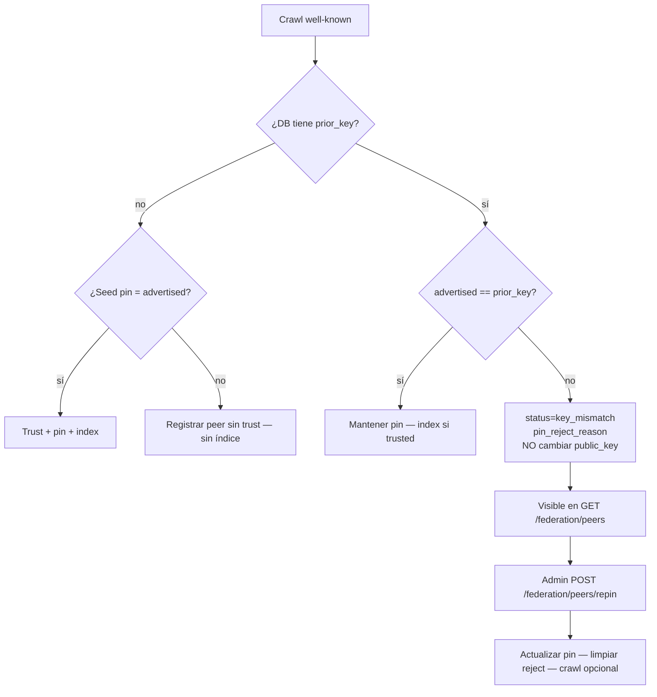

# Claves de peers federados — pin, rechazo, re-pin

> **English:** [federation-peer-keys.md](./federation-peer-keys.md) · **Русский:** [federation-peer-keys.ru.md](./federation-peer-keys.ru.md) · **Français:** [federation-peer-keys.fr.md](./federation-peer-keys.fr.md) · **中文:** [federation-peer-keys.zh.md](./federation-peer-keys.zh.md)
>
> Código: [`crawler.py`](../aimarket_hub/crawler.py) · [`database.py`](../aimarket_hub/database.py) · [`api.py`](../aimarket_hub/api.py) · [`federation_seeds.json`](../aimarket_hub/federation_seeds.json)

---

## Por qué existe

Cada peer federado anuncia una `signer_public_key` Ed25519 en `/.well-known/ai-market.json`. El hub **fija (pin)** esa clave en `peers.public_key` y, en crawls posteriores, rechaza cualquier otra:

```text
public key changed! Rejecting (possible takeover)
```

Es deliberado. Sin un pin sticky, un atacante que controle brevemente el HTTPS del peer podría publicar una clave nueva, entrar al índice y seguir sirviendo cuando vuelva el operador real.

El precio: una rotación **legítima** (volumen nuevo, contenedor sin signing seed, restore) se ve igual que un takeover. Los pins de seed (`federation_seeds.json` / `AIMARKET_SEED_PUBKEYS`) solo aplican en el **primer contacto**. Si la fila ya existe, cambiar el seed file solo no hace nada.

Hasta 2026-08-22 el crawler solo registraba el rechazo en el log. `/federation/peers` seguía mostrando el peer como sano, así que ATLAS quedó congelado en el catálogo durante días sin señal visible. Ese hueco está cerrado.

---

## Ciclo de vida



| Etapa | Qué ocurre |
|-------|------------|
| Primer contacto | Se crea la fila. Se indexa solo si el seed pin coincide **o** el operador llama `approve` después. |
| Crawl estable | La clave anunciada debe igualar `peers.public_key`. |
| Mismatch | El pin no cambia. `status=key_mismatch`, `pin_reject_reason=peer rejected: key changed`, `advertised_public_key=<nueva>`. No se refrescan manifests de ese peer. |
| Re-pin | El admin actualiza el pin. `status` vuelve a `active`. El siguiente crawl indexa si `trusted`. |

---

## Superficies para el operador

### `GET /ai-market/v2/federation/peers` (público)

| Campo | Significado |
|-------|-------------|
| `trusted` | Los manifests se indexan solo si es `true` |
| `public_key` | Pin sticky en la DB |
| `status` | `active` o `key_mismatch` |
| `pin_reject_reason` | Texto humano, p. ej. `peer rejected: key changed` |
| `advertised_public_key` | Última clave que falló el check (vacío si está sano) |

Los peers `key_mismatch` siguen en la lista (primero) para que monitores y el studio alerten sin leer logs del crawler.

### `POST /ai-market/v2/federation/peers/approve` (admin)

Solo cambia `trusted`. **No** cambia el pin.

### `POST /ai-market/v2/federation/peers/repin` (admin)

Puerta operativa para una rotación legítima.

```bash
curl -sS -X POST "$HUB/ai-market/v2/federation/peers/repin" \
  -H "Authorization: Bearer $AIMARKET_ADMIN_TOKEN" \
  -H "Content-Type: application/json" \
  -d '{
    "url": "https://atlas.modelmarket.dev",
    "public_key": "<nueva pubkey Ed25519 b64>",
    "previous_public_key": "<pin antiguo — opcional, rollback / concurrency>",
    "trusted": true,
    "crawl": true
  }'
```

| Campo | Obligatorio | Notas |
|-------|-------------|-------|
| `url` | sí | URL base como en `peers.url` |
| `public_key` | sí | Nuevo pin (debe coincidir con lo que el peer anuncia ahora) |
| `previous_public_key` | no | Si se envía, debe igualar el pin actual |
| `trusted` | no | Por defecto `true`. `null` deja trust igual |
| `crawl` | no | Por defecto `true` — crawl tras el repin |

Auth: `AIMARKET_ADMIN_TOKEN`. Sin token → fail-closed.

---

## Seeds frente a re-pin

| Mecanismo | Cuándo aplica |
|-----------|---------------|
| `federation_seeds.json` / `AIMARKET_SEED_PUBKEYS` | Solo **primer contacto** |
| `peers.public_key` en DB | **Cada** crawl posterior |
| `POST …/peers/repin` | **Única** vía operativa para rotar un pin existente sin borrar la fila |

Tras un re-pin, actualiza también el seed file para que el próximo hub en frío no vuelva a fijar la clave vieja.

---

## Checklist (volúmenes de firma)

Las claves de firma viven en volúmenes durables (oracles, ATLAS, GAIA, …). Recrear el contenedor **sin** ese volumen genera una clave nueva → los hubs con el pin viejo congelan las capabilities del peer hasta el re-pin.

1. Confirma el `signer_public_key` live del well-known.
2. Confirma que sale de tu volumen/seed (no de un tercero).
3. Llama `repin` con `previous_public_key` = pin antiguo.
4. Verifica `GET /federation/peers`: `status=active`, `pin_reject_reason` vacío.
5. Verifica el manifest del hub: schemas de salida reales en las capabilities del peer.
6. Actualiza `federation_seeds.json` y, si aplica, `AIMARKET_SEED_PUBKEYS`.

---

## Relacionado

- Anti-TOFU: `POST /federation/peers/approve`
- Supply / admission: [supply-security.md](./supply-security.md)
- Autodiscovery (monorepo): [`docs/ecosystem-autodiscovery.md`](https://github.com/alexar76/aicom/blob/main/docs/ecosystem-autodiscovery.md)
