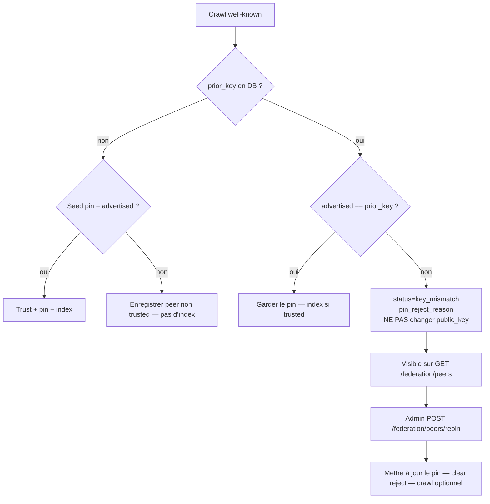

# Clés des peers fédérés — pin, rejet, re-pin

> **English:** [federation-peer-keys.md](./federation-peer-keys.md) · **Русский:** [federation-peer-keys.ru.md](./federation-peer-keys.ru.md) · **Español:** [federation-peer-keys.es.md](./federation-peer-keys.es.md) · **中文:** [federation-peer-keys.zh.md](./federation-peer-keys.zh.md)
>
> Code : [`crawler.py`](../aimarket_hub/crawler.py) · [`database.py`](../aimarket_hub/database.py) · [`api.py`](../aimarket_hub/api.py) · [`federation_seeds.json`](../aimarket_hub/federation_seeds.json)

---

## Pourquoi c’est là

Chaque peer fédéré publie une `signer_public_key` Ed25519 dans `/.well-known/ai-market.json`. Le hub **épingle (pin)** cette clé dans `peers.public_key` et, aux crawls suivants, refuse toute autre clé :

```text
public key changed! Rejecting (possible takeover)
```

C’est volontaire. Sans pin sticky, un attaquant qui contrôle brièvement le HTTPS du peer pourrait publier une nouvelle clé, entrer dans l’index, et continuer après le retour de l’opérateur légitime.

Le coût : une rotation **légitime** (nouveau volume, conteneur sans signing seed, restore) ressemble exactement à une prise de contrôle. Les pins seed (`federation_seeds.json` / `AIMARKET_SEED_PUBKEYS`) ne s’appliquent qu’au **premier contact**. Une fois la ligne créée, changer le fichier seed seul ne change rien.

Jusqu’au 2026-08-22, le crawler ne faisait que logger le rejet. `/federation/peers` montrait encore un peer « sain », donc ATLAS restait figé dans le catalogue pendant des jours sans signal opérateur. Ce trou est refermé.

---

## Cycle de vie



| Étape | Ce qui se passe |
|-------|-----------------|
| Premier contact | Ligne créée. Index seulement si le seed pin correspond **ou** si l’opérateur appelle `approve` plus tard. |
| Crawl stable | La clé annoncée doit égaler `peers.public_key`. |
| Mismatch | Le pin ne bouge pas. `status=key_mismatch`, `pin_reject_reason=peer rejected: key changed`, `advertised_public_key=<nouvelle>`. Pas de refresh des manifests de ce peer. |
| Re-pin | L’admin met à jour le pin. `status` repasse à `active`. Le crawl suivant indexe si `trusted`. |

---

## Surfaces visibles

### `GET /ai-market/v2/federation/peers` (public)

| Champ | Signification |
|-------|---------------|
| `trusted` | Manifests indexés seulement si `true` |
| `public_key` | Pin sticky en base |
| `status` | `active` ou `key_mismatch` |
| `pin_reject_reason` | Texte humain, ex. `peer rejected: key changed` |
| `advertised_public_key` | Dernière clé refusée (vide si sain) |

Les peers `key_mismatch` restent dans la liste (en tête) pour alerter moniteurs et studio sans lire les logs du crawler.

### `POST /ai-market/v2/federation/peers/approve` (admin)

Ne change que `trusted`. **Ne** change **pas** le pin.

### `POST /ai-market/v2/federation/peers/repin` (admin)

Porte officielle pour une rotation légitime.

```bash
curl -sS -X POST "$HUB/ai-market/v2/federation/peers/repin" \
  -H "Authorization: Bearer $AIMARKET_ADMIN_TOKEN" \
  -H "Content-Type: application/json" \
  -d '{
    "url": "https://atlas.modelmarket.dev",
    "public_key": "<nouvelle pubkey Ed25519 b64>",
    "previous_public_key": "<ancien pin — optionnel, rollback / concurrency>",
    "trusted": true,
    "crawl": true
  }'
```

| Champ | Requis | Notes |
|-------|--------|-------|
| `url` | oui | URL de base comme dans `peers.url` |
| `public_key` | oui | Nouveau pin (doit matcher l’annonce actuelle du peer) |
| `previous_public_key` | non | Si fourni, doit égaler le pin courant |
| `trusted` | non | Défaut `true`. `null` laisse le trust intact |
| `crawl` | non | Défaut `true` — crawl après repin |

Auth : `AIMARKET_ADMIN_TOKEN`. Absent → fail-closed.

---

## Seeds vs re-pin

| Mécanisme | Quand ça s’applique |
|-----------|---------------------|
| `federation_seeds.json` / `AIMARKET_SEED_PUBKEYS` | **Premier contact** seulement |
| `peers.public_key` en DB | **Chaque** crawl suivant |
| `POST …/peers/repin` | **Seule** voie opérationnelle pour tourner un pin existant sans supprimer la ligne |

Après un re-pin, mettez aussi à jour le seed file pour qu’un hub neuf n’épingle pas à nouveau l’ancienne clé.

---

## Checklist (volumes de signature)

Les clés de signature vivent sur des volumes durables (oracles, ATLAS, GAIA, …). Recréer le conteneur **sans** ce volume génère une nouvelle clé → les hubs qui ont l’ancien pin gèlent les capabilities du peer jusqu’au re-pin.

1. Vérifier le `signer_public_key` live du well-known.
2. Vérifier qu’il vient de votre volume/seed (pas d’un tiers).
3. Appeler `repin` avec `previous_public_key` = ancien pin.
4. Vérifier `GET /federation/peers` : `status=active`, `pin_reject_reason` vide.
5. Vérifier le manifest du hub : vrais `output_schema` sur les capabilities du peer.
6. Mettre à jour `federation_seeds.json` et éventuellement `AIMARKET_SEED_PUBKEYS`.

---

## Voir aussi

- Anti-TOFU : `POST /federation/peers/approve`
- Supply / admission : [supply-security.md](./supply-security.md)
- Autodiscovery (monorepo) : [`docs/ecosystem-autodiscovery.md`](https://github.com/alexar76/aicom/blob/main/docs/ecosystem-autodiscovery.md)
