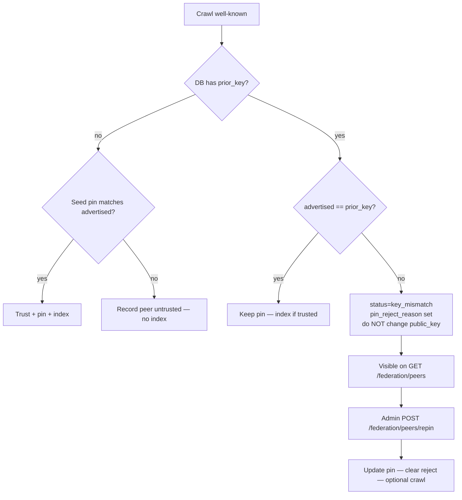

# Federation peer keys — pin, reject, re-pin

> **Русский:** [federation-peer-keys.ru.md](./federation-peer-keys.ru.md) · **Español:** [federation-peer-keys.es.md](./federation-peer-keys.es.md) · **Français:** [federation-peer-keys.fr.md](./federation-peer-keys.fr.md) · **中文:** [federation-peer-keys.zh.md](./federation-peer-keys.zh.md)
>
> Code: [`crawler.py`](../aimarket_hub/crawler.py) · [`database.py`](../aimarket_hub/database.py) · [`api.py`](../aimarket_hub/api.py) · [`federation_seeds.json`](../aimarket_hub/federation_seeds.json)

---

## Why this exists

Every federated peer advertises an Ed25519 `signer_public_key` in `/.well-known/ai-market.json`. The hub **pins** that key in `peers.public_key` and, on later crawls, refuses any other key:

```text
public key changed! Rejecting (possible takeover)
```

That is intentional. Without a sticky pin, an attacker who briefly controls a peer’s HTTPS endpoint could publish a new key, get indexed, and keep serving after the real operator returns.

The cost of that protection: a **legitimate** rotation (new volume, rebuilt container without the signing seed, restored backup) looks identical to a takeover. Seed pins (`federation_seeds.json` / `AIMARKET_SEED_PUBKEYS`) only apply on **first contact**. Once a row exists, changing the seed file alone does nothing.

Until 2026-08-22 the crawler only logged the reject. `/federation/peers` still showed the peer as healthy, so ATLAS stayed frozen in the catalogue for days with no operator-facing signal. That gap is closed.

---

## Lifecycle



| Stage | What happens |
|-------|----------------|
| First contact | Peer row created. Indexed only if seed pin matches **or** an operator later calls `approve`. |
| Steady crawl | Advertised key must equal `peers.public_key`. |
| Mismatch | Pin unchanged. `status=key_mismatch`, `pin_reject_reason=peer rejected: key changed`, `advertised_public_key=<new>`. Manifests for that peer are not refreshed. |
| Re-pin | Admin updates the pin. Status returns to `active`. Next crawl indexes again if `trusted`. |

---

## Surfaces operators see

### `GET /ai-market/v2/federation/peers` (public)

Each peer now includes:

| Field | Meaning |
|-------|---------|
| `trusted` | Manifests indexed only when true |
| `public_key` | Sticky pin in the DB |
| `status` | `active` or `key_mismatch` |
| `pin_reject_reason` | Human string, e.g. `peer rejected: key changed` |
| `advertised_public_key` | Last key that failed the check (empty when healthy) |

`key_mismatch` peers stay on the list (sorted first) so monitors and studio UIs can alarm without reading crawler logs.

### `POST /ai-market/v2/federation/peers/approve` (admin)

Toggles `trusted` only. Does **not** change the pin.

### `POST /ai-market/v2/federation/peers/repin` (admin)

Legitimate rotation escape hatch.

```bash
curl -sS -X POST "$HUB/ai-market/v2/federation/peers/repin" \
  -H "Authorization: Bearer $AIMARKET_ADMIN_TOKEN" \
  -H "Content-Type: application/json" \
  -d '{
    "url": "https://atlas.modelmarket.dev",
    "public_key": "<new Ed25519 pubkey b64>",
    "previous_public_key": "<old pin — optional, for rollback / concurrency>",
    "trusted": true,
    "crawl": true
  }'
```

| Body field | Required | Notes |
|------------|----------|-------|
| `url` | yes | Peer base URL as stored in `peers.url` |
| `public_key` | yes | New pin (must match what the peer advertises now) |
| `previous_public_key` | no | If set, must equal the current pin (optimistic lock + audit) |
| `trusted` | no | Default `true`. Pass `null` to leave trust unchanged |
| `crawl` | no | Default `true` — run a federation crawl after repin |

Auth: `AIMARKET_ADMIN_TOKEN`. Fail-closed if unset.

---

## Seeds vs re-pin

| Mechanism | When it applies |
|-----------|-----------------|
| `federation_seeds.json` `public_key` / `AIMARKET_SEED_PUBKEYS` | **First contact only** — trust + index if advertised key matches |
| DB `peers.public_key` | **Every subsequent crawl** — mismatch rejects |
| `POST …/peers/repin` | **Only** way to rotate an existing pin without deleting the row |

After a re-pin, update the committed seed file too so the next greenfield hub does not pin the stale key again.

---

## Operational checklist (signing volumes)

Peer signing keys live on durable volumes (oracles, ATLAS, GAIA, …). Recreating the container **without** that volume mints a new key → every hub that already pinned the old one freezes that peer’s capabilities until re-pin.

1. Confirm the peer’s live `/.well-known/ai-market.json` `signer_public_key`.
2. Confirm it matches the key derived from the peer’s signing seed/volume (not a stranger).
3. Call `repin` with `previous_public_key` set to the old pin.
4. Verify `GET /federation/peers` shows `status=active` and an empty `pin_reject_reason`.
5. Verify the hub manifest lists the peer’s capabilities with real `output_schema` (not empty stubs).
6. Update `federation_seeds.json` (and any deploy env `AIMARKET_SEED_PUBKEYS`) to the new key.

---

## Related

- Anti-TOFU trust gate: `POST /federation/peers/approve`
- Supply / admission: [supply-security.md](./supply-security.md)
- Autodiscovery overview (monorepo): [`docs/ecosystem-autodiscovery.md`](https://github.com/alexar76/aicom/blob/main/docs/ecosystem-autodiscovery.md)
