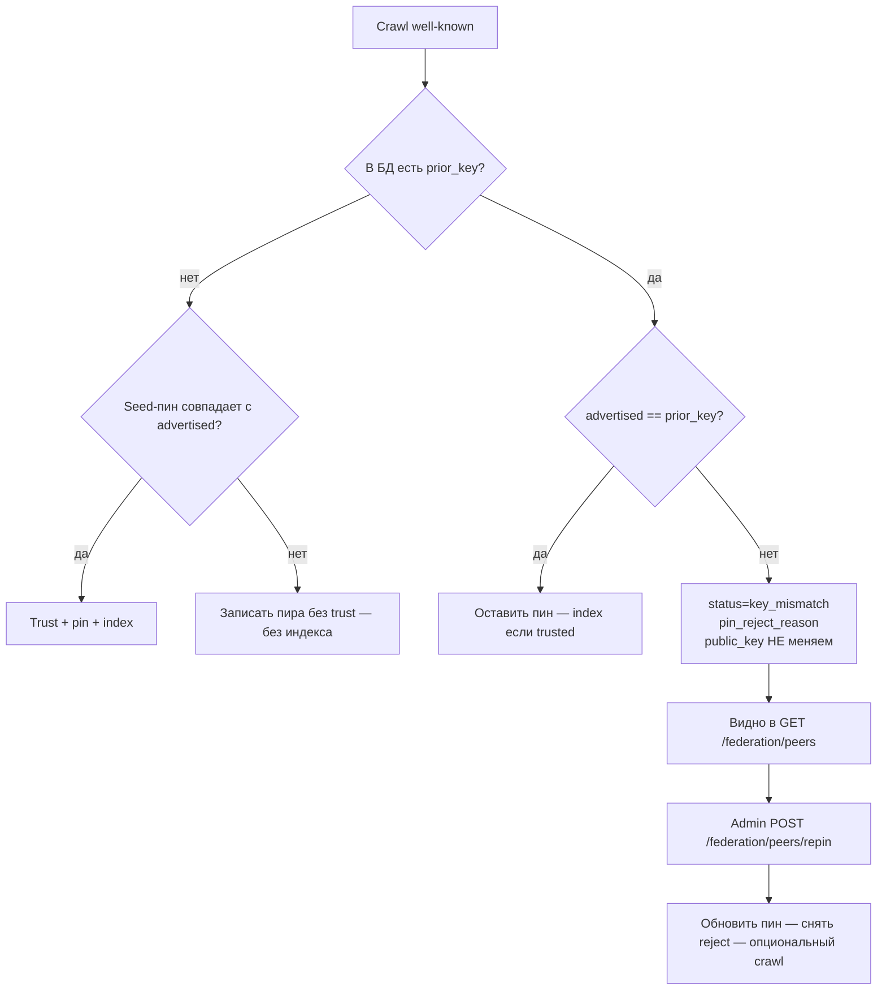

# Ключи пиров федерации — пин, отказ, перепин

> **English:** [federation-peer-keys.md](./federation-peer-keys.md) · **Español:** [federation-peer-keys.es.md](./federation-peer-keys.es.md) · **Français:** [federation-peer-keys.fr.md](./federation-peer-keys.fr.md) · **中文:** [federation-peer-keys.zh.md](./federation-peer-keys.zh.md)
>
> Код: [`crawler.py`](../aimarket_hub/crawler.py) · [`database.py`](../aimarket_hub/database.py) · [`api.py`](../aimarket_hub/api.py) · [`federation_seeds.json`](../aimarket_hub/federation_seeds.json)

---

## Зачем это есть

Каждый федеративный пир объявляет Ed25519 `signer_public_key` в `/.well-known/ai-market.json`. Хаб **пинит** ключ в `peers.public_key` и на следующих обходах отклоняет любой другой:

```text
public key changed! Rejecting (possible takeover)
```

Так и задумано. Без липкого пина атакующий, кратко захвативший HTTPS пира, мог бы опубликовать новый ключ, попасть в индекс и остаться там после возвращения настоящего оператора.

Цена защиты: **легитимная** ротация (новый том, контейнер без signing seed, восстановление из бэкапа) выглядит так же, как takeover. Seed-пины (`federation_seeds.json` / `AIMARKET_SEED_PUBKEYS`) работают только при **первом контакте**. Когда строка уже есть, смена seed-файла сама по себе ничего не делает.

До 2026-08-22 crawler только писал отказ в лог. `/federation/peers` показывал пира как здорового — ATLAS неделями был заморожен в каталоге без сигнала оператору. Этот разрыв закрыт.

---

## Жизненный цикл



| Этап | Что происходит |
|------|----------------|
| Первый контакт | Строка пира создаётся. Индекс только если seed-пин совпал **или** оператор позже вызвал `approve`. |
| Обычный crawl | Advertised-ключ должен равняться `peers.public_key`. |
| Mismatch | Пин не меняется. `status=key_mismatch`, `pin_reject_reason=peer rejected: key changed`, `advertised_public_key=<новый>`. Манифесты пира не обновляются. |
| Перепин | Admin обновляет пин. Статус снова `active`. Следующий crawl индексирует при `trusted`. |

---

## Что видит оператор

### `GET /ai-market/v2/federation/peers` (публичный)

| Поле | Смысл |
|------|--------|
| `trusted` | Манифесты индексируются только при `true` |
| `public_key` | Липкий пин в БД |
| `status` | `active` или `key_mismatch` |
| `pin_reject_reason` | Человекочитаемая причина, напр. `peer rejected: key changed` |
| `advertised_public_key` | Последний ключ, не прошедший проверку (пусто, когда всё здорово) |

Пиры с `key_mismatch` остаются в списке (в начале), чтобы мониторы и студия били тревогу без чтения логов crawler.

### `POST /ai-market/v2/federation/peers/approve` (admin)

Только переключает `trusted`. Пин **не** меняет.

### `POST /ai-market/v2/federation/peers/repin` (admin)

Штатная дверь для легитимной ротации.

```bash
curl -sS -X POST "$HUB/ai-market/v2/federation/peers/repin" \
  -H "Authorization: Bearer $AIMARKET_ADMIN_TOKEN" \
  -H "Content-Type: application/json" \
  -d '{
    "url": "https://atlas.modelmarket.dev",
    "public_key": "<новый Ed25519 pubkey b64>",
    "previous_public_key": "<старый пин — опционально, для отката / concurrency>",
    "trusted": true,
    "crawl": true
  }'
```

| Поле тела | Обязательно | Заметки |
|-----------|-------------|---------|
| `url` | да | Базовый URL как в `peers.url` |
| `public_key` | да | Новый пин (должен совпадать с тем, что пир рекламирует сейчас) |
| `previous_public_key` | нет | Если задан — должен совпасть с текущим пином |
| `trusted` | нет | По умолчанию `true`. `null` — не трогать trust |
| `crawl` | нет | По умолчанию `true` — crawl после repin |

Auth: `AIMARKET_ADMIN_TOKEN`. Без токена — fail-closed.

---

## Seeds и перепин

| Механизм | Когда действует |
|----------|-----------------|
| `federation_seeds.json` / `AIMARKET_SEED_PUBKEYS` | Только **первый контакт** |
| `peers.public_key` в БД | **Каждый** последующий crawl |
| `POST …/peers/repin` | **Единственный** штатный способ сменить существующий пин без удаления строки |

После перепина обновите и seed-файл, иначе следующий «чистый» хаб снова запинит старый ключ.

---

## Чеклист (signing volumes)

Ключи подписи пиров лежат на долговечных томах (oracles, ATLAS, GAIA, …). Пересоздание контейнера **без** тома чеканит новый ключ → хабы со старым пином замораживают capability пира до перепина.

1. Сверьте live `signer_public_key` в well-known.
2. Убедитесь, что он выводится из вашего тома/seed (не чужой).
3. Вызовите `repin` с `previous_public_key` = старый пин.
4. Проверьте `GET /federation/peers`: `status=active`, пустой `pin_reject_reason`.
5. Проверьте манифест хаба: у capability пира есть реальный `output_schema`.
6. Обновите `federation_seeds.json` и при необходимости `AIMARKET_SEED_PUBKEYS`.

---

## Связанное

- Anti-TOFU: `POST /federation/peers/approve`
- Supply / admission: [supply-security.md](./supply-security.md)
- Autodiscovery (монорепо): [`docs/ecosystem-autodiscovery.md`](https://github.com/alexar76/aicom/blob/main/docs/ecosystem-autodiscovery.md)
