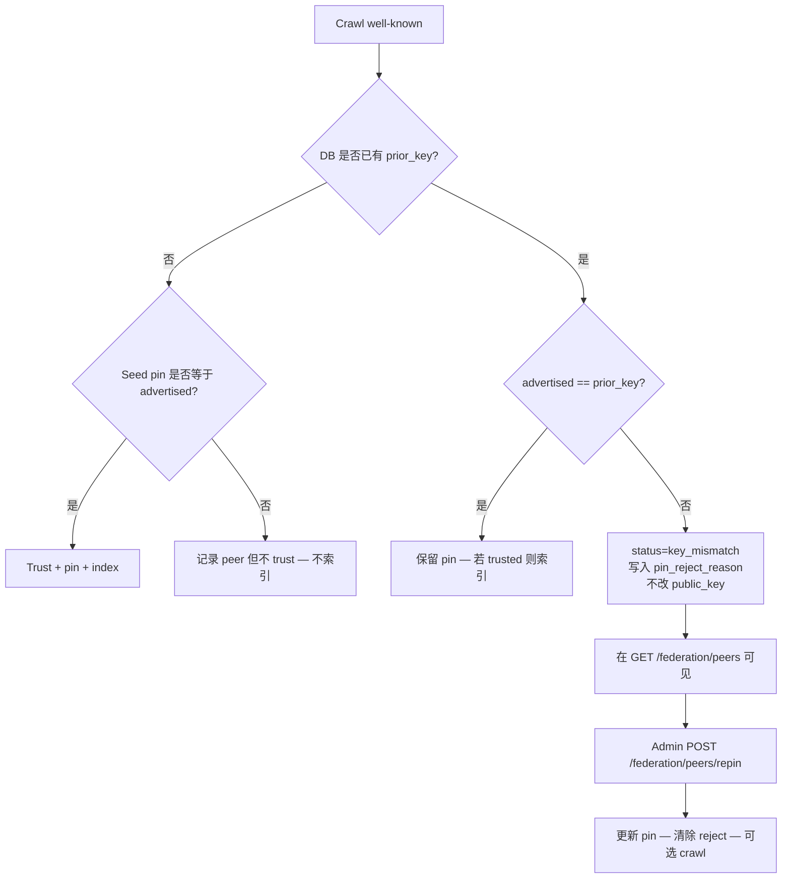

# 联邦 peer 密钥 — 固定、拒绝、重新固定

> **English:** [federation-peer-keys.md](./federation-peer-keys.md) · **Русский:** [federation-peer-keys.ru.md](./federation-peer-keys.ru.md) · **Español:** [federation-peer-keys.es.md](./federation-peer-keys.es.md) · **Français:** [federation-peer-keys.fr.md](./federation-peer-keys.fr.md)
>
> 代码：[`crawler.py`](../aimarket_hub/crawler.py) · [`database.py`](../aimarket_hub/database.py) · [`api.py`](../aimarket_hub/api.py) · [`federation_seeds.json`](../aimarket_hub/federation_seeds.json)

---

## 为什么需要

每个联邦 peer 在 `/.well-known/ai-market.json` 中公布 Ed25519 `signer_public_key`。Hub 会把该密钥 **固定（pin）** 到 `peers.public_key`，之后的爬取若发现密钥不同就拒绝：

```text
public key changed! Rejecting (possible takeover)
```

这是有意为之。若没有粘性 pin，攻击者短暂控制 peer 的 HTTPS 后可以发布新密钥、进入索引，并在真正运营者恢复后继续提供服务。

代价是：**合法** 轮换（新 volume、没有 signing seed 的容器、备份恢复）看起来与接管一模一样。Seed pin（`federation_seeds.json` / `AIMARKET_SEED_PUBKEYS`）只在 **首次接触** 时生效。行已存在时，只改 seed 文件无效。

在 2026-08-22 之前，爬虫只把拒绝写进日志。`/federation/peers` 仍显示 peer「健康」，于是 ATLAS 在目录里冻住多日却没有面向运营者的信号。该缺口已关闭。

---

## 生命周期



| 阶段 | 行为 |
|------|------|
| 首次接触 | 创建 peer 行。仅当 seed pin 匹配 **或** 运营者稍后调用 `approve` 时才索引。 |
| 稳态爬取 | 公布的密钥必须等于 `peers.public_key`。 |
| 不匹配 | pin 不变。`status=key_mismatch`，`pin_reject_reason=peer rejected: key changed`，`advertised_public_key=<新密钥>`。不刷新该 peer 的 manifest。 |
| 重新固定 | Admin 更新 pin。`status` 回到 `active`。若 `trusted`，下次爬取重新索引。 |

---

## 运营者可见面

### `GET /ai-market/v2/federation/peers`（公开）

| 字段 | 含义 |
|------|------|
| `trusted` | 仅为 `true` 时索引 manifest |
| `public_key` | 数据库中的粘性 pin |
| `status` | `active` 或 `key_mismatch` |
| `pin_reject_reason` | 可读原因，例如 `peer rejected: key changed` |
| `advertised_public_key` | 最近一次未通过校验的密钥（健康时为空） |

`key_mismatch` peer 仍留在列表中（排在前面），监控与 studio 无需读爬虫日志即可告警。

### `POST /ai-market/v2/federation/peers/approve`（admin）

只切换 `trusted`。**不**改 pin。

### `POST /ai-market/v2/federation/peers/repin`（admin）

合法轮换的正式入口。

```bash
curl -sS -X POST "$HUB/ai-market/v2/federation/peers/repin" \
  -H "Authorization: Bearer $AIMARKET_ADMIN_TOKEN" \
  -H "Content-Type: application/json" \
  -d '{
    "url": "https://atlas.modelmarket.dev",
    "public_key": "<新的 Ed25519 pubkey b64>",
    "previous_public_key": "<旧 pin — 可选，用于回滚 / 并发校验>",
    "trusted": true,
    "crawl": true
  }'
```

| 字段 | 必填 | 说明 |
|------|------|------|
| `url` | 是 | 与 `peers.url` 一致的基础 URL |
| `public_key` | 是 | 新 pin（须与 peer 当前公布值一致） |
| `previous_public_key` | 否 | 若提供，必须等于当前 pin |
| `trusted` | 否 | 默认 `true`；`null` 表示不改 trust |
| `crawl` | 否 | 默认 `true` — repin 后触发联邦爬取 |

鉴权：`AIMARKET_ADMIN_TOKEN`。未配置则 fail-closed。

---

## Seed 与 re-pin

| 机制 | 何时生效 |
|------|----------|
| `federation_seeds.json` / `AIMARKET_SEED_PUBKEYS` | 仅 **首次接触** |
| DB 中的 `peers.public_key` | **每一次** 后续爬取 |
| `POST …/peers/repin` | 在不删除行的前提下 **唯一** 正式轮换入口 |

re-pin 之后请同步更新 seed 文件，否则下一次全新部署的 Hub 会再次固定旧密钥。

---

## 运维清单（签名 volume）

Peer 签名密钥保存在持久 volume（oracles、ATLAS、GAIA 等）。**不带** 该 volume 重建容器会生成新密钥 → 仍固定旧 pin 的 Hub 会冻结该 peer 的 capability，直到 re-pin。

1. 核对 live well-known 中的 `signer_public_key`。
2. 确认它来自你们自己的 volume/seed（不是外人）。
3. 调用 `repin`，`previous_public_key` 设为旧 pin。
4. 检查 `GET /federation/peers`：`status=active`，`pin_reject_reason` 为空。
5. 检查 Hub manifest：该 peer 的 capability 有真实 `output_schema`。
6. 更新 `federation_seeds.json`，必要时更新 `AIMARKET_SEED_PUBKEYS`。

---

## 相关

- Anti-TOFU：`POST /federation/peers/approve`
- Supply / admission：[supply-security.md](./supply-security.md)
- Autodiscovery（单体仓库）：[`docs/ecosystem-autodiscovery.md`](https://github.com/alexar76/aicom/blob/main/docs/ecosystem-autodiscovery.md)
