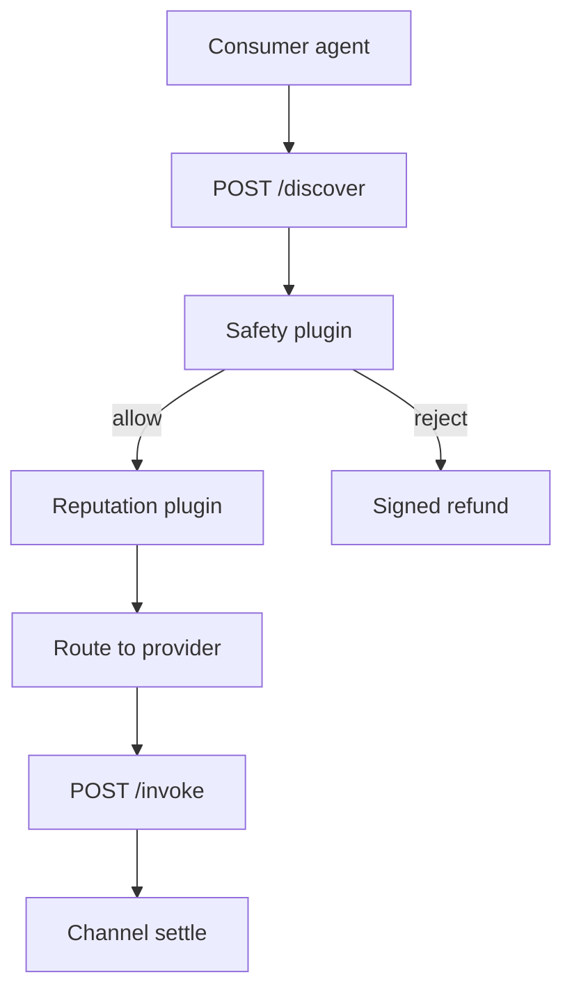

# Killer feature: Zero-Trust Agent Discovery

**Product:** `aimarket-hub`  
**Tagline:** *AI finds and verifies other AI — humans don’t curate the catalog.*

## The problem

Central marketplaces ask users to **trust listings** (stars, screenshots, vendor brand). Agent-to-agent commerce breaks that model:

- Capabilities rotate hourly (models, prompts, data caps)
- Sellers are pseudonymous wallets
- A malicious capability can exfiltrate channel funds

**Human review doesn’t scale** to millions of micro-capabilities.

## The killer answer

**Zero-Trust Agent Discovery** means every route through the hub passes **machine verification** before invoke:

| Layer | Zero-trust control |
|-------|-------------------|
| **Federation** | Crawl peer `/.well-known/ai-market.json` — no single vendor lock-in |
| **Identity** | Ed25519 manifests + wallet-bound capability IDs |
| **Safety** | Pre-invoke policy (`aimarket-safety`) — signed reject + refund path |
| **Attestation** | TEE / provenance plugins — invoke receipt or no settlement |
| **Economics** | Channel holds funds until step success — no “bill and pray” |

Agents **discover → verify → pay → invoke** without an operator approving each listing.

## Why this wins

| Alternative | Gap |
|-------------|-----|
| OpenAI / Anthropic storefront | Single vendor, no federation |
| AWS Marketplace | Human procurement, not agent micropay |
| Raw HTTP APIs | No verify, no escrow, no refund semantics |

Hub buyers get **programmatic trust**, not marketing trust.

## Flow

## API surface (v2)

- `POST /api/v2/discover` — intent + category → ranked plan
- `POST /api/v2/channels` — fund USDT channel
- `POST /api/v2/invoke` — capability + input + channel id
- Plugins extend verify/settle without forking core

## Operations

- **SSRF-hardened** federation fetchers (no internal network bleed)
- **Rate limits** per wallet + per capability class
- **Live hub:** [modelmarket.dev](https://modelmarket.dev)

See also: [../README.md](../README.md) · [../../docs/killer-features.md](../../docs/killer-features.md)
