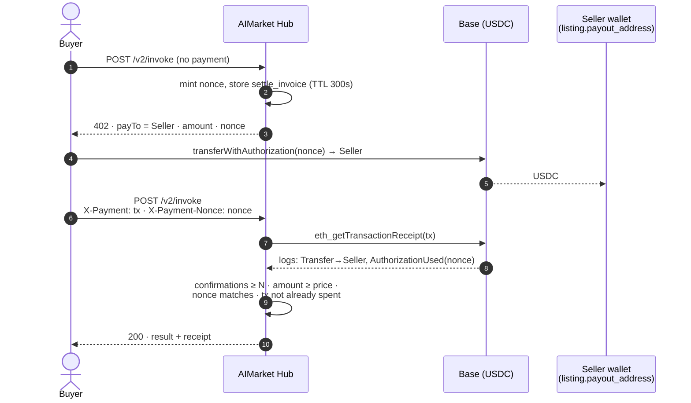
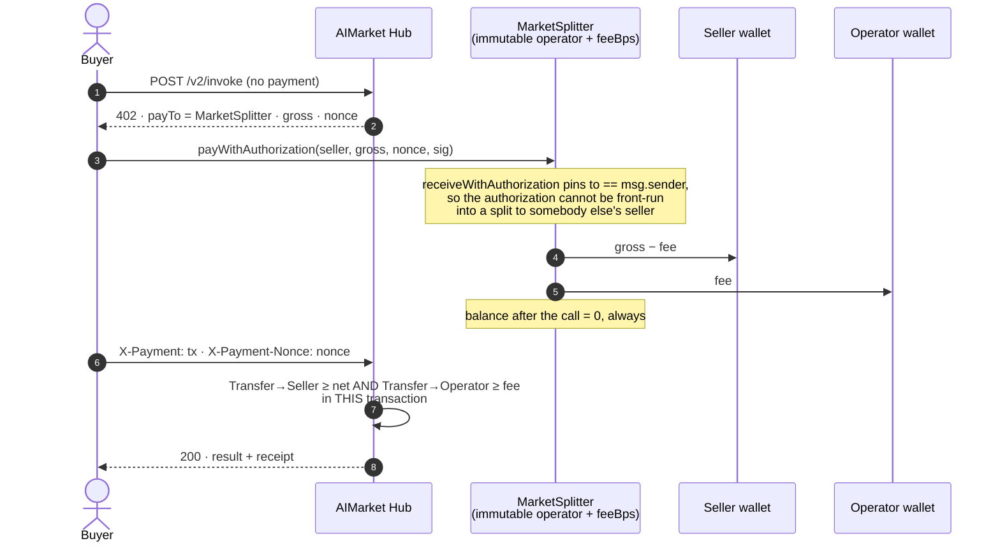
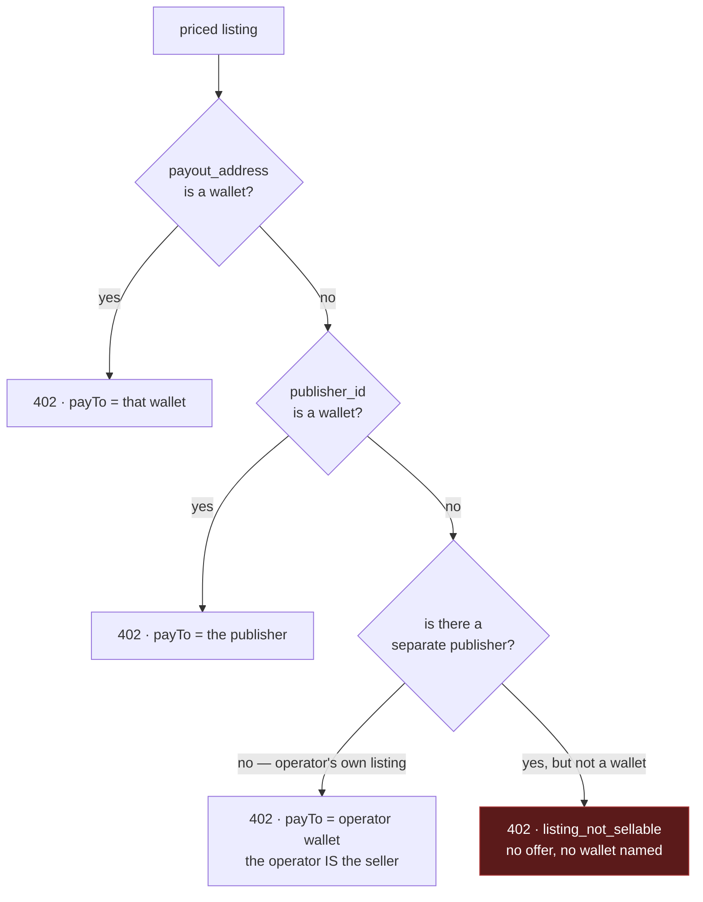
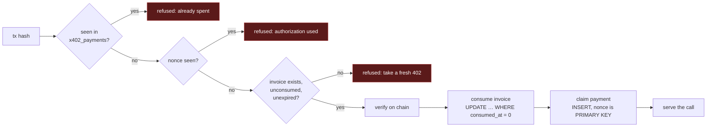
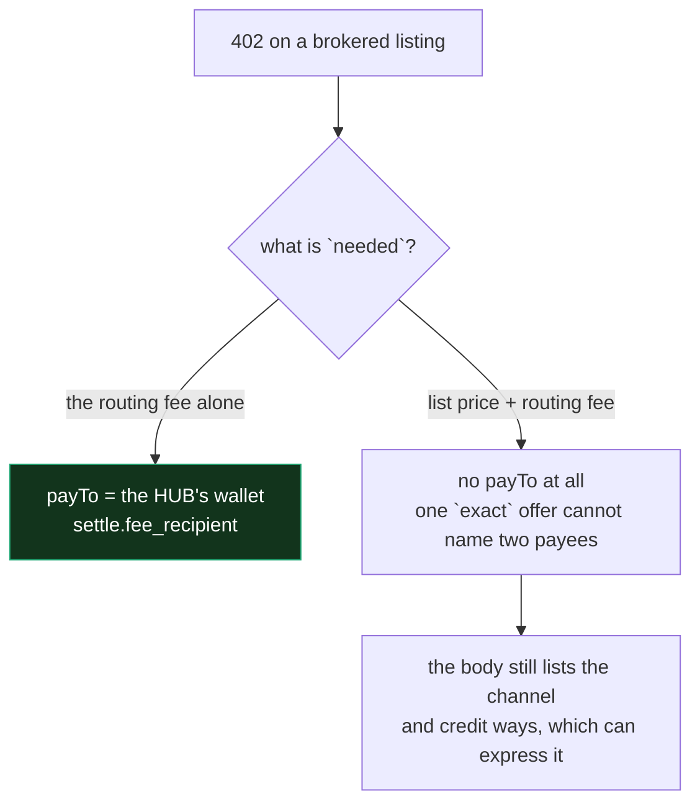
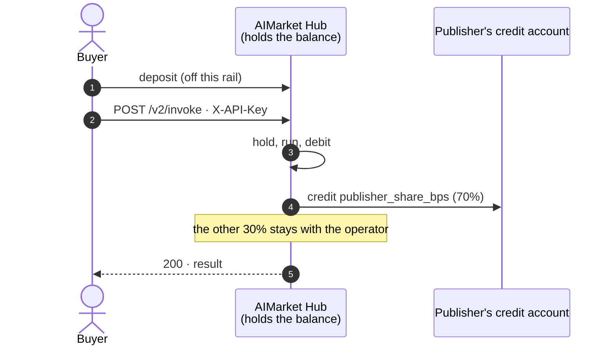
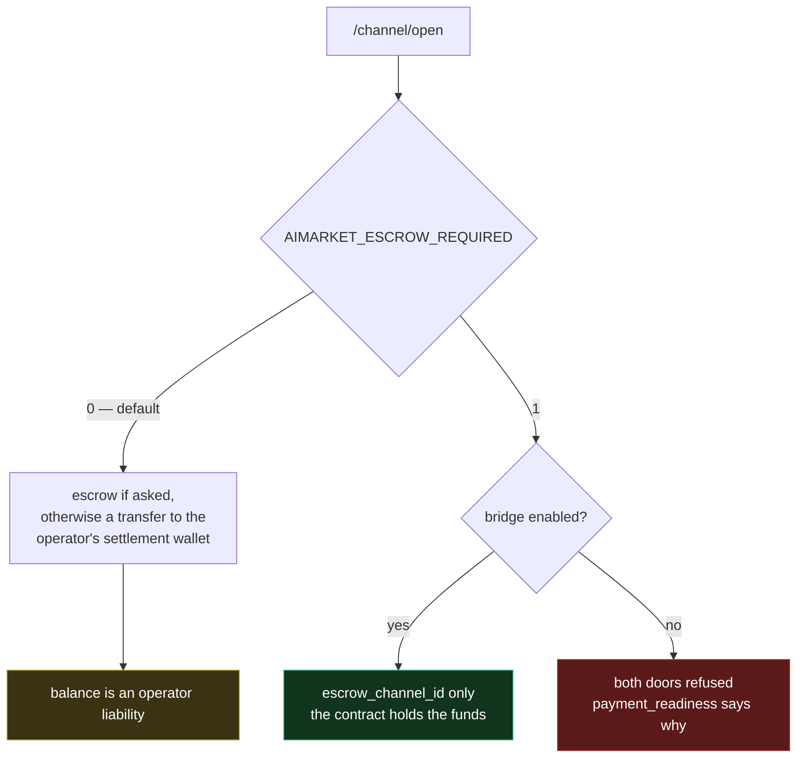
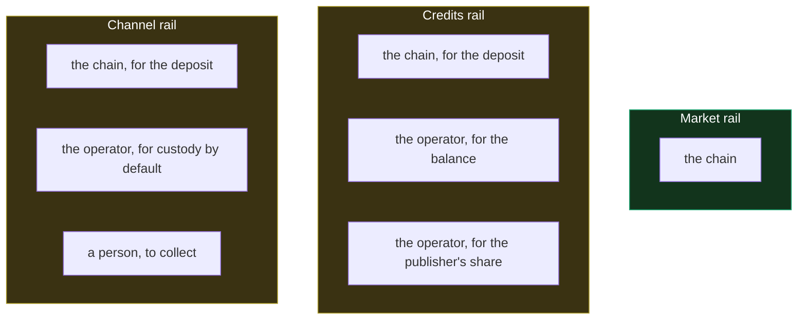

# Money rails — where a payment actually goes

Three rails can pay for a call on this Hub, and they are not variations on one
design. They differ in who holds the money, who can lose it, and what the Hub has
to be trusted for. This document is the map, because the difference between them
has been mistaken for a detail more than once.

| Rail | Buyer pays | Hub custody | Seller paid by | Status |
|---|---|---|---|---|
| **Market (seller-direct)** | USDC on Base, to the seller | **none** | the chain, in the buyer's own transaction | live |
| **Credits** | prepaid balance on this Hub | **yes** — the balance is an operator liability | a ledger entry (`publisher_share_bps`) | live |
| **Channels / escrow** | a deposit, by default to the operator's wallet | **yes, by default** | not paid by this rail | see [KI-11](https://github.com/alexar76/aicom/blob/main/docs/known-issues.md) |

Live HESTIA listings on `modelmarket.dev` (who is the till, every env key, a mined
USDC `transferWithAuthorization` with both logs named):
[`docs/hestia-hub-market-rail.md`](https://github.com/alexar76/aicom/blob/main/docs/hestia-hub-market-rail.md)
([RU](https://github.com/alexar76/aicom/blob/main/docs/hestia-hub-market-rail.ru.md) ·
[ES](https://github.com/alexar76/aicom/blob/main/docs/hestia-hub-market-rail.es.md) ·
[FR](https://github.com/alexar76/aicom/blob/main/docs/hestia-hub-market-rail.fr.md) ·
[ZH](https://github.com/alexar76/aicom/blob/main/docs/hestia-hub-market-rail.zh.md)).

The rest of this document is about the first one, then the other two in short.

---

## 1. The market rail

The invariant, stated once so the diagrams below can be read against it:

> USDC moves from the buyer to the listing's `payout_address`. The Hub reads the
> chain and decides whether to serve the call. It never holds, credits or reroutes
> the money, and it has no key over it.

A second property is **separate from that one**, and conflating the two is the
mistake this rail was built with: *the Hub does not hold the money* and *the Hub
takes no cut* are different statements. A cut is possible without custody, and
§1.3 is how.

### 1.1 Without a fee — the plain path

Money touches two accounts: the buyer's and the seller's. The Hub appears in the
diagram only as a reader.

### 1.2 What the Hub actually checks

Not "the buyer says they paid", and not "a signature verifies". Only the receipt:

- the transaction is mined, `status = 0x1`, and has at least
  `AIMARKET_SETTLE_MIN_CONFIRMATIONS` confirmations;
- a `Transfer` log **of the right token** to **the seller's address** sums to at
  least the seller's share;
- when binding is on (default), an `AuthorizationUsed(payer, nonce)` log for the
  nonce **this Hub minted** is in the same transaction;
- the transaction hash and the nonce have not been spent on another call.

A signed EIP-3009 authorization with no chain receipt is not a payment. It was
treated as one before — booked as a receivable and swept out of band — and that is
the design this rail replaced.

### 1.3 With a fee — the splitter

The Hub carries the index, the trust scoring, the 402 machinery and the RPC
verification. On the plain path it earns nothing for any of it, while publishing
both the payee and the invoke URL, so a buyer can route around it after one
lookup.

[`MarketSplitter`](https://github.com/alexar76/aicom/blob/main/contracts/evm/src/MarketSplitter.sol) fixes that without
touching the custody invariant: it is the address the 402 names, it forwards both
shares in the same call, and it never holds a balance past the end of that call.

Two things about this are deliberate and worth not undoing:

**The Hub does not check that the payment went through the splitter.** It requires
the two legs. A buyer who sends two plain transfers in one multicall settles
identically; the contract is the convenience that produces both from one signature,
which is what an off-the-shelf x402 client can do. So neither the Hub nor the
seller has to trust the contract's code in order to be paid — the chain says
whether they were.

**Rounding goes to the seller**, because the operator's share is the one computed
by division and the seller takes the remainder. Written the other way round it
reads as the generous choice and is the opposite: at 250 bps a one-unit payment
paid the seller 0 and the operator the whole unit. `settle.fee_split` and
`MarketSplitter._settle` do the same arithmetic on purpose — a divergence would
advertise terms the chain then refuses to satisfy.

### 1.4 A listing with nobody to pay

The last branch is the one that had a hole. `payTo` fell back to the operator's own
wallet whenever the listing named no payee — so the 402 told the buyer to pay the
platform for a sale `settle.terms_for` would then refuse, and the buyer was out of
pocket with an error for a receipt. An empty payee now produces **no offer at all**,
and the 402 says why.

### 1.5 One payment, one call

The last two steps are the ones that hold under concurrency: consuming an invoice
is a compare-and-swap (`WHERE consumed_at = 0`, checked by `rowcount`), and the
claim relies on `x402_payments.nonce` being a PRIMARY KEY, so two racing requests
cannot both insert. A failed claim releases the invoice rather than burning it.

### 1.6 Configuration

| Variable | Default | What it does |
|---|---|---|
| `AIMARKET_SETTLE_REQUIRE_BINDING` | `1` | Require an EIP-3009 nonce that this Hub minted. **Leave it on.** With it off, an old transfer to the same seller — made for something else entirely — can be presented as payment, bounded only by "this Hub has not already spent that tx". |
| `AIMARKET_SETTLE_MAX_AGE_S` | `0` (off) | Reject a transfer older than this. With binding on, the invoice TTL already bounds age; set this too if you ever turn binding off. |
| `AIMARKET_SETTLE_MIN_CONFIRMATIONS` | `1` | Confirmations before a payment counts. |
| `AIMARKET_SETTLE_INVOICE_TTL_S` | `300` | How long a 402's nonce stays payable. |
| `AIMARKET_SETTLE_RPC_URL` | — | Overrides the chain endpoint. Exclusive: a bubble RPC must not fall through to mainnet. |
| `AIMARKET_MARKET_FEE_BPS` | `0` (off) | The operator's share, in basis points. Capped at 1000 (10%) here and in the contract. |
| `AIMARKET_MARKET_FEE_TO` | the Hub's x402 wallet | Where the operator's share goes. A fee with no recipient is not charged. |
| `AIMARKET_MARKET_SPLITTER` | — | The deployed `MarketSplitter`. Without it a fee still settles, but the buyer has to produce both legs itself. |

Turning the fee on is two steps and the order matters: deploy the contract with the
operator address and bps you intend, **then** set all three variables to match it.
Terms that disagree with the contract advertise a split the chain will not produce.

### 1.7 Brokering somebody else's capability

When this Hub indexes a peer that bills its own buyers, the peer is paid for the call
and this Hub charges `routing_fee_bps` for the brokerage. Two payees, two amounts:

The left branch had the bug that proves why this page exists: the federated path binds
the *listing's* payee early, because most of its 402s are about the sale — and the
routing-fee refusal inherited it. So the offer asked the buyer to pay **the Hub's own
fee to the seller**: the Hub got nothing and the seller got an extra percent. It was
found by reading a real 402 off `modelmarket.dev` minutes after the rail shipped, not
by a test, which is the honest note to keep here.

The right branch is a refusal to guess. A total owed to two addresses cannot be
expressed by a scheme with one `payTo`; naming the seller hands them the Hub's fee and
naming the Hub makes it custody the seller's price. Naming nobody is the only answer
that is not wrong.

---

## 2. The credits rail

A buyer prepays a balance on this Hub and calls are debited from it.

This rail **is** custodial: the balance is an operator liability, and the publisher
is paid by a row in a table, not by the chain. It is a prepaid convenience, and it
is the only place `publisher_share_bps` applies — a catalogue sale settled on the
market rail explicitly skips it, because the seller was already paid on-chain.

---

## 3. Channels and escrow

Deposits, holds and `debitChannel`. By default a deposit is a plain transfer to the
**operator's settlement wallet**, not into `AIMarketEscrow` — so channel balances
are an operator liability and the contract's non-custodial guarantees describe a
path the default does not take. Collection of an authorized debit is a human act.

This rail is **not** how a seller is paid for a catalogue sale, and the market rail
above does not depend on it. Two switches decide how custodial it actually is:

The bottom-right branch is deliberate. Gating "required" on "enabled" would mean an
operator who asks for the strongest setting and forgets the master switch gets the
weakest one, silently — so the misconfiguration refuses everything and says so at
boot instead.

Collection used to be a human act: an authorized debit was captured on every paid
invoke and nothing presented it unless someone ran the CLI.
`AIMARKET_ESCROW_COLLECT_INTERVAL_S` now runs a bounded pass inside the hub, still
inside the bridge's own submit policy and spend caps — so the interval changes only
how promptly the hub asks, never how much it can take.

Remaining open items are tracked in [KI-11](https://github.com/alexar76/aicom/blob/main/docs/known-issues.md).

---

## What each rail asks you to trust

That is the whole reason the market rail exists: it is the only one of the three
whose answer is a single item, and the item is not a person.
