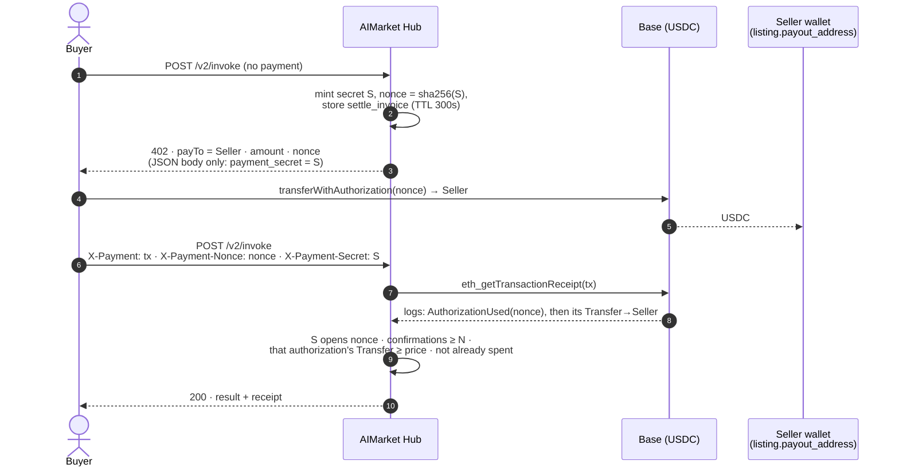
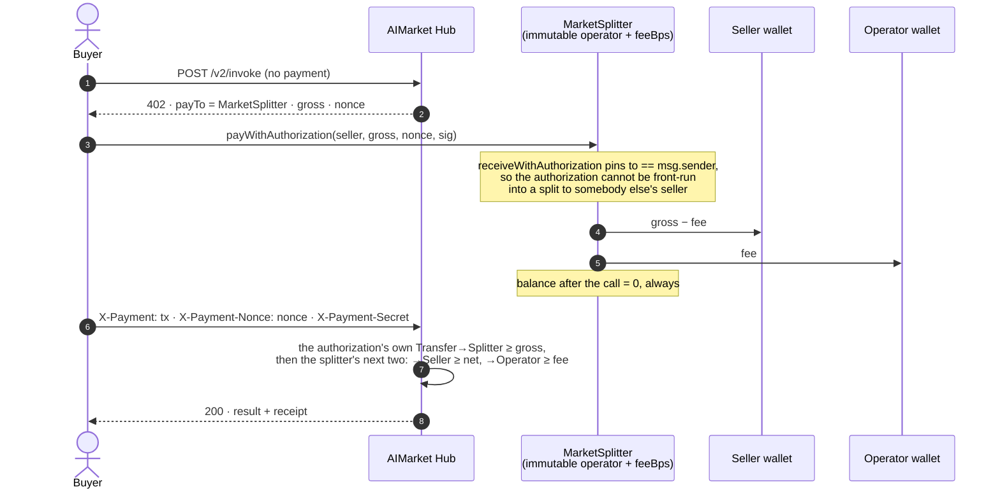
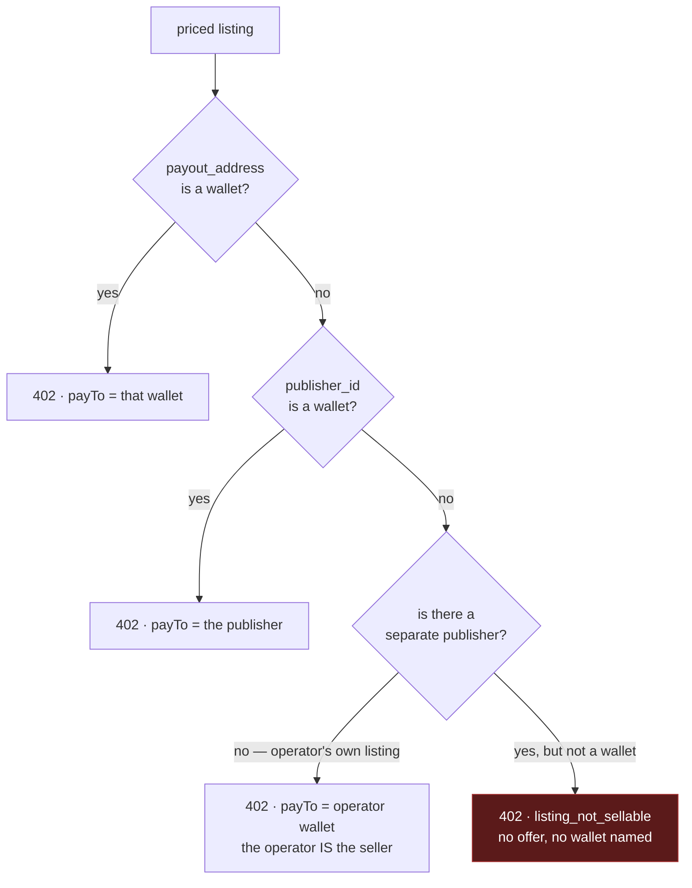
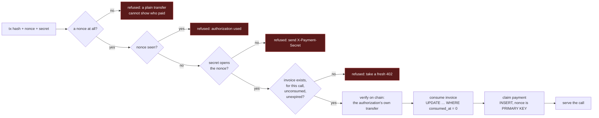
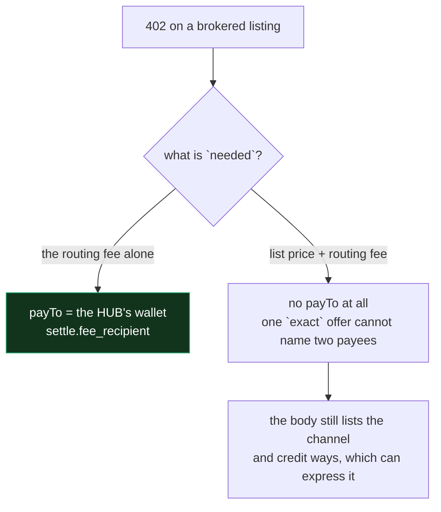
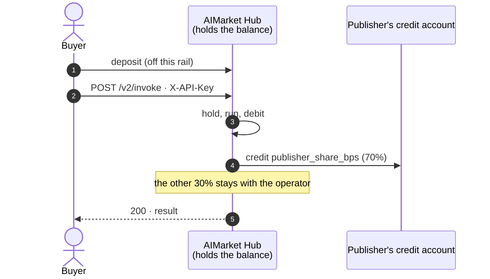
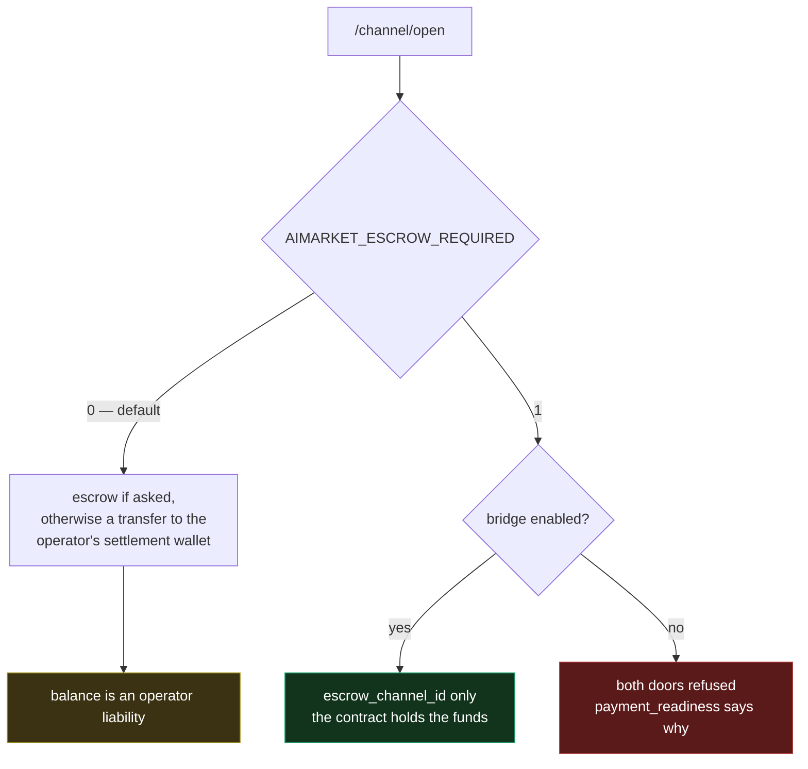
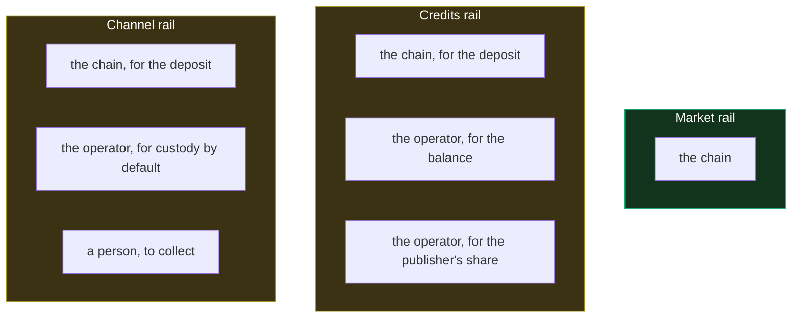

# Money rails — where a payment actually goes

Three rails can pay for a call on this Hub, and they are not variations on one
design. They differ in who holds the money, who can lose it, and what the Hub has
to be trusted for. This document is the map, because the difference between them
has been mistaken for a detail more than once.

| Rail | Buyer pays | Hub custody | Seller paid by | Status |
|---|---|---|---|---|
| **Market (seller-direct)** | USDC on Base, to the seller | **none** | the chain, in the buyer's own transaction | live |
| **Credits** | prepaid balance on this Hub | **yes** — the balance is an operator liability | a ledger entry (`publisher_share_bps`) | live |
| **Channels / escrow** | a deposit, by default to the operator's wallet | **yes, by default** | not paid by this rail | see [KI-11](https://github.com/alexar76/aicom/blob/main/docs/known-issues.md) |

Live HESTIA listings on `modelmarket.dev` (who is the till, every env key, a mined
USDC `transferWithAuthorization` with both logs named):
[`docs/hestia-hub-market-rail.md`](https://github.com/alexar76/aicom/blob/main/docs/hestia-hub-market-rail.md)
([RU](https://github.com/alexar76/aicom/blob/main/docs/hestia-hub-market-rail.ru.md) ·
[ES](https://github.com/alexar76/aicom/blob/main/docs/hestia-hub-market-rail.es.md) ·
[FR](https://github.com/alexar76/aicom/blob/main/docs/hestia-hub-market-rail.fr.md) ·
[ZH](https://github.com/alexar76/aicom/blob/main/docs/hestia-hub-market-rail.zh.md)).

The rest of this document is about the first one, then the other two in short.

---

## 1. The market rail

The invariant, stated once so the diagrams below can be read against it:

> USDC moves from the buyer to the listing's `payout_address`. The Hub reads the
> chain and decides whether to serve the call. It never holds, credits or reroutes
> the money, and it has no key over it.

A second property is **separate from that one**, and conflating the two is the
mistake this rail was built with: *the Hub does not hold the money* and *the Hub
takes no cut* are different statements. A cut is possible without custody, and
§1.3 is how.

### 1.1 Without a fee — the plain path

```mermaid
sequenceDiagram
    autonumber
    actor Buyer
    participant Hub as AIMarket Hub
    participant Chain as Base (USDC)
    participant Seller as Seller wallet<br/>(listing.payout_address)

    Buyer->>Hub: POST /v2/invoke (no payment)
    Hub->>Hub: mint secret S, nonce = sha256(S),<br/>store settle_invoice (TTL 300s)
    Hub-->>Buyer: 402 · payTo = Seller · amount · nonce<br/>(JSON body only: payment_secret = S)
    Buyer->>Chain: transferWithAuthorization(nonce) → Seller
    Chain-->>Seller: USDC
    Buyer->>Hub: POST /v2/invoke<br/>X-Payment: tx · X-Payment-Nonce: nonce · X-Payment-Secret: S
    Hub->>Chain: eth_getTransactionReceipt(tx)
    Chain-->>Hub: logs: AuthorizationUsed(nonce), then its Transfer→Seller
    Hub->>Hub: S opens nonce · confirmations ≥ N ·<br/>that authorization's Transfer ≥ price · not already spent
    Hub-->>Buyer: 200 · result + receipt
```

Money touches two accounts: the buyer's and the seller's. The Hub appears in the
diagram only as a reader.

### 1.2 What the Hub actually checks

Not "the buyer says they paid", and not "a signature verifies". Only the receipt:

- the transaction is mined, `status = 0x1`, and has at least
  `AIMARKET_SETTLE_MIN_CONFIRMATIONS` confirmations;
- an `AuthorizationUsed(payer, nonce)` log for the nonce **this Hub minted**, for
  **this** call (a 402 quoted for one capability does not buy another), is in the same
  transaction, and what **that**
  authorization moved pays: the token's very next log is a transfer **of the right
  token** from the payer to **the seller's address** of at least the price or, with a
  fee, to the splitter of at least the gross, followed by the splitter's own two
  transfers — seller, then operator — each at least its share (§1.3). EIP-3009
  nonces are per signer, so anyone can sign one over the same nonce and put it first:
  every authorization carrying the nonce is tried, not only the first;
- `X-Payment-Secret` opens that nonce: `nonce = sha256(secret)`,
  where the secret is the `payment_secret` the 402 handed its caller (a secret
  alone also names the nonce);
- the payment has not been spent on another call: each authorization is its own
  claim (§1.5).

Why the secret. Once the transfer is mined, its hash and its nonce are public — the
token logs `AuthorizationUsed(payer, nonce)`. A redemption that needed only those two
let anyone watching the chain present them before the buyer did, and the buyer who
paid was then refused as already spent. So the nonce is a commitment: the 402 mints
32 random bytes and hands them to its caller in the JSON body only — never in
`PAYMENT-REQUIRED`, `accepts[].extra` or a header, which proxies log. The
invoice keeps the secret too (migration `040`), for this Hub's own A2A bridge
([`a2a.md`](a2a.md)); an invoice a day past its expiry is deleted, secret included,
when the next 402 is minted. HESTIA uses the same rule, so a nonce means the same
thing at both tills.

Why only the authorization's own transfer. Counting every transfer to the seller
let anyone holding a buyer's signed authorization before it was mined bundle it with
a one-unit authorization of their own and redeem the buyer's money under their own
invoice. Legs counted anywhere in the transaction likewise let several authorizations
share one fee leg.

There is no unbound payment. A plain transfer to the seller says nothing about who paid
or for what: its hash is public the moment it is mined, so whoever presented it first
took the call and the buyer who paid was refused as "already spent". Every payment is the
authorization over a nonce this Hub minted, opened by the buyer's secret. The old switch,
`AIMARKET_SETTLE_REQUIRE_BINDING=0`, is ignored and logged as an error at startup. A
transaction claimed whole before that (the `x402_payments` row keyed on its hash) stays
spent and pays nothing more.

A signed EIP-3009 authorization with no chain receipt is not a payment. It was
treated as one before — booked as a receivable and swept out of band — and that is
the design this rail replaced.

### 1.3 With a fee — the splitter

The Hub carries the index, the trust scoring, the 402 machinery and the RPC
verification. On the plain path it earns nothing for any of it, while publishing
both the payee and the invoke URL, so a buyer can route around it after one
lookup.

[`MarketSplitter`](https://github.com/alexar76/aicom/blob/main/contracts/evm/src/MarketSplitter.sol) fixes that without
touching the custody invariant: it is the address the 402 names, it forwards both
shares in the same call, and it never holds a balance past the end of that call.

```mermaid
sequenceDiagram
    autonumber
    actor Buyer
    participant Hub as AIMarket Hub
    participant Split as MarketSplitter<br/>(immutable operator + feeBps)
    participant Seller as Seller wallet
    participant Op as Operator wallet

    Buyer->>Hub: POST /v2/invoke (no payment)
    Hub-->>Buyer: 402 · payTo = MarketSplitter · gross · nonce
    Buyer->>Split: payWithAuthorization(seller, gross, nonce, sig)
    Note over Split: receiveWithAuthorization pins to == msg.sender,<br/>so the authorization cannot be front-run<br/>into a split to somebody else's seller
    Split->>Seller: gross − fee
    Split->>Op: fee
    Note over Split: balance after the call = 0, always
    Buyer->>Hub: X-Payment: tx · X-Payment-Nonce: nonce · X-Payment-Secret
    Hub->>Hub: the authorization's own Transfer→Splitter ≥ gross,<br/>then the splitter's next two: →Seller ≥ net, →Operator ≥ fee
    Hub-->>Buyer: 200 · result + receipt
```

Two things about this are deliberate and worth not undoing:

**The Hub checks the split the authorization paid for, not the contract's code.**
With a fee the 402 always names the splitter (a fee with no deployed splitter is not
charged at all, `settle.terms_for`), and a bound payment settles only as its own three
transfers, in the token's next three logs after its `AuthorizationUsed`: the gross
from the payer into the splitter, then the splitter's payment to the seller, then to
the operator. Legs taken from anywhere in the transaction let N authorizations share
one fee leg, or pay a seller of the payer's choosing through the splitter while
another transfer paid this listing's. The contract is the convenience that produces
both legs from one signature, which is what an off-the-shelf x402 client can do; the
chain, not the contract's code, says whether the seller and the operator were paid.
Two plain transfers in one multicall pay nothing: no authorization moved them.

**Rounding goes to the seller**, because the operator's share is the one computed
by division and the seller takes the remainder. Written the other way round it
reads as the generous choice and is the opposite: at 250 bps a one-unit payment
paid the seller 0 and the operator the whole unit. `settle.fee_split` and
`MarketSplitter._settle` do the same arithmetic on purpose — a divergence would
advertise terms the chain then refuses to satisfy.

### 1.4 A listing with nobody to pay

```mermaid
flowchart TD
    A[priced listing] --> B{payout_address<br/>is a wallet?}
    B -- yes --> PAY[402 · payTo = that wallet]
    B -- no --> C{publisher_id<br/>is a wallet?}
    C -- yes --> PAY2[402 · payTo = the publisher]
    C -- no --> D{is there a<br/>separate publisher?}
    D -- "no — operator's own listing" --> PAY3[402 · payTo = operator wallet<br/>the operator IS the seller]
    D -- "yes, but not a wallet" --> STOP[402 · listing_not_sellable<br/>no offer, no wallet named]

    style STOP fill:#5b1a1a,stroke:#a33,color:#fff
```

The last branch is the one that had a hole. `payTo` fell back to the operator's own
wallet whenever the listing named no payee — so the 402 told the buyer to pay the
platform for a sale `settle.terms_for` would then refuse, and the buyer was out of
pocket with an error for a receipt. An empty payee now produces **no offer at all**,
and the 402 says why.

### 1.5 One payment, one call

```mermaid
flowchart LR
    TX[tx hash + nonce + secret] --> N{a nonce at all?}
    N -- no --> R0[refused: a plain transfer<br/>cannot show who paid]
    N -- yes --> B{nonce seen?}
    B -- yes --> R2[refused: authorization used]
    B -- no --> S{secret opens<br/>the nonce?}
    S -- no --> R1[refused: send X-Payment-Secret]
    S -- yes --> C{invoice exists,<br/>for this call,<br/>unconsumed,<br/>unexpired?}
    C -- no --> R3[refused: take a fresh 402]
    C -- yes --> D[verify on chain:<br/>the authorization's own transfer]
    D --> E[consume invoice<br/>UPDATE … WHERE consumed_at = 0]
    E --> F[claim payment<br/>INSERT, nonce is PRIMARY KEY]
    F --> OK[serve the call]

    style R0 fill:#5b1a1a,stroke:#a33,color:#fff
    style R1 fill:#5b1a1a,stroke:#a33,color:#fff
    style R2 fill:#5b1a1a,stroke:#a33,color:#fff
    style R3 fill:#5b1a1a,stroke:#a33,color:#fff
```

The last two steps are the ones that hold under concurrency: consuming an invoice
is a compare-and-swap (`WHERE consumed_at = 0`, checked by `rowcount`), and the
claim relies on `x402_payments.nonce` being a PRIMARY KEY, so two racing requests
cannot both insert. A failed claim releases the invoice rather than burning it.

The claim is the payment, not the transaction: the authorization — its nonce — so a
transaction carrying several (a smart wallet settling two invoices at once) is several
payments and buys several calls, and whoever redeems one cannot deny the others. A
transaction claimed whole back when unbound payments existed pays nothing more.
Releasing a verified payment after an unserved
call un-spends that one claim only, never the other authorizations in the same
transaction.

### 1.6 Configuration

| Variable | Default | What it does |
|---|---|---|
| `AIMARKET_SETTLE_REQUIRE_BINDING` | removed | Binding is always on: an EIP-3009 nonce this Hub minted, the transfer that authorization moved, and `X-Payment-Secret` to open the nonce. `0` is ignored and logged as an error at startup (§1.2). |
| `AIMARKET_SETTLE_MAX_AGE_S` | `0` (off) | Reject a transfer older than this. The invoice TTL already bounds age. |
| `AIMARKET_SETTLE_MIN_CONFIRMATIONS` | `1` | Confirmations before a payment counts. |
| `AIMARKET_SETTLE_INVOICE_TTL_S` | `300` | How long a 402's nonce stays payable. |
| `AIMARKET_SETTLE_RPC_URL` | — | Overrides the chain endpoint. Exclusive: a bubble RPC must not fall through to mainnet. |
| `AIMARKET_MARKET_FEE_BPS` | `0` (off) | The operator's share, in basis points. Capped at 1000 (10%) here and in the contract. |
| `AIMARKET_MARKET_FEE_TO` | the Hub's x402 wallet | Where the operator's share goes. A fee with no recipient is not charged. |
| `AIMARKET_MARKET_SPLITTER` | — | The deployed `MarketSplitter`. Without it the fee is not charged at all (logged as an error): the 402 would otherwise ask the buyer for a split nothing produces. |

Turning the fee on is two steps and the order matters: deploy the contract with the
operator address and bps you intend, **then** set all three variables to match it.
Terms that disagree with the contract advertise a split the chain will not produce.

### 1.7 Brokering somebody else's capability

When this Hub indexes a peer that bills its own buyers, the peer is paid for the call
and this Hub charges `routing_fee_bps` for the brokerage. Two payees, two amounts:

```mermaid
flowchart TD
    A[402 on a brokered listing] --> B{what is `needed`?}
    B -- "the routing fee alone" --> F[payTo = the HUB's wallet<br/>settle.fee_recipient]
    B -- "list price + routing fee" --> T[no payTo at all<br/>one `exact` offer cannot name two payees]
    T --> W[the body still lists the channel<br/>and credit ways, which can express it]

    style F fill:#12341c,stroke:#2a7,color:#fff
```

The left branch had the bug that proves why this page exists: the federated path binds
the *listing's* payee early, because most of its 402s are about the sale — and the
routing-fee refusal inherited it. So the offer asked the buyer to pay **the Hub's own
fee to the seller**: the Hub got nothing and the seller got an extra percent. It was
found by reading a real 402 off `modelmarket.dev` minutes after the rail shipped, not
by a test, which is the honest note to keep here.

The right branch is a refusal to guess. A total owed to two addresses cannot be
expressed by a scheme with one `payTo`; naming the seller hands them the Hub's fee and
naming the Hub makes it custody the seller's price. Naming nobody is the only answer
that is not wrong.

### 1.8 Carrying a payment on to a peer

A federated call the buyer paid on chain can take that payment on to the peer (a
HESTIA host verifies the same transfer). What travels depends on whether this Hub
settled it:

| This Hub… | The peer receives |
|---|---|
| settled the payment on this request, against its own invoice | `X-Payment` (and `PAYMENT-SIGNATURE`) with **its own verified nonce** in `X-Payment-Nonce`, next to its peer key when it has one. The buyer's secret stays here: it opens this Hub's invoice and nobody else's |
| holds a peer key but settled nothing (a sandbox trial, a zero price, rails off) | the key alone. The payment is **not** forwarded |
| holds no peer key and settled nothing — a pure relay | the buyer's `X-Payment` (and `PAYMENT-SIGNATURE`), `X-Payment-Nonce` and `X-Payment-Secret`, passed through for the peer's own till |

The middle row is the one that was wrong: a peer reads "key + payment" as "the Hub
verified this against its own invoice", and a payment forwarded unverified let a
caller with nobody's secret redeem, or burn, a payment someone else had made. The
last row means a relaying Hub sees the secret — in the peer's 402, which it relays
verbatim, and again in the retry — which is configuration **B** of
[`hestia-hub-market-rail.md`](https://github.com/alexar76/aicom/blob/main/docs/hestia-hub-market-rail.md) §4.

---

## 2. The credits rail

A buyer prepays a balance on this Hub and calls are debited from it.

```mermaid
sequenceDiagram
    autonumber
    actor Buyer
    participant Hub as AIMarket Hub<br/>(holds the balance)
    participant Pub as Publisher's credit account

    Buyer->>Hub: deposit (off this rail)
    Buyer->>Hub: POST /v2/invoke · X-API-Key
    Hub->>Hub: hold, run, debit
    Hub->>Pub: credit publisher_share_bps (70%)
    Note over Hub: the other 30% stays with the operator
    Hub-->>Buyer: 200 · result
```

This rail **is** custodial: the balance is an operator liability, and the publisher
is paid by a row in a table, not by the chain. It is a prepaid convenience, and it
is the only place `publisher_share_bps` applies — a catalogue sale settled on the
market rail explicitly skips it, because the seller was already paid on-chain.

---

## 3. Channels and escrow

Deposits, holds and `debitChannel`. By default a deposit is a plain transfer to the
**operator's settlement wallet**, not into `AIMarketEscrow` — so channel balances
are an operator liability and the contract's non-custodial guarantees describe a
path the default does not take. Collection of an authorized debit is a human act.

This rail is **not** how a seller is paid for a catalogue sale, and the market rail
above does not depend on it. Two switches decide how custodial it actually is:

```mermaid
flowchart TD
    OPEN["/channel/open"] --> Q{AIMARKET_ESCROW_REQUIRED}
    Q -- "0 — default" --> BOTH[escrow if asked,<br/>otherwise a transfer to the<br/>operator's settlement wallet]
    BOTH --> LIAB[balance is an operator liability]
    Q -- "1" --> ONLY{bridge enabled?}
    ONLY -- yes --> ESC[escrow_channel_id only<br/>the contract holds the funds]
    ONLY -- no --> NONE[both doors refused<br/>payment_readiness says why]

    style LIAB fill:#3a3212,stroke:#a92,color:#fff
    style ESC fill:#12341c,stroke:#2a7,color:#fff
    style NONE fill:#5b1a1a,stroke:#a33,color:#fff
```

The bottom-right branch is deliberate. Gating "required" on "enabled" would mean an
operator who asks for the strongest setting and forgets the master switch gets the
weakest one, silently — so the misconfiguration refuses everything and says so at
boot instead.

Collection used to be a human act: an authorized debit was captured on every paid
invoke and nothing presented it unless someone ran the CLI.
`AIMARKET_ESCROW_COLLECT_INTERVAL_S` now runs a bounded pass inside the hub, still
inside the bridge's own submit policy and spend caps — so the interval changes only
how promptly the hub asks, never how much it can take.

Remaining open items are tracked in [KI-11](https://github.com/alexar76/aicom/blob/main/docs/known-issues.md).

---

## What each rail asks you to trust

```mermaid
flowchart TB
    subgraph M[Market rail]
        M1[the chain]
    end
    subgraph C[Credits rail]
        C1[the chain, for the deposit]
        C2[the operator, for the balance]
        C3[the operator, for the publisher's share]
    end
    subgraph E[Channel rail]
        E1[the chain, for the deposit]
        E2[the operator, for custody by default]
        E3[a person, to collect]
    end

    style M fill:#12341c,stroke:#2a7,color:#fff
    style C fill:#3a3212,stroke:#a92,color:#fff
    style E fill:#3a3212,stroke:#a92,color:#fff
```

That is the whole reason the market rail exists: it is the only one of the three
whose answer is a single item, and the item is not a person.
