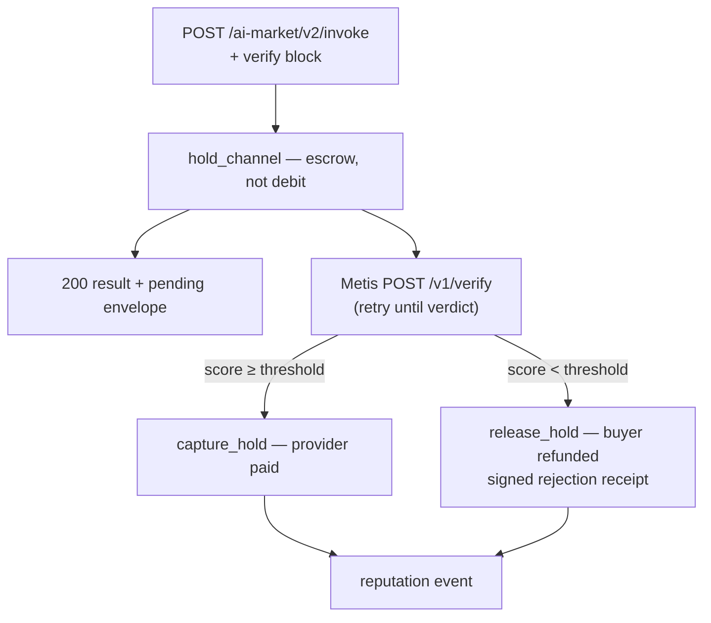

# Pay-on-Verified Settlement

**Product:** `aimarket-hub`  
**Tagline:** *Providers get paid for verified work — buyers keep the output either way.*

## The problem

A marketplace invoke bills on **response**, not on **correctness**:

- A provider that returns garbage is paid like one that returns the right answer
- The buyer's only recourse is off-band complaints — no machine-readable verdict
- Reputation is built from "it responded", not from "it was right"

## Overview

With an optional `verify` block on the invoke body the channel debit becomes an **escrow hold**;
[Metis](https://github.com/alexar76/metis) judges the delivered output against the buyer's stated
intent in the background:

| Step | Mechanism |
|------|-----------|
| **Opt-in** | `verify: { requested, intent, mode, wait }` on `POST /ai-market/v2/invoke` — old clients unaffected |
| **Escrow** | `hold_channel` moves the price to `held` — no debit yet, replay-protected on the receipt nonce |
| **Verdict** | Background worker calls Metis `POST /v1/verify`; transport errors retry forever (backoff, no deadline) |
| **Capture / refund** | `verify_score ≥ threshold` → provider paid; below → buyer refunded + signed rejection receipt |
| **Reputation** | Every performed verdict emits `verify_passed` / `verify_failed` |
| **Audit** | Ed25519-signed envelope + Metis `trace_id`, resolvable at `GET /v1/traces/{trace_id}` |

## Flow

## API surface (v2)

- `POST /ai-market/v2/invoke` — optional `verify: { requested, intent, mode, wait, wait_timeout_s }`
- `GET /ai-market/v2/verification/{nonce}` — envelope (+ `rejection_receipt` when refunded)
- A refund is **HTTP 200** with `verification.status="refunded"` — quality escrow, not
  censorship; `403` stays safety-only (output withheld)

## Operations

- `AIMARKET_VERIFY_ENABLED=1` by default; per-invoke opt-in still required
- Metis endpoint via `AIMARKET_VERIFY_METIS_URL` (falls back to `METIS_URL`)
- No verdict deadline by default — an unresolved hold never pays the provider and never
  captures buyer funds; settlements survive hub restarts (startup reconciliation)
- Indeterminate verdicts follow `AIMARKET_VERIFY_FAIL_CLOSED` (prod defaults to fail-closed)
- Crypto off → advisory mode: verdicts + reputation real, money never moves

See also: [../README.md](../README.md) · [../../docs/pay-on-verified.md](https://github.com/alexar76/aicom/blob/main/docs/pay-on-verified.md)
