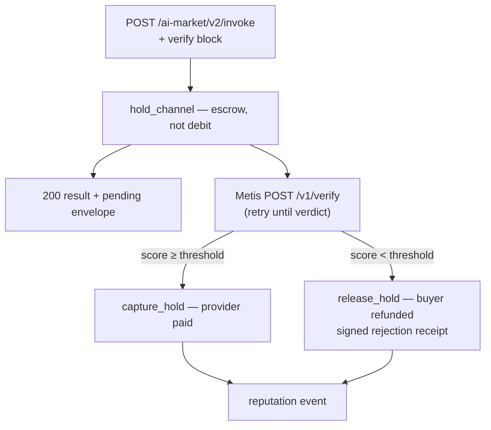
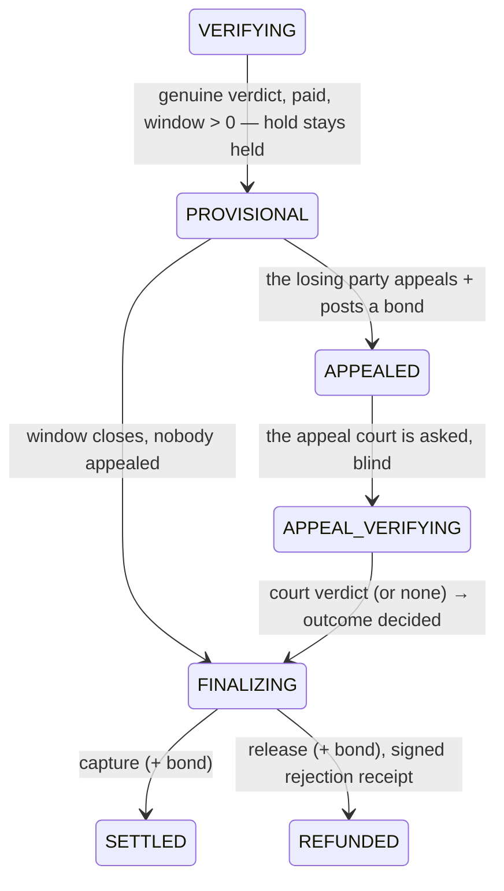

# Pay-on-Verified Settlement

**Product:** `aimarket-hub`  
**Tagline:** *Providers get paid for verified work — buyers keep the output either way.*

## The problem

A marketplace invoke bills on **response**, not on **correctness**:

- A provider that returns garbage is paid like one that returns the right answer
- The buyer's only recourse is off-band complaints — no machine-readable verdict
- Reputation is built from "it responded", not from "it was right"

## Overview

With an optional `verify` block on the invoke body the channel debit becomes an **escrow hold**;
[Metis](https://github.com/alexar76/metis) judges the delivered output against the buyer's stated
intent in the background:

| Step | Mechanism |
|------|-----------|
| **Opt-in** | `verify: { requested, intent, mode, wait }` on `POST /ai-market/v2/invoke` — old clients unaffected |
| **Escrow** | `hold_channel` moves the price to `held` — no debit yet, replay-protected on the receipt nonce |
| **Verdict** | Background worker calls Metis `POST /v1/verify`; transport errors retry forever (backoff, no deadline) |
| **Capture / refund** | `verify_score ≥ threshold` → provider paid; below → buyer refunded + signed rejection receipt |
| **Reputation** | Every performed verdict emits `verify_passed` / `verify_failed` |
| **Audit** | Ed25519-signed envelope + Metis `trace_id`, resolvable at `GET /v1/traces/{trace_id}` |

## Flow

```mermaid
flowchart TB
  INV["POST /ai-market/v2/invoke<br/>+ verify block"]
  HOLD["hold_channel — escrow, not debit"]
  OUT["200 result + pending envelope"]
  METIS["Metis POST /v1/verify<br/>(retry until verdict)"]
  PASS["capture_hold — provider paid"]
  FAIL["release_hold — buyer refunded<br/>signed rejection receipt"]
  REP["reputation event"]

  INV --> HOLD --> OUT
  HOLD --> METIS
  METIS -->|"score ≥ threshold"| PASS
  METIS -->|"score < threshold"| FAIL
  PASS --> REP
  FAIL --> REP
```

## API surface (v2)

- `POST /ai-market/v2/invoke` — optional `verify: { requested, intent, mode, wait, wait_timeout_s }`
- `GET /ai-market/v2/verification/{nonce}` — envelope (+ `rejection_receipt` when refunded)
- A refund is **HTTP 200** with `verification.status="refunded"` — quality escrow, not
  censorship; `403` stays safety-only (output withheld)

## Operations

- `AIMARKET_VERIFY_ENABLED=1` by default; per-invoke opt-in still required
- Metis endpoint via `AIMARKET_VERIFY_METIS_URL` (falls back to `METIS_URL`)
- No verdict deadline by default — an unresolved hold never pays the provider and never
  captures buyer funds; settlements survive hub restarts (startup reconciliation)
- Indeterminate verdicts follow `AIMARKET_VERIFY_FAIL_CLOSED` (prod defaults to fail-closed)
- Crypto off → advisory mode: verdicts + reputation real, money never moves

## Appeals

Off by default. With `AIMARKET_APPEAL_WINDOW_S=0` (the default) nothing below happens and a
verdict moves money the moment it lands, exactly as described above.

A single verifier's verdict is one opinion, and the money it moves cannot be moved back:
there is no un-capture, and a refunded balance can be spent or the channel closed. So an
appeal has to happen **before** the money moves, and the only way to allow that is to wait.
With a window set, a **genuine** verdict (a real pass or fail — never an indeterminate one)
on a **paid** settlement (never an advisory one) becomes *provisional*:

```mermaid
stateDiagram-v2
    VERIFYING --> PROVISIONAL: genuine verdict, paid, window > 0 — hold stays held
    PROVISIONAL --> FINALIZING: window closes, nobody appealed
    PROVISIONAL --> APPEALED: the losing party appeals + posts a bond
    APPEALED --> APPEAL_VERIFYING: the appeal court is asked, blind
    APPEAL_VERIFYING --> FINALIZING: court verdict (or none) → outcome decided
    FINALIZING --> SETTLED: capture (+ bond)
    FINALIZING --> REFUNDED: release (+ bond), signed rejection receipt
```

Every arrow is one conditional statement that only its winner gets past, and the final
outcome is written in the same statement that claims `finalizing` — so a crash, a restart
or a second worker *replays* that decision instead of making another one. A replay that
finds a hold already moved the decided way records it as done (not as a ledger failure) and
accrues nothing twice.

### Who may appeal, and how

`POST /ai-market/v2/verification/{nonce}/appeal` — body `{"statement": "…"}` (optional, ≤ 4000 chars).

| Verdict | Appellant | Credential | Bond held on |
|---|---|---|---|
| passed | the buyer | `X-Payment-Channel-Secret` of the paying channel | that channel, receipt `appeal_<nonce>` |
| failed | the seller | `X-API-Key` of the publisher's hub **credits** account | that credits account, receipt `appeal_<nonce>` |

Only the losing party, only once, and only before the deadline in the provisional envelope's
`appeal.deadline`. A seller paid on-chain through its `payout_address` with no credits
account on this hub has nothing the hub can hold a bond from, so its appeal is **refused**
(`409 seller_appeal_unavailable`) rather than heard unbonded. A legacy channel with no debit
secret cannot authenticate its owner and cannot appeal either.

Answers: `202` filed · `401` bad credential · `403 wrong_party` · `402 bond_unavailable` ·
`409` `already_appealed` / `appeal_window_closed` / `not_appealable` / `verdict_pending` /
`seller_appeal_unavailable` · `503 appeals_unavailable` (no court configured).

### The bond

`bond = max($0.02, 20% × price)`, never more than the price (`AIMARKET_APPEAL_BOND_MIN_USD`,
`AIMARKET_APPEAL_BOND_RATE`). It pays for the second verification when the appeal fails:

| Appeal court says | Final verdict | Invoke hold | Bond |
|---|---|---|---|
| the same as the first verdict | first verdict (**upheld**) | per the verdict | **forfeited** (captured by the operator) |
| the opposite | appeal verdict (**overturned**) | per the appeal verdict | returned |
| nothing usable (split jury, outage, timeout after `AIMARKET_APPEAL_MAX_WAIT_S`) | first verdict (**indeterminate**) | per the verdict | returned |

A forfeited bond goes to the operator's books, not to the other party: winning an appeal
returns the winner's own money; it is not a prize.

### The appeal court

A second verifier at `AIMARKET_APPEAL_METIS_URL` (key `AIMARKET_APPEAL_METIS_KEY`, named in
envelopes by `AIMARKET_APPEAL_VERIFIER_ID`, default `metis.appeal@v1`). The hub refuses to
treat the first-instance URL or verifier id as a court. It is meant to be a separate Metis
instance running a jury on a vendor set disjoint from the first instance — see Metis
README "Jury verification" and `metis/deploy/prod.jury.example.yaml`.

It judges **blind**: the stored intent and delivery, a fresh audit id, and the appellant's
statement as a third fenced, redacted, untrusted span attributed to "one of the two
parties". It never receives the first verdict, its score, its reasons, its trace, the
settlement nonce or even the word "appeal". The court's answer goes through the same
reader as the first verdict: only a genuine pass or fail counts.

### What is deferred, and what is signed

Capture/release, the slash ladder (`record_verified_failure`) and the reputation event all
wait for the **final** outcome — an overturned verdict leaves no fault record and no
reputation edge for the verdict that did not stand. While provisional or under appeal, the
hold stays held, so the buyer's channel cannot be closed and the hold reaper never
releases it (nor the bond): every appeal status is in the reaper's unresolved set.

The envelope carries an `appeal` object — the terms while open (`deadline`,
`appealable_by`, `bond_usd`, `verifier`), then who filed and a digest of the statement (the
statement itself is never served), then the outcome (`first_verdict`, `appeal_verdict`,
`overturned`, `bond`, both trace ids). Any envelope carrying it is signed at
**`VERIFICATION_SIG_VERSION` 3**, which binds the whole object; envelopes without one stay
byte-identical v2. A refund's signed rejection receipt names the appeal in its bound
`reason` (`verify_failed_on_appeal`, `verify_failed_appeal_upheld`,
`verify_failed_appeal_indeterminate`) and carries the trace of the verdict the money
followed.

### The research signal

`GET /ai-market/v2/verification/appeals/stats` — how often the court agreed with the first
instance (`agreement_rate` = upheld / (upheld + overturned)), durable across restarts; plus
the Prometheus counter `aimarket_hub_verify_appeals_total{party,outcome}`.

### What this does and does not guarantee

- It guarantees every hold — invoke and bond — is resolved exactly once, after the final
  outcome, and that nothing irreversible happens to a verdict that can still be appealed.
- It does not make the court right. Two independent verifiers can agree on a wrong answer;
  the bond only prices the appeal, it does not prove the verdict.
- It delays the provider's money by the window, always, for every paid genuine verdict.
- Blindness covers what the hub sends. An appellant's statement can still say "the first
  judge got this wrong", and the court will read it.
- Independence is operational: a court on the same host, operator or gateway as the first
  instance shares their failures. The hub checks only that the URL and id differ.

Knobs: `AIMARKET_APPEAL_WINDOW_S` (0) · `AIMARKET_APPEAL_METIS_URL` · `AIMARKET_APPEAL_METIS_KEY` ·
`AIMARKET_APPEAL_VERIFIER_ID` (`metis.appeal@v1`) · `AIMARKET_APPEAL_BOND_MIN_USD` (0.02) ·
`AIMARKET_APPEAL_BOND_RATE` (0.20) · `AIMARKET_APPEAL_MAX_WAIT_S` (21600; 0 = none) ·
`AIMARKET_APPEAL_SWEEP_S` (30, the safety-net pass that finalizes expired windows and picks up
filed appeals a crashed worker left behind).

See also: [../README.md](../README.md) · [../../docs/pay-on-verified.md](https://github.com/alexar76/aicom/blob/main/docs/pay-on-verified.md)
