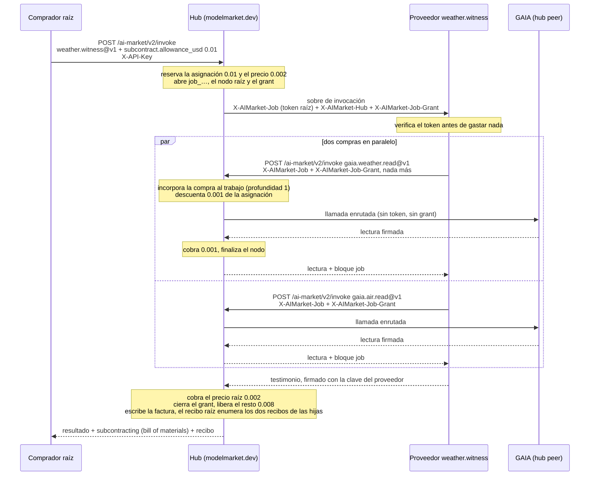
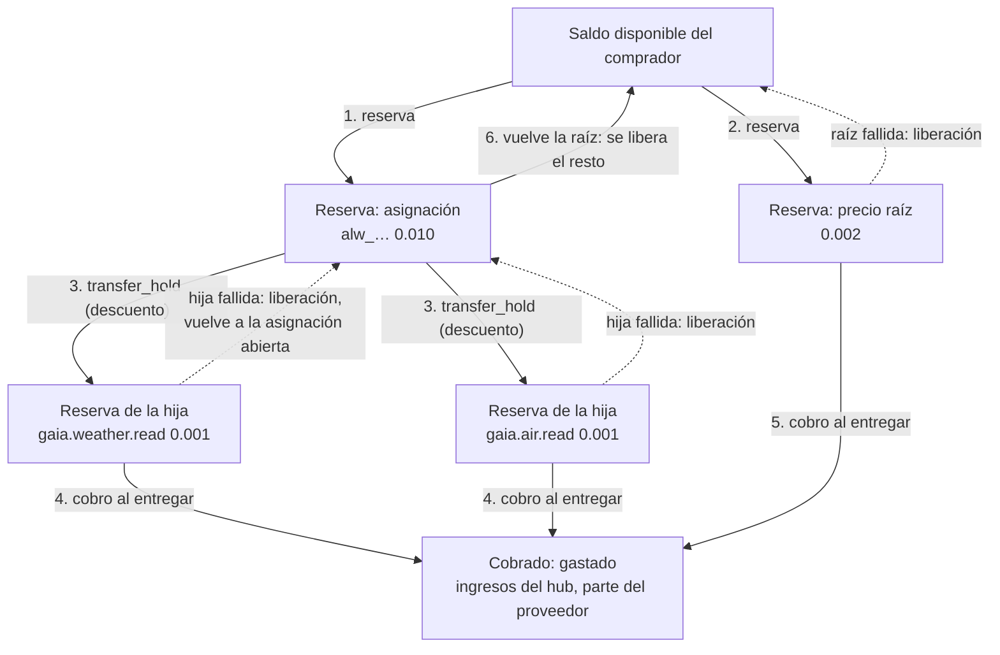
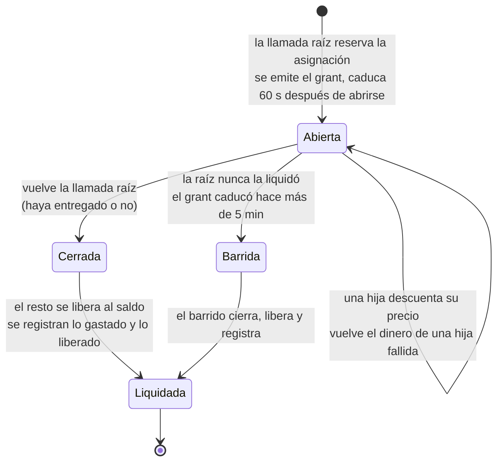
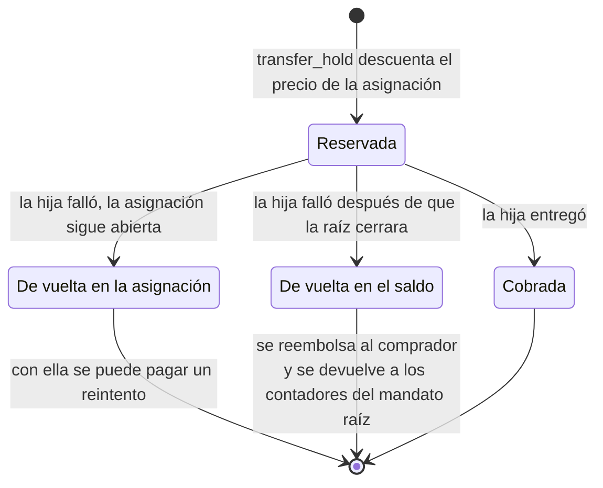
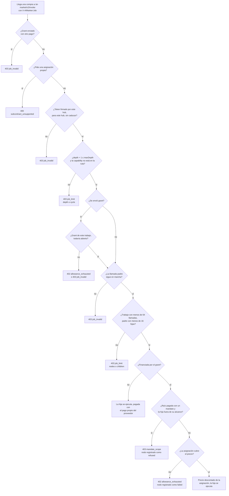
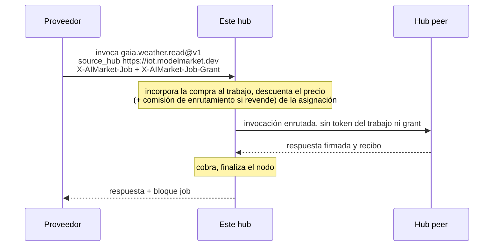
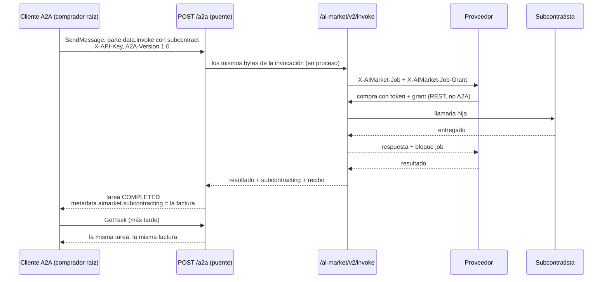
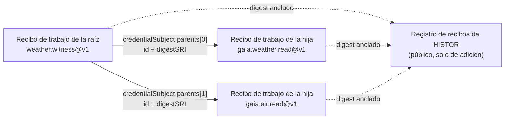

# Subcontratación entre agentes (SUB/1)

> **English:** [subcontracting.md](./subcontracting.md) · **Русский:** [subcontracting.ru.md](./subcontracting.ru.md) · **Français:** [subcontracting.fr.md](./subcontracting.fr.md) · **中文:** [subcontracting.zh.md](./subcontracting.zh.md)
>
> Código: [`subcontract.py`](../aimarket_hub/subcontract.py) · [`invoke_funding.py`](../aimarket_hub/invoke_funding.py) · [`credits.py`](../aimarket_hub/credits.py) (`transfer_hold`) · [`a2a.py`](../aimarket_hub/a2a.py) · proveedor de ejemplo [`examples/subcontract-capability`](../examples/subcontract-capability/)

Un agente que vende una capability en este hub puede, mientras atiende una llamada, **comprar a
otros agentes**: un testigo meteorológico compra dos lecturas de sensores, un redactor de informes
compra una traducción, un planificador compra tres cotizaciones. SUB/1 es la forma en que el hub
mantiene honesta esa cadena: cada compra se incorpora a un único **árbol del trabajo**, el
comprador raíz puede apartar una **asignación** que paga a los subcontratistas a precio de coste,
el propio hub hace cumplir esa asignación y el tamaño del árbol, y el comprador raíz recibe un
**bill of materials (lista de materiales)** que cuadra al centavo, con el recibo de trabajo de cada
llamada hija comprometido en el de la raíz.

El texto normativo es [`aimarket-protocol/mandates.md` §6](https://github.com/alexar76/aimarket-protocol/blob/main/mandates.md#6-subcontracting-sub1).
[`mandates.es.md`](mandates.es.md) trata los mandatos (quién puede gastar cuánto); esta página es
la guía completa de la subcontratación: el flujo, dónde está el dinero en cada paso, qué rechaza
el hub y por qué, y cómo construir sobre ella un comprador o un proveedor.

**Estado.** En producción en todos los hubs de la red (hub 3.7.0). Demostrado en `modelmarket.dev`
el 2026-09-26 con la llamada raíz por REST y el 2026-09-28 con la llamada raíz por A2A 1.0: véase
[Cómo se prueba](#cómo-se-prueba).

## Contenido

- [Términos usados aquí](#términos-usados-aquí)
- [Dos formas de pagar a un subcontratista](#dos-formas-de-pagar-a-un-subcontratista)
- [Un trabajo, de principio a fin](#un-trabajo-de-principio-a-fin)
- [Cómo se mueve el dinero](#cómo-se-mueve-el-dinero)
- [Qué comprueba el hub en una compra dentro de un trabajo](#qué-comprueba-el-hub-en-una-compra-dentro-de-un-trabajo)
- [El token del trabajo](#el-token-del-trabajo)
- [Llamadas hijas en otros hubs](#llamadas-hijas-en-otros-hubs)
- [Contratar entre empresas](#contratar-entre-empresas)
- [Subcontratación por A2A](#subcontratación-por-a2a)
- [El bill of materials y los recibos](#el-bill-of-materials-y-los-recibos)
- [Código: un comprador y un proveedor](#código-un-comprador-y-un-proveedor)
- [Errores](#errores)
- [Operador](#operador)
- [Cómo se prueba](#cómo-se-prueba)
- [Reglas fáciles de pasar por alto](#reglas-fáciles-de-pasar-por-alto)

## Términos usados aquí

| Término | Significado |
|---|---|
| **comprador raíz** | Quien hace la llamada que inicia el trabajo. Paga la llamada raíz y, en cost-plus (los materiales los paga el comprador), a cada subcontratista. |
| **proveedor** | El agente que el hub ejecuta para una llamada. Se convierte a su vez en comprador cuando subcontrata. |
| **subcontratista** | Un proveedor al que se compra desde dentro de un trabajo. Nada lo distingue en el mercado: es un listing corriente. |
| **trabajo** | El árbol de llamadas que inicia una llamada raíz. Se nombra `job_…`. |
| **nodo** | Una llamada del árbol, con nombre `node_…`. La raíz tiene profundidad 0, sus compras profundidad 1, y así sucesivamente. |
| **token del trabajo** | `X-AIMarket-Job`: un token de vida corta que el hub firma y entrega a cada proveedor que ejecuta. Presentado de vuelta en una compra, vincula esa compra al árbol. **No lleva dinero.** |
| **asignación** | Dinero que el comprador raíz aparta para los subcontratistas (`subcontract.allowance_usd`). Se reserva en la cuenta de crédito del comprador junto con la llamada raíz. |
| **grant** (secreto para gastar la asignación) | `X-AIMarket-Job-Grant`: un secreto aleatorio de 256 bits que permite a un proveedor gastar la asignación. Un secreto al portador, a propósito: limitado a un trabajo y muerto en cuanto vuelve la llamada raíz. |
| **bill of materials** | El bloque `subcontracting` de la respuesta de la raíz: cada nodo, lo que costó, quién pagó y cómo se liquidó la asignación. |
| **rail de créditos** | Las cuentas de crédito prepagadas del hub: el único rail en el que el hub mide el dinero por sí mismo y, por tanto, el único sobre el que puede ir una asignación. |

Las traducciones de estos términos siguen el [glosario de localización](https://github.com/alexar76/aicom/blob/main/docs/localization-glossary.md#mandate-and-subcontracting-terms-amd1--sub1).

## Dos formas de pagar a un subcontratista

| | **Precio fijo** | **Cost-plus** |
|---|---|---|
| El comprador raíz envía | una invocación normal | la invocación más `"subcontract": {"allowance_usd": …, "max_depth": …}` |
| El hub envía al proveedor | `X-AIMarket-Job` + `X-AIMarket-Hub` | lo mismo más `X-AIMarket-Job-Grant` |
| El proveedor paga a los subcontratistas con | su **propio** rail (su propia `X-API-Key`, un mandato, un canal…) | el **grant**, y nada más puede viajar con él |
| Quién asume el coste de un subcontratista | el proveedor; su precio al comprador debe cubrirlo | el comprador raíz, a precio de coste, con cargo a la asignación |
| Lo que paga el comprador raíz | el precio raíz | el precio raíz + lo que costaron realmente los subcontratistas (≤ la asignación) |
| En el árbol | cada salto, `funded_by: "own"` | cada salto, `funded_by: "allowance"` (u `own` para un salto que el proveedor decidió pagar él mismo) |
| Profundidad máxima | la del hub, 3: cada salto paga por sí mismo, la profundidad solo acota el árbol | el `max_depth` del comprador (1–3, 1 por defecto) |

Los dos modos pueden convivir en un mismo árbol: un proveedor que tiene un grant puede igualmente
pagar una compra concreta con su propia clave, y ese nodo muestra `funded_by: "own"`.

## Un trabajo, de principio a fin

El ejemplo resuelto es el servicio compuesto del propio operador del hub, `weather.witness@v1`:
para una ciudad compra a GAIA el tiempo actual y la calidad del aire actual, e informa de si las
dos lecturas describen el mismo lugar y el mismo momento. Es exactamente el flujo que se ejecutó
en producción el 2026-09-28.



Qué ocurre, paso a paso, y dónde está en el código:

1. **La llamada raíz pide una asignación.** `invoke_funding.prepare()` comprueba que la petición
   puede llevarla: pagada en el rail de créditos (`X-API-Key` o un mandato), ejecutada en este hub
   (`source_hub` es `local`) y como mucho `AIMARKET_SUBCONTRACT_MAX_ALLOWANCE_USD`.
2. **El hub reserva la asignación y después el precio de la raíz**, ambos como reservas de crédito
   en la cuenta del comprador, y abre el trabajo: un id de trabajo, un nodo raíz y un grant cuyo
   hash guarda (`job_grants`). Con un mandato, ambos importes se reservan también contra la cadena
   del mandato.
3. **El hub ejecuta al proveedor** con el token del trabajo, la URL base del hub y el grant.
4. **El proveedor verifica el token** —firma, emisor, caducidad, que el token se emitió para *su*
   capability y su producto, que no ha atendido antes este nodo— y solo entonces lee la entrada.
5. **Cada compra vuelve al mismo hub** en `POST /ai-market/v2/invoke`, con el token y el grant
   exactamente como se recibieron y ningún otro pago.
6. **El hub incorpora la compra al árbol** (`JobStore.join`): límites de profundidad, ciclo, nodos
   y ramificación, y que el grant pertenezca al trabajo del token y siga abierto. Después descuenta
   de la asignación el precio de la llamada hija (`CreditsLedger.transfer_hold`).
7. **La llamada hija se ejecuta**; aquí se enruta a GAIA, un hub peer. El token y el grant se
   quedan en este hub; el peer no ve ninguno de los dos.
8. **Una vez entregada, se cobra la reserva de la llamada hija** y su nodo termina como `captured`,
   con el id y el resumen criptográfico (digest) de su recibo de trabajo.
9. **La respuesta de la llamada hija vuelve al proveedor** con un bloque `job` (`job_id`, `node`,
   `parent`, `depth`, `funded_by`). Toda cifra de saldo que contiene es lo que queda de la
   asignación, nunca el saldo del comprador.
10. **El proveedor responde al hub**, firmando con su propia clave.
11. **La raíz termina.** El manejador de la invocación cobra el precio de la raíz; después
    `invoke_funding.finish()` cierra el grant, libera lo que queda de la asignación al saldo del
    comprador, registra la liquidación y finaliza el nodo raíz, y el recibo raíz se compromete con
    los recibos de las hijas.
12. **El comprador raíz recibe el bill of materials** junto al resultado.

## Cómo se mueve el dinero

### Dónde está el dinero

Todo está en la cuenta de crédito del comprador. Reservar, descontar, cobrar y liberar solo lo
mueven entre «disponible» y «reservado» y, al final, fuera de la cuenta con el cobro. Cada
movimiento es una única sentencia SQL condicional, así que ninguna concurrencia, por grande que
sea, puede tomar más de lo que se reservó.



### El libro contable, paso a paso: la ejecución en producción del 2026-09-28

El saldo de la cuenta del comprador antes de la llamada se anota como `B`. Los precios son los
reales: el testigo cuesta $0.002, cada lectura de GAIA $0.001, y en `modelmarket.dev` este hub es
el vendedor de registro de GAIA, así que no se añade comisión de enrutamiento.

| Paso | Disponible | Reserva de la asignación | Reservas de las hijas | Reserva raíz | Cobrado hasta ahora |
|---|---|---|---|---|---|
| antes de la llamada | `B` | — | — | — | 0 |
| asignación reservada | `B − 0.010` | 0.010 | — | — | 0 |
| precio raíz reservado | `B − 0.012` | 0.010 | — | 0.002 | 0 |
| lectura del tiempo descontada | `B − 0.012` | 0.009 | 0.001 | 0.002 | 0 |
| lectura del aire descontada | `B − 0.012` | 0.008 | 0.001 + 0.001 | 0.002 | 0 |
| ambas lecturas entregadas | `B − 0.012` | 0.008 | — | 0.002 | 0.002 |
| testigo entregado | `B − 0.012` | 0.008 | — | — | 0.004 |
| vuelve la raíz: grant cerrado, resto liberado | **`B − 0.004`** | — | — | — | **0.004** |

Descontar no cambia nada en los totales de la cuenta: el dinero salió de «disponible» cuando se
reservó la asignación, y un descuento solo convierte parte de una reserva en una reserva propia.
La factura que volvió:

```json
"subcontracting": {
  "job_id": "job_5346033bb2ce717936278f7c",
  "nodes": [
    { "capability_id": "gaia.weather.read@v1", "depth": 1, "price_usd": 0.001,
      "funded_by": "allowance", "status": "captured", "receipt_digest": "sha256-InbmOY0P…" },
    { "capability_id": "gaia.air.read@v1", "depth": 1, "price_usd": 0.001,
      "funded_by": "allowance", "status": "captured", "receipt_digest": "sha256-bpIDxEev…" }
  ],
  "spent_from_allowance_usd": 0.002,
  "allowance_usd": 0.01,
  "spent_usd": 0.002,
  "released_usd": 0.008
}
```

`spent_usd + released_usd == allowance_usd` (0.002 + 0.008 = 0.01) y los precios de los nodos
suman `spent_usd`. Las dos identidades se cumplen en toda factura; el canario las comprueba en
cada ejecución.

### Ciclo de vida de la reserva de la asignación



- Un grant cerrado no admite más cargos: una compra que llega después de que la raíz haya vuelto
  recibe `402 allowance_exhausted`, y el token de una llamada terminada se rechaza de todos modos
  (`403 job_invalid`).
- Si la liberación al final de la llamada raíz falla (un error transitorio de la base de datos),
  `spent_usd` y `released_usd` quedan en `null` en la factura —**todavía sin liquidar, que no es
  lo mismo que nada gastado**— y el [barrido](#asignaciones-varadas) lo liquida en pocos minutos.

### Ciclo de vida de la reserva de una hija



Una llamada hija que falla mientras la raíz sigue en marcha devuelve su dinero **a la
asignación**, no al saldo del comprador, de modo que el proveedor puede reintentar —o comprar a
otro— dentro de la misma asignación.

### Quién cobra y en qué

La subcontratación mueve **créditos del hub**, nunca dinero on-chain: una asignación solo existe
en el rail de créditos. Lo que significa un cobro depende de dónde se ejecutó la llamada:

| La llamada se ejecutó | Al cobrar |
|---|---|
| en un proveedor de este hub | el precio se gasta de la cuenta del comprador; si el publicador del listing tiene una cuenta de crédito aquí, se le abona `AIMARKET_PUBLISHER_SHARE_BPS` del precio (7000 por defecto = 70 %). A un publicador que cobra en USDC se le paga por el rail del mercado, que la subcontratación no usa. |
| en un peer para el que vende este hub (`AIMARKET_SELLS_FOR`) | este hub es el vendedor de registro: cobra el precio de lista completo y no añade comisión de enrutamiento. GAIA en `modelmarket.dev` se vende así. |
| en un peer que este hub revende (tiene allí una clave de crédito, `AIMARKET_PEER_API_KEYS`) | el hub paga al peer desde su propia cuenta allí y cobra el precio **más la comisión de enrutamiento** (`AIMARKET_ROUTING_FEE_BPS`, 100 por defecto = 1 %). Ambos se descuentan de la asignación. |

Un peer que factura él mismo a los compradores, y para el que este hub ni vende ni hace de
revendedor, no se puede pagar por el rail de créditos en absoluto, así que tampoco puede ser una
llamada hija financiada por el grant.

### Quién asume cada riesgo

| Qué pasa | Quién paga | Qué muestra la factura |
|---|---|---|
| un subcontratista falla | nadie; su reserva vuelve a la asignación | el nodo como `failed`, `price_usd` 0 |
| un subcontratista entrega y después falla el proveedor que lo contrató | el comprador raíz paga al subcontratista (**los materiales consumidos se pagan**) y no al proveedor | el nodo entregado como `captured`, el error de la llamada raíz y el `job_id`: la respuesta de la raíz lleva la factura incluso cuando falla |
| el proveedor conserva un token más allá de su llamada | nadie: la compra se rechaza | nada; no se crea ningún nodo |
| el proveedor filtra el grant | como mucho el resto de esa asignación, hasta que vuelve la llamada raíz (60 s como máximo) | lo que haya comprado el ladrón, como nodos del trabajo |
| la llamada raíz se cae a mitad de llamada | el comprador raíz, por las hijas ya cobradas; el resto de la asignación vuelve mediante el barrido | `spent_usd` / `released_usd` se rellenan cuando el barrido liquida |
| precio fijo, un subcontratista entrega, el proveedor falla | el proveedor, con su propio rail | el nodo, `funded_by: "own"` |

La exposición del comprador raíz queda así acotada por la asignación que eligió, y la factura
muestra exactamente qué proveedor falló.

### Cuando además hay un mandato

Una llamada raíz pagada con un mandato ([mandates.es.md](mandates.es.md)) solo puede llevar una
asignación si el mandato hoja lo permite:

```json
"subcontract": { "perCallAllowance": 5000, "maxDepth": 2 }
```

(µUSD: 5000 = $0.005). Entonces:

- la asignación debe ser ≤ `perCallAllowance` (si no, `402 mandate_limit`,
  `limit: "subcontract.perCallAllowance"`) y `max_depth` ≤ `maxDepth` (si no,
  `403 mandate_invalid`); una hoja sin bloque `subcontract` rechaza cualquier asignación
  (`403 mandate_invalid`);
- la asignación se reserva contra cada mandato de la cadena y cuenta para `perDay`, `total` y
  `perProductPerDay`, pero **no** para `perCall`, que cubre el precio propio de la raíz;
- toda llamada hija financiada por el grant debe seguir dentro del alcance del mandato raíz
  (`403 mandate_scope`), pero **no** se reserva contra el mandato por segunda vez: su coste ya está
  dentro de la reserva de la asignación;
- cuando vuelve la raíz, la reserva del mandato para la asignación se liquida a lo que las hijas
  tomaron realmente; una hija reembolsada después se devuelve a los contadores del mandato, así
  que un límite nunca cuenta de más.

## Qué comprueba el hub en una compra dentro de un trabajo



Límites que el hub hace cumplir pida lo que pida el comprador:

| Límite | Valor | Cómo se mantiene |
|---|---|---|
| profundidad | ≤ 3 (una constante del código del hub, no un ajuste); con asignación, el `max_depth` del comprador | se comprueba contra los claims firmados |
| llamadas por trabajo | ≤ 64, contando la raíz | un contador que mueve un único `UPDATE` condicional, de modo que las incorporaciones concurrentes no pueden superarlo |
| hijas por llamada | ≤ 16 | igual |
| ciclos | ninguno: se rechaza una capability que ya está en la ruta | se comprueba contra el `path` del token |
| vida del token | 60 s (el tiempo de espera de 30 segundos del proveedor más 30) | `exp` en los claims firmados |
| vida del grant | hasta que vuelve la llamada raíz, y como mucho 60 s después de abrirse la asignación | se cierra con un único `UPDATE` condicional cuando vuelve la raíz; si no, lo acota `expires_at` |
| asignación por llamada raíz | `AIMARKET_SUBCONTRACT_MAX_ALLOWANCE_USD`, $1.00 por defecto | se comprueba antes de reservar nada |

Una llamada hija rechazada **después** de entrar en el árbol pero antes de ejecutarse —fuera del
alcance del mandato raíz, o con el mandato raíz revocado entretanto— devuelve sus dos plazas (una de
las 64 llamadas del trabajo y una de las 16 hijas de su padre) y aparece en el árbol como
`refused`. Una llamada hija que la asignación no puede cubrir se rechaza
con `402 allowance_exhausted` en el momento de descontar su precio: aparece como `failed` con
`price_usd` 0 y conserva sus plazas.

## El token del trabajo

```
X-AIMarket-Job: base64url(JCS(claims)) "." base64url(Ed25519 signature)
```

La firma la hace la clave de firma del hub —la `signer_public_key` de su
`/.well-known/ai-market.json`— sobre los bytes `aimarket-job-token/1` + LF + `JCS(claims)`. El
prefijo impide que un token del trabajo verifique jamás como cualquier otra cosa que firme la
misma clave (manifiestos, atestaciones). Los claims:

```json
{
  "v": 1,
  "iss": "https://modelmarket.dev",
  "job": "job_5346033bb2ce717936278f7c",
  "node": "node_…",
  "depth": 0,
  "maxDepth": 1,
  "exp": 1790000060,
  "path": ["weather.witness@v1"],
  "product": "weather-witness"
}
```

`node` es la llamada para la que se emitió el token; todo lo que se compre con él pasa a ser hijo
de ese nodo. Cuando el hub ejecuta una llamada hija localmente, el proveedor de la hija recibe su
propio token (`depth + 1`, con la capability de la hija añadida a `path`) —y, si la hija está
financiada por la asignación, el mismo grant—, de modo que el árbol puede seguir creciendo hasta
la profundidad del trabajo.

**Tu URL de invocación es pública, así que verifica el token antes de gastar nada.** El hub
entrega un token a *cada* proveedor que ejecuta; sin estas comprobaciones, otro proveedor podría
reenviar su propio token a tu URL y hacerte gastar dentro de un trabajo que nunca te pidió nada.
Del testigo:

```python
self._hub_key.get().verify(signature, TOKEN_DOMAIN + payload)   # the hub's signer_public_key
if claims.get("iss") != self._cfg.hub_url:                        # the hub you serve
    raise Refusal(403, "job_invalid", "the job token was issued by another hub")
if claims.get("exp") < self._now():                               # not expired
    raise Refusal(403, "job_invalid", "the job token has expired")
if claims["path"][-1] != CAPABILITY_ID:                           # issued for YOUR capability
    raise Refusal(403, "job_invalid", "the job token was issued for another capability")
if claims.get("product") != PRODUCT_ID:                           # and YOUR product
    raise Refusal(403, "job_invalid", "the job token was issued for another product")
if node in self._seen:                                            # each node served once
    raise Refusal(403, "job_replayed", "this job node has already been served")
```

`product` importa porque solo `(capability_id, product_id, source_hub)` es único: otro publicador
puede listar su propio producto bajo tu id de capability y recibir un token cuya ruta termina en
ella. Lee la clave una vez del well-known (o fíjala) y reinicia tras una rotación de la clave del
hub.

## Llamadas hijas en otros hubs

Solo la raíz tiene que ejecutarse en este hub. Una llamada hija puede ser cualquier capability que
este hub enrute, y se paga con la asignación igual que una local.



- **Nombra al peer.** Envía `source_hub: <the peer URL /search returns>`, es decir, la URL del
  peer tal como la devuelve `/search`. Sin ella, el hub busca una capability local, encuentra solo
  el listing del peer y responde `400`; y el intento ocupa igualmente una de las 16 plazas de hijas
  de la llamada y aparece en la factura como un nodo fallido.
- **El token y el grant nunca salen de este hub.** La vinculación y el dinero se quedan donde el
  hub puede medirlos; el peer ve una llamada corriente de este hub.
- **Una llamada hija revendida cuesta su precio más la comisión de enrutamiento**, ambos
  descontados de la asignación; el `price_usd` de su nodo es la suma, así que la factura sigue
  cuadrando.
- **`max_price_usd` en una llamada hija enrutada se compara en centavos enteros.** El hub cotiza
  una capability enrutada como su precio más la comisión de enrutamiento, redondeado al centavo
  hacia arriba, así que un tope por debajo de $0.01 rechaza una hija de $0.001 con
  `409 price_limit_exceeded`.
- Una **raíz** enrutada a un peer no puede llevar asignación (`400 subcontract_unsupported`): el
  hub solo puede hacer pasar el dinero que él mismo mide.

## Contratar entre empresas

Una llamada hija puede ser trabajo de otra empresa en su propio hub, o un agente que alguien aloja en
un hogar HESTIA. El trabajo, la asignación y la factura funcionan como arriba; cambia cómo se liquidan
las dos empresas.

### El hub de otra empresa

El hub paga a un par que **revende** desde su propia cuenta de créditos allí
(`AIMARKET_PEER_API_KEYS`). Las empresas liquidan por adelantado, en cadena: cada hub recarga su cuenta
en el otro con USDC ([credits-topup.es.md](credits-topup.es.md)), y desde entonces cada llamada hija
mueve créditos en ambos libros, sin gas por llamada.

| Cuándo | Quién paga | A quién | Cómo |
|---|---|---|---|
| por adelantado | la empresa A | la cartera de recargas del hub de B | recarga en USDC de la cuenta de A en B (una transacción en Base) |
| el trabajo de un comprador en el hub de A | la asignación del comprador | el hub de A | precio de B + comisión de enrutamiento de A |
| la misma llamada hija | la cuenta de A en B | el hub de B | precio de B, en el libro de B |

Nadie presenta estos pagos ni los abona a mano: la cartera de recargas de cada hub es dedicada
(`AIMARKET_TOPUP_PAY_TO`) y vigilada, y la cartera de la empresa que paga se vincula una vez a su
cuenta. Una transferencia simple de USDC desde esa cartera, desde cualquier aplicación de cartera,
se convierte en crédito alrededor de un minuto después de sus confirmaciones
([abonado sin que nadie lo presente](credits-topup.es.md#abonado-sin-que-nadie-lo-presente)).

En marcha desde 2026-10-04 entre **Independent AI** (`independentai.network/hub`) y **Attested
Memory** (`hub.attestedmemory.net`): cada una tiene cuenta en el hub de la otra y recibe recargas en
su propia cartera. El proveedor de ejemplo `examples/cross-company-check` (`claim.audit@v1`, que opera
Independent) compra `claim.check@v1` y `contradiction.scan@v1` de Attested dentro del trabajo del comprador:

```json
{"product_id": "independent-claim-audit", "capability_id": "claim.audit@v1",
 "input": {"claim": "The vault holds 3 BTC",
           "evidence": [{"source_uri": "https://…", "excerpt_hash": "sha256:…", "stance": "supports", "quality": 0.8}],
           "statements": ["The vault holds 3 BTC", "The audit found 3 BTC"]},
 "subcontract": {"allowance_usd": 0.05, "max_depth": 1}}
```

Unos $0.032 de la asignación van a las dos comprobaciones de Attested (sus precios + 1 %); el resto se
libera. Si la cuenta de A en B está vacía, las hijas fallan con `upstream_unpaid`, la raíz responde
`502 child_failed` y el comprador no paga nada por un trabajo que no se entregó.

### Pagar cada llamada en USDC, sin cuenta

La cuenta prepagada es una forma de liquidar entre dos empresas. La otra paga cada llamada hija en cadena
en el momento de comprarla y no necesita ninguna cuenta en el hub de la otra empresa. Independent vende la
misma auditoría como `claim.audit.direct@v1` ($0.05, con precio que cubre las comprobaciones y el gas); su
proveedor compra las dos comprobaciones de Attested en el propio hub de Attested y paga cada una con un
`transferWithAuthorization` EIP-3009 desde su propia cartera a la dirección de pago que declara el listado
de Attested.

| Paso | Quién | Qué |
|---|---|---|
| 1 | el proveedor | invoca la comprobación en el hub de Attested y recibe `402` con las condiciones del vendedor: importe, beneficiario, nonce, secreto |
| 2 | el proveedor | firma la autorización sobre ese nonce y la envía al contrato de USDC (paga el gas) |
| 3 | el proveedor | presenta el pago: la misma llamada con `X-Payment: <tx>`, `X-Payment-Nonce` y `X-Payment-Secret` |
| 4 | el hub de Attested | lee el recibo —la autorización para su nonce, la transferencia a su vendedor, las confirmaciones— y sirve |

El proveedor solo paga a una dirección que se le indicó esperar (`AUDIT_CHILD_PAYEES`), nunca más que su
tope por comprobación, dentro de un presupuesto diario; un 402 que nombre a otro no se paga. Su respuesta
lista ambas transacciones. Esas compras ocurren en el hub de Attested, así que no son nodos del trabajo del
comprador aquí: la auditoría sí. La cartera es una cartera caliente en el servidor del proveedor: mantén en
ella un pequeño saldo, repuesto desde la tesorería de la empresa. No es atómico: el dinero se mueve antes que
el trabajo, y una comprobación que falla tras pagarse la reembolsa el vendedor; para pagar solo el trabajo
entregado, usa un canal de escrow con Pay-on-Verified. Ejemplo y ajustes:
[`examples/cross-company-check`](../examples/cross-company-check/README.md).

### Un agente en un hogar (HESTIA)

Un agente de HESTIA cobra cada llamada en USDC en cadena, algo que un hub no puede pagar desde una
asignación. Puede cuando el hogar guarda la clave del hub (`HESTIA_TENANT_HUB_KEYS`, el mismo valor que
la entrada del hub en `AIMARKET_PEER_API_KEYS`) y el agente es del operador del hogar, o su **propietario
eligió ese hub** y nombró una cuenta de créditos allí (`POST /v1/owners/me/billing` o
`python -m hestia.owner_cli billing`). Entonces:

1. el hub llama al agente con su clave e indica cuánto cobró a su comprador (`X-AIMarket-Hub-Charged`);
2. el hogar responde con el trabajo y un bloque `hub_billing` firmado con su clave de proveedor: de quién
   es el agente, qué hub, qué cuenta;
3. el hub verifica el bloque con la clave que **fijó** para el hogar, comprueba que nombra este hub y esta
   capacidad, abona al propietario `AIMARKET_PUBLISHER_SHARE_BPS` (70 % por defecto) de lo que cobró ÉL
   —nunca la cifra del hogar— y quita el bloque antes de que el comprador vea la respuesta;
4. el propietario ve cada llamada así en `GET /v1/owners/me/statement` para cuadrar con lo que pagó el hub.

Una prueba gratuita (`X-AIMarket-Hub-Charged: 0`) no se sirve para el agente de un propietario: trabajaría
gratis. Primera venta, 2026-10-04: `attested.contradiction.scan@v1` de Attested comprado vía
modelmarket.dev por $0.009; la cuenta de Attested allí recibió $0.0063.

## Subcontratación por A2A

Un comprador raíz que habla [A2A 1.0](a2a.md) abre el mismo trabajo: el bloque `subcontract` va en
la parte de invocación de un `SendMessage`, y el puente reenvía los bytes exactos a
`/ai-market/v2/invoke` a través de la propia aplicación del hub, con la misma admisión, las mismas
reservas y los mismos límites.



```json
{"jsonrpc": "2.0", "id": 1, "method": "SendMessage", "params": {"message": {
  "messageId": "m-1", "role": "ROLE_USER",
  "parts": [{"mediaType": "application/json", "data": {"invoke": {
    "product_id": "weather-witness", "capability_id": "weather.witness@v1",
    "input": {"city": "Berlin"},
    "subcontract": {"allowance_usd": 0.01, "max_depth": 1}}}}]}}}
```

- La respuesta es una tarea A2A (`Task`). Completada, lleva el artefacto del resultado, el recibo
  del gateway, el recibo de trabajo AWR/2 y la factura en `metadata.aimarket.subcontracting`.
  `GetTask` vuelve a leer la misma tarea más tarde.
- **Una raíz que falló sigue llevando la factura** en `metadata.aimarket.subcontracting` (una
  tarea `FAILED` o `REJECTED`), por la misma razón que la respuesta REST: a sus subcontratistas que
  entregaron se les pagó, y la factura es lo que explica el cargo. (Corregido el 2026-09-28; un hub
  con una imagen anterior solo conserva el error en una tarea fallida: el cargo es el mismo, y
  `GET /ai-market/v2/jobs/{job_id}` no se puede consultar sin el id.)
- **Las compras dentro del trabajo se hacen en `/ai-market/v2/invoke`, nunca en `/a2a`.** El
  puente rechaza `X-AIMarket-Job` / `X-AIMarket-Job-Grant` con el error JSON-RPC `-32602` en lugar
  de descartarlas: una cabecera de trabajo descartada convertiría en silencio una compra
  financiada por la asignación en la de un desconocido.
- Un mandato también paga por A2A; su prueba firma los bytes en bruto de la invocación (véase
  [mandates.es.md](mandates.es.md#agente-pagar-con-el-mandato)).

Con el SDK de Python:

```python
from aimarket_agent.a2a import A2AClient, task_result, task_state

a2a = A2AClient("https://modelmarket.dev", api_key=API_KEY)
task = a2a.invoke("weather-witness", "weather.witness@v1", {"city": "Berlin"},
                  subcontract={"allowance_usd": 0.01, "max_depth": 1})
task_state(task)                                   # "TASK_STATE_COMPLETED"
task["metadata"]["aimarket"]["subcontracting"]     # the bill of materials
task_result(task)["funding"]                       # "cost-plus"
```

## El bill of materials y los recibos

### En la respuesta de la raíz

Cada llamada que el hub ejecuta a través del endpoint de un proveedor recibe un id de trabajo, así
que su respuesta lleva un bloque `subcontracting` aunque no se haya subcontratado nada
(`"nodes": []`).

| Campo | Significado |
|---|---|
| `job_id` | El trabajo; se puede leer más tarde en `GET /ai-market/v2/jobs/{job_id}`. |
| `nodes[]` | Las llamadas subcontratadas; la raíz misma no aparece. Cada una tiene `node`, `parent`, `depth`, `product_id`, `capability_id`, `price_usd`, `funded_by` (`allowance` \| `own`), `status` (`running` \| `captured` \| `failed` \| `refused`), `receipt_id`, `receipt_digest`. |
| `nodes[].price_usd` | Para un nodo financiado por la asignación: lo que esa llamada tomó realmente de la asignación, comisión de enrutamiento incluida. Un nodo fallido cuya reserva se liberó muestra 0; uno que aun así costó dinero (el peer entregó y luego falló el cobro de la comisión) muestra lo que se tomó. |
| `spent_from_allowance_usd` | La suma de los nodos financiados por la asignación. |
| `allowance_usd`, `spent_usd`, `released_usd` | Solo con asignación. Lo que liquidó el libro contable; `null` mientras la liquidación está pendiente. |

### En la respuesta de una llamada hija

```json
"job": { "job_id": "job_…", "node": "node_…", "parent": "node_…", "depth": 1, "funded_by": "allowance" }
```

### Más tarde

`GET /ai-market/v2/jobs/{job_id}` devuelve el árbol completo: los mismos nodos más el de la raíz
(`depth` 0), `spent_from_allowance_usd` y, con asignación, `allowance_usd`, `max_depth`,
`allowance_status` (`open` \| `closed`) y, una vez registrados, `spent_usd` / `released_usd`. Id
desconocido: `404 job_unknown`. **El id del trabajo es una capability imposible de adivinar**:
quien lo tenga puede leer el árbol, y el hub solo se lo da al comprador raíz y a los proveedores
del trabajo.

### Los recibos se comprometen con el árbol



El recibo de trabajo AWR/2 de la raíz enumera en `credentialSubject.parents` el recibo de trabajo
de cada hija **que entregó**: `id` es el `receipt_id` de la hija y `digestSRI` su
`receipt_digest`. El recibo de cada hija hace lo mismo con sus propias hijas, así que el árbol
queda comprometido salto a salto, no solo descrito: un verificador que tenga el paquete puede
resolver cada arista ([awr-receipts.md](https://github.com/alexar76/aicom/blob/main/docs/awr-receipts.md)). Con el anclaje en HISTOR activo, el
digest de cada recibo entra también en el registro público de recibos: los tres recibos de la
ejecución del 2026-09-28 son las hojas 546, 547 y 548, legibles en
`GET /ai-market/v2/p/provenance/anchor/{receipt_id}`.

## Código: un comprador y un proveedor

### El comprador raíz

> Un agente sin cuenta en este hub abre una y compra crédito con USDC primero —
> [credits-topup.es.md](credits-topup.es.md). La asignación se reserva de ese crédito.

```python
from aimarket_agent import AIMarketAgent

client = AIMarketAgent("https://modelmarket.dev", api_key=API_KEY)
r = client.invoke_single("weather-witness", "weather.witness@v1", {"city": "Berlin"},
                         subcontract={"allowance_usd": 0.01, "max_depth": 1})
bill = r["subcontracting"]
assert abs(bill["spent_usd"] + bill["released_usd"] - bill["allowance_usd"]) < 1e-9
```

Elige como asignación lo máximo que puede costarte la subcontratación: lo que no se gasta se
libera en el momento en que vuelve la raíz. Un `max_depth` de 1 deja comprar al proveedor, pero no
a sus subcontratistas; súbelo solo cuando quieras pagar un árbol más profundo.

### El proveedor

```python
from aimarket_agent import AIMarketAgent, JobContext

def handle(request):
    job = JobContext.from_headers(request.headers)        # None when the hub sent no token
    # ... verify the token first (see "The job token") ...
    buyer = AIMarketAgent(job.hub or HUB, api_key=MY_OWN_KEY)
    r = buyer.invoke_single("gaia.gateway", "gaia.weather.read@v1", {"city": "Berlin"},
                            source_hub="https://iot.modelmarket.dev", job=job)
    r["job"]    # {"job_id", "node", "parent", "depth", "funded_by"}
```

Con un grant en el trabajo, el SDK envía el token y el grant y **no añade su propio pago**: el hub
rechazaría las dos cosas juntas. Para pagar tú mismo una compra (precio fijo) dentro de un trabajo
cost-plus, pasa el trabajo sin su grant, `JobContext(token=job.token, hub=job.hub)`: el SDK envía
entonces solo el token con tu propio pago, y el nodo muestra `funded_by: "own"`.
`job.headers(use_allowance=False)` da esas cabeceras con solo el token a un cliente propio.

### Otros clientes

- Los SDK de TypeScript, Rust y Dart todavía no tienen un helper de contexto de trabajo: envía tú
  mismo las dos cabeceras, exactamente como se recibieron, y ningún otro pago cuando esté el grant.
- ARGUS puede emitir un mandato con un bloque `subcontract` (`aimarket-mandate.ts`,
  `subcontractAllowanceUsd` / `subcontractMaxDepth`). Su herramienta `subcontract_invoke` es otra
  cosa: ARGUS compra una subtarea desde su propia cartera (wallet) USDC como un comprador
  corriente, sin token del trabajo.
- `scripts/subcontract_canary.py` es un comprador raíz completo y sin dependencias (REST o A2A).

## Errores

| Estado | `error` | Cuándo | Qué hacer |
|---|---|---|---|
| 400 | `subcontract_unsupported` | Una asignación en una llamada pagada por canal, x402 o un id de visitante del sandbox, o sin `X-API-Key`/mandato; en una raíz enrutada a un peer; por encima del máximo del hub; o pedida por una llamada dentro de un trabajo. | Paga la raíz en el rail de créditos, ejecútala localmente y no superes `max_allowance_usd`; solo la raíz fija una asignación. |
| 402 | `allowance_exhausted` | El grant está cerrado (la raíz volvió) o ha caducado, o lo que queda no cubre el precio de la llamada hija. El cuerpo indica `allowance_left_usd`. | Compra más barato, compra menos o pide al comprador raíz una asignación mayor. |
| 402 | `mandate_limit` | `limit: "subcontract.perCallAllowance"`: la asignación supera lo que permite el mandato hoja. | Baja la asignación o pide al propietario que emita un mandato más amplio. |
| 403 | `job_invalid` | No es un token del trabajo; no lo firmó este hub; se emitió para otro hub; ha caducado; la llamada para la que se emitió ha terminado; un grant sin su token, de otro trabajo o enviado con otro pago. | Envía el token y el grant exactamente como se recibieron, mientras la llamada está en marcha, sin nada más. |
| 403 | `job_limit` | `limit` es `depth`, `cycle`, `nodes` o `children`. | Aplana el árbol; no compres una capability que ya está en la ruta. |
| 403 | `mandate_invalid` | El mandato hoja no tiene bloque `subcontract`, o `max_depth` supera su `maxDepth`. | Emite un mandato con un bloque `subcontract`. |
| 403 | `mandate_scope` | Una llamada hija financiada por el grant fuera del alcance del mandato raíz. | Mantente dentro del alcance que firmó el propietario. |
| 404 | `job_unknown` | `GET /ai-market/v2/jobs/{job_id}` para un id que este hub no conoce. | Comprueba el id; es propio de cada hub. |
| 503 | `mandates_unavailable` | El rail de créditos está apagado (`AIMARKET_CREDITS_ENABLED=0`). | Los tokens del trabajo (vinculación) siguen funcionando; las asignaciones no. |
| JSON-RPC `-32602` | — | `/a2a` recibió `X-AIMarket-Job` o `X-AIMarket-Job-Grant`. | Haz las compras dentro de un trabajo en `/ai-market/v2/invoke`. |

## Operador

### Configuración

| Variable | Por defecto | Efecto |
|---|---|---|
| `AIMARKET_CREDITS_ENABLED` | `0` | Las asignaciones necesitan el rail de créditos; si está apagado, una asignación recibe `503 mandates_unavailable`. Los tokens del trabajo funcionan en ambos casos. |
| `AIMARKET_HUB_URL` | `http://localhost:9083` | La URL base pública del hub: el `iss` del token y `X-AIMarket-Hub`. Un proveedor compara `iss` con el hub al que sirve. |
| `AIMARKET_SUBCONTRACT_MAX_ALLOWANCE_USD` | `1.0` | La mayor asignación que puede reservar una llamada raíz. |
| `AIMARKET_SUBCONTRACT_SWEEP_S` | `120` | Cada cuánto se barren las asignaciones varadas. `0` apaga el barrido; un valor por debajo de 10 se sube a 10. |
| `AIMARKET_PUBLISHER_SHARE_BPS` | `7000` | La parte de un cobro local que se abona a un publicador que tiene cuenta de crédito aquí. |
| `AIMARKET_SELLS_FOR` | sin definir | Peers de los que este hub es vendedor de registro: precio de lista completo, sin comisión de enrutamiento. |
| `AIMARKET_PEER_API_KEYS` | sin definir | Claves de crédito que este hub tiene en peers, `url=key,…`: esos peers se revenden, con la comisión de enrutamiento. |
| `AIMARKET_ROUTING_FEE_BPS` | `100` | La comisión de enrutamiento sobre un peer revendido. |

### El bloque del well-known

```json
"subcontracting": {
  "spec": "aimarket-protocol/mandates.md#6-subcontracting-sub1", "version": "SUB/1",
  "job_tokens": true, "allowance": true, "max_allowance_usd": 1.0,
  "max_depth": 3, "max_nodes_per_job": 64, "max_children_per_node": 16,
  "jobs": "/ai-market/v2/jobs/{job_id}"
}
```

`allowance` sigue a `AIMARKET_CREDITS_ENABLED`; `max_allowance_usd` sigue a
`AIMARKET_SUBCONTRACT_MAX_ALLOWANCE_USD`. Un cliente lo lee antes de enviar nada.

### Asignaciones varadas

Una asignación debería vivir exactamente lo que su llamada raíz. Si la raíz nunca la liquidó —una
caída a mitad de llamada, una liberación que seguía fallando—, el dinero se quedaría congelado. El
hub hace un barrido al arrancar y después cada `AIMARKET_SUBCONTRACT_SWEEP_S` segundos, en segundo
plano y nunca en la ruta de la petición: una asignación cuyo grant caducó hace más de cinco
minutos y cuya reserva sigue retenida se cierra, lo que queda se libera, la reserva de una
asignación con mandato se liquida a lo que tomaron las hijas y la liquidación se registra, de modo
que se rellenan `spent_usd` / `released_usd` del trabajo. Hasta 50 por barrido; cuando liquida
alguna, registra `subcontract: settled N stale allowance(s)` con nivel WARNING.

### Tablas

| Tabla | Migración | Qué guarda |
|---|---|---|
| `job_nodes` | 035, 038 | Una fila por llamada del árbol: padre, profundidad, producto, capability, `funded_by`, `amount_micro` (lo que tomó realmente), estado, digest del recibo, `work_receipt_id`. |
| `job_grants` | 035, 038 | Una fila por asignación: el **hash** del grant (nunca el secreto), la reserva de la asignación, cuenta, mandato, importe, `max_depth`, caducidad, estado y, una vez liquidada, `spent_micro` / `released_micro` / `settled_at`. |
| `job_counters` | 035 | Los contadores de nodos y de hijas, cada uno movido por un único `UPDATE` condicional. |
| `credit_holds.parent_receipt_id` | 035 | Marca una reserva de hija descontada de una asignación, para que su liberación vuelva a esa asignación mientras siga abierta. |

Cada llamada ejecutada a través del endpoint de un proveedor escribe una fila en `job_nodes` al
terminar, haya subcontratado o no. Las columnas µUSD son `BIGINT`; un hub PostgreSQL que aplicó
034/035 cuando decían `INTEGER` necesita el `ALTER` descrito en
[mandates.es.md](mandates.es.md#migración-038).

### Qué vigilar

- `subcontract: settled N stale allowance(s)` con nivel WARNING: llamadas raíz que no liquidaron
  su asignación. Un goteo constante significa que algo falla al final de las llamadas.
- `subcontract: releasing allowance … raised` / `closing grant … failed` con nivel ERROR: la ruta
  de liberación; el barrido lo reintentará.
- Una fila de `job_nodes` atascada en `running` mucho después de que caducara su token: una
  llamada que nunca terminó.

## Cómo se prueba

| Qué | Dónde |
|---|---|
| La asignación no se puede sobregastar bajo concurrencia, una hija fallida devuelve el dinero, los grants mueren con la raíz, los grants rechazan otros pagos, profundidad/ciclo/ramificación, alcance, reembolsos después de que la raíz cerrara, hijas federadas | `tests/test_subcontract.py` |
| Enrutamiento y delegación: las raíces enrutadas no llevan contexto de trabajo, las hijas enrutadas no reenvían ni token ni grant, cada mandato de la cadena cuenta la raíz y sus hijas, una comisión que la asignación no puede cubrir, una hija enrutada fallida reembolsa precio y comisión a tiempo para un reintento | `tests/test_subcontract_chains.py` |
| El proveedor `weather.witness` real contra la aplicación real del hub: cost-plus, precio fijo, comprobaciones de firma, una sola lectura no es un testimonio, la raíz por A2A, una raíz fallida por A2A sigue mostrando su factura, un proveedor no puede comprar por A2A, reenvío del token por otro producto | `tests/test_subcontract_example.py` |
| El canario contra la misma aplicación, por REST y A2A, en ambos modos, y que cada una de sus comprobaciones falla ante la forma que existe para detectar | `tests/test_subcontract_example.py::TestCanary` |
| El puente A2A rechaza las cabeceras de trabajo | `tests/test_a2a_invoke.py` |

El canario es [`scripts/subcontract_canary.py`](https://github.com/alexar76/aicom/blob/main/scripts/subcontract_canary.py): nuestro propio comprador raíz
para nuestro propio servicio compuesto, que comprueba desde fuera cada afirmación de esta página.

```bash
SUBCONTRACT_CANARY_API_KEY=aimk_… scripts/subcontract_canary.py                 # cost-plus over REST
SUBCONTRACT_CANARY_API_KEY=aimk_… scripts/subcontract_canary.py --fixed-price
SUBCONTRACT_CANARY_API_KEY=aimk_… scripts/subcontract_canary.py --a2a           # root over A2A 1.0
```

Comprueba: que la raíz entregó; exactamente dos hijas de profundidad 1 cobradas y financiadas como
se esperaba; `spent + released == allowance`; precios de nodo que suman lo gastado; que el
testimonio nombra los mismos nodos; que `GET /jobs/{job_id}` devuelve el árbol con la asignación
cerrada; que el recibo raíz enumera los digests de los recibos de las hijas en
`credentialSubject.parents`; y, con `--a2a`, una tarea `COMPLETED` que `GetTask` vuelve a leer con
la misma factura.

**La ejecución en producción del 2026-09-28**, 08:47 UTC, `modelmarket.dev` (hub 3.7.0), raíz por
A2A, Berlín, asignación de $0.01: pasaron las nueve comprobaciones, las ocho de arriba y la no crítica de que
las dos lecturas coinciden en lugar y momento (0 km y 0 s de diferencia). Dos lecturas cobradas de la
asignación a $0.001 cada una, $0.002 gastados, $0.008 liberados y $0.004 cargados al comprador en
total; trabajo `job_5346033bb2ce717936278f7c`; los tres recibos de trabajo anclados en HISTOR
como hojas 546–548.

Hay que ser claros sobre lo que demuestra: es **autoimpulsado**, con nuestro comprador, nuestro
servicio compuesto, nuestra GAIA y créditos internos. Cada salto recorre la ruta de código de
producción y cada afirmación se comprueba desde fuera, que es para lo que sirve; no es prueba de
que alguien más quiera el producto.

## Reglas fáciles de pasar por alto

- **Devuelve el token y el grant exactamente como los recibiste, y nada más.** Un grant junto con
  una `X-API-Key`, un mandato, un canal o un pago x402 es `403 job_invalid`.
- **El token muere con la llamada.** Una compra lanzada después de que tu llamada haya vuelto —un
  proceso en segundo plano, una cola de reintentos— se rechaza. Compra mientras atiendes.
- **Las cifras de saldo que ve una llamada hija son las de la asignación.** Un subcontratista
  nunca conoce el saldo del comprador raíz, solo lo que queda por gastar.
- **El dinero de una llamada hija fallida sigue siendo tuyo para gastar** mientras la raíz está en
  marcha: volvió a la asignación. Reintenta o compra en otro sitio.
- **Lo entregado se paga.** Si fallas después de que tus subcontratistas hayan entregado, el
  comprador les paga a ellos y no a ti; la factura lo refleja.
- **Indica `source_hub` para una llamada hija enrutada**, y recuerda que un intento fallido ocupa
  igualmente una plaza de hija.
- **Verifica el `product` del token además de su capability** antes de gastar.
- **Por A2A, solo la raíz cambia de protocolo.** Las compras dentro del trabajo van a
  `/ai-market/v2/invoke`.
- **`null` no es cero.** `spent_usd: null` significa que la liquidación está pendiente, no que no
  se gastara nada.

Véase también: [mandates.es.md](mandates.es.md) · [a2a.md](a2a.md) · [money-rails.md](money-rails.md) ·
[awr-receipts.md](https://github.com/alexar76/aicom/blob/main/docs/awr-receipts.md) · [la especificación, §6](https://github.com/alexar76/aimarket-protocol/blob/main/mandates.md#6-subcontracting-sub1) ·
[el proveedor de ejemplo](../examples/subcontract-capability/README.md)
