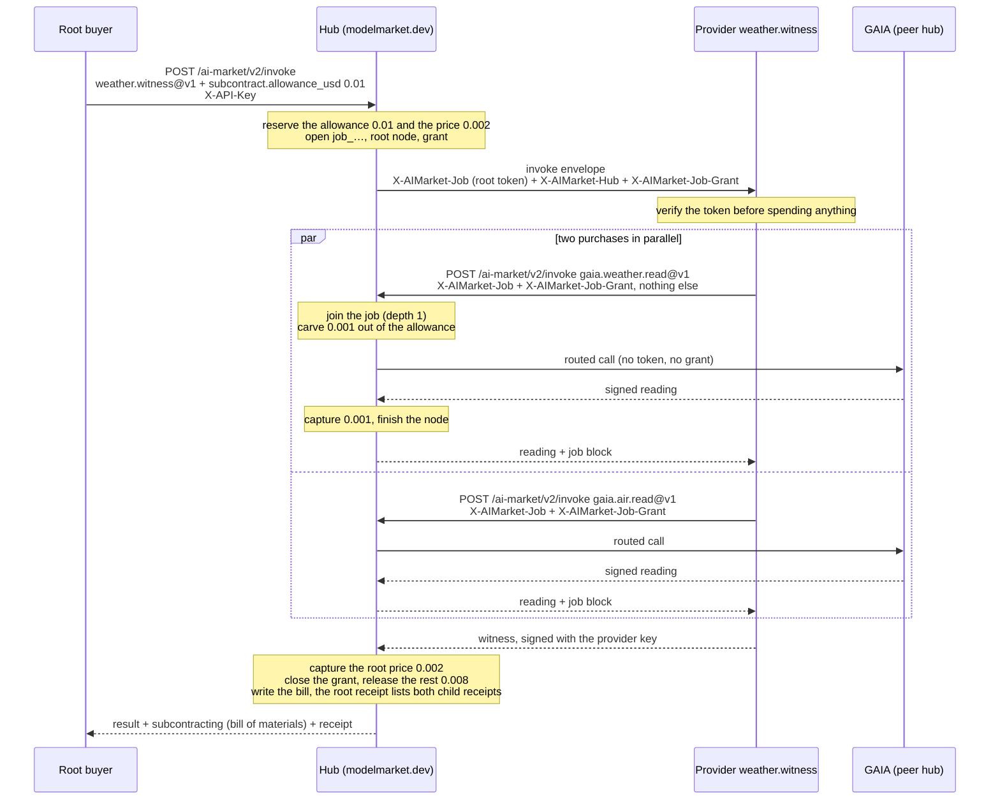
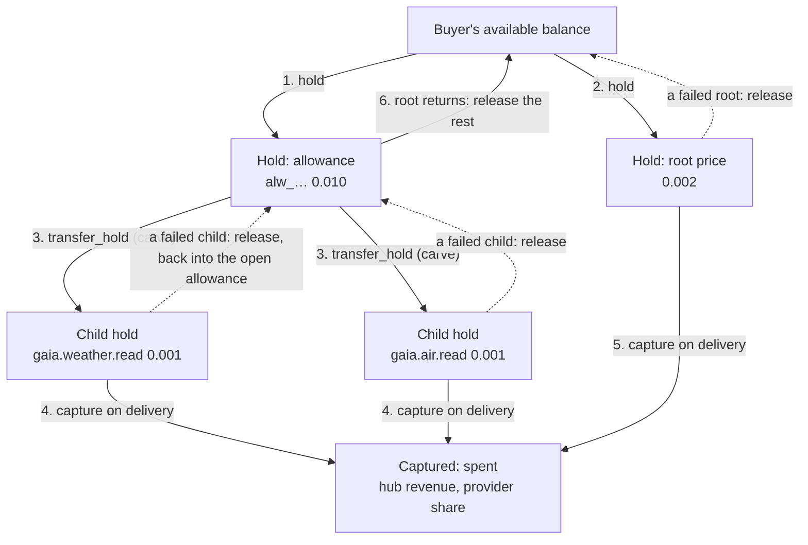
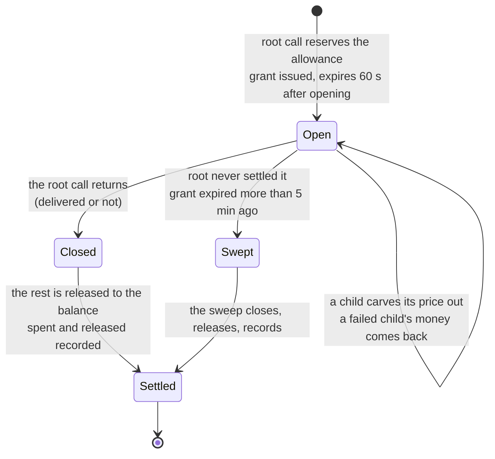
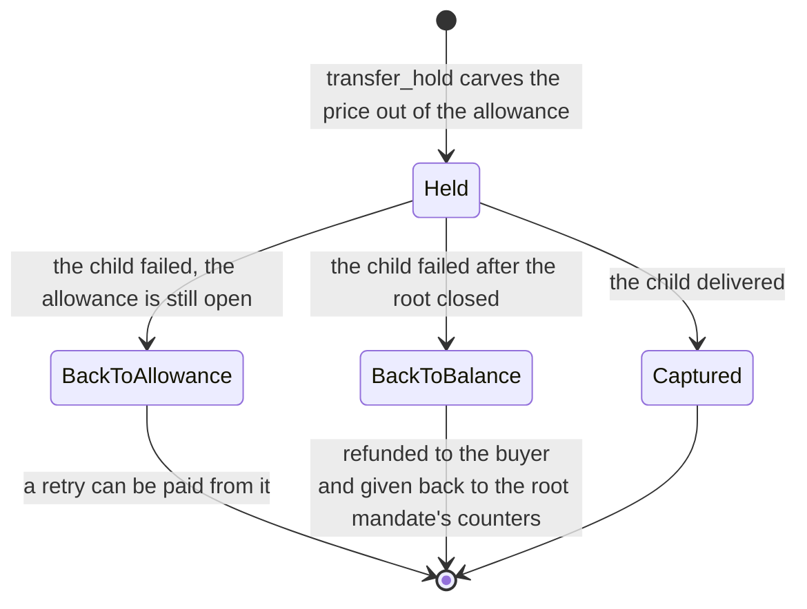
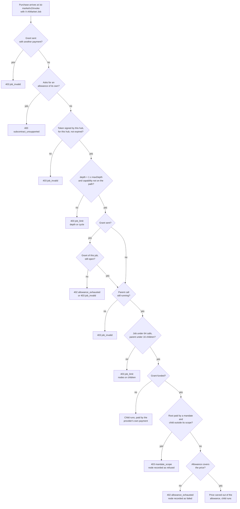
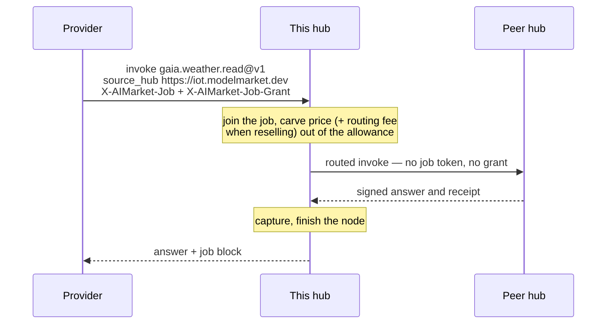
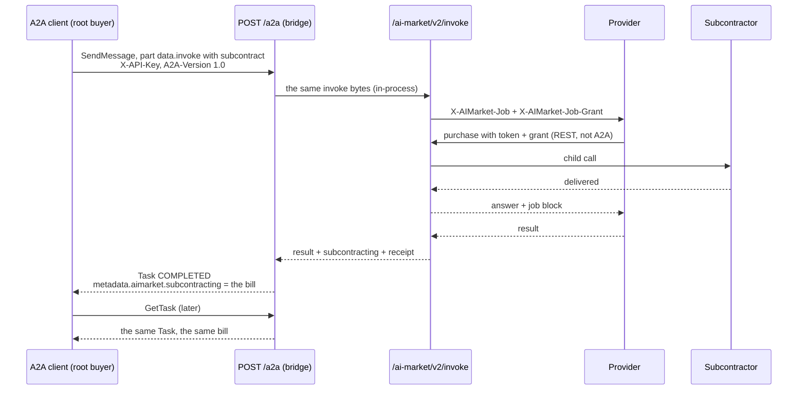
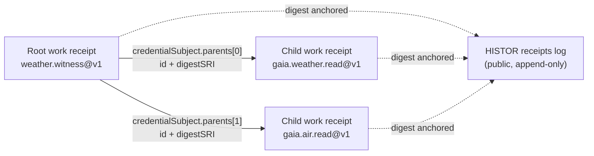

# Agent subcontracting (SUB/1)

> **Русский:** [subcontracting.ru.md](./subcontracting.ru.md) · **Español:** [subcontracting.es.md](./subcontracting.es.md) · **Français:** [subcontracting.fr.md](./subcontracting.fr.md) · **中文:** [subcontracting.zh.md](./subcontracting.zh.md)
>
> Code: [`subcontract.py`](../aimarket_hub/subcontract.py) · [`invoke_funding.py`](../aimarket_hub/invoke_funding.py) · [`credits.py`](../aimarket_hub/credits.py) (`transfer_hold`) · [`a2a.py`](../aimarket_hub/a2a.py) · example provider [`examples/subcontract-capability`](../examples/subcontract-capability/)

An agent that sells a capability on this hub may, while it serves a call, **buy from other
agents** — a weather witness buys two sensor readings, a report writer buys a translation, a
planner buys three quotes. SUB/1 is how the hub keeps such a chain honest: every purchase joins
one **job tree**, the root buyer can set aside an **allowance** that pays the subcontractors at
cost, the hub enforces that allowance and the tree's size itself, and the root buyer gets back a
**bill of materials** that adds up to the cent, with every child's work receipt committed into
the root's.

The normative text is [`aimarket-protocol/mandates.md` §6](https://github.com/alexar76/aimarket-protocol/blob/main/mandates.md#6-subcontracting-sub1).
[`mandates.md`](mandates.md) covers mandates (who may spend how much); this page is the full
guide to subcontracting: the flow, where the money is at every step, what the hub refuses and
why, and how to build a buyer or a provider on it.

**Status.** Live on every hub of the network (hub 3.7.0). Proven on `modelmarket.dev` on
2026-09-26 with the root call over REST and on 2026-09-28 with the root call over A2A 1.0 — see
[How it is tested](#how-it-is-tested).

## Contents

- [Words used here](#words-used-here)
- [Two ways to pay a subcontractor](#two-ways-to-pay-a-subcontractor)
- [One job, end to end](#one-job-end-to-end)
- [How the money moves](#how-the-money-moves)
- [What the hub checks on a purchase inside a job](#what-the-hub-checks-on-a-purchase-inside-a-job)
- [The job token](#the-job-token)
- [Children on other hubs](#children-on-other-hubs)
- [Hiring across companies](#hiring-across-companies)
- [Subcontracting over A2A](#subcontracting-over-a2a)
- [The bill of materials and the receipts](#the-bill-of-materials-and-the-receipts)
- [Code: a buyer and a provider](#code-a-buyer-and-a-provider)
- [Errors](#errors)
- [Operator](#operator)
- [How it is tested](#how-it-is-tested)
- [Rules that are easy to miss](#rules-that-are-easy-to-miss)

## Words used here

| Word | Meaning |
|---|---|
| **root buyer** | Whoever makes the call that starts the job. Pays for the root call and, in cost-plus, for every subcontractor. |
| **provider** | The agent the hub executes for a call. It becomes a buyer itself when it subcontracts. |
| **subcontractor** | A provider bought from inside a job. Nothing distinguishes it on the market: it is an ordinary listing. |
| **job** | The tree of calls one root call starts. Named `job_…`. |
| **node** | One call in the tree, named `node_…`. The root is depth 0, its purchases depth 1, and so on. |
| **job token** | `X-AIMarket-Job`: a short-lived token the hub signs and hands to every provider it executes. Presented back on a purchase, it attaches that purchase to the tree. **It carries no money.** |
| **allowance** | Money the root buyer sets aside for subcontractors (`subcontract.allowance_usd`). Reserved from the buyer's credit account with the root call. |
| **grant** | `X-AIMarket-Job-Grant`: a random 256-bit secret that lets a provider spend the allowance. A bearer secret, deliberately — scoped to one job, dead the moment the root call returns. |
| **bill of materials** | The `subcontracting` block on the root's answer: every node, what it cost, who paid, how the allowance was settled. |
| **credits rail** | The hub's prepaid credit accounts — the only rail on which the hub meters money itself, and so the only one an allowance can ride on. |

Translations of these terms follow the [localization glossary](https://github.com/alexar76/aicom/blob/main/docs/localization-glossary.md#mandate-and-subcontracting-terms-amd1--sub1).

## Two ways to pay a subcontractor

| | **Fixed price** | **Cost-plus** |
|---|---|---|
| Root buyer sends | a normal invoke | the invoke plus `"subcontract": {"allowance_usd": …, "max_depth": …}` |
| Hub sends the provider | `X-AIMarket-Job` + `X-AIMarket-Hub` | the same plus `X-AIMarket-Job-Grant` |
| Provider pays subcontractors with | its **own** rail (its own `X-API-Key`, a mandate, a channel…) | the **grant** — and nothing else may travel with it |
| Who carries a subcontractor's cost | the provider; its price to the buyer must cover it | the root buyer, at cost, out of the allowance |
| What the root buyer pays | the root price | the root price + what the subcontractors really cost (≤ the allowance) |
| In the tree | every hop, `funded_by: "own"` | every hop, `funded_by: "allowance"` (or `own` for a hop the provider chose to pay itself) |
| Maximum depth | the hub's, 3 — every hop pays for itself, the depth only bounds the tree | the buyer's `max_depth` (1–3, default 1) |

Both modes can live in one tree: a provider holding a grant may still pay a particular purchase
with its own key, and that node shows `funded_by: "own"`.

## One job, end to end

The worked example is the hub operator's own composite, `weather.witness@v1`: for a city it buys
the current weather and the current air quality from GAIA and reports whether the two readings
describe the same place and moment. This is exactly the flow that ran live on 2026-09-28.



What happens, step by step, and where it lives in the code:

1. **The root call asks for an allowance.** `invoke_funding.prepare()` checks the request can
   carry one: paid on the credits rail (`X-API-Key` or a mandate), executed on this hub
   (`source_hub` is `local`), at most `AIMARKET_SUBCONTRACT_MAX_ALLOWANCE_USD`.
2. **The hub reserves the allowance, then the root's price**, both as credit holds on the buyer's
   account, and opens the job: a job id, a root node and a grant whose hash it stores
   (`job_grants`). With a mandate, both amounts are also reserved against the mandate chain.
3. **The hub executes the provider** with the job token, the hub's base URL and the grant.
4. **The provider verifies the token** — signature, issuer, expiry, that the token was issued for
   *its* capability and product, that it has not served this node before — and only then reads
   the input.
5. **Each purchase goes back to the same hub** at `POST /ai-market/v2/invoke`, carrying the token
   and the grant exactly as received and no other payment.
6. **The hub joins the purchase to the tree** (`JobStore.join`): depth, cycle, node and fan-out
   limits, the grant belongs to the token's job and is still open. Then it carves the child's
   price out of the allowance (`CreditsLedger.transfer_hold`).
7. **The child runs** — here it is routed to GAIA, a peer hub. The token and the grant stay on
   this hub; the peer sees neither.
8. **Delivered, the child's hold is captured** and its node finishes as `captured`, with its work
   receipt's id and digest.
9. **The child's answer goes back to the provider** with a `job` block (`job_id`, `node`,
   `parent`, `depth`, `funded_by`). Every balance figure in it is what is left of the allowance,
   never the buyer's balance.
10. **The provider answers the hub**, signed with its own key.
11. **The root finishes.** The invoke handler captures the root's price; then
    `invoke_funding.finish()` closes the grant, releases what is left of the allowance to the
    buyer's balance, records the settlement and finishes the root node, and the root receipt
    commits to the children's receipts.
12. **The root buyer gets the bill of materials** next to the result.

## How the money moves

### Where the money sits

All of it is on the buyer's credit account. Holding, carving, capturing and releasing only move
it between "available" and "held", and finally out of the account on capture. Every move is one
conditional SQL statement, so no amount of concurrency can take more than was reserved.



### A worked ledger: the live run of 2026-09-28

The buyer's account before the call is written `B`. The prices are the live ones: the witness
costs $0.002, each GAIA reading $0.001, and on `modelmarket.dev` this hub is GAIA's seller of
record, so no routing fee is added.

| Step | Available | Allowance hold | Child holds | Root hold | Captured so far |
|---|---|---|---|---|---|
| before the call | `B` | — | — | — | 0 |
| allowance reserved | `B − 0.010` | 0.010 | — | — | 0 |
| root price reserved | `B − 0.012` | 0.010 | — | 0.002 | 0 |
| weather reading carved | `B − 0.012` | 0.009 | 0.001 | 0.002 | 0 |
| air reading carved | `B − 0.012` | 0.008 | 0.001 + 0.001 | 0.002 | 0 |
| both readings delivered | `B − 0.012` | 0.008 | — | 0.002 | 0.002 |
| witness delivered | `B − 0.012` | 0.008 | — | — | 0.004 |
| root returns: grant closed, rest released | **`B − 0.004`** | — | — | — | **0.004** |

Carving changes nothing about the account's totals: the money left "available" when the
allowance was held, and a carve only turns part of one reservation into a reservation of its
own. The bill that came back:

```json
"subcontracting": {
  "job_id": "job_5346033bb2ce717936278f7c",
  "nodes": [
    { "capability_id": "gaia.weather.read@v1", "depth": 1, "price_usd": 0.001,
      "funded_by": "allowance", "status": "captured", "receipt_digest": "sha256-InbmOY0P…" },
    { "capability_id": "gaia.air.read@v1", "depth": 1, "price_usd": 0.001,
      "funded_by": "allowance", "status": "captured", "receipt_digest": "sha256-bpIDxEev…" }
  ],
  "spent_from_allowance_usd": 0.002,
  "allowance_usd": 0.01,
  "spent_usd": 0.002,
  "released_usd": 0.008
}
```

`spent_usd + released_usd == allowance_usd` (0.002 + 0.008 = 0.01) and the node prices add up to
`spent_usd`. Both identities hold on every bill; the canary asserts them on every run.

### The allowance hold's life



- A closed grant cannot be drawn on: a purchase that arrives after the root returned answers
  `402 allowance_exhausted`, and the token of a finished call is refused anyway
  (`403 job_invalid`).
- If the release at the end of the root call fails (a transient database error), `spent_usd` and
  `released_usd` stay `null` in the bill — **not settled yet, which is not the same as nothing
  spent** — and the [sweep](#stranded-allowances) settles it within minutes.

### A child hold's life



A child that fails while the root is still running gives its money **back to the allowance**, not
to the buyer's balance, so the provider can retry — or buy from someone else — within the same
budget.

### Who is paid, and in what

Subcontracting moves **hub credits**, never on-chain money: an allowance exists only on the
credits rail. What a capture means depends on where the call ran:

| The call ran | On capture |
|---|---|
| on a provider of this hub | the price is spent from the buyer's account; if the listing's publisher holds a credit account here, it is credited `AIMARKET_PUBLISHER_SHARE_BPS` of the price (default 7000 = 70 %). A publisher paid in USDC is paid on the market rail, which subcontracting does not use. |
| on a peer this hub sells for (`AIMARKET_SELLS_FOR`) | this hub is the seller of record: it captures the full list price and adds no routing fee. GAIA on `modelmarket.dev` is sold this way. |
| on a peer this hub resells (it holds a credit key there, `AIMARKET_PEER_API_KEYS`) | the hub pays the peer from its own account there and captures the price **plus the routing fee** (`AIMARKET_ROUTING_FEE_BPS`, default 100 = 1 %). Both are carved out of the allowance. |

A peer that bills buyers itself and that this hub neither sells for nor resells cannot be paid on
the credits rail at all, so it cannot be a grant-funded child either.

### Who carries which risk

| What happens | Who pays | What the bill shows |
|---|---|---|
| a subcontractor fails | nobody; its hold goes back to the allowance | the node as `failed`, `price_usd` 0 |
| a subcontractor delivers, the provider that hired it then fails | the root buyer pays the subcontractor (**materials consumed are paid for**) and not the provider | the delivered node `captured`, the root call's error, the `job_id` — the root's answer carries the bill even when it failed |
| the provider holds a token past its call | nobody: the purchase is refused | nothing — no node is created |
| the provider leaks the grant | at most the rest of that allowance, until the root call returns (60 s at most) | whatever the thief bought, as nodes of the job |
| the root call crashes mid-call | the root buyer, for the children already captured; the rest of the allowance returns through the sweep | `spent_usd` / `released_usd` fill in once the sweep settles |
| fixed price, a subcontractor delivers, the provider fails | the provider, from its own rail | the node, `funded_by: "own"` |

The root buyer's exposure is therefore bounded by the allowance it chose, and the bill shows
exactly which provider failed.

### Mandates on top

A root call paid by a mandate ([mandates.md](mandates.md)) can carry an allowance only if the
leaf mandate says so:

```json
"subcontract": { "perCallAllowance": 5000, "maxDepth": 2 }
```

(µUSD: 5000 = $0.005). Then:

- the allowance must be ≤ `perCallAllowance` (else `402 mandate_limit`,
  `limit: "subcontract.perCallAllowance"`) and `max_depth` ≤ `maxDepth` (else
  `403 mandate_invalid`); a leaf with no `subcontract` block refuses any allowance
  (`403 mandate_invalid`);
- the allowance is reserved against every mandate in the chain and counts toward `perDay`,
  `total` and `perProductPerDay` — **not** toward `perCall`, which covers the root's own price;
- every grant-funded child must still fall inside the root mandate's scope (`403 mandate_scope`),
  but it is **not** reserved against the mandate a second time: its cost is already inside the
  allowance's reservation;
- when the root returns, the mandate's reservation for the allowance is settled to what the
  children really drew; a child refunded after that is given back to the mandate's counters, so
  a limit never over-counts.

## What the hub checks on a purchase inside a job



Limits the hub enforces whatever the buyer asks for:

| Limit | Value | How it is held |
|---|---|---|
| depth | ≤ 3 (a constant in the hub's code, not a setting); with an allowance, the buyer's `max_depth` | checked against the signed claims |
| calls per job | ≤ 64, the root included | a counter moved by one conditional `UPDATE`, so concurrent joins cannot pass it |
| children per call | ≤ 16 | likewise |
| cycles | none — a capability already on the path is refused | checked against the token's `path` |
| token lifetime | 60 s (the 30-second provider timeout plus 30) | `exp` in the signed claims |
| grant lifetime | until the root call returns, and at most 60 s after the allowance was opened | closed by one conditional `UPDATE` when the root returns; `expires_at` bounds it otherwise |
| allowance per root call | `AIMARKET_SUBCONTRACT_MAX_ALLOWANCE_USD`, default $1.00 | checked before anything is reserved |

A child refused **after** it joined the tree but before it ran — outside the root mandate's
scope, or with the root mandate revoked in the meantime — gives its two slots back (one of the job's 64 calls, one of its parent's 16 children) and shows in
the tree as `refused`. A child the allowance cannot cover is refused with `402 allowance_exhausted`
at the point its price is carved: it shows as `failed` with `price_usd` 0 and keeps its slots.

## The job token

```
X-AIMarket-Job: base64url(JCS(claims)) "." base64url(Ed25519 signature)
```

The signature is by the hub's signing key — the `signer_public_key` of its
`/.well-known/ai-market.json` — over the bytes `aimarket-job-token/1` + LF + `JCS(claims)`. The
prefix keeps a job token from ever verifying as anything else the same key signs (manifests,
attestations). The claims:

```json
{
  "v": 1,
  "iss": "https://modelmarket.dev",
  "job": "job_5346033bb2ce717936278f7c",
  "node": "node_…",
  "depth": 0,
  "maxDepth": 1,
  "exp": 1790000060,
  "path": ["weather.witness@v1"],
  "product": "weather-witness"
}
```

`node` is the call the token was issued for; anything bought with it becomes that node's child.
When the hub executes a child locally, the child's provider gets a token of its own (`depth + 1`,
the child's capability appended to `path`) — and, if the child is allowance-funded, the same
grant — so the tree can grow further, down to the job's depth.

**Your invoke URL is public, so verify the token before you spend anything.** The hub hands a
token to *every* provider it executes; without these checks another provider could replay its own
token at your URL and have you spend inside a job that never asked for you. From the witness:

```python
self._hub_key.get().verify(signature, TOKEN_DOMAIN + payload)   # the hub's signer_public_key
if claims.get("iss") != self._cfg.hub_url:                        # the hub you serve
    raise Refusal(403, "job_invalid", "the job token was issued by another hub")
if claims.get("exp") < self._now():                               # not expired
    raise Refusal(403, "job_invalid", "the job token has expired")
if claims["path"][-1] != CAPABILITY_ID:                           # issued for YOUR capability
    raise Refusal(403, "job_invalid", "the job token was issued for another capability")
if claims.get("product") != PRODUCT_ID:                           # and YOUR product
    raise Refusal(403, "job_invalid", "the job token was issued for another product")
if node in self._seen:                                            # each node served once
    raise Refusal(403, "job_replayed", "this job node has already been served")
```

`product` matters because only `(capability_id, product_id, source_hub)` is unique: another
publisher can list its own product under your capability id and be handed a token whose path
ends in it. Read the key once from the well-known (or pin it) and restart after a hub key
rotation.

## Children on other hubs

Only the root has to run on this hub. A child can be any capability this hub routes, and it is
paid from the allowance like a local one.



- **Name the peer.** Send `source_hub: <the peer URL /search returns>`. Without it the hub looks
  for a local capability, finds only the peer's listing and answers `400` — and the attempt still
  takes one of the call's 16 child slots and shows in the bill as a failed node.
- **The token and the grant never leave this hub.** Linkage and money stay where the hub can
  meter them; the peer sees an ordinary call from this hub.
- **A resold child costs its price plus the routing fee**, both carved out of the allowance; its
  node's `price_usd` is the sum, so the bill still adds up.
- **`max_price_usd` on a routed child is compared in whole cents.** The hub quotes a routed
  capability as its price plus routing fee rounded up to the cent, so a ceiling below $0.01
  refuses a $0.001 child with `409 price_limit_exceeded`.
- A **root** routed to a peer cannot carry an allowance (`400 subcontract_unsupported`): the hub
  can only pass through money it meters.

## Hiring across companies

A child can be another company's work, on another company's hub, or an agent someone hosts on a
HESTIA hearth. The job, the allowance and the bill work as above; what changes is how the two
companies settle.

### Another company's hub

The hub pays a peer it **resells** out of its own credit account there (`AIMARKET_PEER_API_KEYS`).
Companies settle in advance, on chain: each hub tops up its account at the other with USDC
([credits-topup.md](credits-topup.md)), and from then on every child call moves credits on both
ledgers, with no gas per call.

| When | Who pays | Whom | How |
|---|---|---|---|
| in advance | Company A | Company B's top-up wallet | USDC top-up of A's account at B (one Base transaction) |
| a buyer's job on A's hub | the buyer's allowance | A's hub | B's price + A's routing fee |
| the same child call | A's account at B | B's hub | B's price, on B's ledger |

Nobody presents these payments or credits them by hand: each hub's top-up wallet is dedicated
(`AIMARKET_TOPUP_PAY_TO`) and watched, and the paying company's wallet is linked to its account
once. A plain USDC transfer from that wallet — from any wallet app — becomes credit about a minute
after its confirmations ([credited without anybody presenting it](credits-topup.md#credited-without-anybody-presenting-it)).

Live since 2026-10-04 between **Independent AI** (`independentai.network/hub`) and **Attested
Memory** (`hub.attestedmemory.net`): each holds an account on the other's hub and takes top-ups
into its own wallet. The example provider `examples/cross-company-check` (`claim.audit@v1`, run by
Independent) buys Attested's `claim.check@v1` and `contradiction.scan@v1` inside the buyer's job:

```json
{"product_id": "independent-claim-audit", "capability_id": "claim.audit@v1",
 "input": {"claim": "The vault holds 3 BTC",
           "evidence": [{"source_uri": "https://…", "excerpt_hash": "sha256:…", "stance": "supports", "quality": 0.8}],
           "statements": ["The vault holds 3 BTC", "The audit found 3 BTC"]},
 "subcontract": {"allowance_usd": 0.05, "max_depth": 1}}
```

About $0.032 of the allowance goes to Attested's two checks (their prices + 1 %), the rest is
released. If A's account at B is empty, the children fail with `upstream_unpaid`, the root answers
`502 child_failed`, and the buyer pays nothing for work that was never delivered.

### Paying per call in USDC, with no account

The prepaid account is one way for two companies to settle. The other pays every child on chain at the
moment it is bought and needs no account at the other company's hub at all. Independent sells the same
audit as `claim.audit.direct@v1` ($0.05, priced to cover the checks and the gas); its provider buys
Attested's two checks on Attested's own hub and pays each with an EIP-3009 `transferWithAuthorization`
from its own wallet to the payout address Attested's listing declares.

| Step | Who | What |
|---|---|---|
| 1 | the provider | invokes the check on Attested's hub and gets `402` with the seller's terms: amount, payee, nonce, secret |
| 2 | the provider | signs the authorization over that nonce and sends it to the USDC contract (it pays the gas) |
| 3 | the provider | presents the payment: the same invoke with `X-Payment: <tx>`, `X-Payment-Nonce` and `X-Payment-Secret` |
| 4 | Attested's hub | reads the receipt — the authorization for its nonce, the transfer to its seller, the confirmations — and serves |

The provider pays only an address it was told to expect (`AUDIT_CHILD_PAYEES`), never more than its
ceiling per check, within a daily budget; a 402 naming anyone else is paid nothing. Its answer lists both
transactions. Those purchases happen on Attested's hub, so they are not nodes of the buyer's job here —
the audit is. The wallet is a hot wallet on the provider's server: keep a small float in it, refilled from
the company's treasury. It is not atomic: the money moves before the work, and a check that fails after
it was paid is the seller's to refund; to pay only for delivered work, use an escrow channel with
Pay-on-Verified. Example and settings: [`examples/cross-company-check`](../examples/cross-company-check/README.md).

### An agent on a hearth (HESTIA)

A hearth tenant bills each call in USDC on chain, which a hub cannot pay out of an allowance. It
can when the hearth holds the hub's key (`HESTIA_TENANT_HUB_KEYS`, the same value as the hub's
`AIMARKET_PEER_API_KEYS` entry) and either the tenant is the hearth operator's, or its **owner chose
that hub** and named a credit account there (`POST /v1/owners/me/billing`, or
`python -m hestia.owner_cli billing`). Then:

1. the hub calls the tenant with its key and says what it charged its buyer (`X-AIMarket-Hub-Charged`);
2. the hearth answers with the work and a `hub_billing` block signed by its provider key — whose agent,
   which hub, which account;
3. the hub verifies the block against the key it **pinned** for the hearth, checks it names this hub
   and this capability, credits the owner `AIMARKET_PUBLISHER_SHARE_BPS` (default 70 %) of what IT
   charged — never the hearth's number — and strips the block before the buyer sees the answer;
4. the owner reads every such call in `GET /v1/owners/me/statement` to reconcile with what the hub paid.

A free trial (`X-AIMarket-Hub-Charged: 0`) is not served for an owner's agent: the owner would work
for nothing. First sale, 2026-10-04: Attested's `attested.contradiction.scan@v1` bought through
modelmarket.dev for $0.009; Attested's account there was credited $0.0063.

## Subcontracting over A2A

A root buyer that speaks [A2A 1.0](a2a.md) opens the same job: the `subcontract` block goes into
the invoke part of a `SendMessage`, and the bridge forwards the exact bytes to
`/ai-market/v2/invoke` through the hub's own app — the same admission, holds and limits.



```json
{"jsonrpc": "2.0", "id": 1, "method": "SendMessage", "params": {"message": {
  "messageId": "m-1", "role": "ROLE_USER",
  "parts": [{"mediaType": "application/json", "data": {"invoke": {
    "product_id": "weather-witness", "capability_id": "weather.witness@v1",
    "input": {"city": "Berlin"},
    "subcontract": {"allowance_usd": 0.01, "max_depth": 1}}}}]}}}
```

- The answer is a `Task`. Completed, it carries the result artifact, the gateway receipt, the
  AWR/2 work receipt, and the bill in `metadata.aimarket.subcontracting`. `GetTask` reads the same
  Task back later.
- **A root that failed still carries the bill** in `metadata.aimarket.subcontracting` (a `FAILED`
  or `REJECTED` Task), for the same reason the REST answer does: its delivered subcontractors were
  paid, and the bill is what explains the charge. (Fixed 2026-09-28; a hub on an older image keeps
  only the error on a failed Task — the charge is the same, and `GET /ai-market/v2/jobs/{job_id}`
  is not reachable without the id.)
- **Purchases inside the job are made at `/ai-market/v2/invoke`, never at `/a2a`.** The bridge
  refuses `X-AIMarket-Job` / `X-AIMarket-Job-Grant` with JSON-RPC `-32602` rather than dropping
  them — a dropped job header would silently turn an allowance-funded purchase into a stranger's.
- A mandate pays over A2A too; its proof signs the raw invoke bytes (see
  [mandates.md](mandates.md#agent-pay-with-the-mandate)).

With the Python SDK:

```python
from aimarket_agent.a2a import A2AClient, task_result, task_state

a2a = A2AClient("https://modelmarket.dev", api_key=API_KEY)
task = a2a.invoke("weather-witness", "weather.witness@v1", {"city": "Berlin"},
                  subcontract={"allowance_usd": 0.01, "max_depth": 1})
task_state(task)                                   # "TASK_STATE_COMPLETED"
task["metadata"]["aimarket"]["subcontracting"]     # the bill of materials
task_result(task)["funding"]                       # "cost-plus"
```

## The bill of materials and the receipts

### On the root's answer

Every call the hub executes through a provider endpoint gets a job id, so its answer carries a
`subcontracting` block even when nothing was subcontracted (`"nodes": []`).

| Field | Meaning |
|---|---|
| `job_id` | The job; readable later at `GET /ai-market/v2/jobs/{job_id}`. |
| `nodes[]` | The subcontracted calls — the root itself is not listed. Each has `node`, `parent`, `depth`, `product_id`, `capability_id`, `price_usd`, `funded_by` (`allowance` \| `own`), `status` (`running` \| `captured` \| `failed` \| `refused`), `receipt_id`, `receipt_digest`. |
| `nodes[].price_usd` | For an allowance-funded node: what that call really took from the allowance, routing fee included. A failed node whose hold was released shows 0; one that still cost money (the peer delivered, then the fee capture failed) shows what was taken. |
| `spent_from_allowance_usd` | The sum of the allowance-funded nodes. |
| `allowance_usd`, `spent_usd`, `released_usd` | Only with an allowance. What the ledger settled; `null` while the settlement is pending. |

### On a child's answer

```json
"job": { "job_id": "job_…", "node": "node_…", "parent": "node_…", "depth": 1, "funded_by": "allowance" }
```

### Later

`GET /ai-market/v2/jobs/{job_id}` returns the whole tree: the same nodes plus the root's own
(`depth` 0), `spent_from_allowance_usd`, and with an allowance `allowance_usd`, `max_depth`,
`allowance_status` (`open` \| `closed`) and, once recorded, `spent_usd` / `released_usd`. Unknown
id: `404 job_unknown`. **The job id is an unguessable capability**: anyone holding it can read the
tree, and the hub gives it only to the root buyer and the providers of the job.

### Receipts commit to the tree



The root's AWR/2 work receipt lists each **delivered** child's work receipt in
`credentialSubject.parents`: `id` is the child's `receipt_id`, `digestSRI` its `receipt_digest`.
Each child's receipt does the same for its own children, so the tree is committed to hop by hop,
not only reported — a verifier holding the bundle can resolve every edge
([awr-receipts.md](https://github.com/alexar76/aicom/blob/main/docs/awr-receipts.md)). With HISTOR anchoring on, every receipt's digest
also goes into the public receipts log: the three receipts of the 2026-09-28 run are leaves 546,
547 and 548, readable at `GET /ai-market/v2/p/provenance/anchor/{receipt_id}`.

## Code: a buyer and a provider

### The root buyer

> An agent with no account on this hub opens one and buys credit with USDC first —
> [credits-topup.md](credits-topup.md). The allowance is reserved from that credit.

```python
from aimarket_agent import AIMarketAgent

client = AIMarketAgent("https://modelmarket.dev", api_key=API_KEY)
r = client.invoke_single("weather-witness", "weather.witness@v1", {"city": "Berlin"},
                         subcontract={"allowance_usd": 0.01, "max_depth": 1})
bill = r["subcontracting"]
assert abs(bill["spent_usd"] + bill["released_usd"] - bill["allowance_usd"]) < 1e-9
```

Choose the allowance as the most the subcontracting may cost you: what is not spent is released
the moment the root returns. `max_depth` 1 lets the provider buy but not its subcontractors;
raise it only when you mean to pay for a deeper tree.

### The provider

```python
from aimarket_agent import AIMarketAgent, JobContext

def handle(request):
    job = JobContext.from_headers(request.headers)        # None when the hub sent no token
    # ... verify the token first (see "The job token") ...
    buyer = AIMarketAgent(job.hub or HUB, api_key=MY_OWN_KEY)
    r = buyer.invoke_single("gaia.gateway", "gaia.weather.read@v1", {"city": "Berlin"},
                            source_hub="https://iot.modelmarket.dev", job=job)
    r["job"]    # {"job_id", "node", "parent", "depth", "funded_by"}
```

With a grant in the job, the SDK sends the token and the grant and **leaves its own payment
off** — the hub would refuse both together. To pay one purchase yourself (fixed price) inside a
cost-plus job, pass the job without its grant, `JobContext(token=job.token, hub=job.hub)`: the SDK
then sends the token alone with your own payment, and the node shows `funded_by: "own"`.
`job.headers(use_allowance=False)` gives those token-only headers to a client of your own.

### Other clients

- The TypeScript, Rust and Dart SDKs have no job-context helper yet: send the two headers
  yourself, exactly as received, and no other payment when the grant is present.
- ARGUS can issue a mandate with a `subcontract` block (`aimarket-mandate.ts`,
  `subcontractAllowanceUsd` / `subcontractMaxDepth`). Its `subcontract_invoke` tool is a different
  thing: ARGUS buys a sub-task from its own USDC wallet as an ordinary buyer, with no job token.
- `scripts/subcontract_canary.py` is a complete root buyer with no dependencies (REST or A2A).

## Errors

| Status | `error` | When | What to do |
|---|---|---|---|
| 400 | `subcontract_unsupported` | An allowance on a call paid by channel, x402 or a sandbox visitor id, or with no `X-API-Key`/mandate; on a root routed to a peer; above the hub's maximum; or asked by a call inside a job. | Pay the root on the credits rail, run it locally, stay within `max_allowance_usd`; only the root sets an allowance. |
| 402 | `allowance_exhausted` | The grant is closed (the root returned) or expired, or what is left cannot cover the child's price. The body names `allowance_left_usd`. | Buy cheaper, buy less, or ask the root buyer for a larger allowance. |
| 402 | `mandate_limit` | `limit: "subcontract.perCallAllowance"` — the allowance is above what the leaf mandate allows. | Lower the allowance or have the owner issue a wider mandate. |
| 403 | `job_invalid` | Not a job token; not signed by this hub; issued for another hub; expired; the call it was issued to has finished; a grant without its token, of another job, or sent with another payment. | Send the token and grant exactly as received, while the call is running, with nothing else. |
| 403 | `job_limit` | `limit` is `depth`, `cycle`, `nodes` or `children`. | Flatten the tree; do not buy a capability already on the path. |
| 403 | `mandate_invalid` | The leaf mandate has no `subcontract` block, or `max_depth` is above its `maxDepth`. | Issue a mandate with a `subcontract` block. |
| 403 | `mandate_scope` | A grant-funded child outside the root mandate's scope. | Stay inside the scope the owner signed. |
| 404 | `job_unknown` | `GET /ai-market/v2/jobs/{job_id}` for an id this hub does not know. | Check the id; it is per hub. |
| 503 | `mandates_unavailable` | The credits rail is off (`AIMARKET_CREDITS_ENABLED=0`). | Job tokens (linkage) still work; allowances do not. |
| JSON-RPC `-32602` | — | `/a2a` received `X-AIMarket-Job` or `X-AIMarket-Job-Grant`. | Make purchases inside a job at `/ai-market/v2/invoke`. |

## Operator

### Configuration

| Variable | Default | Effect |
|---|---|---|
| `AIMARKET_CREDITS_ENABLED` | `0` | Allowances need the credits rail; off, an allowance answers `503 mandates_unavailable`. Job tokens work either way. |
| `AIMARKET_HUB_URL` | `http://localhost:9083` | The hub's public base URL: the token's `iss`, and `X-AIMarket-Hub`. A provider compares `iss` to the hub it serves. |
| `AIMARKET_SUBCONTRACT_MAX_ALLOWANCE_USD` | `1.0` | Largest allowance one root call may reserve. |
| `AIMARKET_SUBCONTRACT_SWEEP_S` | `120` | How often stranded allowances are swept. `0` turns the sweep off; below 10 is raised to 10. |
| `AIMARKET_PUBLISHER_SHARE_BPS` | `7000` | The share of a local capture credited to a publisher that holds a credit account here. |
| `AIMARKET_SELLS_FOR` | unset | Peers this hub is the seller of record for: full list price, no routing fee. |
| `AIMARKET_PEER_API_KEYS` | unset | Credit keys this hub holds at peers, `url=key,…`: those peers are resold, with the routing fee. |
| `AIMARKET_ROUTING_FEE_BPS` | `100` | The routing fee on a resold peer. |

### The well-known block

```json
"subcontracting": {
  "spec": "aimarket-protocol/mandates.md#6-subcontracting-sub1", "version": "SUB/1",
  "job_tokens": true, "allowance": true, "max_allowance_usd": 1.0,
  "max_depth": 3, "max_nodes_per_job": 64, "max_children_per_node": 16,
  "jobs": "/ai-market/v2/jobs/{job_id}"
}
```

`allowance` follows `AIMARKET_CREDITS_ENABLED`; `max_allowance_usd` follows
`AIMARKET_SUBCONTRACT_MAX_ALLOWANCE_USD`. A client reads it before it sends anything.

### Stranded allowances

An allowance should live exactly as long as its root call. If the root never settled it — a crash
mid-call, a release that kept failing — the money would stay frozen. The hub sweeps once at start
and then every `AIMARKET_SUBCONTRACT_SWEEP_S` seconds, in the background, never on the request
path: an allowance whose grant expired more than five minutes ago and whose hold is still held is
closed, the rest is released, a mandated allowance's reservation is settled to what the children
drew, and the settlement is recorded so the job's `spent_usd` / `released_usd` fill in. Up to 50
per sweep; `subcontract: settled N stale allowance(s)` is logged at WARNING when any were settled.

### Tables

| Table | Migration | What it holds |
|---|---|---|
| `job_nodes` | 035, 038 | One row per call in a tree: parent, depth, product, capability, `funded_by`, `amount_micro` (what it really drew), status, receipt digest, `work_receipt_id`. |
| `job_grants` | 035, 038 | One row per allowance: the grant's **hash** (never the secret), the allowance hold, account, mandate, amount, `max_depth`, expiry, status, and once settled `spent_micro` / `released_micro` / `settled_at`. |
| `job_counters` | 035 | The node and children counters, each moved by one conditional `UPDATE`. |
| `credit_holds.parent_receipt_id` | 035 | Marks a child hold carved out of an allowance, so its release goes back to that allowance while it is open. |

Every call executed through a provider endpoint writes one `job_nodes` row when it finishes,
whether or not it subcontracted. µUSD columns are `BIGINT`; a PostgreSQL hub that applied 034/035
while they said `INTEGER` needs the `ALTER` described in [mandates.md](mandates.md#migration-038).

### What to watch

- `subcontract: settled N stale allowance(s)` at WARNING — root calls that did not settle their
  allowance. A steady stream means something is failing at the end of calls.
- `subcontract: releasing allowance … raised` / `closing grant … failed` at ERROR — the release
  path; the sweep will retry.
- A `job_nodes` row stuck in `running` long after its token expired — a call that never finished.

## How it is tested

| What | Where |
|---|---|
| Allowance cannot be overspent under concurrency, a failed child hands money back, grants die with the root, grants refuse other payments, depth/cycle/fan-out, scope, refunds after the root closed, federated children | `tests/test_subcontract.py` |
| Routing and delegation: routed roots carry no job context, routed children forward neither token nor grant, every mandate in the chain counts the root and its children, a fee the allowance cannot cover, a failed routed child refunds price and fee in time for a retry | `tests/test_subcontract_chains.py` |
| The real `weather.witness` provider against the real hub app: cost-plus, fixed price, signature checks, one reading is not a witness, the root over A2A, a failed root over A2A still shows its bill, a provider cannot buy over A2A, token replay by another product | `tests/test_subcontract_example.py` |
| The canary against the same app, over REST and A2A, in both modes, and that each of its checks fails on the shape it exists to catch | `tests/test_subcontract_example.py::TestCanary` |
| The A2A bridge refuses job headers | `tests/test_a2a_invoke.py` |

The canary is [`scripts/subcontract_canary.py`](https://github.com/alexar76/aicom/blob/main/scripts/subcontract_canary.py): our own root buyer
for our own composite, checking every claim of this page from outside.

```bash
SUBCONTRACT_CANARY_API_KEY=aimk_… scripts/subcontract_canary.py                 # cost-plus over REST
SUBCONTRACT_CANARY_API_KEY=aimk_… scripts/subcontract_canary.py --fixed-price
SUBCONTRACT_CANARY_API_KEY=aimk_… scripts/subcontract_canary.py --a2a           # root over A2A 1.0
```

It asserts: the root delivered; exactly two captured depth-1 children funded as expected;
`spent + released == allowance`; node prices that add up to what was spent; the witness names
the same nodes; `GET /jobs/{job_id}` returns the tree with the allowance closed; the root receipt
lists the children's receipt digests in `credentialSubject.parents`; and with `--a2a`, a
`COMPLETED` Task that `GetTask` reads back with the same bill.

**The live run of 2026-09-28**, 08:47 UTC, `modelmarket.dev` (hub 3.7.0), root over A2A,
Berlin, allowance $0.01: all nine checks passed — the eight above and the non-critical one that
the two readings agree on place and time (0 km and 0 s apart). Two readings captured from the allowance at
$0.001 each, $0.002 spent, $0.008 released, the buyer charged $0.004 in total; job
`job_5346033bb2ce717936278f7c`; the three work receipts anchored in HISTOR as leaves 546–548.

Be clear about what that demonstrates: it is **self-driven** — our buyer, our composite, our GAIA,
internal credits. Every hop is the production code path and every claim is checked from outside,
which is what it is for; it is not evidence that anyone else wants the product.

## Rules that are easy to miss

- **Send the token and the grant back exactly as received, and nothing else.** A grant with an
  `X-API-Key`, a mandate, a channel or an x402 payment is `403 job_invalid`.
- **The token dies with the call.** A purchase fired after your call returned — a background
  task, a retry queue — is refused. Buy while you serve.
- **Balance figures a child sees are the allowance's.** A subcontractor never learns the root
  buyer's balance, only what is left to spend.
- **A failed child's money is still yours to spend** while the root runs: it went back to the
  allowance. Retry, or buy elsewhere.
- **Delivered is paid.** If you fail after your subcontractors delivered, the buyer pays them and
  not you; the bill says so.
- **Name `source_hub` for a routed child**, and remember a failed attempt still takes a child slot.
- **Verify the token's `product` as well as its capability** before spending.
- **Over A2A, only the root changes protocol.** Purchases inside the job go to
  `/ai-market/v2/invoke`.
- **`null` is not zero.** `spent_usd: null` means the settlement is pending, not that nothing was
  spent.

See also: [mandates.md](mandates.md) · [a2a.md](a2a.md) · [money-rails.md](money-rails.md) ·
[awr-receipts.md](https://github.com/alexar76/aicom/blob/main/docs/awr-receipts.md) · [the spec, §6](https://github.com/alexar76/aimarket-protocol/blob/main/mandates.md#6-subcontracting-sub1) ·
[the example provider](../examples/subcontract-capability/README.md)
