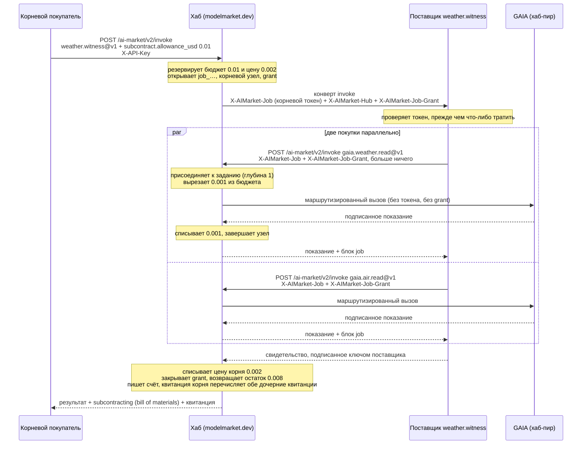
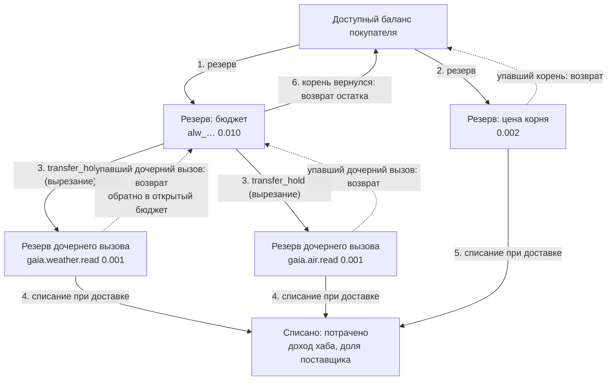
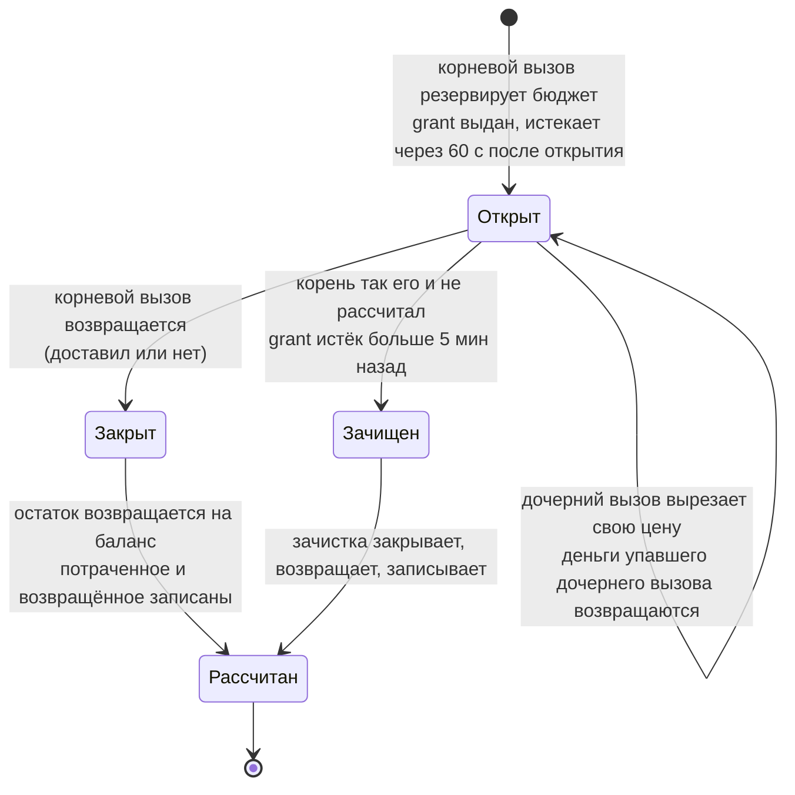
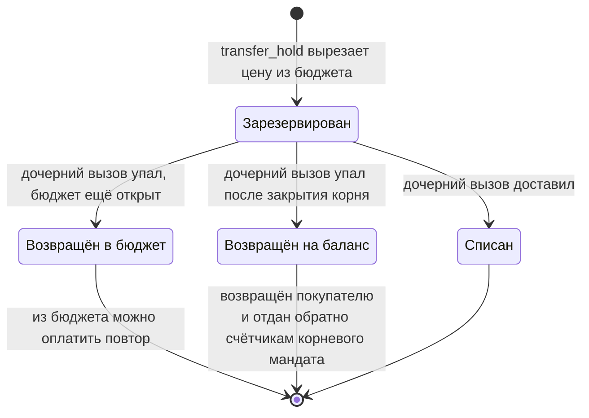
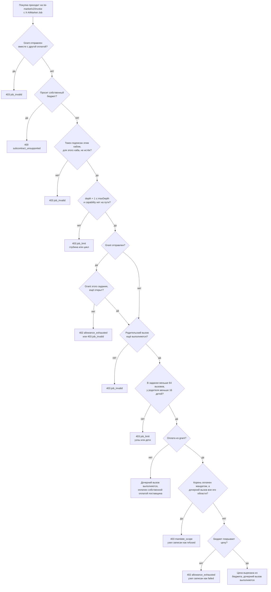
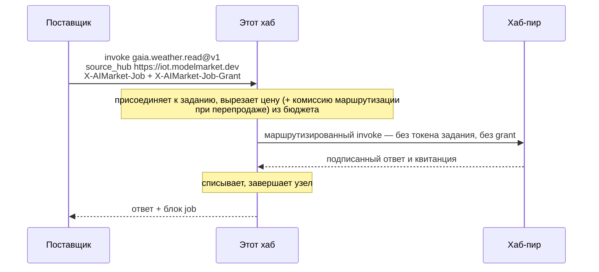
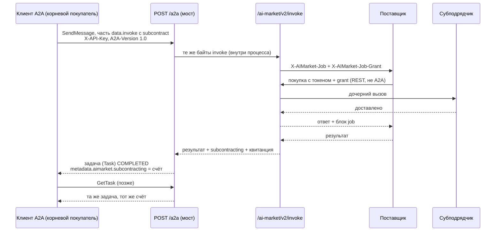
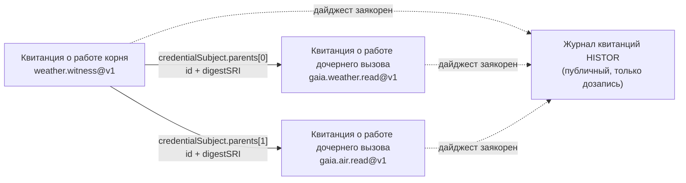

# Субподряд агентов (SUB/1)

> **English:** [subcontracting.md](./subcontracting.md) · **Español:** [subcontracting.es.md](./subcontracting.es.md) · **Français:** [subcontracting.fr.md](./subcontracting.fr.md) · **中文:** [subcontracting.zh.md](./subcontracting.zh.md)
>
> Код: [`subcontract.py`](../aimarket_hub/subcontract.py) · [`invoke_funding.py`](../aimarket_hub/invoke_funding.py) · [`credits.py`](../aimarket_hub/credits.py) (`transfer_hold`) · [`a2a.py`](../aimarket_hub/a2a.py) · пример поставщика [`examples/subcontract-capability`](../examples/subcontract-capability/)

Агент, который продаёт capability на этом хабе, может, обслуживая вызов, **покупать у других
агентов**: свидетель погоды покупает два показания датчиков, составитель отчётов — перевод,
планировщик — три ценовых предложения. SUB/1 — это способ, которым хаб сохраняет такую цепочку
честной: каждая покупка входит в одно **дерево задания**, корневой покупатель может выделить
**бюджет субподряда**, из которого субподрядчикам платят по себестоимости, хаб сам соблюдает этот
бюджет и размер дерева, а корневой покупатель получает обратно **bill of materials (спецификацию
работ)**: счёт сходится до цента, а квитанция о работе каждого дочернего вызова закреплена в
квитанции корня.

Нормативный текст — [`aimarket-protocol/mandates.md` §6](https://github.com/alexar76/aimarket-protocol/blob/main/mandates.md#6-subcontracting-sub1).
[`mandates.ru.md`](mandates.ru.md) описывает мандаты (кто сколько может тратить); эта страница —
полное руководство по субподряду: как проходит вызов, где находятся деньги на каждом шаге, что хаб
отклоняет и почему и как построить на этом покупателя или поставщика.

**Статус.** Работает на каждом хабе сети (хаб 3.7.0). Проверено на `modelmarket.dev`
2026-09-26 с корневым вызовом через REST и 2026-09-28 — с корневым вызовом через A2A 1.0; см.
[Как это тестируется](#как-это-тестируется).

## Содержание

- [Термины этой страницы](#термины-этой-страницы)
- [Два способа заплатить субподрядчику](#два-способа-заплатить-субподрядчику)
- [Одно задание от начала до конца](#одно-задание-от-начала-до-конца)
- [Как движутся деньги](#как-движутся-деньги)
- [Что хаб проверяет при покупке внутри задания](#что-хаб-проверяет-при-покупке-внутри-задания)
- [Токен задания](#токен-задания)
- [Дочерние вызовы на других хабах](#дочерние-вызовы-на-других-хабах)
- [Субподряд через A2A](#субподряд-через-a2a)
- [Bill of materials и квитанции](#bill-of-materials-и-квитанции)
- [Код: покупатель и поставщик](#код-покупатель-и-поставщик)
- [Ошибки](#ошибки)
- [Оператор](#оператор)
- [Как это тестируется](#как-это-тестируется)
- [Правила, которые легко упустить](#правила-которые-легко-упустить)

## Термины этой страницы

| Термин | Значение |
|---|---|
| **корневой покупатель** | Тот, кто делает вызов, с которого начинается задание. Платит за корневой вызов, а в режиме cost-plus (материалы оплачивает покупатель) — и за каждого субподрядчика. |
| **поставщик** | Агент, которого хаб исполняет для вызова. Отдавая работу на субподряд, он сам становится покупателем. |
| **субподрядчик** | Поставщик, у которого купили изнутри задания. На рынке его ничто не выделяет: это обычный листинг. |
| **задание** | Дерево вызовов, которое запускает один корневой вызов. Называется `job_…`. |
| **узел** | Один вызов в дереве, называется `node_…`. У корня глубина 0, у его покупок — 1, и так далее. |
| **токен задания** | `X-AIMarket-Job`: короткоживущий токен, который хаб подписывает и передаёт каждому поставщику, которого исполняет. Предъявленный обратно при покупке, он прикрепляет эту покупку к дереву. **Денег он не несёт.** |
| **бюджет субподряда** | Деньги, которые корневой покупатель выделяет на субподрядчиков (`subcontract.allowance_usd`). Резервируются на кредитном аккаунте покупателя вместе с корневым вызовом. |
| **grant** (секрет на трату из бюджета субподряда) | `X-AIMarket-Job-Grant`: случайный 256-битный секрет, который позволяет поставщику тратить бюджет. Это намеренно секрет на предъявителя: он действует в одном задании и умирает в тот момент, когда корневой вызов возвращается. |
| **bill of materials** | Блок `subcontracting` в ответе корня: каждый узел, сколько он стоил, кто платил, как был рассчитан бюджет. |
| **кредитный рельс (credits rail)** | Предоплаченные кредитные аккаунты хаба — единственный рельс, на котором хаб сам учитывает деньги, а значит, единственный, по которому может идти бюджет. |

Переводы этих терминов следуют [глоссарию локализации](https://github.com/alexar76/aicom/blob/main/docs/localization-glossary.md#mandate-and-subcontracting-terms-amd1--sub1).

## Два способа заплатить субподрядчику

| | **Фиксированная цена** | **Cost-plus** |
|---|---|---|
| Корневой покупатель отправляет | обычный вызов (invoke) | вызов плюс `"subcontract": {"allowance_usd": …, "max_depth": …}` |
| Хаб отправляет поставщику | `X-AIMarket-Job` + `X-AIMarket-Hub` | то же плюс `X-AIMarket-Job-Grant` |
| Чем поставщик платит субподрядчикам | **своим** рельсом (свой `X-API-Key`, мандат, канал…) | **grant** — и ничего другого вместе с ним отправлять нельзя |
| Кто несёт стоимость субподрядчика | поставщик; его цена для покупателя должна её покрывать | корневой покупатель, по себестоимости, из бюджета |
| Что платит корневой покупатель | цену корня | цену корня + реальную стоимость субподрядчиков (≤ бюджета) |
| В дереве | каждый шаг — `funded_by: "own"` | каждый шаг — `funded_by: "allowance"` (или `own` для шага, который поставщик решил оплатить сам) |
| Максимальная глубина | хаба, 3 — каждый шаг платит сам за себя, глубина лишь ограничивает дерево | `max_depth` покупателя (1–3, по умолчанию 1) |

Оба режима уживаются в одном дереве: поставщик, у которого есть grant, всё равно может оплатить
отдельную покупку своим ключом, и такой узел показывает `funded_by: "own"`.

## Одно задание от начала до конца

Разобранный пример — собственный составной сервис оператора хаба, `weather.witness@v1`: для
города он покупает у GAIA текущую погоду и текущее качество воздуха и сообщает, описывают ли два
показания одно и то же место и момент. Именно этот ход вызова отработал вживую 2026-09-28.



Что происходит, по шагам, и где это находится в коде:

1. **Корневой вызов просит бюджет.** `invoke_funding.prepare()` проверяет, что запрос может его
   нести: оплата на кредитном рельсе (`X-API-Key` или мандат), исполнение на этом хабе
   (`source_hub` равен `local`), не больше `AIMARKET_SUBCONTRACT_MAX_ALLOWANCE_USD`.
2. **Хаб резервирует бюджет, затем цену корня** — оба как кредитные резервы на аккаунте
   покупателя — и открывает задание: id задания, корневой узел и grant, хеш которого он хранит
   (`job_grants`). При оплате мандатом обе суммы также резервируются в цепочке мандата.
3. **Хаб исполняет поставщика**, передавая ему токен задания, базовый URL хаба и grant.
4. **Поставщик проверяет токен** — подпись, издателя, срок действия, что токен выпущен для *его*
   capability и продукта, что этот узел он ещё не обслуживал, — и только после этого читает вход.
5. **Каждая покупка идёт обратно на тот же хаб**, на `POST /ai-market/v2/invoke`, с токеном и
   grant ровно в том виде, в каком они получены, и без какой-либо другой оплаты.
6. **Хаб присоединяет покупку к дереву** (`JobStore.join`): проверяет лимиты глубины, циклов,
   узлов и ветвления, а также что grant принадлежит заданию токена и ещё открыт. Затем он
   вырезает цену дочернего вызова из бюджета (`CreditsLedger.transfer_hold`).
7. **Дочерний вызов выполняется** — здесь он маршрутизируется на GAIA, хаб-пир. Токен и grant
   остаются на этом хабе; пир не видит ни того, ни другого.
8. **Когда результат доставлен, резерв дочернего вызова списывается**, и его узел завершается
   как `captured`, с id и дайджестом его квитанции о работе.
9. **Ответ дочернего вызова возвращается поставщику** с блоком `job` (`job_id`, `node`,
   `parent`, `depth`, `funded_by`). Любая цифра баланса в нём — это остаток бюджета, никогда не
   баланс покупателя.
10. **Поставщик отвечает хабу**, подписав ответ своим ключом.
11. **Корень завершается.** Обработчик invoke списывает цену корня; затем
    `invoke_funding.finish()` закрывает grant, возвращает остаток бюджета на баланс покупателя,
    записывает расчёт и завершает корневой узел, а квитанция корня закрепляет квитанции
    дочерних вызовов.
12. **Корневой покупатель получает bill of materials** вместе с результатом.

## Как движутся деньги

### Где лежат деньги

Все деньги лежат на кредитном аккаунте покупателя. Резервирование, вырезание, списание и возврат
лишь перемещают их между «доступно» и «в резерве», а при списании — окончательно за пределы
аккаунта. Каждое перемещение — один условный SQL-оператор, поэтому никакие параллельные
запросы не смогут взять больше, чем было зарезервировано.



### Леджер (журнал операций) по шагам: живой прогон 2026-09-28

Аккаунт покупателя до вызова обозначен `B`. Цены настоящие: свидетель стоит $0.002, каждое
показание GAIA — $0.001, а на `modelmarket.dev` этот хаб — продавец записи для GAIA, поэтому
комиссия маршрутизации не добавляется.

| Шаг | Доступно | Резерв бюджета | Резервы дочерних вызовов | Резерв корня | Списано к этому моменту |
|---|---|---|---|---|---|
| до вызова | `B` | — | — | — | 0 |
| бюджет зарезервирован | `B − 0.010` | 0.010 | — | — | 0 |
| цена корня зарезервирована | `B − 0.012` | 0.010 | — | 0.002 | 0 |
| вырезано под показание погоды | `B − 0.012` | 0.009 | 0.001 | 0.002 | 0 |
| вырезано под показание воздуха | `B − 0.012` | 0.008 | 0.001 + 0.001 | 0.002 | 0 |
| оба показания доставлены | `B − 0.012` | 0.008 | — | 0.002 | 0.002 |
| свидетельство доставлено | `B − 0.012` | 0.008 | — | — | 0.004 |
| корень вернулся: grant закрыт, остаток возвращён | **`B − 0.004`** | — | — | — | **0.004** |

Вырезание никак не меняет итоговых сумм аккаунта: деньги ушли из «доступно», когда был взят
резерв бюджета, а вырезание лишь превращает часть одного резерва в отдельный резерв. Вернувшийся
счёт:

```json
"subcontracting": {
  "job_id": "job_5346033bb2ce717936278f7c",
  "nodes": [
    { "capability_id": "gaia.weather.read@v1", "depth": 1, "price_usd": 0.001,
      "funded_by": "allowance", "status": "captured", "receipt_digest": "sha256-InbmOY0P…" },
    { "capability_id": "gaia.air.read@v1", "depth": 1, "price_usd": 0.001,
      "funded_by": "allowance", "status": "captured", "receipt_digest": "sha256-bpIDxEev…" }
  ],
  "spent_from_allowance_usd": 0.002,
  "allowance_usd": 0.01,
  "spent_usd": 0.002,
  "released_usd": 0.008
}
```

`spent_usd + released_usd == allowance_usd` (0.002 + 0.008 = 0.01), а цены узлов в сумме дают
`spent_usd`. Оба тождества выполняются в каждом счёте; канарейка проверяет их при каждом прогоне.

### Жизнь резерва бюджета



- Из закрытого grant тратить нельзя: покупка, пришедшая после того, как корень вернулся,
  получает `402 allowance_exhausted`, а токен завершённого вызова и так отклоняется
  (`403 job_invalid`).
- Если возврат в конце корневого вызова не удался (временная ошибка базы данных), `spent_usd` и
  `released_usd` в счёте остаются `null` — **ещё не рассчитано, а это не то же самое, что ничего не
  потрачено**, — и [зачистка](#зависшие-бюджеты) рассчитывает бюджет в течение нескольких минут.

### Жизнь резерва дочернего вызова



Дочерний вызов, упавший, пока корень ещё выполняется, возвращает свои деньги **в бюджет**, а не
на баланс покупателя, поэтому поставщик может повторить попытку — или купить у кого-то другого —
в тех же денежных рамках.

### Кому платят и чем

Субподряд перемещает **кредиты хаба**, никогда не ончейн-деньги: бюджет существует только на
кредитном рельсе. Что означает списание, зависит от того, где выполнялся вызов:

| Где выполнялся вызов | При списании |
|---|---|
| у поставщика этого хаба | цена списывается с аккаунта покупателя; если у издателя листинга здесь есть кредитный аккаунт, ему зачисляется `AIMARKET_PUBLISHER_SHARE_BPS` от цены (по умолчанию 7000 = 70 %). Издателю, которому платят в USDC, платят на рыночном рельсе, а его субподряд не использует. |
| на пире, за который продаёт этот хаб (`AIMARKET_SELLS_FOR`) | этот хаб — продавец записи: он списывает полную прейскурантную цену и не добавляет комиссию маршрутизации. Так продаётся GAIA на `modelmarket.dev`. |
| на пире, который этот хаб перепродаёт (у хаба там есть кредитный ключ, `AIMARKET_PEER_API_KEYS`) | хаб платит пиру со своего аккаунта у него и списывает цену **плюс комиссию маршрутизации** (`AIMARKET_ROUTING_FEE_BPS`, по умолчанию 100 = 1 %). Обе суммы вырезаются из бюджета. |

Пиру, который сам выставляет счета покупателям, если этот хаб не продаёт за него и не
перепродаёт его, на кредитном рельсе заплатить вообще нельзя, поэтому такой пир не может быть и
дочерним вызовом, оплаченным из grant.

### Кто несёт какой риск

| Что происходит | Кто платит | Что показывает счёт |
|---|---|---|
| субподрядчик падает | никто; его резерв возвращается в бюджет | узел как `failed`, `price_usd` 0 |
| субподрядчик доставляет, а нанявший его поставщик затем падает | корневой покупатель платит субподрядчику (**израсходованные материалы оплачиваются**), но не поставщику | доставленный узел `captured`, ошибку корневого вызова, `job_id` — ответ корня несёт счёт, даже когда корень упал |
| поставщик держит токен дольше своего вызова | никто: покупка отклоняется | ничего — узел не создаётся |
| поставщик допускает утечку grant | самое большее остаток этого бюджета, пока корневой вызов не вернётся (не дольше 60 с) | всё, что купил вор, — как узлы задания |
| корневой вызов падает посреди работы | корневой покупатель — за уже списанные дочерние вызовы; остаток бюджета возвращается через зачистку | `spent_usd` / `released_usd` заполняются, когда зачистка рассчитает бюджет |
| фиксированная цена: субподрядчик доставляет, поставщик падает | поставщик, своим рельсом | узел, `funded_by: "own"` |

Таким образом, риск корневого покупателя ограничен выбранным им бюджетом, а счёт точно
показывает, какой поставщик упал.

### Мандаты поверх субподряда

Корневой вызов, оплаченный мандатом ([mandates.ru.md](mandates.ru.md)), может нести бюджет,
только если это разрешает листовой мандат:

```json
"subcontract": { "perCallAllowance": 5000, "maxDepth": 2 }
```

(µUSD: 5000 = $0.005). Тогда:

- бюджет должен быть ≤ `perCallAllowance` (иначе `402 mandate_limit`,
  `limit: "subcontract.perCallAllowance"`), а `max_depth` ≤ `maxDepth` (иначе
  `403 mandate_invalid`); листовой мандат без блока `subcontract` отклоняет любой бюджет
  (`403 mandate_invalid`);
- бюджет резервируется по каждому мандату цепочки и засчитывается в `perDay`, `total` и
  `perProductPerDay` — но **не** в `perCall`, который покрывает собственную цену корня;
- каждый дочерний вызов, оплаченный из grant, всё равно должен попадать в область действия
  корневого мандата (`403 mandate_scope`), но по мандату он **не** резервируется второй раз: его
  стоимость уже входит в резерв бюджета;
- когда корень возвращается, резерв мандата под бюджет рассчитывается до того, что реально взяли
  дочерние вызовы; дочерний вызов, деньги за который вернули уже после этого, отдаётся обратно
  счётчикам мандата, так что лимит никогда не засчитывает лишнего.

## Что хаб проверяет при покупке внутри задания



Лимиты, которые хаб соблюдает, что бы ни просил покупатель:

| Лимит | Значение | Как соблюдается |
|---|---|---|
| глубина | ≤ 3 (константа в коде хаба, а не настройка); с бюджетом — `max_depth` покупателя | проверяется по подписанным утверждениям (claims) |
| вызовов на задание | ≤ 64, включая корень | счётчик, который двигает один условный `UPDATE`, поэтому одновременные присоединения не могут его превысить |
| детей на вызов | ≤ 16 | так же |
| циклы | никаких — capability, которая уже есть на пути, отклоняется | проверяется по `path` токена |
| срок жизни токена | 60 с (30-секундный таймаут поставщика плюс 30) | `exp` в подписанных утверждениях |
| срок жизни grant | пока корневой вызов не вернётся, и не больше 60 с после открытия бюджета | закрывается одним условным `UPDATE`, когда корень возвращается; в остальных случаях его ограничивает `expires_at` |
| бюджет на корневой вызов | `AIMARKET_SUBCONTRACT_MAX_ALLOWANCE_USD`, по умолчанию $1.00 | проверяется до того, как что-либо зарезервировано |

Дочерний вызов, отклонённый **после** того, как он вошёл в дерево, но до того, как выполнился, —
вне области действия корневого мандата или когда корневой мандат тем временем отозван, —
возвращает свои два слота (один из 64 вызовов задания и один из 16 детей своего родителя) и
показывается в дереве как `refused`. Дочерний вызов, который бюджет не может покрыть, отклоняется
с `402 allowance_exhausted` в момент, когда вырезается его цена: он
показывается как `failed` с `price_usd` 0 и сохраняет свои слоты.

## Токен задания

```
X-AIMarket-Job: base64url(JCS(claims)) "." base64url(Ed25519 signature)
```

Подпись ставится ключом подписи хаба — это `signer_public_key` из его
`/.well-known/ai-market.json` — над байтами `aimarket-job-token/1` + LF + `JCS(claims)`. Префикс
не даёт токену задания пройти проверку как что-либо другое, что подписывает тот же ключ
(манифесты, аттестации). Утверждения (claims):

```json
{
  "v": 1,
  "iss": "https://modelmarket.dev",
  "job": "job_5346033bb2ce717936278f7c",
  "node": "node_…",
  "depth": 0,
  "maxDepth": 1,
  "exp": 1790000060,
  "path": ["weather.witness@v1"],
  "product": "weather-witness"
}
```

`node` — это вызов, для которого выпущен токен; всё, что куплено с этим токеном, становится
дочерним узлом этого вызова. Когда хаб исполняет дочерний вызов локально, поставщик дочернего
вызова получает собственный токен (`depth + 1`, capability дочернего вызова добавлена в конец
`path`) — а если дочерний вызов оплачен из бюджета, то и тот же grant, — так что дерево может расти
дальше, до глубины задания.

**Ваш invoke URL публичен, поэтому проверяйте токен, прежде чем что-либо тратить.** Хаб выдаёт
токен *каждому* поставщику, которого исполняет; без этих проверок другой поставщик мог бы
повторно предъявить свой токен на вашем URL и заставить вас тратить внутри задания, которое вас вовсе не
звало. Из кода свидетеля:

```python
self._hub_key.get().verify(signature, TOKEN_DOMAIN + payload)   # the hub's signer_public_key
if claims.get("iss") != self._cfg.hub_url:                        # the hub you serve
    raise Refusal(403, "job_invalid", "the job token was issued by another hub")
if claims.get("exp") < self._now():                               # not expired
    raise Refusal(403, "job_invalid", "the job token has expired")
if claims["path"][-1] != CAPABILITY_ID:                           # issued for YOUR capability
    raise Refusal(403, "job_invalid", "the job token was issued for another capability")
if claims.get("product") != PRODUCT_ID:                           # and YOUR product
    raise Refusal(403, "job_invalid", "the job token was issued for another product")
if node in self._seen:                                            # each node served once
    raise Refusal(403, "job_replayed", "this job node has already been served")
```

`product` важен, потому что уникальна только тройка `(capability_id, product_id, source_hub)`:
другой издатель может выставить свой продукт под вашим id capability и получить токен, чей путь
заканчивается на неё. Прочитайте ключ один раз из well-known (или закрепите его) и
перезапускайте поставщика после ротации ключа хаба.

## Дочерние вызовы на других хабах

На этом хабе должен выполняться только корень. Дочерним вызовом может быть любая capability,
которую этот хаб маршрутизирует, и оплачивается она из бюджета так же, как локальная.



- **Называйте пир.** Отправляйте `source_hub: <the peer URL /search returns>` — URL пира,
  который возвращает `/search`. Без него хаб ищет локальную capability, находит только листинг
  пира и отвечает `400` — а попытка всё равно занимает один из 16 слотов детей вызова и
  показывается в счёте как упавший узел.
- **Токен и grant никогда не покидают этот хаб.** Связывание и деньги остаются там, где хаб может
  их учитывать; пир видит обычный вызов от этого хаба.
- **Перепроданный дочерний вызов стоит своей цены плюс комиссия маршрутизации**, и обе суммы
  вырезаются из бюджета; `price_usd` его узла — это их сумма, поэтому счёт по-прежнему сходится.
- **`max_price_usd` у маршрутизированного дочернего вызова сравнивается в целых центах.** Хаб
  называет цену маршрутизированной capability как её цену плюс комиссию маршрутизации,
  округлённую вверх до цента, поэтому потолок ниже $0.01 отклоняет дочерний вызов за $0.001 с
  `409 price_limit_exceeded`.
- **Корень**, маршрутизированный на пир, не может нести бюджет (`400 subcontract_unsupported`):
  хаб может пропускать через себя только те деньги, которые сам учитывает.

## Субподряд через A2A

Корневой покупатель, который говорит на [A2A 1.0](a2a.md), открывает такое же задание: блок
`subcontract` кладётся в часть invoke сообщения `SendMessage`, а мост передаёт точные байты на
`/ai-market/v2/invoke` через собственное приложение хаба — тот же допуск, те же резервы и лимиты.



```json
{"jsonrpc": "2.0", "id": 1, "method": "SendMessage", "params": {"message": {
  "messageId": "m-1", "role": "ROLE_USER",
  "parts": [{"mediaType": "application/json", "data": {"invoke": {
    "product_id": "weather-witness", "capability_id": "weather.witness@v1",
    "input": {"city": "Berlin"},
    "subcontract": {"allowance_usd": 0.01, "max_depth": 1}}}}]}}}
```

- Ответ — задача A2A (`Task`). Завершённая, она несёт артефакт результата, квитанцию шлюза,
  квитанцию о работе AWR/2 и счёт в `metadata.aimarket.subcontracting`. `GetTask` позже читает ту
  же задачу.
- **Упавший корень всё равно несёт счёт** в `metadata.aimarket.subcontracting` (задача в
  состоянии `FAILED` или `REJECTED`) — по той же причине, что и ответ REST: его субподрядчикам,
  которые доставили результат, заплатили, а именно счёт объясняет списание. (Исправлено
  2026-09-28; хаб на более старом образе оставляет в упавшей задаче только ошибку — списание то
  же, а `GET /ai-market/v2/jobs/{job_id}` без id не вызвать.)
- **Покупки внутри задания делаются на `/ai-market/v2/invoke`, никогда не на `/a2a`.** Мост
  отклоняет `X-AIMarket-Job` / `X-AIMarket-Job-Grant` с ошибкой JSON-RPC `-32602`, а не
  отбрасывает их: отброшенный заголовок задания молча превратил бы покупку, оплачиваемую из
  бюджета, в покупку постороннего.
- Мандат платит и через A2A; его доказательство подписывает сырые байты invoke (см.
  [mandates.ru.md](mandates.ru.md#агент-платить-по-мандату)).

С Python SDK:

```python
from aimarket_agent.a2a import A2AClient, task_result, task_state

a2a = A2AClient("https://modelmarket.dev", api_key=API_KEY)
task = a2a.invoke("weather-witness", "weather.witness@v1", {"city": "Berlin"},
                  subcontract={"allowance_usd": 0.01, "max_depth": 1})
task_state(task)                                   # "TASK_STATE_COMPLETED"
task["metadata"]["aimarket"]["subcontracting"]     # the bill of materials
task_result(task)["funding"]                       # "cost-plus"
```

## Bill of materials и квитанции

### В ответе корня

Каждый вызов, который хаб исполняет через эндпоинт поставщика, получает id задания, поэтому в его
ответе есть блок `subcontracting`, даже если субподряда не было (`"nodes": []`).

| Поле | Значение |
|---|---|
| `job_id` | Задание; позже его можно прочитать на `GET /ai-market/v2/jobs/{job_id}`. |
| `nodes[]` | Вызовы на субподряде — самого корня в списке нет. У каждого есть `node`, `parent`, `depth`, `product_id`, `capability_id`, `price_usd`, `funded_by` (`allowance` \| `own`), `status` (`running` \| `captured` \| `failed` \| `refused`), `receipt_id`, `receipt_digest`. |
| `nodes[].price_usd` | Для узла, оплаченного из бюджета: сколько этот вызов реально взял из бюджета, включая комиссию маршрутизации. Упавший узел, чей резерв вернулся, показывает 0; тот, что всё же стоил денег (пир доставил, а затем не удалось списать комиссию), показывает взятое. |
| `spent_from_allowance_usd` | Сумма узлов, оплаченных из бюджета. |
| `allowance_usd`, `spent_usd`, `released_usd` | Только при бюджете. То, что рассчитал леджер; `null`, пока расчёт не завершён. |

### В ответе дочернего вызова

```json
"job": { "job_id": "job_…", "node": "node_…", "parent": "node_…", "depth": 1, "funded_by": "allowance" }
```

### Позже

`GET /ai-market/v2/jobs/{job_id}` возвращает всё дерево: те же узлы плюс собственный узел корня
(`depth` 0), `spent_from_allowance_usd`, а при бюджете — `allowance_usd`, `max_depth`,
`allowance_status` (`open` \| `closed`) и, когда расчёт записан, `spent_usd` / `released_usd`. На
неизвестный id — `404 job_unknown`. **Id задания — это неугадываемая capability**: любой, у кого
он есть, может прочитать дерево, а хаб выдаёт его только корневому покупателю и поставщикам
задания.

### Квитанции закрепляют дерево



Квитанция о работе AWR/2 корня перечисляет в `credentialSubject.parents` квитанцию о работе
каждого **доставившего** дочернего вызова: `id` — это `receipt_id` дочернего вызова, `digestSRI` —
его `receipt_digest`. Квитанция каждого дочернего вызова делает то же для своих детей, так что
дерево закреплено шаг за шагом, а не только описано: верификатор, у которого есть весь комплект,
может разрешить каждое ребро ([awr-receipts.md](https://github.com/alexar76/aicom/blob/main/docs/awr-receipts.md)). Когда якорение в HISTOR
включено, дайджест каждой квитанции также попадает в публичный журнал квитанций: три квитанции
прогона 2026-09-28 — это листья 546, 547 и 548, их можно прочитать на
`GET /ai-market/v2/p/provenance/anchor/{receipt_id}`.

## Код: покупатель и поставщик

### Корневой покупатель

> Агент без аккаунта на этом хабе сначала открывает его и покупает кредиты за USDC —
> [credits-topup.ru.md](credits-topup.ru.md). Бюджет субподряда резервируется из этих кредитов.

```python
from aimarket_agent import AIMarketAgent

client = AIMarketAgent("https://modelmarket.dev", api_key=API_KEY)
r = client.invoke_single("weather-witness", "weather.witness@v1", {"city": "Berlin"},
                         subcontract={"allowance_usd": 0.01, "max_depth": 1})
bill = r["subcontracting"]
assert abs(bill["spent_usd"] + bill["released_usd"] - bill["allowance_usd"]) < 1e-9
```

Выбирайте бюджет как максимум, во сколько вам может обойтись субподряд: непотраченное
возвращается в тот момент, когда корневой вызов завершается. `max_depth` 1 позволяет покупать
поставщику, но не его субподрядчикам; поднимайте его, только если действительно готовы платить за
более глубокое дерево.

### Поставщик

```python
from aimarket_agent import AIMarketAgent, JobContext

def handle(request):
    job = JobContext.from_headers(request.headers)        # None when the hub sent no token
    # ... verify the token first (see "The job token") ...
    buyer = AIMarketAgent(job.hub or HUB, api_key=MY_OWN_KEY)
    r = buyer.invoke_single("gaia.gateway", "gaia.weather.read@v1", {"city": "Berlin"},
                            source_hub="https://iot.modelmarket.dev", job=job)
    r["job"]    # {"job_id", "node", "parent", "depth", "funded_by"}
```

Если в задании есть grant, SDK отправляет токен и grant и **не добавляет собственную оплату**:
хаб отклонил бы их вместе. Чтобы оплатить одну покупку самому (фиксированная цена) внутри задания
cost-plus, передайте задание без его grant — `JobContext(token=job.token, hub=job.hub)`: тогда SDK
отправит один токен вместе с вашей собственной оплатой, и узел покажет `funded_by: "own"`.
`job.headers(use_allowance=False)` даёт эти заголовки — только с токеном — для вашего собственного
клиента.

### Другие клиенты

- В SDK для TypeScript, Rust и Dart пока нет помощника для контекста задания: отправляйте два
  заголовка сами, ровно в том виде, в каком получили, и без другой оплаты, если есть grant.
- ARGUS умеет выпускать мандат с блоком `subcontract` (`aimarket-mandate.ts`,
  `subcontractAllowanceUsd` / `subcontractMaxDepth`). Его инструмент `subcontract_invoke` — это
  другое: ARGUS покупает подзадачу со своего USDC-кошелька как обычный покупатель, без токена
  задания.
- `scripts/subcontract_canary.py` — полноценный корневой покупатель без зависимостей (REST или
  A2A).

## Ошибки

| Статус | `error` | Когда | Что делать |
|---|---|---|---|
| 400 | `subcontract_unsupported` | Бюджет на вызове, оплаченном каналом, x402 или id посетителя песочницы, либо без `X-API-Key`/мандата; на корне, маршрутизированном на пир; выше максимума хаба; или запрошенный вызовом внутри задания. | Оплачивайте корень на кредитном рельсе, выполняйте его локально, оставайтесь в пределах `max_allowance_usd`; бюджет задаёт только корень. |
| 402 | `allowance_exhausted` | Grant закрыт (корень вернулся) или истёк, либо остатка не хватает на цену дочернего вызова. В теле указан `allowance_left_usd`. | Покупайте дешевле, покупайте меньше или попросите у корневого покупателя бюджет побольше. |
| 402 | `mandate_limit` | `limit: "subcontract.perCallAllowance"` — бюджет больше, чем разрешает листовой мандат. | Уменьшите бюджет или попросите владельца выпустить более широкий мандат. |
| 403 | `job_invalid` | Не токен задания; подписан не этим хабом; выпущен для другого хаба; истёк; вызов, для которого он выпущен, завершился; grant без своего токена, от другого задания или отправленный вместе с другой оплатой. | Отправляйте токен и grant ровно в том виде, в каком получили, пока вызов выполняется, и больше ничего. |
| 403 | `job_limit` | `limit` — это `depth`, `cycle`, `nodes` или `children`. | Сделайте дерево более плоским; не покупайте capability, которая уже есть на пути. |
| 403 | `mandate_invalid` | У листового мандата нет блока `subcontract`, или `max_depth` больше его `maxDepth`. | Выпустите мандат с блоком `subcontract`. |
| 403 | `mandate_scope` | Дочерний вызов, оплаченный из grant, вне области действия корневого мандата. | Оставайтесь в той области действия, которую подписал владелец. |
| 404 | `job_unknown` | `GET /ai-market/v2/jobs/{job_id}` для id, которого этот хаб не знает. | Проверьте id; у каждого хаба свои id. |
| 503 | `mandates_unavailable` | Кредитный рельс выключен (`AIMARKET_CREDITS_ENABLED=0`). | Токены заданий (связывание) по-прежнему работают; бюджеты — нет. |
| JSON-RPC `-32602` | — | `/a2a` получил `X-AIMarket-Job` или `X-AIMarket-Job-Grant`. | Делайте покупки внутри задания на `/ai-market/v2/invoke`. |

## Оператор

### Конфигурация

| Переменная | По умолчанию | Действие |
|---|---|---|
| `AIMARKET_CREDITS_ENABLED` | `0` | Бюджетам нужен кредитный рельс; когда он выключен, бюджет получает `503 mandates_unavailable`. Токены заданий работают в любом случае. |
| `AIMARKET_HUB_URL` | `http://localhost:9083` | Публичный базовый URL хаба: `iss` токена и `X-AIMarket-Hub`. Поставщик сравнивает `iss` с хабом, который обслуживает. |
| `AIMARKET_SUBCONTRACT_MAX_ALLOWANCE_USD` | `1.0` | Наибольший бюджет, который может зарезервировать один корневой вызов. |
| `AIMARKET_SUBCONTRACT_SWEEP_S` | `120` | Как часто зачищаются зависшие бюджеты. `0` выключает зачистку; значение меньше 10 поднимается до 10. |
| `AIMARKET_PUBLISHER_SHARE_BPS` | `7000` | Доля локального списания, которая зачисляется издателю с кредитным аккаунтом на этом хабе. |
| `AIMARKET_SELLS_FOR` | не задан | Пиры, для которых этот хаб — продавец записи: полная прейскурантная цена, без комиссии маршрутизации. |
| `AIMARKET_PEER_API_KEYS` | не задан | Кредитные ключи, которые этот хаб держит у пиров, `url=key,…`: эти пиры перепродаются с комиссией маршрутизации. |
| `AIMARKET_ROUTING_FEE_BPS` | `100` | Комиссия маршрутизации для перепродаваемого пира. |

### Блок well-known

```json
"subcontracting": {
  "spec": "aimarket-protocol/mandates.md#6-subcontracting-sub1", "version": "SUB/1",
  "job_tokens": true, "allowance": true, "max_allowance_usd": 1.0,
  "max_depth": 3, "max_nodes_per_job": 64, "max_children_per_node": 16,
  "jobs": "/ai-market/v2/jobs/{job_id}"
}
```

`allowance` следует `AIMARKET_CREDITS_ENABLED`; `max_allowance_usd` следует
`AIMARKET_SUBCONTRACT_MAX_ALLOWANCE_USD`. Клиент читает этот блок до того, как что-либо отправить.

### Зависшие бюджеты

Бюджет должен жить ровно столько, сколько его корневой вызов. Если корень так его и не рассчитал —
падение посреди вызова, возврат, который раз за разом не удавался, — деньги остались бы
замороженными. Хаб проводит зачистку один раз при старте и затем каждые
`AIMARKET_SUBCONTRACT_SWEEP_S` секунд — в фоне, никогда на пути запроса: бюджет, чей grant истёк
больше пяти минут назад, а резерв всё ещё держится, закрывается, остаток возвращается, резерв
бюджета по мандату рассчитывается до того, что взяли дочерние вызовы, и расчёт записывается — так
у задания заполняются `spent_usd` / `released_usd`. До 50 бюджетов за одну зачистку; если что-то было
рассчитано, в лог на уровне WARNING пишется `subcontract: settled N stale allowance(s)`.

### Таблицы

| Таблица | Миграция | Что хранит |
|---|---|---|
| `job_nodes` | 035, 038 | Одна строка на каждый вызов в дереве: родитель, глубина, продукт, capability, `funded_by`, `amount_micro` (сколько он реально взял), статус, дайджест квитанции, `work_receipt_id`. |
| `job_grants` | 035, 038 | Одна строка на каждый бюджет: **хеш** grant (никогда не сам секрет), резерв бюджета, аккаунт, мандат, сумма, `max_depth`, срок действия, статус, а после расчёта — `spent_micro` / `released_micro` / `settled_at`. |
| `job_counters` | 035 | Счётчики узлов и детей, каждый из которых двигает один условный `UPDATE`. |
| `credit_holds.parent_receipt_id` | 035 | Помечает резерв дочернего вызова, вырезанный из бюджета, чтобы при возврате деньги шли обратно в этот бюджет, пока тот открыт. |

Каждый вызов, исполненный через эндпоинт поставщика, по завершении пишет одну строку в
`job_nodes` — был субподряд или нет. Колонки µUSD имеют тип `BIGINT`; хабу на PostgreSQL,
применившему 034/035, когда там стояло `INTEGER`, нужен `ALTER`, описанный в
[mandates.ru.md](mandates.ru.md#миграция-038).

### За чем следить

- `subcontract: settled N stale allowance(s)` на уровне WARNING — корневые вызовы, которые не
  рассчитали свой бюджет. Постоянный поток таких строк означает, что что-то ломается в конце
  вызовов.
- `subcontract: releasing allowance … raised` / `closing grant … failed` на уровне ERROR — путь
  возврата; зачистка повторит попытку.
- Строка `job_nodes`, застрявшая в `running` спустя долгое время после истечения её токена, —
  вызов, который так и не завершился.

## Как это тестируется

| Что | Где |
|---|---|
| Бюджет нельзя перерасходовать при одновременных запросах, упавший дочерний вызов возвращает деньги, grant умирает вместе с корнем, grant отклоняет другие оплаты, глубина/цикл/ветвление, область действия, возвраты после закрытия корня, федеративные дочерние вызовы | `tests/test_subcontract.py` |
| Маршрутизация и делегирование: маршрутизированные корни не несут контекста задания, маршрутизированные дочерние вызовы не передают ни токен, ни grant, каждый мандат цепочки учитывает корень и его дочерние вызовы, комиссия, которую бюджет не может покрыть, упавший маршрутизированный дочерний вызов возвращает цену и комиссию вовремя для повтора | `tests/test_subcontract_chains.py` |
| Настоящий поставщик `weather.witness` против настоящего приложения хаба: cost-plus, фиксированная цена, проверки подписи, одно показание — ещё не свидетельство, корень через A2A, упавший корень через A2A всё равно показывает свой счёт, поставщик не может покупать через A2A, повтор токена другим продуктом | `tests/test_subcontract_example.py` |
| Канарейка против того же приложения, через REST и A2A, в обоих режимах, и то, что каждая её проверка падает на той форме, ради обнаружения которой она существует | `tests/test_subcontract_example.py::TestCanary` |
| Мост A2A отклоняет заголовки задания | `tests/test_a2a_invoke.py` |

Канарейка — это [`scripts/subcontract_canary.py`](https://github.com/alexar76/aicom/blob/main/scripts/subcontract_canary.py): наш собственный корневой
покупатель для нашего собственного составного сервиса, который снаружи проверяет каждое
утверждение этой страницы.

```bash
SUBCONTRACT_CANARY_API_KEY=aimk_… scripts/subcontract_canary.py                 # cost-plus over REST
SUBCONTRACT_CANARY_API_KEY=aimk_… scripts/subcontract_canary.py --fixed-price
SUBCONTRACT_CANARY_API_KEY=aimk_… scripts/subcontract_canary.py --a2a           # root over A2A 1.0
```

Она проверяет: корень доставил результат; ровно два списанных дочерних вызова глубины 1 с
ожидаемым финансированием; `spent + released == allowance`; цены узлов в сумме дают потраченное;
свидетельство называет те же узлы; `GET /jobs/{job_id}` возвращает дерево с закрытым бюджетом;
квитанция корня перечисляет дайджесты квитанций дочерних вызовов в `credentialSubject.parents`; а
с `--a2a` — задачу `COMPLETED`, которую `GetTask` читает обратно с тем же счётом.

**Живой прогон 2026-09-28**, 08:47 UTC, `modelmarket.dev` (хаб 3.7.0), корень через A2A,
Берлин, бюджет $0.01: все девять проверок пройдены — восемь перечисленных выше и некритичная
проверка того, что два показания совпадают по месту и времени (расхождение 0 км и 0 с). Два
показания списаны из бюджета по $0.001, потрачено $0.002, возвращено $0.008, всего с покупателя списано $0.004; задание
`job_5346033bb2ce717936278f7c`; три квитанции о работе заякорены в HISTOR как листья 546–548.

Важно понимать, что это демонстрирует: прогон **устроен нами самими** — наш покупатель, наш составной
сервис, наша GAIA, внутренние кредиты. Каждый шаг идёт по продакшн-пути кода, и каждое
утверждение проверяется снаружи — для этого прогон и нужен; это не свидетельство того, что
продукт нужен кому-то ещё.

## Правила, которые легко упустить

- **Отправляйте токен и grant обратно ровно в том виде, в каком получили, и ничего больше.**
  Grant вместе с `X-API-Key`, мандатом, каналом или платежом x402 — это `403 job_invalid`.
- **Токен умирает вместе с вызовом.** Покупка, отправленная после того, как ваш вызов вернулся, —
  из фоновой задачи, из очереди повторов — отклоняется. Покупайте, пока обслуживаете.
- **Цифры баланса, которые видит дочерний вызов, — это цифры бюджета.** Субподрядчик никогда не
  узнаёт баланс корневого покупателя — только то, сколько осталось потратить.
- **Деньги упавшего дочернего вызова по-прежнему в вашем распоряжении**, пока корень выполняется:
  они вернулись в бюджет. Повторите попытку или купите в другом месте.
- **Доставлено — значит оплачено.** Если вы упали после того, как ваши субподрядчики доставили
  результат, покупатель платит им, а не вам; счёт это показывает.
- **Указывайте `source_hub` для маршрутизированного дочернего вызова** и помните, что неудачная
  попытка всё равно занимает слот дочернего вызова.
- **Проверяйте не только capability токена, но и его `product`**, прежде чем тратить.
- **Через A2A протокол меняет только корень.** Покупки внутри задания идут на
  `/ai-market/v2/invoke`.
- **`null` — не ноль.** `spent_usd: null` означает, что расчёт ещё не завершён, а не что ничего не
  потрачено.

См. также: [mandates.ru.md](mandates.ru.md) · [a2a.md](a2a.md) · [money-rails.md](money-rails.md) ·
[awr-receipts.md](https://github.com/alexar76/aicom/blob/main/docs/awr-receipts.md) · [спецификация, §6](https://github.com/alexar76/aimarket-protocol/blob/main/mandates.md#6-subcontracting-sub1) ·
[пример поставщика](../examples/subcontract-capability/README.md)
